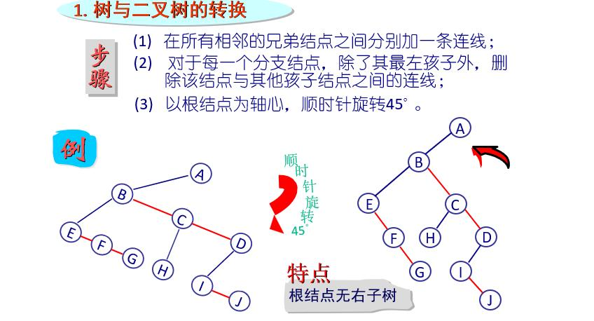
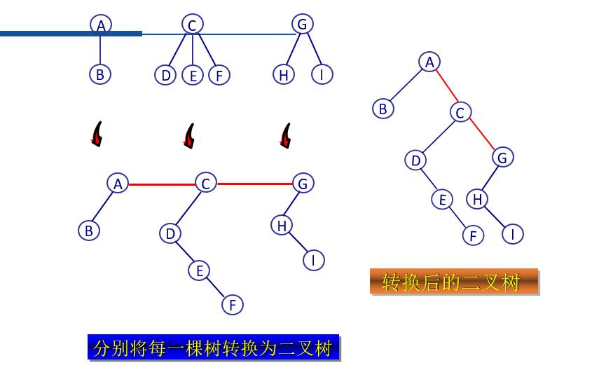
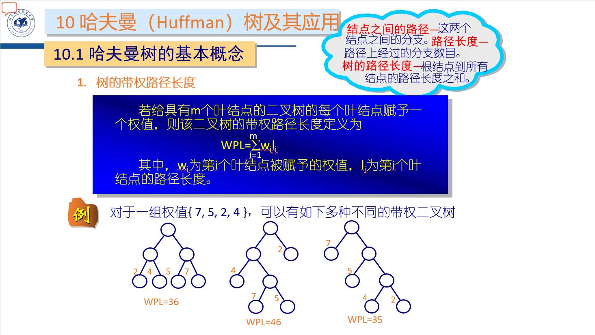
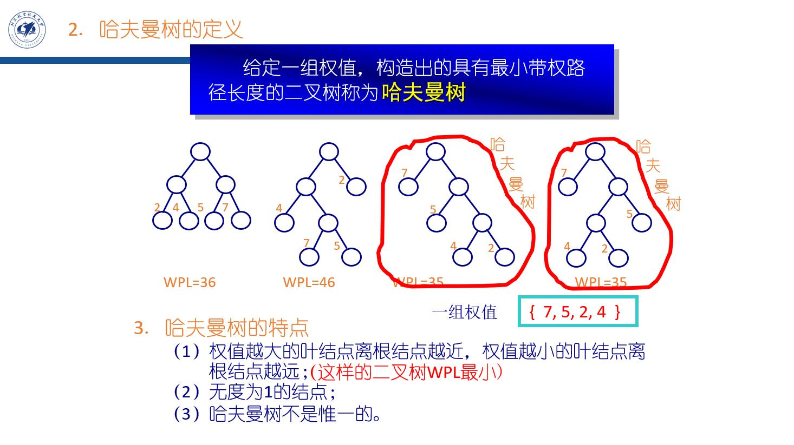

# 树
## 1.树的基本名词术语
1. 结点的度：该结点拥有的子树的数目
2. 树的度：  树中结点度的最大值
3. 叶结点：  度为0 的结点
4. 分支结点: 度非0 的结点
5. 树的层次: 根结点为第1层,若某结点在第i 层,则其孩子结点(若存在)为第i+1层。
6. 树的深度/高度:树中结点所处的最大层次数

7. 路径：对于树中任意两个结点di和dj，若在树中存在一个结点序列d1,d2, … di, …,dj，使得di是di+1的双亲(1≤i＜j)，则称该结点序列是从di到dj的一条路径。
   路径的长度为：路径结点数-1
8. 祖先与子孙：若树中结点d到ds存在一条路径，则称d是ds的祖先，ds是d的子孙
9.  树林(森林): m≥0 棵不相交的树组成的树的集合
10. 树的有序性:若树中结点的子树的相对位置不能随意改变, 则称该树为有序树，否则称该树为无序树

重要公式：<br>
**n=n0+n1+n2+……**
**n-1=n1+2n2+……**
**n0=n2+1**

## 2.二叉树
**子树有严格的左、右之分且度≤2的树是二叉树**
### 2.1特殊形态的二叉树
1. 满二叉树：即每一层结点数均达到最大值，全填满，三角形
2. 完全二叉树：只有最下面两层的结点的度可以小于2,并且最下面一层的结点(叶结点)都依次排列在该层从左至右的位置上
### 2.2二叉树的性质
1. n个结点的非空二叉树共有n-1个分支
2. 非空二叉树的第i层最多有$2^{i-1}$个结点(i≥1)
3. 深度为h的非空二叉树最多有$2^h-1$个结点
4. 具有n个结点的非空完全二叉树的深度为h=$\lfloor$$log_2n$$\rfloor$+1 

## 3.二叉树与树、树林之间的转换
### 3.1二叉树与树转换

### 3.2二叉树与树林转换


## 4.编程问题
### 4.1二叉树建立
```c
struct  node 
{
    Datatype   data;
    struct  node   *left,  *right;
};
typedef struct node  BTNode;
typedef struct node  *BTNodeptr;
```
### 4.2二叉树遍历(DFS,BFS)
```c
//已知前中、中后遍历可恢复二叉树
//前序遍历
void  preorder(BTNodeptr t)
{
    if(t!=NULL)
    {
        VISIT(t);       /* 访问t指向结点  */
        preorder(t->left);
        preorder(t->right);
    }
}

//中序遍历
void  inorder(BTNodeptr t)
{
    if(t!=NULL)
    {
        inorder(t->left);
        VISIT(T);       /* 访问T指结点  */
        inorder(t->right);
    }
}


//后序遍历
void  postorder(BTNodeptr t)
{
    if(t!=NULL)
    {
        postorder(t->left);
        postorder(t->right);
        VISIT(T);       /* 访问T指结点  */
    }
}

//按层次遍历
#define NodeNum  100
void  layerorder(BTNodeptr t)
{
    BTNodeptr queue[NodeNum], p;
    int front, rear;
    if(t!=NULL)
    {
        queue[0]=t;
        front=0;
        rear=0;
        while(front<=rear)
        {                 /* 若队列不空 */
            p=queue[front++]; 
            VISIT(p);                     /* 访问p指结点 */
            if(p->left!=NULL)                  /* 若左孩子非空 */
                queue[++rear]=p->left;
            if(p->right!=NULL)               /* 若右孩子非空 */
                queue[++rear]=p->right;
        }
    }
}

```
### 4.3二叉树拷贝
```c
BTNodeptr  copyTree(BTNodeptr  src)
{
    BTNodeptr obj;
    if(src == NULL)
        obj = NULL;
    else 
    {
        obj = (BTNodeptr) malloc(sizeof(BTNode));
        obj->data = src->data;
        obj->left = copyTree(src->left);
        obj->right = copyTree(src->right);
    }
        return obj;
}    //树拷贝
```

### 4.4二叉树删除
```c
void  destoryTree(BTNodeptr  p)
{
    if(p != NULL)
    {
        destoryTree(p->left);
        destoryTree(p->right);
        free(p);
        p = NULL; 
    }
}    //树删除
```
### 4.5二叉树高度
```c
int max(x,y) 
{ if((x >y)  return x; else return y; }
int  heightTree(BTNodeptr  p)
{
    if(p == NULL)
        return 0;
    else
        return 1 + max(heightTree(p->left), heightTree(p->right));
}     //计算树的高度
```

## 5.二叉查找树
左子树上所有结点的值都小于根结点的值<br>
右子树上所有结点的值都大于或等于根结点的值
### 5.1二叉查找树插入
```c
BTNodeptr  insertBST(BTNodeptr p, Datatype item)
{
    if(p == NULL)
    {
        p = (BTNodeptr)malloc(sizeof(BTNode));
        p->data = item;
        p->left = p->right = NULL;
    } 
    else if( item < p->data)
        p->left = insertBST(p->left, item);
    else if( item >= p->data)
        p->right = insertBST(p->right,item);
    return p;
} 
#include <stdio.h>
typedef int Datatype;
struct node {
    Datatype data;
    struct node *left, *right;
};
typedef struct node BTNode, *BTNodeptr;
BTNodeptr  insertBST(BTNodeptr p, Datatype item);
int main()
{
    int i, item;
    BTNodeptr  root=NULL;
    for(i=0; i<10; i++)//构造一个有10个元素的BST树
    { 
        scanf(“%d”, &item);
        root = insertBST(root, item);
    }
    return 0;
}
```
### 5.2二叉查找树查找
```c
BTNodeptr  searchBST(BTNodeptr t,Datatype  key)//非递归算法
{
    BTNodeptr  p=t;
    while(p!=NULL)
    {
        if(key == p->data)  
            return p;               /* 查找成功 */
        if(key > p->data)
            p=p->right;        /* 将p移到右子树的根结点 */
        else
            p=p->left;         /* 将p移到左子树的根结点 */
    }
    return NULL;                 /* 查找失败 */
}

BTNodeptr  searchBST( BTNodeptr t, Datatype key )//递归算法
{
    if(t!=NULL)
    {
        if(key == t->data) 
            return t;                         /* 查找成功  */ 
        if(key > t->data)                   /* 查找T的右子树  */
            return searchBST(t->right, key);               
        else
            return searchBST(t->left, key); /* 查找T的左子树*/
    }                                                  
    else
        return NULL;                    /* 查找失败  */
}
//查找所有祖先节点
void  searchBST(BTNodeptr t, Datatype item)
{
    BTNodeptr  p=t;
    while(p!=NULL)
    {
        if(item == p->data) 
            break;                      /* 查找结束  */
        if(item > p->data)
        {
            printf(“%d ”,p->data);
            p=p->right;          /* 将p 移到右子树的根结点 */
        }
        else
        {
            printf(“%d ”,p->data);
            p=p->left;           /* 将p 移到左子树的根结点 */
        }
    }
}
```

## 6.堆(特殊的完全二叉树)
堆是一种特殊类型的完全二叉树，具有以下两个性质：<br>
（1）每个节点的值大于（或小于）等于其每个子节点的值；<br>
（2）该树完全平衡，其最后一层的叶子都处于最左侧的位置。<br>
满足上面两个性质定义的是大顶堆（max heap）（或小顶堆min heap）。这意味着大顶堆的根节点包含了最大的元素，小顶堆的根节点包含了最小的元素。

## 7.哈夫曼（Huffman）树及其应用
### 7.1哈夫曼树的基本概念


### 7.2哈夫曼树的构造
1. 对于给定的权值W={w1,w2, ……, wm}，构造出树林F={T1,T2, ……, Tm}，其中，Ti(1≤i≤m)为左、右子树为空，且根结点(叶结点)的权值为wi的二叉树。
2. 将F中根结点权值最小的两棵二叉树合并成为一棵新的二叉树，即把这两棵二叉树分别作为新的二叉树的左、右子树，并令新的二叉树的根结点权值为这两棵二叉树的根结点的权值之和，将新的二叉树加入F的同时从F中删除这两棵二叉树。
3. 重复步骤2，直到F中只有一棵二叉树。


