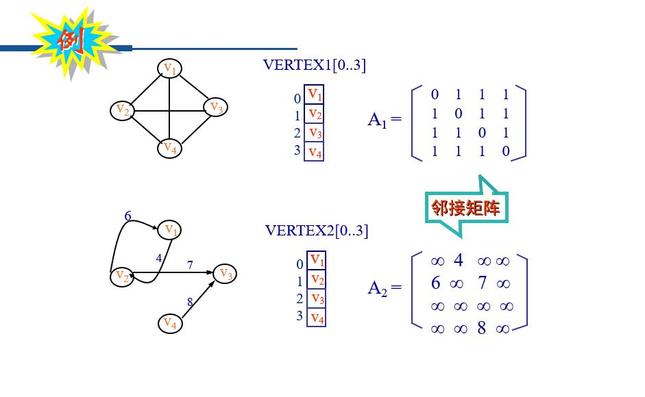
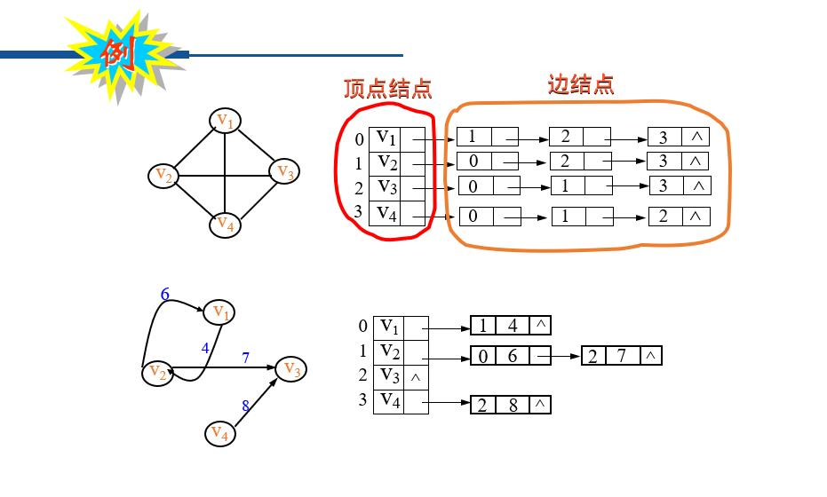
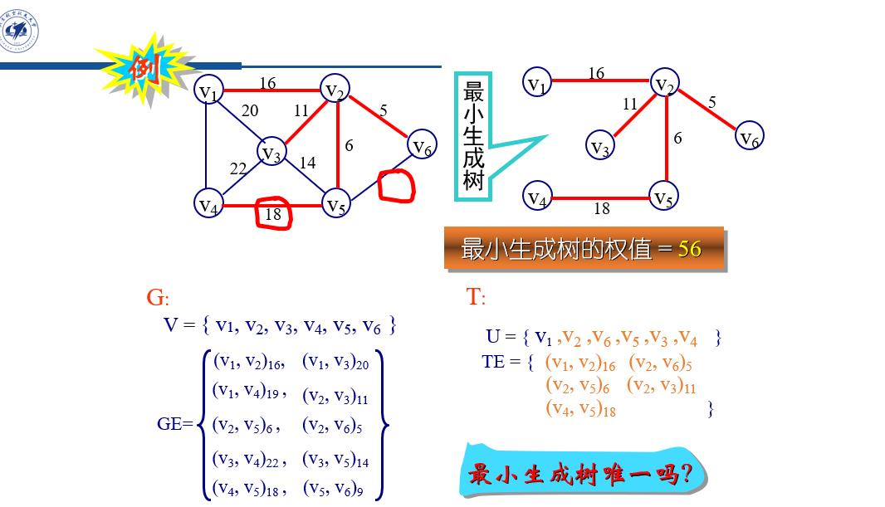
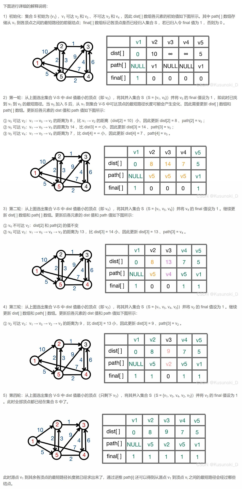

# 图
## 1.基础概念
1. 图：图是由顶点的非空有穷集合与顶点之间关系(边或弧)的集合构成的结构, 通常表示为   G = (V, E)<br>
其中, V 为顶点集合, E 为关系(边或弧)的集合

2. 网(络)：与边有关的数据称为权,边上带权的图称为网络
3. 顶点的度：依附于顶点vi的边的数目,记为TD(vi)<br>
    出度：以顶点vi 为出发点的边的数目,记为OD(vi)<br>
    入读：以顶点vi 为终止点的边的数目,记为ID(vi)<br>
    TD(vi) = OD(vi) + ID(vi)<br>
    边的数目达到最大的图称为完全图。<br>
    边的数目达到或接近最大的图称为稠密图，<br>
    否则,称为稀疏图<br>

4. 路径：$p(v_x,v_y)=v_x,v_{i1},v_{i2},……，v_{im},v_y$<br>
   路径长度：不带权的图的路径长度是指路径上所经过的边的数目，带权图的路径长度是指路径上经过的边上的权值之和<br>
   回路(环)：出发点与终止点相同的路径<br>
   简单路径：顶点序列中顶点不重复出现的路径
   
5. 子图：对于图G=(V,E) 与 G´=(V´,E´), 若有V´⊆V, E´⊆E,则称G´为G的一个子图
6. 无向图的连通:无向图中顶点vi 到vj 有路径,则称顶点vi 与vj 是连通的。若无向图中任意两个顶点都连通, 则称该无向图是连通的（称为连通图）<br>
    有向图的连通:若有向图中顶点vi 到vj 有路径,并且顶点vj到vi 也有路径，则称顶点vi 与vj 是连通的。若有向图中任意两个顶点都连通，则称该有向图是强连通的
7. 生成树:包含具有n个顶点的连通图G的全部n个顶点,仅包含其n-1条边的极小连通子图称为G的一个生成树

## 2.1图的建立(邻接矩阵)&nbsp;$O(n^2)$


```c
#include <stdio.h>
#include <stdlib.h>
#define MAXVER  512
#define INFINITY   32767

struct edge     //id是边序号，wei是边权重
{
    int id;
    int wei;
};
struct edge graph[MAXVER][MAXVER]; //邻接矩阵

int main()
{
    int N,E;
    scanf("%d %d",&N,&E); //输入图的顶点(vertex)个数和边(edge)的个数
    
    //初始化图
    for(int i=0;i<N;i++)
        for(int j=0;j<N;j++)
            graph[i][j].wei=INFINITY;

    //构造图
    for(int i=0;i<E;i++)    //如果需要存储点信息，再开一个一维数组
    {
        int id,v1,v2,wei;
        scanf("%d%d%d%d",&id,&v1,&v2,&wei);
        graph[v1][v2].id = id; graph[v1][v2].wei = wei;
        graph[v2][v1].id = id; graph[v2][v1].wei = wei;
    }
}    
```

## 2.2图的建立(邻接表)&nbsp;$O(n+e)$

如果要存边结点信息，可以看作业&nbsp;*独立路径数计算.c*
```c
//定义框架
#define MaxV  256          //<最大顶点个数>
typedef struct  edge    //定义边结点类型
{ 
    int  adjvex;        //此结点在头节点数组的位置
    int  weight;        //权重
    struct edge  *next;
}ELink;

typedef struct ver    //定义头结点类型
{
    int  vertex;      //头结点的数值
    ELink  *link;     //指向边结点
}VLink;
VLink  G[MaxV];
```

```c
//在链表尾插入一个节点
ELink  *insertEdge(ELink *head, int avex)
{
    ELink *e,*p;
    e =(ELink *)malloc(sizeof(ELink));
    e->adjvex= avex; e->weight=1; e->next = NULL;
    if(head == NULL)  { head=e; return head; }
    for(p=head; p->next != NULL; p=p->next)
        ;
    p->next = e;  
    return head;
}
ELink  *insertEdge(ELink *head, int avex)
{
//在链表尾插入一个节点(有序从小到大)
    ELink *e,*p,*q = NULL;
    e =(ELink *)malloc(sizeof(ELink)); /* 创建一个数据项为avex的新结点 */
    e->adjvex= avex; e->weight=1; e->next = NULL;
    if(head == NULL)  /* head是一个空表 */
        return e;
    for(p=head; p != NULL && avex > p->adjvex;  q = p, p = p->next) /* 找到插入位置 */
        ;
    if( p == head){  /* 在头结点前插入 */
        e->next = p;
        return e;
    }
    else {           /* 在结点p前插入一个结点 */
        q->next = e;
        e->next = p;
        return head;
    }
}
```

```c
//建立图
void createGraph(VLink graph[])
{ 
    int i,n,v1,v2;
    scanf("%d",&n);
    for(i=0; i<n; i++)
    {
        scanf("%d%d",&v1,&v2);
        while(v2 != -1)
        {
            graph[v1].link=insertEdge(graph[v1].link, v2);
            graph[v2].link=insertEdge(graph[v2].link, v1);
            scanf("%d",&v2);
        }
    }
} 
```
## 3.1图的遍历(深度优先遍历(DFS))
从图中某个指定的顶点v出发,先访问顶点v,然后从顶点v未被访问过的一个邻接点出发，继续进行深度优先遍历,直到图中与v相通的所有顶点都被访问；若此时图中还有未被访问过的顶点, 则从另一个未被访问过的顶点出发重复上述过程,直到遍历全图。<br>
如果图中具有n个顶点、e条边,算法的时间复杂度为O(n+e)<br>
**核心思想：递归**

```c
int  Visited[N]={0}; //标识顶点是否被访问过，N为顶点数
void  travelDFS(VLink  G[ ], int n)
{
    int i;
    for(i=0; i<n; i++) Visited[i] = 0 ;
    Visited[c] = 1 ;//惰性删去节点 c 
    for(i=0; i<n; i++)
        if( !Visited[i] ) DFS(G, i);
}

void DFS(VLink  G[ ], int v)
{
    ELink  *p;
    Visited[v] = 1; //标识某顶点被访问过
    VISIT(G, v); //访问某顶点
    //printf("%d",G[v].vertex);
    for(p = G[v].link; p !=NULL;  p=p->next)
         if( !Visited[p->adjvex] )
             DFS(G, p->adjvex);
}
```
## 3.2图的遍历(广度优先遍历(BFS))
从图中某个指定的顶点v出发,先访问顶点v,然后依次访问顶点v的各个未被访问过的邻接点,然后又从这些邻接点出发, 按照同样的规则访问它们的那些未被访问过的邻接点，如此下去，直到图中与v 相通的所有顶点都被访问; 若此时图中还有未被访问过的顶点, 则从另一个未被访问过的顶点出发重复上述过程, 直到遍历全图。<br>
如果图中具有n个顶点、e条边,算法的时间复杂度为O(n+e)<br>
**核心思想：队列**
```c
#define MAXSIZE 1000
#define ElemType  int
int queue[MAXSIZE];
int  Front=0, Rear=MAXSIZE-1, Count=0;
int  Visited1[N]={0}; //标识顶点是否被访问守，N为顶点数

void  travelBFS(VLink  G[ ], int n)
{
    int i;
    for(i=0; i<n; i++) Visited1[i] = 0 ;
    Visited1[c] = 1 ;//惰性删去节点 c 
    for(i=0; i<n; i++)
        if( !Visited1[i] ) BFS(G, i);
}

void BFS(VLink  G[ ], int v)
{
    ELink  *p;
    Visited1[v] = 1; //标识某顶点已入队
    enQueue(queue, v);
    while( !isEmpty())
    {
        v=deQueue(queue);  //取出队头元素
        VISIT(G, v); //访问某顶点
        //printf("%d",G[v].vertex);
        for(p=G[v].link; p!=NULL; p=p->next ) //访问该顶点的每个邻接顶点
            if( !Visited1[p->adjvex] ) 
            {
                Visited1[p->adjvex] = 1; //标识某顶点入队
                enQueue(queue,p->adjvex);
            }
    }
}

void enQueue(ElemType queue[ ], ElemType item)
{
    if(isFull())               /* 队满，插入失败 */  
        printf("Full queue!");
    else{
            Rear = (Rear+1) % MAXSIZE;
            queue[Rear]=item;
            Count++;
                        /* 队未满，插入成功 */ 
        }
}

ElemType  deQueue(ElemType queue[ ])
{ 
    ElemType e;
    if(isEmpty())
        printf("Empty queue!");     /* 队空，删除失败 */
    else
    {
        e=queue[Front];
        Count--;                             /* 队非空，删除成功 */
        Front = (Front+1)%MAXSIZE;
        return e;
    }
}
int  isEmpty( )
{
    return Count == 0;
}
int  isFull( )
{
    return Count == MAXSIZE;
}
```
## 4.最小生成树
1. 生成树：包含具有n个顶点的连通图G的全部n个顶点,仅包含其n-1条边的极小连通子图称为G的一个生成树
2. 最小生成树：带权连通图中，总的权值之和最小的带权生成树为最小生成树
3. 求最小生成树：<br>**算法：贪心**
   普里姆(Prim)算法:&nbsp;**O($elog_2n$)** &nbsp; (n个顶点，e条边)
   1. 随便选1单元素点集{A}，再选一个该点集连接的最小边ab和点B
   2. 在{A,B}中再选一个该点集连接的最小边……
    
Prim代码解析：prim函数得到的edges[i]代表i节点的前驱节点
```c
#include <stdio.h>
#include <stdlib.h>
#define MAXVER  512
#define INFINITY   32767

struct edge {
    int id;
    int wei;
};
struct edge graph[MAXVER][MAXVER]; //邻接矩阵
int edges[MAXVER]={0}; //生成树

void Prim(struct edge weights[][MAXVER], int n, int src, int edges[]);

int cmp (const void * a, const void * b){
    return *(int*)a - *(int*)b;
}

int main()
{
    int N,E;
    scanf("%d %d",&N,&E); //输入图的顶点(vertex)个数和边(edge)的个数
    
    //初始化图
    for(int i=0;i<N;i++)
            for(int j=0;j<N;j++)
                graph[i][j].wei=INFINITY;
    //构造图
    for(int i=0;i<E;i++)
    {
        int id,v1,v2,wei;
        scanf("%d%d%d%d",&id,&v1,&v2,&wei);
        graph[v1][v2].id = id; graph[v1][v2].wei = wei;
        graph[v2][v1].id = id; graph[v2][v1].wei = wei;
    }
    
    //求最小生成树--prim算法
    Prim(graph,N,0,edges);

    
    //整理
    int edges_id[MAXVER]; //需要铺设的边的id
    int edges_wei = 0;//铺设光缆的最小用料数
    
    for(int i=1;i<N;i++){
        edges_id[i-1]=graph[i][edges[i]].id;//根据生成树数组edges可得到生成树边序号
        edges_wei+=graph[i][edges[i]].wei;//生成树边权重求和（即用料数）
    }
    qsort(edges_id,N-1,sizeof(int),cmp);//输出的id值按照升序排序
    
    //输出
    printf("%d\n",edges_wei); //输出铺设光缆的最小用料数
    
    for(int i=0;i<N-1;i++)
        printf("%d ",edges_id[i]); //输出需要铺设的边的id
    printf("\n");
    
    return 0;
}

void Prim(struct edge weights[][MAXVER], int n, int src, int edges[])
{ //weights为权重数组、n为顶点个数、src为最小树的第一个顶点、edge为最小生成树边
    int minweight [MAXVER], min;
    int i, j, k;
    for(i=0; i<n; i++){  //初始化相关数组
        minweight[i] = weights[src][i].wei;  //将src顶点与之有边的权值存入数组
        edges[i]  = src;  //初始时所有顶点的前序顶点设为src，(src,i）
     }
    minweight[src]  = 0;   //将第一个顶点src顶点加入生成树
    for(i=1; i<n; i++){
        min = INFINITY;
        for(j=0, k=0;  j<n; j++)
            if(minweight[j] !=0 && minweight[j] < min) {  //在数组中找最小值，其下标为k
                min = minweight[j];  k = j;
            }
        minweight[k] = 0;  //找到最小树的一个顶点
        for(j=0;  j<n; j++)
             if(minweight[j] != 0 && weights[k][j].wei < minweight[j] ) {
                  minweight[j] = weights[k][j].wei;    //将小于当前权值的边(k,j)权值加入数组中
                  edges[j] = k;   //将边(j,k)信息存入边数组中
             }
    }
}
```
克鲁斯卡尔(Kruskal)方法&nbsp;**O($elog_2e$)** &nbsp;(n个顶点，e条边)
1. 找一个最小边
2. 再找一个与目前树无回路的最小边……

## 5.最短路径问题（Dijkstra算法）
路径长度：
1. 不带权的图：路径上所经过的边的数目
2. 带权的图：路径上所经过的边上的权值之和<br>
单源最短路径：即求图中某一顶点到其他各个顶点的最短路径，可通过 Dijkstra 算法求解

    
   
        


    