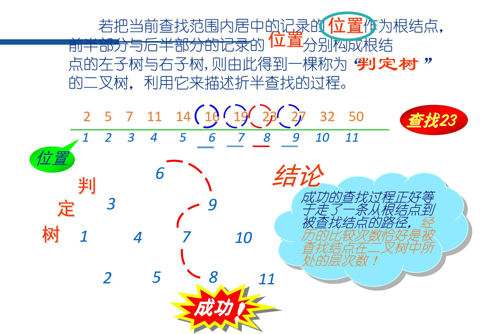
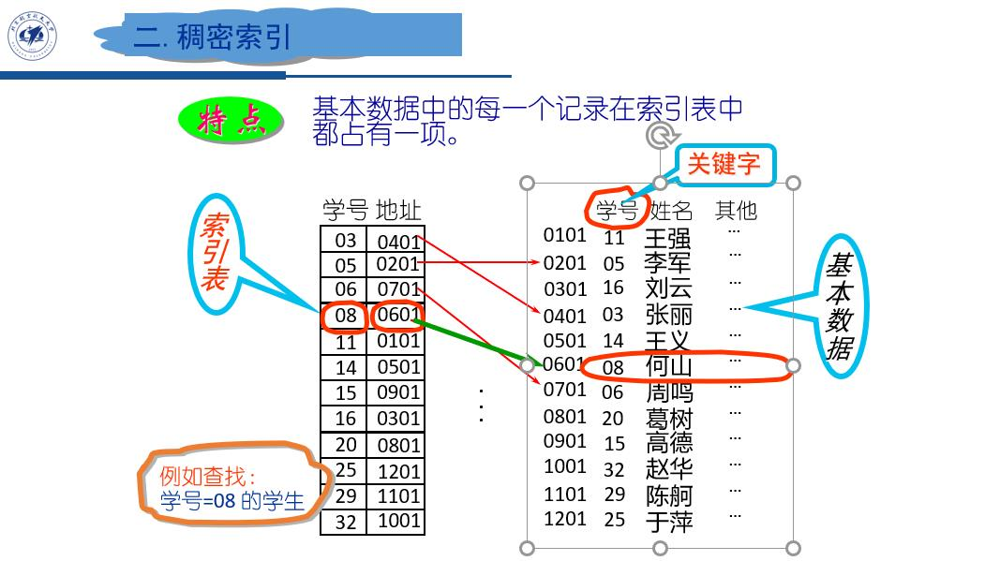
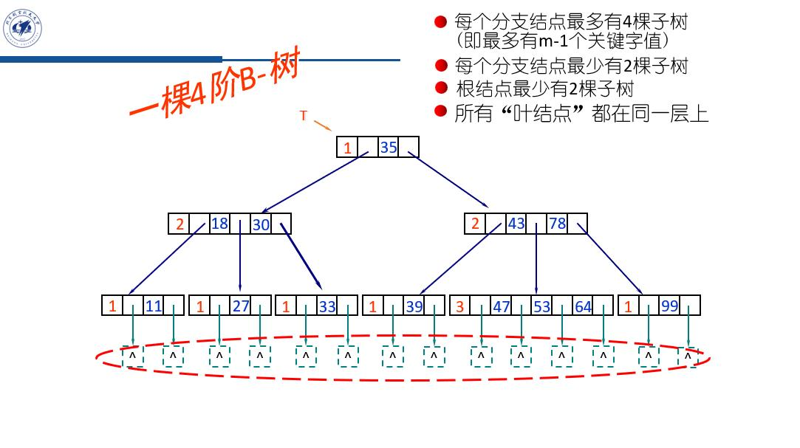
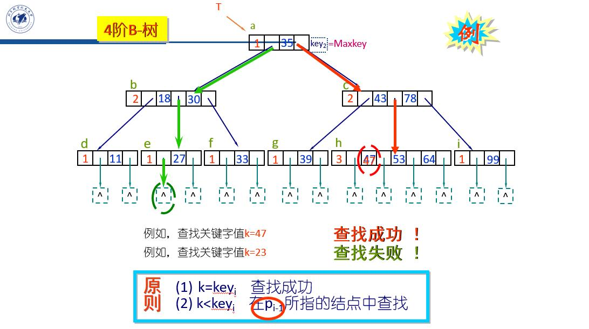
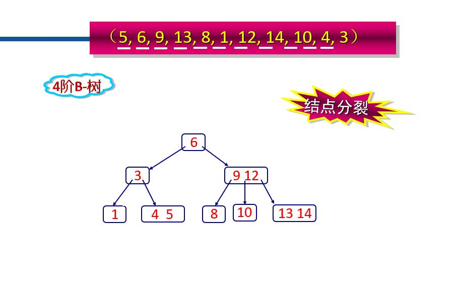
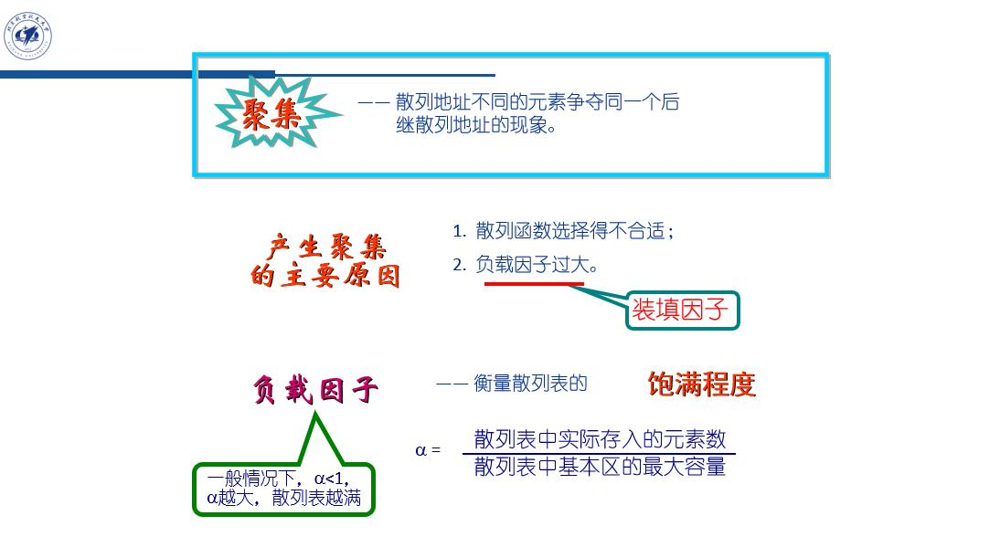
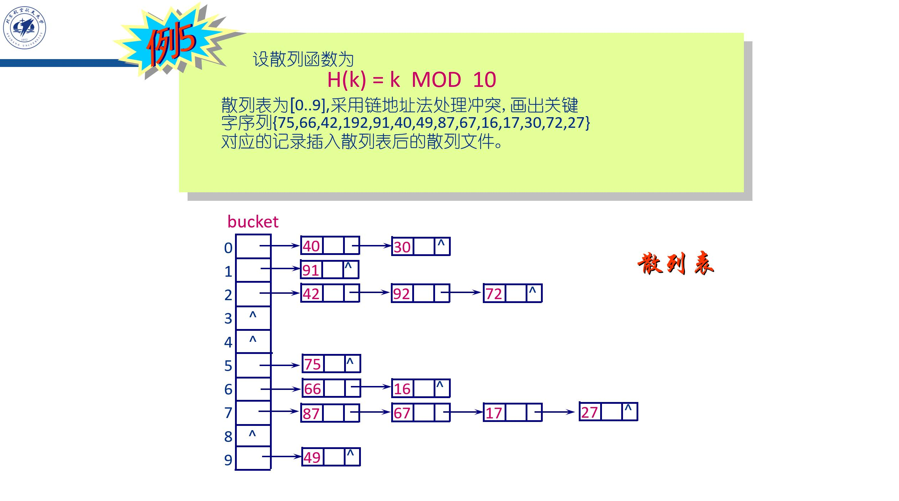

# 查找
## 1.平均查找长度ASL(Average Search Length)
$\displaystyle ASL=\sum_{i=1}^{n}p_{i}c_{i}$<br>
其中，pi为查找第i个记录的概率，ci为查找第i个记录所进行过的关键字的比较次数。


## 2.顺序查找法
$\displaystyle ASL=\sum_{i=1}^{n}p_{i}c_{i}=\frac1n\sum_{i=1}^{n}i=\frac {n+1} 2$<br>
```c
int  search(keytype key[ ],int n,keytype k)//线性表
{     
    int  i;
    for(i=0;i<n; i++)
        if(key[i]==k) 
            return i;
    return -1;
}

struct node *search(struct node * p, keytype  k)//链表
{
    for(; p!=NULL; p=p->link )
        if(p->key==k)
            return p;              /* 查找成功 */      
    return NULL;                  /* 查找失败 */  
}

```

## 3.二分查找法

查找一个元素的比较次数为被查找结点在判定树中所处的层次数<br>
$\displaystyle ASL=\sum_{i=1}^{n}p_{i}c_{i}=\frac1n\sum_{i=1}^{h}(第i层)×(第i层中元素个数)$<br>
```c
int  binsearch(keytype key[ ], int n, keytype k)//非递归
{
    int low=0, high=n-1, mid;
    while(low<=high)
    {
        mid=(low+high)/2;
        if(k==key[mid])
            return mid;             /*  查找成功  */
        if(k>key[mid])
            low=mid+1;            /*  准备查找后半部分 */
        else
            high=mid-1;           /* 准备查找前半部分 */
    }
    return -1;                             /*   查找失败  */
}

int binsearch2(keytype key[ ], int low, int high, keytype k)//递归
{
    int  mid;
    if(low>high)
        return -1;
    else
    { 
        mid=(low+high)/2;
        if(k==key[mid])
            return mid;
        else
            if(k<key[mid])
            return  binsearch2(key,low,mid–1,k);
        else
            return  binsearch2(key,mid+1,high,k);
    }
}
```
## 4.索引
记录关键字值与记录的存储位置之间的对应关系<br>
步骤：<br>
1. 在基本数据中寻找简单关键词
2. 通过关键词与对应地址构建索引表
3. 可以通过索引表确定关键词的地址


## 5.1二叉查找（排序）树（BST）
采用链式存储，元素插入与删除效率高，同时查找效率通常较高<br>
详细内容见《3.树》

## 5.2 B-树和B+树——多路查找树
### 5.2.1 B-树的定义
一个m阶的B-树为满足下列条件的m叉树：<br>
每个节点：$n,p_0,key_1,p_1,key_2,p_2,……,key_n,p_n$<br>
其中,n为结点中关键字值的个数,n≤m-1<br>
$key_i$为关键字，且满足 $key_i$≤$key_{i+1}$                         
$p_i$为指向该结点的第i+1棵子树的根的指针,$p_i$指的结点中所有关键字值都大于$key_i$


### 5.2.2 B-树的查找
从根节点开始往下找，每个节点的关键词集合采用顺序查找或二分查找

```c
#define M  1000
typedef struct node 
{
    int  keynum; 
    keytype  key[M+1];
    struct node  *ptr[M+1];
    rectype  *recptr[M+1];
} BNode;

keytype  searchBTree(BNode *t,keytype k)
{
    int i,n;
    BNode *p=t;
    while(p!=NULL)
    {
        n=p->keynum;
        p->key[n+1]=Maxkey;
        i=1;
        while(k>p->key[i])
            i++;
        if(p->key[i]==k)
            return  p->key[i];
        else
            p=p->ptr[i-1];           
    }
    return  -1;
}
```
### 5.2.3 B-树的构建
从叶节点开始插入，小的在左，大的在右<br>
当插入元素数超过(m-1)即到达m时，将第m/2个元素向上提出为双亲节点，左右分裂为两个叶节点<br>


### 5.2.4 B+树的定义
1. B-树的每个分支结点中含有该结点中关键字值的个数,B+树没有
2. B-树每个分支节点中含有指向关键字值对应记录的指针<br>
   而B+树只有叶结点有指向关键字值对应记录的指针
3. B-树只有一个指向根节点的入口<br>
   而B+树的叶结点被链接成为一个不等长的链表， 因此，B+树有两个入口，一个指向根结点，另一个指向最左边的叶结点(即最小关键字所在的叶结点)

## 6.散列(Hash)查找
### 6.1 概念
1. 散列函数<br>
$A=H(k)$<br>
其中，k为记录的关键字，H(k)称为散列函数，或哈希(Hash)函数，或杂凑函数。函数值A为k对应的记录在查找表中位置。
2. 散列冲突<br>
    对于不同的关键字ki与kj，经过散列得到相同的散列地址，即有$H(k_i) = H(k_j)$这种现象称为散列冲突。
3. 散列函数构造过程<br>
   1. 确定散列的地址空间(地址范围)；
   2. 构造合适的散列函数
   3. 选择处理冲突的方法

### 6.2 构造合适的散列函数
1. 直接定址法   $H(k)=ak+b$
2. 除留余数法   $H(k)=k\mod p$ &nbsp; p是大于地址范围的素数

### 6.3 选择处理冲突的方法
1. 开放地址法<br>
在散列表中的“空”地址向处理冲突开放。即当散列表未满时，处理冲突需要的“下一个”地址在该散列表中解决。<br>
$D_i=(H(k)+d_i)\mod m$<br>
(1) $di=1, 2, 3, …, m–1$ 称为线性探测再散列  <br>
(2) $di=1^2, -1^2,  2^2, -2^2,…$称为二次探测再散列<br>
(3) $di=伪随机数序列$      称为伪随机再散列<br>

“线性探测法”容易产生元素“聚集”的问题<br>
“二次探测法”可以较好地避免元素“聚集”的问题，但不能探测到表中的所有元素(至少可以探测到表中的一半元素)<br>

2. 再散列法<br>
$D_i=H(k)$

3. 链地址法<br>
将所有散列地址相同的记录链接成一个线性链表。若散列范围为[0..m-1],则定义指针数组bucket[0..m-1]分别存放m个链表的头指针。


```c
//hash链地址法例子
//此题a[][]是一个二维数组，存储字符串
typedef struct  edge    //定义边结点类型
{ 
    char  adjvex[25];
    struct edge  *next;
}ELink;

typedef struct ver    //定义顶点结点类型
{
    ELink  *link;
}VLink;
VLink  G[4000];

int main()
{
    int count=0;
    //hash存放
	for(i=0;i<=t-1;i++)
	{
		G[hash(a[i])].link=insertEdge(G[hash(a[i])].link, a[i]);
	}
	//hash查找	
	ELink *p=G[hash(b)].link;
	while(1)
	{
		if(p==NULL)
		{
			if(count==0) count++;
			printf("0 %d\n",count);
			break;	
		}
		else if(strcmp(p->adjvex,b)>0)
		{
			if(count==0) count++;
			printf("0 %d\n",count);
			break;
		}
		else if(strcmp(p->adjvex,b)==0)
		{
			count++;
			printf("1 %d\n",count);
			break;
		}
		else if(strcmp(p->adjvex,b)!=0)
		{
			count++;
			p=p->next;
		}
	}
}
unsigned int hash(char *str)
{
    unsigned int h=0;
    char *p;
    for(p=str; *p!='\0'; p++)
        h = MULT*h + *p;
    return h % NHASH;
}
ELink  *insertEdge(ELink *head, char avex[])
{
    ELink *e,*p;
    e =(ELink *)malloc(sizeof(ELink));
    strcpy(e->adjvex,avex);e->next = NULL;
    if(head == NULL)  { head=e; return head; }
    for(p=head; p->next != NULL; p=p->next)
        ;
    p->next = e;  
    return head;
}
```

