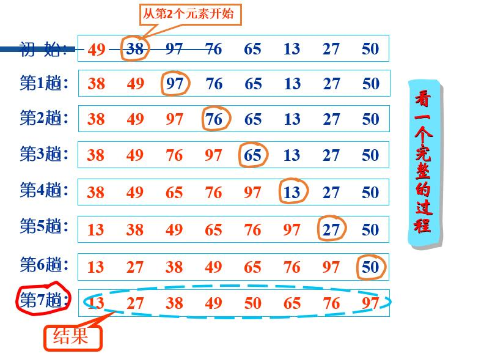
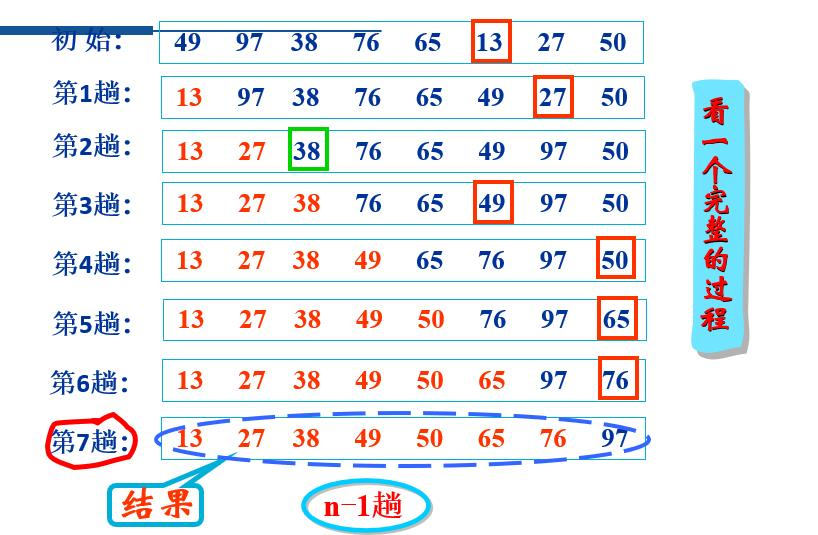
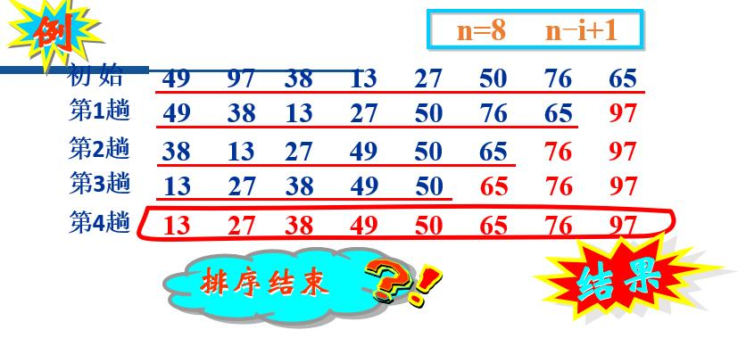
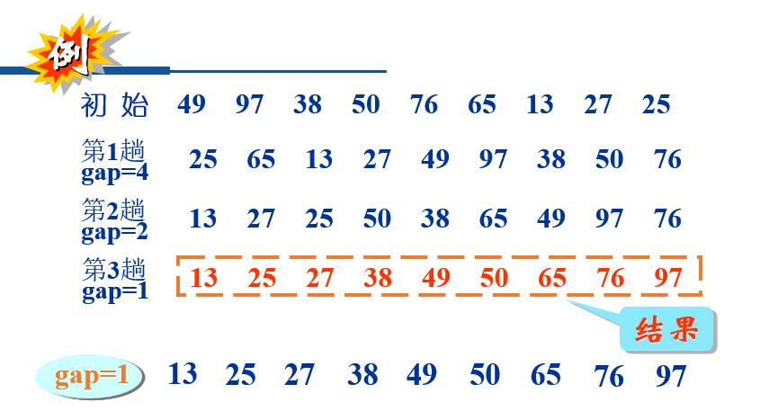
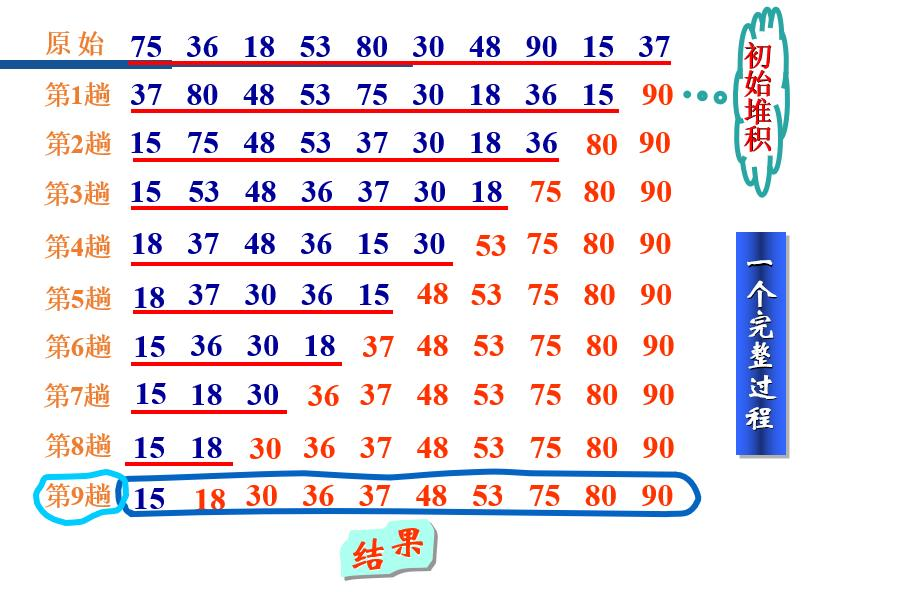
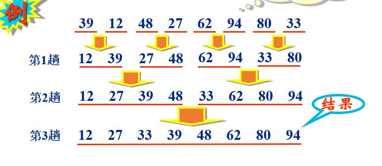
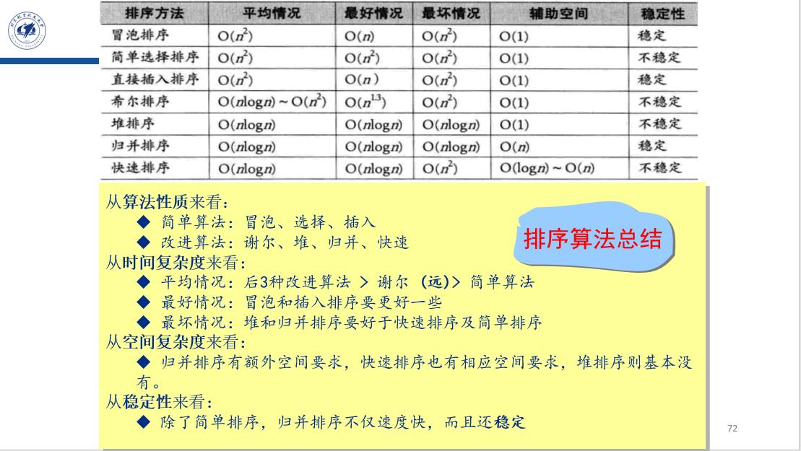

# 排序
## 1.插入排序法
第i趟排序将序列的第i+1个元素插入到一个大小为i、且已经按值有序的子序列(ki-1,1, ki-1,2, …, ki-1,i)的合适位置，得到一个大小为i+1、且仍然按值有序的子序列(ki,1, ki,2, …, ki,i+1)。<br>
时间复杂度：O($2^n$)<br>
稳定性：稳定<br>
若原始序列为一个按值递增的序列，n-1次比较<br>
若原始序列为一个按值递减的序列，n(n-1)/2次比较


```c
//顺序插入
void insertSort(int k[ ],int n)
{
    int i, j;
    int  temp;
    for(i=1;i<n;i++)
    {
        temp=k[i];
        for(j=i-1; j>=0 && temp<k[j]; j--) 
            k[j+1]=k[j];
        k[j+1]=temp;
    }
}

//二分插入(非递归)
void  insertBSort(keytype k[ ], int n)
{     
    int i, j, low, high, mid;
    keytype temp;
    for(i=1;i<n;i++ )
    {
        temp=k[i];
        low=0;
        high=i-1;
        while(low<=high)
        {
            mid=(low+high)/2;
            if(temp<k[mid])
                high=mid-1;
            else
                low=mid+1;
        }
        for(j=i-1;j>=low;j--)
            k[j+1]=k[j];
        k[low]=temp;
    }
}

//二分插入(递归)
int searchB(keytype a[ ],int n,keytype k)
{
    int low=0, high=n-1, mid;
    while(low<=high)
    {
        mid=(low+high)/2;
        if(a[mid]==k)
            return mid;          /*  返回mid  */
        if(k>a[mid])
            low=mid+1;         /*  准备查找后半部分 */
        else
            high=mid–1;        /* 准备查找前半部分 */
    }
    return high;                /* 返回high*/
}
```
## 2.选择排序
第i趟排序从序列的后n-i+1个元素中一个值最小的元素，将其置于该n-i+1个元素的最前面,并交换。
时间复杂度：O($2^n$)<br>
稳定性：不稳定<br>
无论原始序列为什么状态，第i趟排序都需要经过n-i次元素之间的比较，因此，整个排序过程中元素之间的比较次数恒为n(n-1)/2
<br>
```c
void  selectSort(int k[ ],int n)   //选择排序 
{     
    int i, j, d;
    int  temp;
    for(i=0;i<n-1;i++)
    {
        d=i;
        for(j=i+1;j<n;j++)
		{
			count++;
			if(k[j]<k[d])
            	d=j;
		} 	
        if(d!=i)            /* 最小值元素非未排序元素的第一个元素时，交换 */
        {    
            temp=k[d];
            k[d]=k[i];
            k[i]=temp;
        }
    }
}
```

## 3.冒泡排序
第i趟排序对序列的前n-i+1个元素从第一个元素开始依次作如下操作:相邻的两个元素比较大小，若前者大于后者,则两个元素交换位置，否则不交换位置。<br>
时间复杂度：O($2^n$)<br>
稳定性：稳定<br>

```c
void  bubbleSort(int k[ ],int n)//冒泡排序 
{    
    int i, j, flag=1;
    int temp;
    for(i=n-1; i>0 && flag==1; i--)
    {
        flag=0;                        /* 每趟排序前标志flag置0 */ 
        for(j=0;j<i;j++)
		{
			count++; 
			if(k[j]>k[j+1])
            {
                temp=k[j];
                k[j]=k[j+1];
                k[j+1]=temp;  /* 交换两个元素的位置 */     
                flag=1;              /* 标志flag置1 */ 
            }
		} 
            
    }
}
```

## 4.谢尔(Shell)排序法
首先确定一个元素的间隔数gap。将参加排序的元素按照gap分隔成若干个子序列(即分别把那些位置相隔为gap的元素看作一个子序列),然后对各个子序列采用某种排序方法进行排序；此后减小gap值，重复上述过程，直到gap<1<br>
时间复杂度：O($nln_2(n)$)-O($2^n$)<br>
稳定性：不稳定<br>

```c
void  shellSort(keytype k[ ],int n)
{     
    int  i, j, flag, gap=n;
    keytype  temp; 
    while(gap>1)
    {
        gap=gap/2;
        do
        {
            flag=0;                  /* 每趟排序前,标志flag置0 */ 
            for(i=0;i<n–gap;i++)
            {
                j=i+gap;
                if(k[i]>k[j])
                {
                    temp=k[i];
                    k[i]=k[j];
                    k[j]=temp;
                    flag=1;  
                }
            }
        }
        while(flag!=0);
    }
}
```
## 5.堆(Heap)排序法
堆是一种特殊类型的完全二叉树，具有以下两个性质：<br>
（1）每个节点的值大于（或小于）等于其每个子节点的值；<br>
（2）该树完全平衡，其最后一层的叶子都处于最左侧的位置。<br>
排序步骤:<br>
1.将原始序列转换为第一个堆<br>
2.将堆的第一个元素与堆积的最后那个元素交换位置。(即“去掉”最大值元素)<br>
3.将“去掉”最大值元素后剩下的元素组成的子序列重新转换一个新的堆。<br>
4.重复上述过程的第2至第3步n-1次<br>

时间复杂度：O($nln_2(n)$)<br>
稳定性：不稳定<br>

```c
void heapSort(int k[ ],int n)//堆排序1 
{
    int i;
    int temp;
    for(i=n/2-1;i>=0;i--)
        adjust(k,i,n);
    for(i=n-1;i>=1;i--)
    {
        temp=k[i];
        k[i]=k[0];
        k[0]=temp;
        adjust(k,0,i);
    }
}
void  adjust(int k[ ],int i,int n)//堆排序2 
{
    int j;
    int  temp;
    temp=k[i];
    j=2*i+1;
    while(j<n)
    {
        if(j+1<n && k[j]<k[j+1])
            j++;
        count++; 
        if(temp<k[j]) 
        {
            k[(j-1)/2]=k[j];
            j=2*j+1;
        } 
        else break;
    }
    k[(j-1)/2]=temp;
}
```

## 6.二路归并(Merge)排序法
将两个位置相邻、并且各自按值有序的子序列合并为一个按值有序的子序列的过程称为二路归并
时间复杂度：O($nln_2(n)$)<br>
稳定性：稳定<br>

```c
void mergeSort(int k[ ],int n)//二路归并1 
{
    int *tmp;
    tmp = (int *)malloc(sizeof(int) * n);
    if(tmp != NULL) 
    {
        mSort(k, tmp, 0, n-1);
        free(tmp);
    } 
    else
        printf("No space for tmp array!!!\n");
}
void mSort(int k[], int tmp[], int left, int right)//二路归并2
{
    int center;
    if(left < right)
    {
        center = (left+right)/2;
        mSort(k, tmp, left, center);
        mSort(k, tmp, center+1, right);
        merge(k, tmp, left,center, right);
    }
}
void merge(int x[ ],int tmp[ ],int left,int leftend,int rightend)//二路归并3
{     
    int i=left, j=leftend+1, q=left;
    while(i<=leftend && j<=rightend)
    {
    	count++;
    	if(x[i]<=x[j]) 
            tmp[q++]=x[i++];
        else
            tmp[q++]=x[j++];
	}    
    while(i<=leftend)
        tmp[q++]=x[i++];
    while(j<=rightend)
        tmp[q++]=x[j++];
    for(i=left; i<=rightend; i++)
        x[i]=tmp[i];
}
```

## 7.快速(Quick)排序法
从当前参加排序的元素中任选一个元素(通常称之为分界元素pivot)与当前参加排序的那些元素进行比较,凡是小于分界元素的元素都移到分界元素的前面,凡是大于分界元的元素都移到分界素的后面,分界元素将当前参加排序的元素分
成前后两部分,而分界元素处在排序的最终位置。然后，分别对这两部分中大小大于1的部分重复上述过程,直到排序结束。<br>
每一次排序至少可以确定一个元素的最终位置<br>
步骤：  
1. 反复执行动作i++ ，直到K[s]≤K[i]或者i=t。<br>
   反复执行动作j-- ，直到K[s]≤K[j]或者j=s。
2. 若i<j，则K[i]与K[j]交换位置，转到第1步
3. 若i>j，则K[s]与K[j]交换位置，到此,分界元素K[s]的最终位置已经确定，然后对被K[s]分成的两部分中大小大于1的部分重复上述过程，直到排序结束。

时间复杂度：O($nln_2(n)$)<br>
稳定性：不稳定<br>
```c
void quickSort(int k[],int n)//快速排序1
{
    quick(k,0,n-1);
}
void quick(int k[ ],int left,int right)//快速排序2
{     
	int i, last;
    if(left<right)
	{
        last=left; 
        for(i=left+1;i<=right;i++)
        {
        	count++;
        	if(k[i]<k[left])
                swap(&k[++last],&k[i]); 
		} 
        swap(&k[left],&k[last]);
        quick(k,left,last-1); 
        quick(k,last+1,right);   	
    }
}
void swap(int *plow, int *phigh)
{
    int tmp = *plow;
    *plow = *phigh;
    *phigh = tmp;
}
```
## 8.排序算法总结



