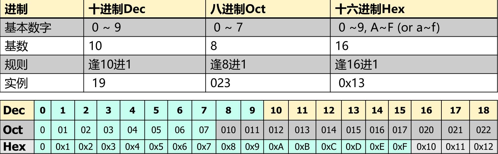
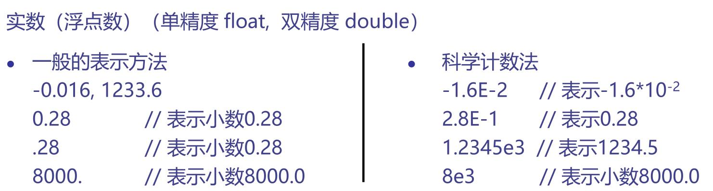
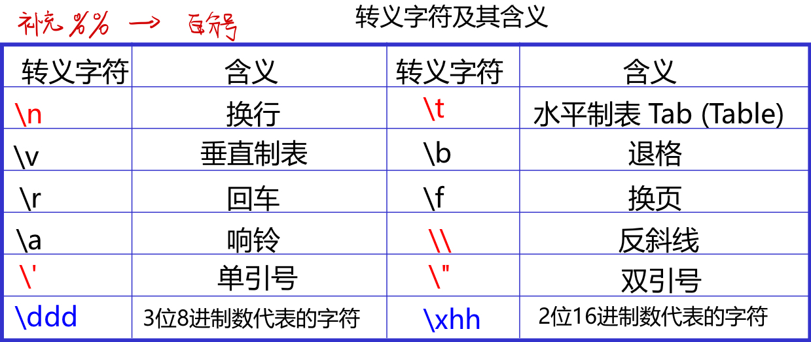
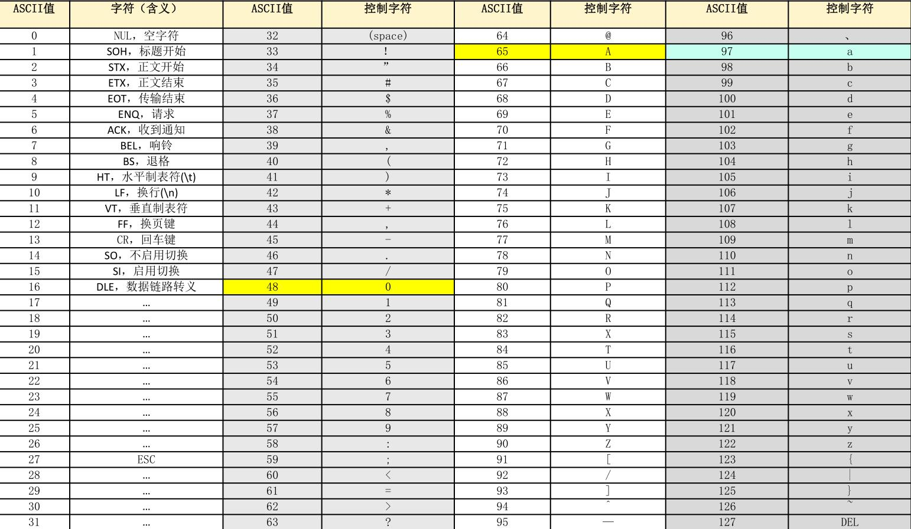
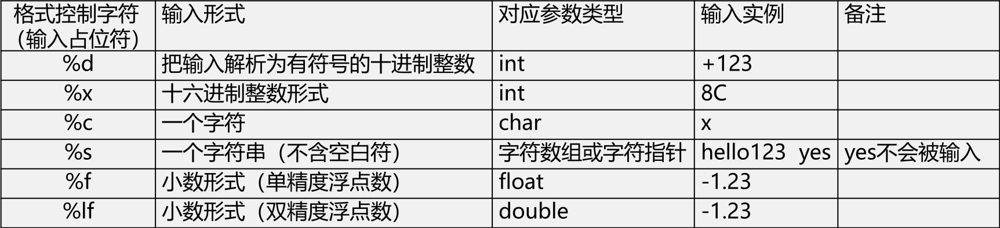
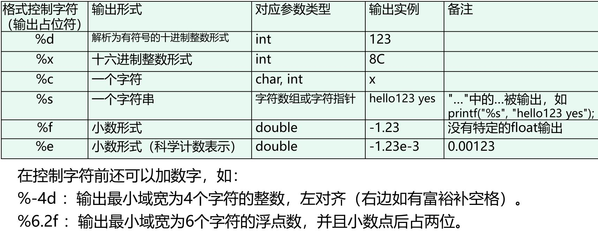
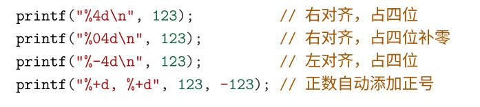
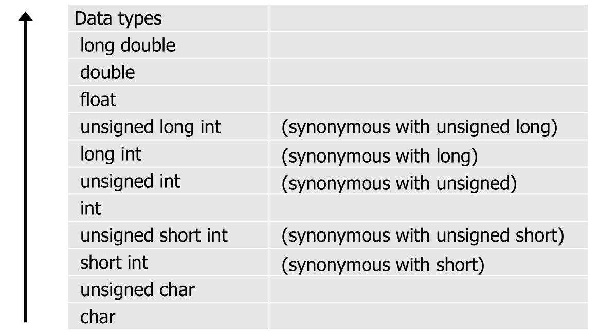

# 编程基础知识
## 1.常量
### 1.1整数

### 1.2 实数

**注意：科学计数法，表示的是浮点数，不是整数**
### 1.3字符常量

**ASCII编码表**


## 2.输入输出
### 2.1输入

**%o输入八进制**<br>
**%x输入十六进制**<br>
**注意：
1.scanf()会跳过前导空白，从第一个有效数值型字符开始读入<br>
2.format格式串中其它字符必须原样输入<br>
3.scanf()函数有返回值，返回成功赋值的数据项数，读到文件末尾而没有数据时返回EOF(-1)**<br>
### 2.2输出

<br>
**%o输出八进制**<br>
**%x输出十六进制小写**<br>
**%X输出十六进制大写**

## 3.数据类型
1. (隐式转换)不同数据类型运算时，数据类型会隐式转换为最高的。

2. (显式转换)如 d=(double)（b/5）<br>
注意：强制类型转换要加括号<br>
应用: 提取浮点数的整数部分和小数部分

## 4.关系运算和逻辑运算
应用：正确返回1，错误返回0<br>
```c
if((a==1)+(b==2)+(c==3)+(d==4)+(e==5)+(f==6)==3) //恰好判断对3个人
```

## 5.常量符号表示(宏定义)
```c
#define A B //把A定义为B，以后就调用A即可
```


