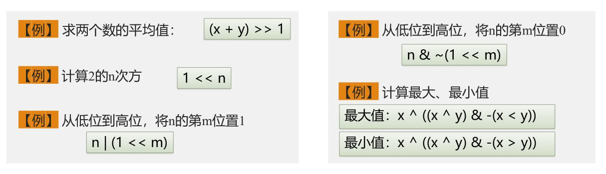

# 数据处理
## 补码
正数不变 
负数补码=模-正数 或 正数取反+1 (模为$2^n$)
数据类型|2进制范围|10进制范围
----|----|----
char|[$-2^7$,$2^7-1$]|[-128,127]
int|[$-2^{31}$,$2^{31}-1$]|$±2.1×10^9$
unsigned int|[$0$,$2^{32}-1$]|$4.2×10^9$
long long|[$-2^{63}$,$2^{63}-1$]|$±9.22×10^{18}$
unsigned long long|[$0$,$2^{64}-1$]|$1.8×10^{19}$
## 位运算
位运算|解释|使用方法|注意点
---|---|---|---
&按位与|有0则0|用来归0/取出某一位|越与越小
\|按位或|有1则1|用来加数/置1|越或越大
^按位异或|同0异1|\^1翻转 \^0不变|可大可小
~按位取反|取相反数|
\<<n左移位|左移n位|连续n个1 (1<<n)-1|1ll<<n表long long型
\>>n右移位|右移n位|

**注意：位运算要多加括号，不然极其容易错** 
应用:
