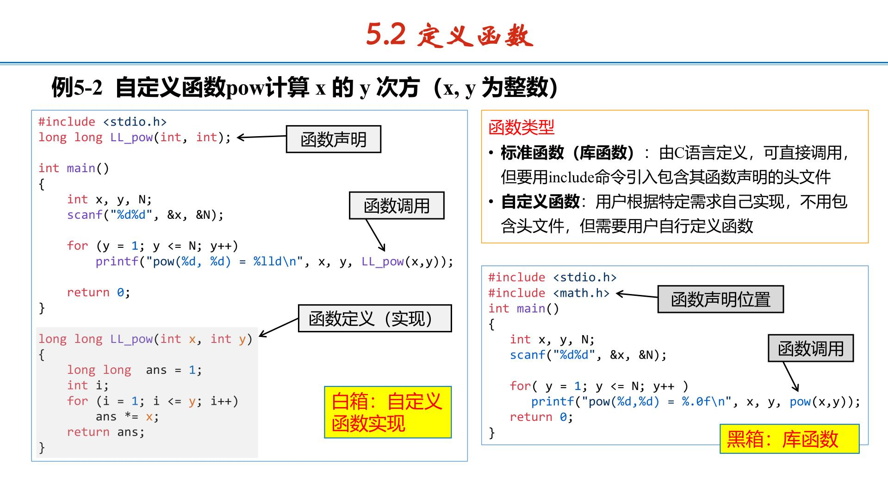
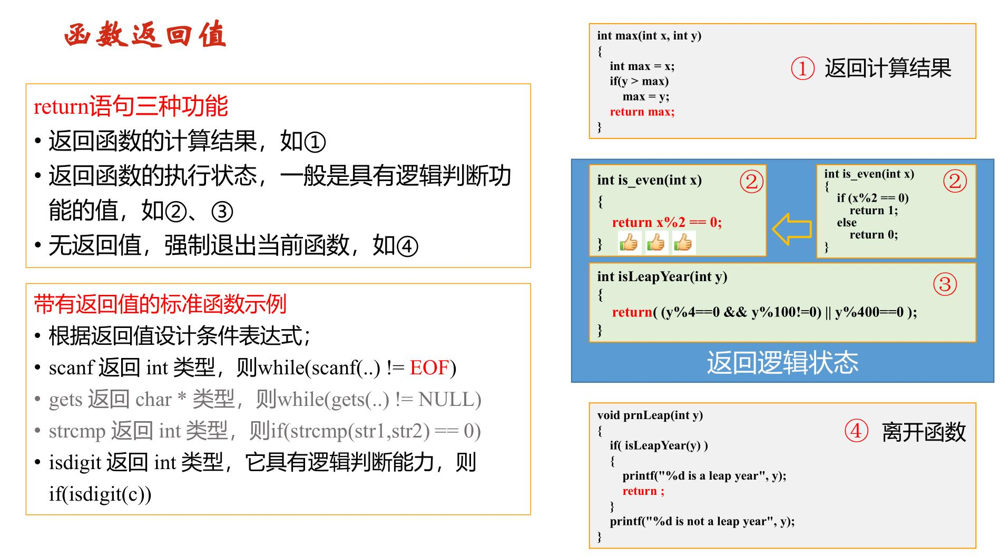
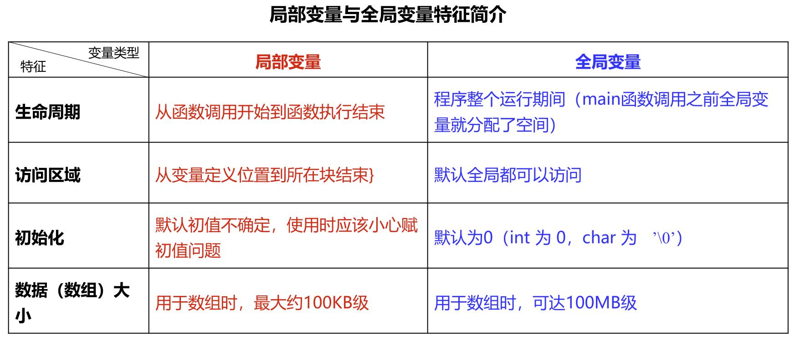
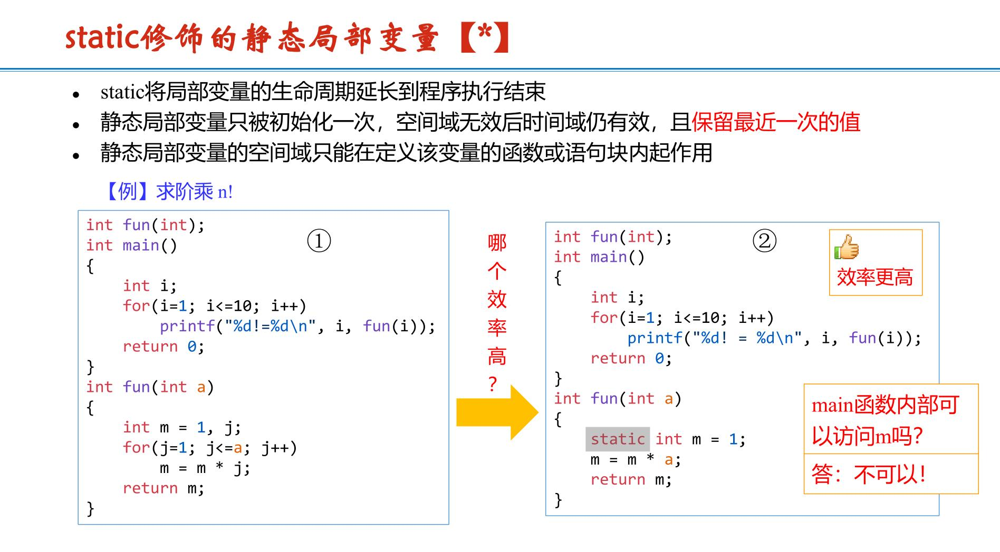

# 函数基础使用方法
## 1.声明，调用与定义

若函数有返回值，用int f(int a)之类定义<br>
若没有返回值，用void f()定义

**注意：函数不能嵌套定义，但可以嵌套调用**
## 2.return的3种功能

## 3.局部变量和全局变量

**局部变量和全局变量重名时，局部变量起作用**
### static修饰的静态局部变量

## 4.递归函数

对于显式表达式，直接求或循环求即可O($n$)<br>
但对隐式表达式，最好用递归函数 O($2^n$)
```c
//递归求n!
long long f(int n)
{
if (n<=1)
return 1;\\基本情况
return n*f(n-1);\\递归调用
}
```
```c
//递归求斐波那契数列
unsigned long long fib(int n )
{
if ( ( n == 0 ) || ( n == 1 ) )
return n;
return fib(n-1) + fib(n-2);
}

//正常求斐波那契数列(要开数组)
#define N 100
unsigned long long F[101] = {0, 1};
...
void fib_loop(int n)
{
int i;
for(i=2; i<=N; i++)
F[i] = F[i-1] + F[i-2];
}
```

## 5.函数调用注意点
1. 有返回值函数(int,long long) 可直接输出或变量赋值<br>
如 ①w=getWeek(day)  <br>
   ②printf("%d",getWeek(day))
2. 无返回值函数(void) 直接打函数名称即可<br>
如 printWeek(w)