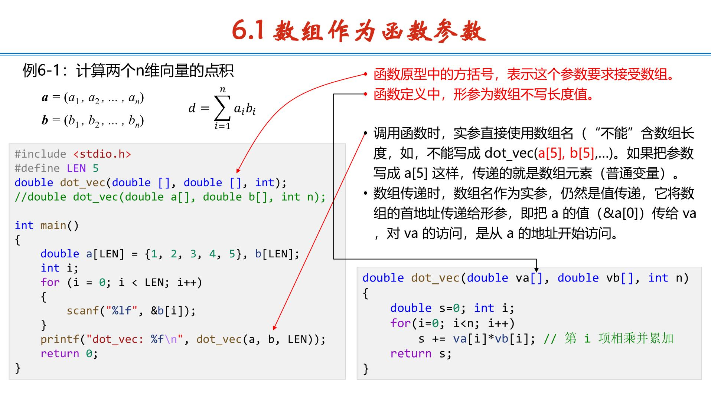
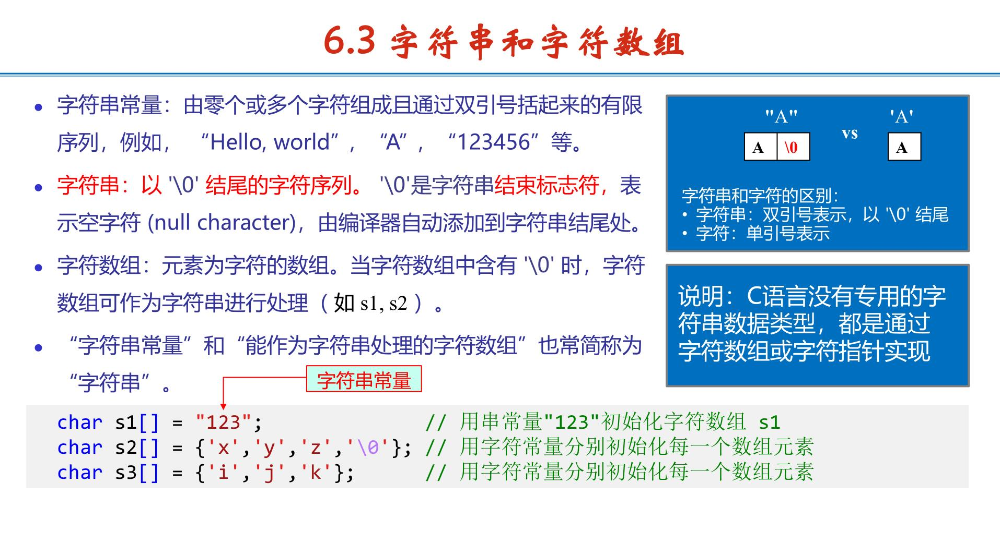
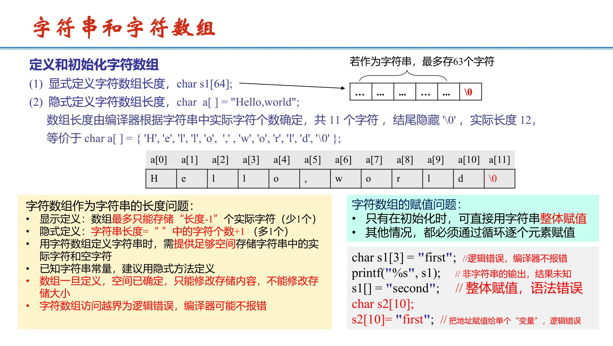
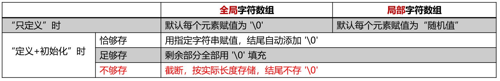
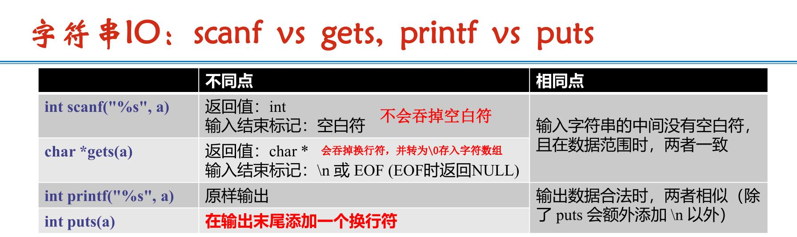
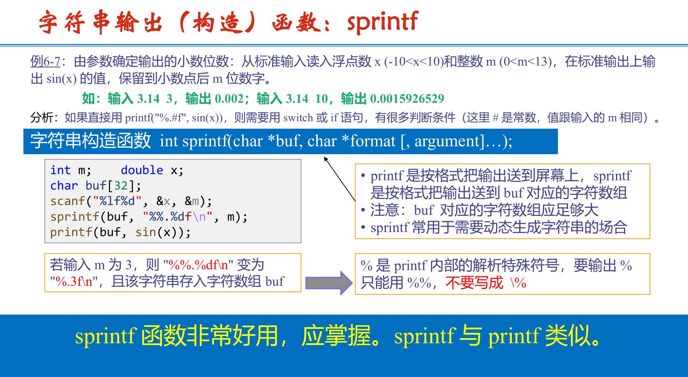
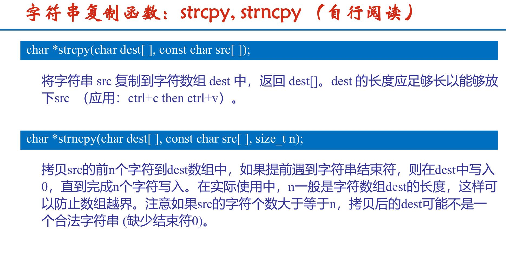
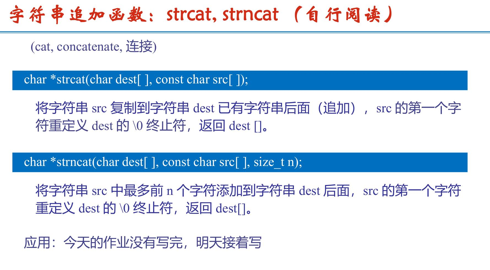
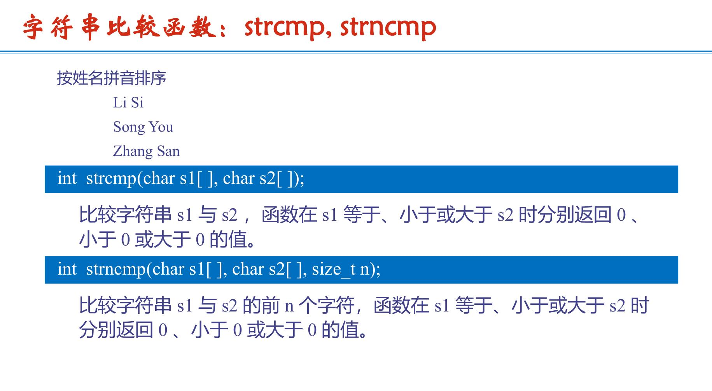
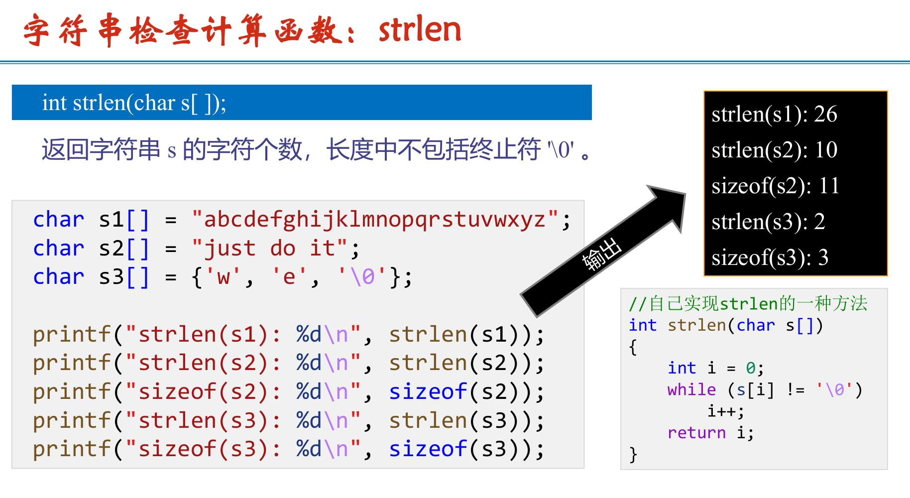

# 数组基础知识
## 1.数组作为函数参数

```c
double f(double a[],double b[],int n)；//数组函数声明与定义
x=f(a,b,n)；//数组函数调用, n表示数组长度
```
## 2.排序
### 2.1冒泡排序O($2^n$)
```c
//常规冒泡
void optiBubSort(int a[], int n)//数组第一项为a[1],排序前n项
{
    int i, j, hold, swapFlag;
    for (i = 1; i < n; i++) // 扫描轮数
    {
        swapFlag = 0;
        for (j = 1; j <= n-i; j++) // 某轮扫描（若数组第一项为a[0],j=0;j<n-1）
        {
            if (a[j] > a[j+1])
            {
                swapFlag = 1; // flag1
                hold = a[j];
                a[j] = a[j+1];
                a[j+1] = hold;
            }
        }
        if (swapFlag == 0) // flag0
        break;
    }
}
// flag1：某一轮扫描中，有元素交换，可能未排好序，继续下一轮扫描
// flag0：某一轮扫描中，没有元素交换，已经排好序，break，扫描结束
```
```c
//递归冒泡
void optiRecurBubSort(int a[], int n)//数组第一项为a[1],排序前n项
{
    int j, hold, swapFlag = 0;
    if(n <= 1)  return;
    for (j = 1; j <= n-1; j++)//若数组第一项为a[0],j=0;j<n-1）
    {
        if (a[j] > a[j+1])
        {
            swapFlag = 1;
            hold = a[j];
            a[j] = a[j+1];
            a[j+1] = hold;
        }
    }
    if (swapFlag == 0) return; //无交换，则已排好序，返回（不再递归）
    optiRecurBubSort(a, n-1);
}
```
## 3.查找
### 3.1线性查找
```c
int find(int x[], int key, int SIZE)
{
    int j;
    for ( j = 1; j <= SIZE; j++ )
    if ( x[j] == key )  return j;
    return -1;
}
```
### 3.2二分查找
```c
//常规二分查找
int bin_find(int b[], int key,int low, int high)
{
    int mid;
    while( low <= high )
    {
        mid = (low + high)/2;
        if(b[mid]==key ) return mid;
        else if (b[mid]>key) high = mid-1;
        else                   low = mid+1;
    }
    return -1;
}
```
```c
//二分查找≥key的最小数
int bin_find(int b[], int key,int low, int high)
{
    int mid;
    while( low <= high )
    {
        mid = (low + high)/2;
        if(b[mid]>=key&&(mid==1||b[mid-1]<key)) return mid;
        else if(b[mid]>=key) high = mid-1;
        else if (b[mid]<key) low = mid+1;
    }
    return -1;
}
```

```c
//递归二分查找
int rec_bin_find(int b[], int key, int low, int high)
{
    int mid;
    if( low > high ) return -1;
    mid = (low + high)/2;
    if( key == b[mid] )    return mid;
    else if( key < b[mid]) return rec_bin_find(b, key, low, mid-1);
    else                   return rec_bin_find(b, key, mid+1, high);

}
```
```c
//应用：求单调递增函数零点
double solve_f(double low, double high)
{
    while (high - low >= eps)
    {
        double mid = low + (high - low) / 2;
        f(mid) > 0 ? (high = mid) : (low = mid);
    }
    return low + (high - low) / 2;
}
```

## 4.字符串与字符数组
                    



```c
#include <string.h>
strlen(x)//返回字符串实际长度，不计算 '\0'
sizeof(x)//返回字符数组所占字节数,因为char型为1字节，所以返回数组长度(非实际长度，并算'\0')
for(i = 0; s[i] != '\0'; i++)
printf("%c", s[i]); //不知道多长就这么访问，知道就用strlen算长度
```
## 5.标准字符串函数(#include <string.h>)





