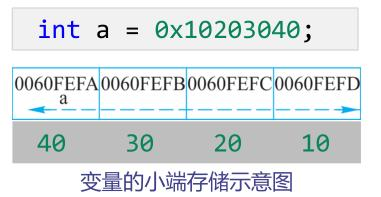

# 指针基础
## 1.指针、地址、变量、内存之间的关系
### 1.1指针、地址、变量
```c
char a;
char *aPtr, ch;
aPtr = &a;
a = 'c'; // 直接访问
*aPtr = 'x'; // 间接访问
```
地址(指针)|变量
-----|-----
&a|a|
aPtr|*aPtr|
### 1.2内存存储
**地址是用 16 进制表示的 64 位二进制数（8 字节）(这是固定宽度，称为寻址空间)(表示存储数据数量的多少)**<br>
**对于单位长度为多字节的数据实体，其地址是其第一个字节的地址（低地址端）。**<br>
小端存储模式是指将变量的低字节存放到内存空间的低地址处。<br>
大端存储模式是指将变量的高字节存放到内存空间的低地址处。
```c
int a = 0;
printf("address of a: %p\n", &a);        //000000000061FE1C
printf("sizeof of &a: %d\n", sizeof(&a));//8
printf(" sizeof of a: %d\n", sizeof(a)); //4
//变量 a 存放在以 000000000061FE1C 开始的连续 4 个字节的内存空间中
//其地址为第一个字节的地址
```


## 2.通过指针变量访问数据
**指针变量无论其指向的变量是什么类型，其自身的数据长度（sizeof 表达式的值）都固定(8字节)**

### 2.1指针变量的基础操作和常量指针
```c
//指针定义
int x, y, z;
int *xPtr, *yPtr, *zPtr;

//指针初始化与赋值
int array[4] = {1, 2, 3, 4};
int *p1 = &array[1];
int *p2 = array; // 等价为 p2 = &array[0];
int *p3 = NULL; //表示空指针，即p3就是0;

//解引用
int i = 10, y = 20, *pi;
pi = &i;
y = *pi;//*pi就是i

//常量指针和指针常量
1. const <类型> *<变量名>;//常量指针，不能通过解引用改变值
2. <类型> *const <变量名>;//指针常量，不能变地址
3. const <类型> *const <变量名>;//常量指针常量
```

### 2.2 char* 型指针
**字符数组名s作为表达式的值（例如出现在赋值符的右侧）是该字符串首字符的地址。**
```c
char *p = NULL;
char s[20] = "point to me";
p = "point to me";  // p 指向字符串常量"point to me"（存在于常量区）,p为常量指针。
*p='A';              //运行错误,不能用“解引用”改常量指针所指的值
p = s;              // p 指向数组s（内容虽然是 "point to me" ，但属于另一个对象）
s = "point to you"; // 编译错误，s 是数组名，是右值，不能被赋值
p = "point to you"; // p 指向字符串常量 "point to you"

char *s; scanf("%s", s);//运行错误，野指针，没有数据实体空间
//而字符数组和常量字符串有实体空间
```
## 3.指针作为函数参数
**当一个函数需要同时向外部传递多个数值，又不用全局变量，也不用返回值时，可使用指针类型的函数参数。**
```c
//利用函数 swap 交换实际参数的值
int main
{
    int a = 3, b = 4;
    swap(&a, &b);           //实参传递的是变量的地址
}
void swap(int *pa, int *pb) //形参定义为指针
{
    int tmp = *pa;
    *pa = *pb;
    *pb = tmp;
}

//数组名和指针作为函数参数的关系
void fill_array(int array[10], int n);
void fill_array(int array[], int n); // 用这种形式更清晰！
void fill_array(int *array, int n); // 用这种形式是本质

//指针作为函数返回值
char *strchr(char *s, int c);//返回字符c在s中第一次出现的位置的指针。如果 s 中无字符 c 则返回空指针
char *strrchr(char *s, int c);//返回字符c在s中最后一次出现的位置的指针。如果 s 中无字符 c 则返回空指针
char *strstr(const char *_Str, const char *_SubStr);//在字符串_Str 中寻找子串_SubStr，如果找到则返回在_Str 中指向_SubStr 子串的指针，否则返回空指针。
```

## 4.指针运算
**注意指针运算的结果一定要指向合法的内存空间（例如在数组合法空间范围内），否则会发生“指针越界”**
指针运算类型|写法|解释|注意
-----|-----|-----|-----
指针加减整数|a=a+n 指针|value(p+n)=value(p)+n*sizeof(T)|\*a++代表\*(a++)
指针下标|p[n] 数<br>&p[n] 指针|p[n]等价于*(p+n)，&p[n]等价于p+n
指针相减|p2-p1 数|指向元素之间的下标差|只有同类型并且指向同一数组内的元素的指针才可以相减
-----|mid = low+(high–low)/2 指针|计算中间指针
指针比较|if(p!=NULL)<br> while(low< high>)
指针的强制类型转换|(char*)pa=(char *)&a|(pa+1)-pa 返回元素差<br>(char *)(pa+1)-(char *)pa 返回字节数差
