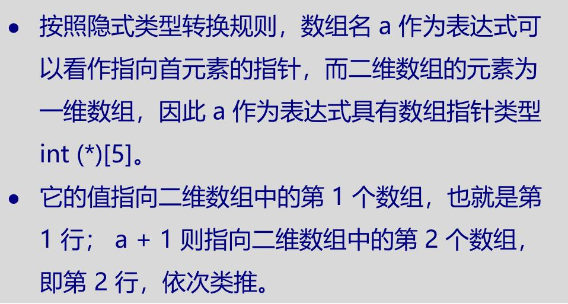
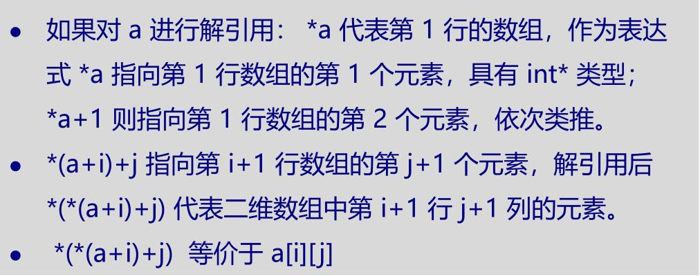
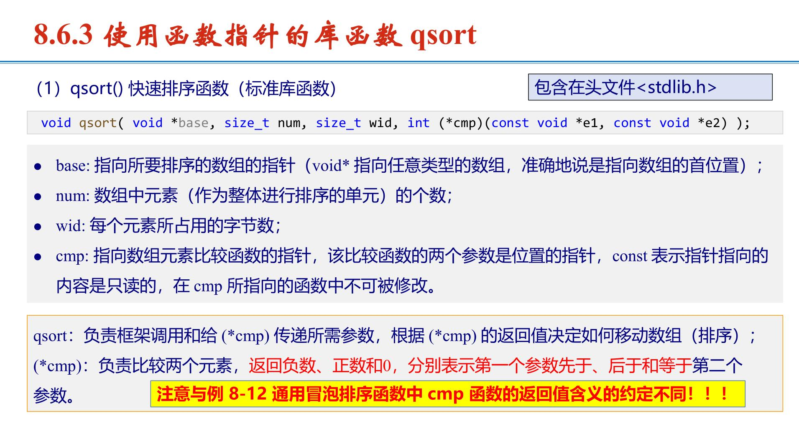
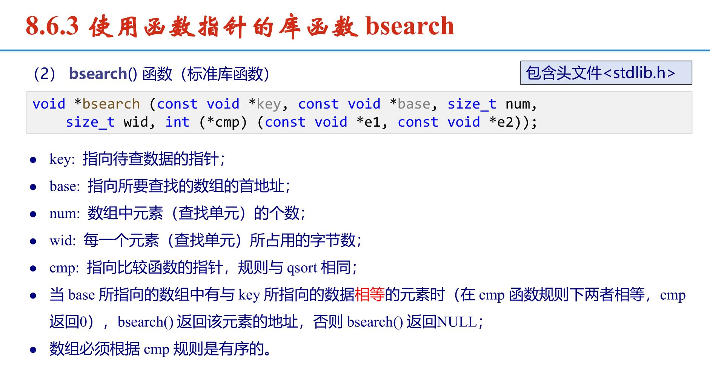

# 指针进阶
## 1.数组杂谈
### 1.1偏移量
c[1]等价于*(c+1)
1[c]等价于*(1+c)
a[b]等价于*(a+b)
### 1.2函数
若想用函数处理数组，要传入数组元素的地址。
若是一维数组a[x]，传入 int*a
若是二维数组a[x][y]，传入 int (*a)[y]
若是指针数组char* a[x],传入 char** a

## 2.数组类型与数组指针
## 2.1 数组类型
数组类型由 **<元素类型> [<数组长度>]** 来描述<br>
数组名作为**表达式**，隐式转换为指向数组首元素的指针<br>
int a[10]，float b[20]，char c[30] 这三个数组的类型分别为<br>
int [10]，float [20] 和 char [30]
```c
//数组名不会隐式转化的情况（&arr,sizeof(arr)）
int (*pArr)[5] = &arr; // pArr 是一个指向包含5个整数的数组的指针
size_t size = sizeof(arr); // 计算整个数组的大小，而不是指针的大小
```

## 2.2 数组指针(指向数组，不是指向第一个元素)
数组指针变量的定义如下：**<类型> (*<变量名>)[<元素个数>];** <br>
在数值上等于它首元素的地址，但和首元素地址的类型不一样
```c
int a[5];
float b[20];
char c[30];
int (*pa)[5] = &a;
float (*pb)[20] = &b;
char (*pc)[30] = &c;
*pa //数组指针解引用后，代表它所指向的数组变量。可以看作数组名，用作表达式时和数组名一样也可以隐式转换为指向数组首元素的指针。
```

## 3.多维数组与数组指针
### 3.1 多维数组的理解
**二维数组可以看作数组的数组**
例如 int a[4][5] 可以看作一个长度为4的数组，这个数组的每个元素是一个长度为5的int型数组<br>
a 的每一行以及每行的元素，在内存中连续存储<br>
   <br>
a[i]即*(a+i) 指向第i行的第1个元素

### 3.2二维数组作为函数参数的本质
```c
void F(int a[4][5]);
void F(int a[][5]); // 通常这样写
void F(int (*a)[5]); // 本质是这样
```

## 4.多重指针
多重指针就是指向指针的指针。
二重指针的地址是一个三重指针，
以此类推。多重指针的定义和普通指针一样，都是 **<类型> *<变量名>**，其中 <类型>是指针类型。
```c
int i = 5;
int *ip = &i;
int **ipp = &ip;
printf("i = %d, **ipp = %d\n", i, **ipp);//i = 5, **ipp = 5
**ipp = 10;
printf("i = %d, **ipp = %d\n", i, **ipp);//i = 10, **ipp = 10
```
```c
//交换字符串指针指向
#include <stdio.h>
void swap_string(char **pstr1, char **pstr2)
{
    char *tmp;
    tmp = *pstr1;
    *pstr1 = *pstr2;
    *pstr2 = tmp;
}
int main()
{
    char *str1 = "hello";
    char *str2 = "world";
    swap_string(&str1, &str2);
    printf("%s\n%s\n", str1, str2);
    return 0;
}
```


## 5.指针数组
指针数组就是元素类型为指针的数组<br>
指针数组 类似 二维数组，语法上都可以用双下标访问元素，要保证不是野指针
```c
int *piArr[10];
char *pcArr[20]; // 用得特别多
double *pdArr[40];
//分别定义了三个数组，数组元素类型分别是 int*， char* 以及 double*。
char *pcArr[] = {"I", "Love", "C", "Language"};
```
```c
//按字符串长度排序（指针数组版）
#include <stdio.h>
#include <string.h>
char a[100][1001]; // save lines
int main()
{
    int i, j, k = 0, tmp;
    char *lines[100], *temptr;
    int lens[100];
    while(gets(a[k]) != NULL) // read all lines
    {
        lines[k] = a[k];
        lens[k] = strlen(lines[k]);
        k++;
    }
    for (i = 1; i < k; i++) // bubble sorting
        for (j = 0; j < k - i; j++)
        {
            int dicflag= (lens[j] == lens[j +1]) && (strcmp(lines[j], lines[j +1]) >0);
            if (lens[j] > lens[j + 1] || dicflag)
            {
                tmp= lens[j];
                lens[j] = lens[j + 1];
                lens[j + 1] = tmp;
                temptr = lines[j];
                lines[j] = lines[j + 1];
                lines[j + 1] = temptr;
            }
        }
    for (i = 0; i < k; ++i)
    printf("%s\n",lines[i]);
    return 0;
}
```
## 6.函数指针
定义方法
```c
//指针函数
char  *strstr(char *s, char *s1)//主语是函数，该函数返回一个指针
//函数指针
int (*f_name)(……)//主语是指针，f_name 是一个变量，指向一个返回 int 类型的函数
//函数指针函数
int *(*p_name)(……)
```
使用技巧
```c
int sum(int a, int b)
{
    return a + b;
}
int main()
{
int (*funPtr)(int, int) = sum;//将函数名赋值给函数指针
//此时funPtr 就相当与sum
int x = 3, y = 4;
printf("%d + %d = %d\n", x, y, funPtr(x, y));
return 0;
}
```
### 6.1 qsort快排

```c
#include <stdlib.h>
void qsort( void *base, size_t num, size_t wid, int (*cmp)(const void *e1, const void *e2) );//数组名，元素个数，sizeof(数组数据类型)，比较函数(自己写一个)
//下面是一个例子
qsort(a, n, sizeof(int), rise_int);
int rise_int(const void *p1, const void *p2)
{
    if ( *(int *)p1 < *(int *)p2 ) return -1;
    if ( *(int *)p1 > *(int *)p2 ) return 1;
    return 0;
}
```
板子：二维数组排序
```c
int pt[500005][2];
int main()
{
    int n;
    scanf("%d",&n);
	for(i=0;i<=n-1;i++)
	{
		scanf("%d%d",&pt[i][0],&pt[i][1]); 
	}
    qsort(pt, n, 2 * sizeof(int), x_ascending);
}

int x_ascending(const void * pt1, const void * pt2)//前降序后升序
{
if(((int*) pt1)[0] > ((int *) pt2)[0]) return -1;
else if(((int *) pt1)[0] < ((int *) pt2)[0]) return 1;

else if (((int *) pt1)[1] < ((int *) pt2)[1]) return -1;
else if(((int *) pt1)[1] > ((int *) pt2)[1]) return 1;

else return 0;
}
```
结构体排序(oj排行版完整版)
```c
struct Stu {
    char name[30];
    double score;
    int fa;
} oj[2000];

int comp(const void *pt1, const void *pt2);

int main() {
    int i = 0,n;
    while (scanf("%s %lf %d", oj[i].name, &oj[i].score, &oj[i].fa) != EOF) {
        i++;
    }
    n=i;
    qsort(oj, n, sizeof(oj[0]), comp);
	for(i=0;i<=n-1;i++)
	{
        printf("%10s %8.2f %10d\n", oj[i].name, oj[i].score, oj[i].fa);		
	}
    return 0;
}

int comp(const void *pt1, const void *pt2) {
    struct Stu *s1 = (struct Stu *)pt1;
    struct Stu *s2 = (struct Stu *)pt2;

    if (s1->score > s2->score) return -1; //首先按分数降序排列
    else if (s1->score < s2->score) return 1;

    else if (s1->fa < s2->fa) return -1; //如果分数相同，按fa升序排列
    else if (s1->fa > s2->fa) return 1;

    return strcmp(s1->name, s2->name); // 如果fa也相同，按名字字典顺序排列
}
```

### 6.2 bsearch查找

```c
void *bsearch (const void *key, const void *base, size_t num, size_t wid, int (*cmp) (const void *e1, const void *e2));
int cmp(const void *a,const void *b)
{
    if(*b 为 目标元素) return 0;  
    if(*b 位于 目标元素 右侧) return 一个负整数;  
    if(*b 位于 目标元素 左侧) return 一个正整数;
}
//下面是一个例子(有序查找)
int* ret = (int *)bsearch(&t, data, n, sizeof(int), cmp);
int cmp(const void *e1, const void *e2)
{
    if(*((int *)e1) < *((int *)e2)) return -1;

    else if(*((int *)e1) > *((int *)e2)) return 1;
    return 0;
}
```

板子：二维数组查找(无序查找)<br>
对每一个 t，若 t 出现在数组 data 中，则输出它出现的位置（出现在data 中第几个输入的数，从1开始计数），否则输出 NO。每一个输出占一行。
```c
int data[1000000][2];
int main()
{
    int n, i, t, *ret;
    scanf("%d", &n);
    for (i = 0; i < n; i++)
    {
        scanf("%d", data[i]); //等价于 scanf("%d", &data[i][0]);
        data[i][1] = i + 1;//保存序号
    }
    qsort(data, n, 2 * sizeof(int), cmp); // n 个单元，每个单元存放数据和序号
    while (scanf("%d", &t) != EOF)
    {
        ret = (int *)bsearch(&t, data, n, 2 * sizeof(int), cmp);
        if (ret)
            printf("%d\n", ret[1]);
        else
            printf("NO\n");
    }
    return 0;
}
int cmp(const void *e1, const void *e2)
{
    if(*((int *)e1) < *((int *)e2))
        return -1;
    else if(*((int *)e1) > *((int *)e2))
        return 1;
    else
        return 0;
}
```
### 6.3 双指针有序数组去重
```c
int removeDuplicates(int num[], int len)//输入(数组首元素地址，数组长度)，返回最后一个元素的位置
{
    int slow, fast;
    slow = 0;
    fast = 1;
    while (fast < len)
    {
        if (num[fast] != num[slow])
        {
            slow++;
            num[slow] = num[fast];
        }
        fast++;
    }
    return slow+1;
}
```


