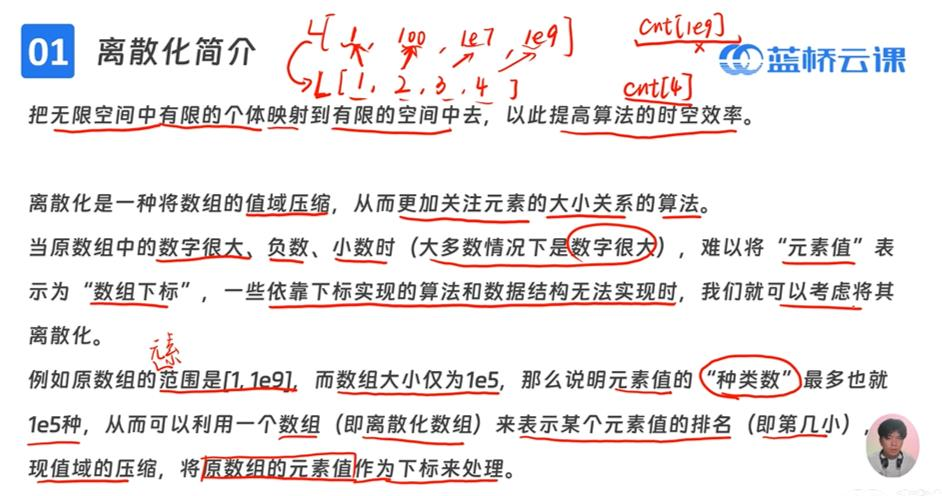
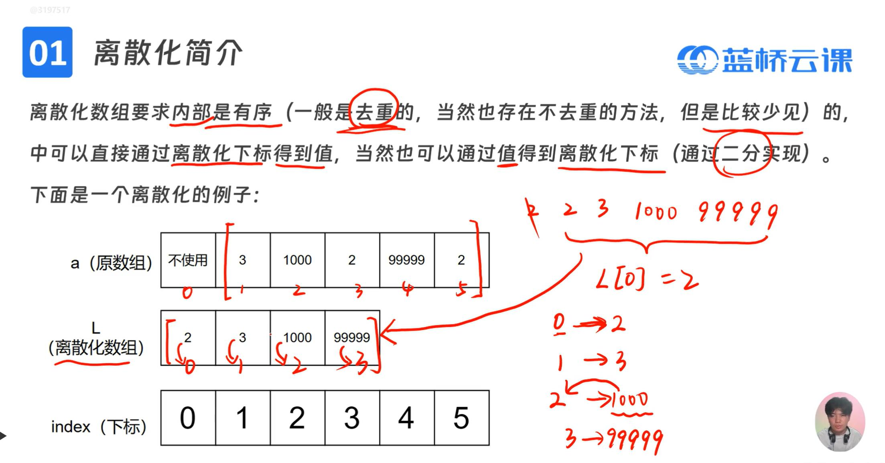

# 基础算法
## 1.前缀和and后缀和
1. 应用：多次求数组不同区间的和
```c
//前缀和
prefix[0]=0;//初始化
for(i=1;i<=n;i++)    prefix[i]=prefix[i-1]+a[i];//求前缀和
sum(l,r)=prefix[r]-prefix[l-1]

//后缀和
suffix[n+1]=0;//初始化
for(i=n;i>=1;i--)    suffix[i]=suffix[i+1]+a[i];//求后缀和
sum(l,r)=suffix[l]-suffix[r+1]

//二维前缀和
for(i=1;i<=n;i++)
    for(j=1;j<=n;j++)
        prefix[i][j]=a[i][j]+prefix[i-1][j]+prefix[i][j-1]-prefix[i-1][j-1];
sum((x1,y1),(x2,y2))=prefix[x2][y2]-prefix[x1-1][y2]-prefix[x2][y1-1]+prefix[x1-1][y1-1];
```

## 2.差分
1. 性质：差分数组前缀和为原数组
2. 应用：区间多次修改，将[l,r]都加上x
```c
//差分
a[0]=0;//初始化
for(i=1;i<=n;i++)    diff[i]=a[i]-a[i-1];//定义差分数组
diff[l]=diff[l]+c;                       //区间修改
diff[r+1]=diff[r+1]-c;
for(i=1;i<=n;i++)    a[i]=a[i-1]+diff[i];//数组还原

//二维差分
for(i=1;i<=n;i++)                      //定义差分数组
	for(j=1;j<=m;j++)
        diff[i][j]=a[i][j]-a[i][j-1];
for(i=x1;i<=x2;i++)                    //区间修改
{
	diff[i][y1]=diff[i][y1]+c;
	diff[i][y2+1]=diff[i][y2+1]-c;
}	
for(i=1;i<=n;i++)                     //数组还原
	for(j=1;j<=m;j++)
        a[i][j]=a[i][j-1]+diff[i][j];
```

## 3.答案二分
```c
int check(int mid)
{
    int res=0;
    //写代码
    return res;
}
int main()
{
    int low=0,high=1e9;
    while(low+1!=high)
    {
        int mid=(low+high)/2;
        //写代码
        if(check(mid)) low=mid;
        else high=mid;  
    }
    printf("%d",high);//输出看具体情况
}

```
## 4.双指针
### 4.1对撞指针
i右移，j左移
### 4.2快慢指针
```c
//找最小(和>m)
while(r<=n)
{
    sum=sum+a[r];            //1.右指针移动
    if(sum>=m)                    
    {
        while(sum-a[l]>=m)    //2.满足条件时左指针移动
        {
            sum=sum-a[l];
            l++;
        }
        if(r-l+1<min)        //3.记录最小值和指针位置
        {
            min=r-l+1;
            ll=l;
            rr=r;
        }
    }
    r++;
}

//找最大(不重复)
while(r+1<=n)
{
    while(r+1<=n&&count[a[r+1]]==0)    //1.满足条件时右指针移动
    {
        count[a[r+1]]++;
        r++;
    }
    if(r-l+1>max)                      //2.记录最大值和指针位置
    {
        max=r-l+1;
        ll=l;
        rr=r;
    } 
    count[a[l]]--;                    //3.左指针移动
    l++;
}
```
## 5.离散化


```cpp
#include <bits/stdc++.h>
using namespace std;
const int N=1e5+9;
int a[N]; 
vector<int>L; //离散化数组

int getidx(int x) //x值对应的下标(从1开始)
{
	//lower_bound(a,b,c)在有序数组区间[a,b]中找到第一个>=c的寄存器位置 
	return lower_bound(L.begin(), L.end(), x) - L.begin()+1;
}

int getval(int idx)//idx下标(从1开始)对应的值
{
    return L[idx-1];
} 

int main()
{
	int n;
	scanf("%d",&n);
	for(int i=1;i<=n;i++) scanf("%d",&a[i]);
	
	for(int i=1;i<=n;i++) L.push_back(a[i]);
	
	//排序去重 
	sort(L.begin(),L.end());
	L.erase(unique( L.begin() , L.end() ), L.end());
	
	//输出离散化数组 
	for(const auto&i:L) printf("%d ",i);
	printf("\n");
	
	int idx;
	scanf("%d",&idx);
	printf("%d\n",getval(idx));
    return 0;
}
```


