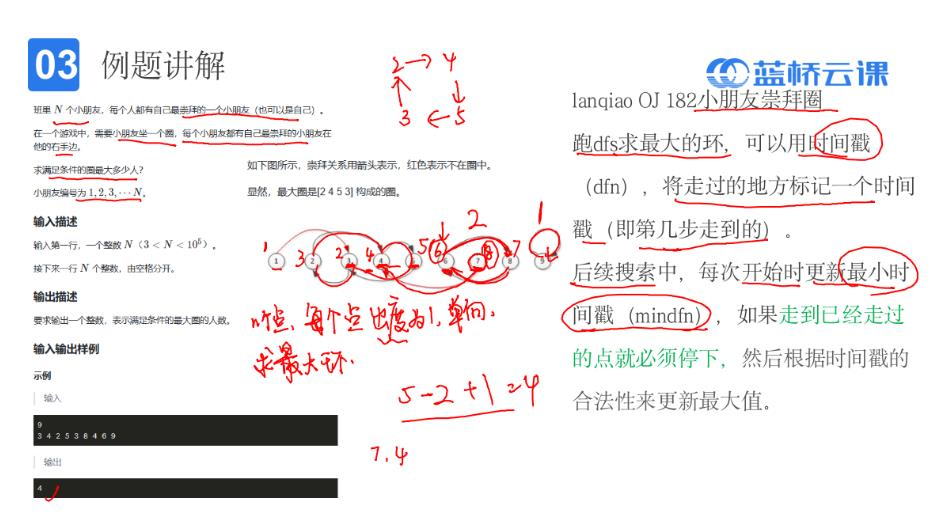
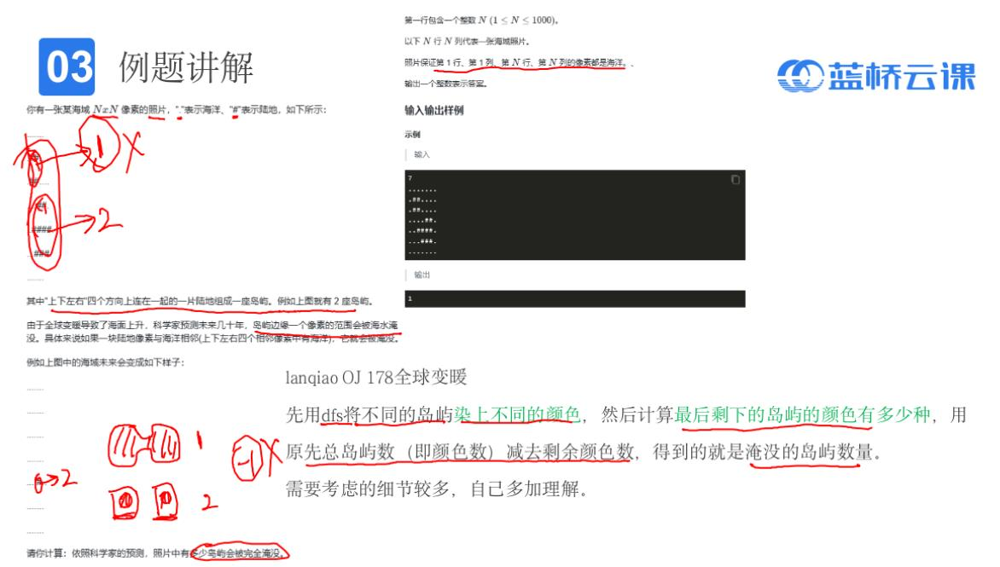

# 搜索
## 1.DFS
### 1.1排序树
代表题型：n个数全排列
```c
int a[30];
int vis[30];
int n;
void dfs(int dep)；

int main()
{
	scanf("%d",&n);
	dfs(1); 

    return 0;
}
void dfs(int dep)
{
	int i;
	//出口 
	if(dep==n+1)
	{
		for(i=1;i<=n;i++)
		{
			printf("%d",a[i]);
		}
		printf("\n");
		return;
	}
	//向下搜索 
	for(i=1;i<=n;i++)			//枚举范围 
	{
		if(vis[i]!=0) continue;	//排除不合法路径 
		vis[i]=1;				//修改状态 
		a[dep]=i;
		
		dfs(dep+1);				//下一层 
		
		vis[i]=0;				//恢复初始状态 
		a[dep]=0;	
	}
	return;
} 
```
### 1.2子集树
代表题型：从n个数中选m个数
```c
#include<stdio.h>
int a[50];
int n,m,count;
void dfs(int dep,int num);

int main() 
{ 
    scanf("%d%d",&n,&m);
    dfs(1,0);
    return 0; 
}
void dfs(int dep,int num)
{
    int i;
    if(num==m)
    {
        for(i=1;i<=n;i++)
        {
            if(a[i]==1) printf("%d ",i);
        } 
        printf("\n");
        return;
    }
    for(i=1;i<=2;i++)            //1代表选，2代表不选
    {
        a[dep]=i;
        if(i==1&&dep<=n)	dfs(dep+1,num+1);
        else if(i==2&&dep<=n)	dfs(dep+1,num);
        
        a[dep]=0;
    }
    return;
}

```
## 2.DFS例题
### 2.1小朋友崇拜圈

```c
#include <stdio.h>
#include <string.h>
#include <stdlib.h>
#include <math.h>
#include <ctype.h>
int a[200000];
int dfn[200000];    //dfn时间戳
int idx,dfn_min;    //idx当前时间
int dfs(int x);
int max(int a,int b);
int main()
{
	int n,ans=0,i;
	scanf("%d",&n);
	for(i=1;i<=n;i++)
	{
		scanf("%d",&a[i]);
	}
	for(i=1;i<=n;i++)
	{
		if(dfn[i]==0)
		{
			dfn_min=idx+1;
			ans=max(ans,dfs(i));
		}
	}
	printf("%d",ans); 

    return 0;
}
//深度搜索，若dfn不为0，且dfn比初始值大(保证在一个圈里)，则圈长为前后dfn之差
int dfs(int x)
{
	idx++;
	dfn[x]=idx;
	if(dfn[a[x]]!=0)
	{
		if(dfn[a[x]]>=dfn_min) return dfn[x]-dfn[a[x]]+1;
		return 0;
	}
	return dfs(a[x]);
}
int max(int a,int b)
{
	if(a>b) return a;
	return b;
}

```
### 2.2全球变暖

给每个岛染色，数海平面上升后的颜色数量
```c
#include <stdio.h>
#include <string.h>
#include <stdlib.h>
#include <math.h>
#include <ctype.h>
int n,colour,ans,i,j;
char map[1005][1005];
int col[1005][1005];
int dx[]={0,0,1,-1};
int dy[]={1,-1,0,0};
int vis[10005];
void dfs(int x,int y);
int main()
{ 
	scanf("%d",&n);
	for(i=1;i<=n;i++)
	{
		for(j=1;j<=n;j++)
		{
			scanf(" %c",&map[i][j]);
		}
	}
	for(i=1;i<=n;i++)
		for(j=1;j<=n;j++)
		{
			if(col[i][j]!=0||map[i][j]=='.') continue;//已经染色或海洋 
			colour++;
			dfs(i,j); 
		}
		
	for(i=1;i<=n;i++)
		for(j=1;j<=n;j++)
		{
			if(map[i][j]=='.') continue;
			int flag=1;
			for(int k=0;k<4;k++)
			{
				int x=i+dx[k],y=j+dy[k];
				if(map[x][y]=='.') flag=0;
			}
			if(flag==1)
			{
				if(vis[col[i][j]]==0)
				{
					ans++;
					vis[col[i][j]]++;	
				}
				
			}
		}
	printf("%d",ans);

    return 0;
}
void dfs(int x,int y)
{
	col[x][y]=colour;
	for(i=0;i<4;i++)
	{
		int nx=x+dx[i],ny=y+dy[i];
		if(col[nx][ny]!=0||map[nx][ny]=='.') continue;
		dfs(nx,ny);
	}
}

```


