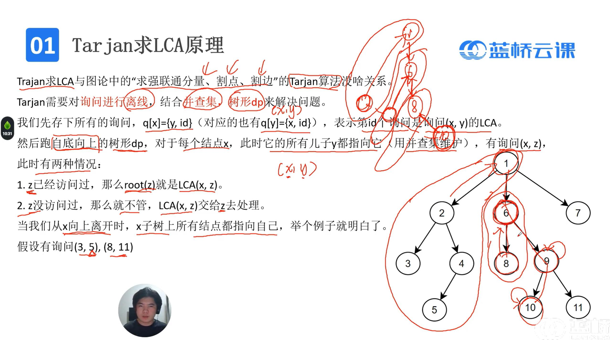
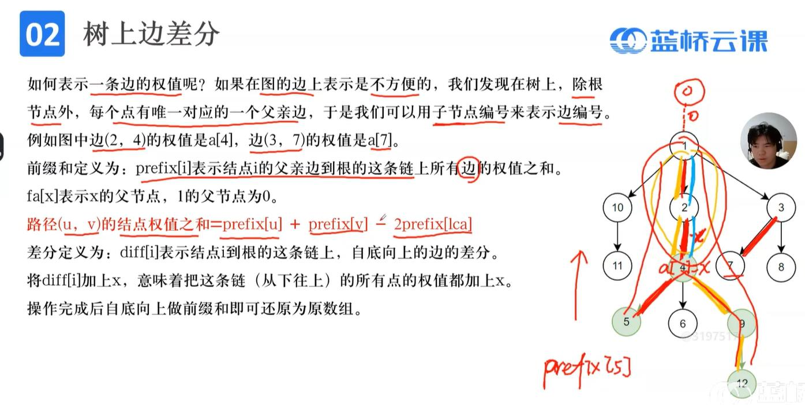
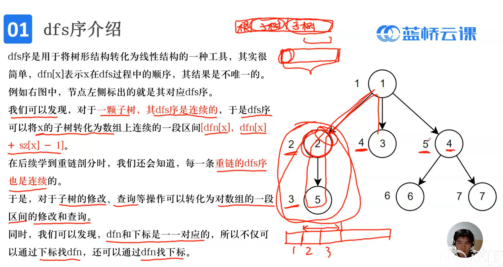

# 树上问题
## 1.树的遍历
```c
#define N 300000
int ls[N],rs[N];//leftson,rightson
//前序遍历 
void dfs1(int x)
{
	printf("%d ",x);
	if(ls[x]) dfs1(ls[x]);
	if(rs[x]) dfs1(rs[x]);
}
//中序遍历 
void dfs2(int x)
{
	if(ls[x]) dfs1(ls[x]);
	printf("%d ",x);
	if(rs[x]) dfs1(rs[x]);
}
//后序遍历 
void dfs3(int x)
{
	if(ls[x]) dfs1(ls[x]);
	if(rs[x]) dfs1(rs[x]);
	printf("%d ",x);
}
//层序遍历
void bfs()
{
	int queue[N],l=1,r=1;
	queue[1]=1;
	while(l<=r)
	{
		int x=queue[l++];
		printf("%d ",x);
		if(ls[x]) queue[++r]=ls[x];
		if(rs[x]) queue[++r]=rs[x];
	} 
}
 
int main()
{
	int n,i;
	scanf("%d",&n);
	for(i=1;i<=n;i++)
	{
		scanf("%d%d",&ls[i],&rs[i]);
	}
	bfs();

    return 0;
}
```
## 2.树的直径与重心
1. 树的直径：树上最长的一条链(的点的个数)(不唯一)
2. 直径(u,v)满足<br>
2.1 u,v都是叶子结点，度数为1<br>
2.2 在以任意一点为根的树上，u、v中必然存在一点为最深的叶子结点
3. 求直径：跑两遍dfs<br>
   3.1 在任意结点为根的树上跑一遍dfs，找最深点u，以u为根再跑一次dfs，找最深点v，长度为dep[v];
```cpp
#include <bits/stdc++.h>
using namespace std;
using ll=long long;
const int N=1e5+9;
vector<int>g[N];
int dep1[N],depU[N],depV[N];

void dfs(int x,int fa,int dep[]) //求x为根节点的深度数组depx[N]; 
{
	dep[x]=dep[fa]+1;
	for(const auto &y:g[x])
	{
		if(y==fa) continue;
		dfs(y,x,dep);
	}
}
 
int main()
{
	int n;//n个点 
	scanf("%d",&n);
	for(int i=1;i<=n-1;i++)
	{
		int u,v;
		scanf("%d%d",&u,&v);
		g[u].push_back(v);
		g[v].push_back(u);
	}
	dep1[0]=depU[0]=depV[0]=-1;  //初始化
	//两遍dfs求直径
	dfs(1,0,dep1);
	int U=1,V=1;
	for(int i=1;i<=n;i++)	if(dep1[i]>dep1[U]) U=i;
	dfs(U,0,depU);
	for(int i=1;i<=n;i++)	if(depU[i]>depU[V]) V=i;
	int d=depU[V];//求出直径
	printf("直径为%d->%d，长度为%d",U,V,d); 
    return 0;
}
```
4. 树的重心：对于某个点，将其删除后，使得剩余连通块的最大值最小
5. 重心的性质：<br>
5.1 重心的若干棵子树的大小一定≤n/2，其他点都必然存在一棵子树大小≥n/2<br>
5.2 一棵树至多2个重心，且一定相邻，删去两个重心的连接边后，一定得到2棵大小相等的树<br>
5.3 所有点到重心的距离和最小<br>
5.4 两棵树相连，新重心在大树的连接点与原重心的简单路径上，如果两树大小一样，则重心为2个连接点<br>
```cpp
#include <bits/stdc++.h>
using namespace std;
const int N=1e6+9;
vector<int> g[N];
int sz[N];	//sz[i]表示i结点为根节点的树的大小 
int mss[N];	//mss[i]表示删去i结点后的最大子树大小 
int n,ans=0;
void dfs(int x,int fa)
{
	sz[x]=1, mss[x]=0;
	for(const auto &y:g[x])
	{
		if(y==fa) continue;
		dfs(y,x);
		sz[x]=sz[x]+sz[y];
		mss[x]=max(mss[x],sz[y]);
	}
	mss[x]=max(mss[x],n-sz[x]);
	if(mss[x]<=n/2) ans=mss[x]; 
}

int main()
{
	scanf("%d",&n);
	for(int i=1;i<=n-1;i++)
	{
		int u,v;
		scanf("%d%d",&u,&v);
		g[u].push_back(v);
		g[v].push_back(u);
	}
	dfs(1,0);
	printf("%d",ans);
    return 0;
}
```

## 3.最近公共祖先(LCA)
法1：倍增法(动态规划+贪心)<br>
时间复杂度O(log(n))
```cpp
#include <bits/stdc++.h>
using namespace std;
const int N=1e5+9;
int dep[N],fa[N][24];//fa[i][j]表示i结点往上走2^j所到的结点
vector<int>g[N];
int dfs(int x,int p)//p为x父亲结点 
{
	dep[x]=dep[p]+1;
	fa[x][0]=p;
	for(int i=1;i<=20;i++) fa[x][i]=fa[fa[x][i-1]][i-1];
	for(const auto &y:g[x])
	{
		if(y==p) continue;
		dfs(y,x); 
	} 
} 

int lca(int x,int y)
{
	if(dep[x]<dep[y]) swap(x,y);//x为深的点
	for(int i=20;i>=0;i--) //将x向上移至与y一样深 
	{
		if(dep[fa[x][i]]>=dep[y]) x=fa[x][i];
	}
	if(x==y) return x;
	for(int i=20;i>=0;i--)	//同时向上移动x与y 
	{
		if(dep[fa[x][i]]!=dep[fa[y][i]]) x=fa[x][i],y=fa[y][i]; 
	}
	return fa[x][0]; 
}  
int main()
{
	int n,q;
	scanf("%d",&n);
	for(int i=1;i<=n-1;i++)
	{
		int u,v;
		scanf("%d%d",&u,&v);
		g[u].push_back(v);
		g[v].push_back(u);
	}
	dfs(1,0);
	scanf("%d",&q);//q次询问 
	while(q--)
	{
		int a,b;
		scanf("%d%d",&a,&b);
		printf("%d\n",lca(a,b)); 
	}

    return 0;
}
```
法2：Tarjan离线法<br>

```cpp
#include <bits/stdc++.h>
using namespace std;
const int N=2e5+9;
vector<int>g[N];
struct Q
{
	int x,id;
};
vector<Q> q[N];//询问
int ans[N],pre[N];
int root(int x)
{
	pre[x]=(pre[x]==x?x:root(pre[x]));
	return pre[x];
}

bitset<N>vis;
void dfs(int x,int fa)
{
	vis[x]=true;
	for(const auto &y:g[x])
	{
		if(y==fa) continue;
		dfs(y,x);
		pre[y]=x;
	}
	
	for(const auto &t:q[x])
	{
		int y=t.x, id=t.id;
		if(vis[y]) ans[id]=root(y);
	}
}
 
int main()
{
	int n,m;
	scanf("%d",&n);
	for(int i=1;i<=n;i++) pre[i]=i;
	for(int i=1;i<=n-1;i++)
	{
		int u,v;
		scanf("%d%d",&u,&v);
		g[u].push_back(v);
		g[v].push_back(u);
	}
	scanf("%d",&m);
	for(int i=1;i<=m;i++)
	{
		int x,y;
		scanf("%d%d",&x,&y);
		q[x].push_back({y,i});
		q[y].push_back({x,i});
	}		
	dfs(1,0);
	for(int i=1;i<=m;i++) printf("%d\n",ans[i]);

    return 0;
}
```
## 4.树上边差分

思路：用点的权值代替父亲边，如es[2]表示边(1,2)的权重<br>
前缀和：prefix[i]表示根节点到i的父亲边这条链上所有边的权值之和<br>
sum(u,v)=prefix[u]+prefix[v]-2*prefix[lca(u,v)]<br>
差分：diff[i]表示从结点i到根节点这条链上，自下而上的边的差分<br>
(u,v)都加1：diff[u]+; diff[v]++; diff[lca(u,v)]-=2;<br>
```cpp
#include <bits/stdc++.h>
using namespace std;
const int N=2e5+9;
struct Node
{
	int v,w;
}; 
vector<Node>g[N];
int prefix[N],diff[N];
int es[N];//es[i]表示i结点对应的边权
int dep[N],fa[N][24];//fa[i][j]表示i结点往上走2^j所到的结点
 
void lca_dfs(int x,int p)//lca预处理函数 
{
	dep[x]=dep[p]+1;
	fa[x][0]=p;
	for(int i=1;i<=20;i++) fa[x][i]=fa[fa[x][i-1]][i-1];
	for(const auto &t:g[x])
	{
		int y=t.v;
		if(y==p) continue;
		lca_dfs(y,x); 
	} 
} 
int lca(int x,int y)
{
	if(dep[x]<dep[y]) swap(x,y);//x为深的点
	for(int i=20;i>=0;i--) //将x向上移至与y一样深 
	{
		if(dep[fa[x][i]]>=dep[y]) x=fa[x][i];
	}
	if(x==y) return x;
	for(int i=20;i>=0;i--)	//同时向上移动x与y 
	{
		if(dep[fa[x][i]]!=dep[fa[y][i]]) x=fa[x][i],y=fa[y][i]; 
	}
	return fa[x][0]; 
}
  
void es_dfs(int x,int p) //边权es处理函数 
{
	for(const auto&t:g[x])
	{
		int y=t.v,w=t.w;
		if(y==p) continue;
		es[y]=w;
		es_dfs(y,x);
	}
} 
void prefix_dfs(int x,int p)//前缀和预处理函数 
{
	for(const auto&t:g[x])
	{
		int y=t.v,w=t.w;
		if(y==p) continue;
		prefix[y]=prefix[x]+es[y];
		prefix_dfs(y,x);
	}
}
void diff_dfs1(int x,int p)//预处理得到diff数组 
{
	diff[x]=es[x];
	for(const auto&t:g[x])
	{
		int y=t.v,w=t.w;
		if(y==p) continue;
		diff[x]=diff[x]-es[y];
		diff_dfs1(y,x);
	}

}
void diff_dfs2(int x,int p)//diff还原边权es 
{
	es[x]=diff[x];
	for(const auto&t:g[x])
	{
		int y=t.v,w=t.w;
		if(y==p) continue;
		diff_dfs2(y,x);
		es[x]+=es[y];
	}
}

int main()
{
	int n;
	scanf("%d",&n);
	for(int i=1;i<=n-1;i++)
	{
		int u,v,w;
		scanf("%d%d%d",&u,&v,&w);
		g[u].push_back({v,w});
		g[v].push_back({u,w});
	}
	lca_dfs(1,0);//预处理lca 
	es_dfs(1,0);//预处理边权es
	prefix_dfs(1,0);//预处理前缀和prefix 
	printf("%d\n",prefix[5]+prefix[12]-2*prefix[lca(5,12)]);//求5-12这条路径的长度 
	
	diff_dfs1(1,0);//预处理差分diff 
	diff[5]++,diff[12]++,diff[lca(5,12)]-=2;//5-12这条路径每条边+1 
	diff_dfs2(1,0);//利用差分diff修改边权es 
	prefix_dfs(1,0);//更新前缀和prefix 
	printf("%d\n",prefix[5]+prefix[12]-2*prefix[lca(5,12)]);//求5-12这条路径的新长度
    return 0;
}
```
## 5.树上点差分
```cpp
#include <bits/stdc++.h>
using namespace std;
const int N=2e5+9;
vector<int>g[N];
int prefix[N],diff[N];
int edge[N];//es[i]表示i结点对应的点权
int dep[N],fa[N][24];//fa[i][j]表示i结点往上走2^j所到的结点
 
void lca_dfs(int x,int p)//lca预处理函数 
{
	dep[x]=dep[p]+1;
	fa[x][0]=p;
	for(int i=1;i<=20;i++) fa[x][i]=fa[fa[x][i-1]][i-1];
	for(const auto &y:g[x])
	{
		if(y==p) continue;
		lca_dfs(y,x); 
	} 
} 
int lca(int x,int y)
{
	if(dep[x]<dep[y]) swap(x,y);//x为深的点
	for(int i=20;i>=0;i--) //将x向上移至与y一样深 
	{
		if(dep[fa[x][i]]>=dep[y]) x=fa[x][i];
	}
	if(x==y) return x;
	for(int i=20;i>=0;i--)	//同时向上移动x与y 
	{
		if(dep[fa[x][i]]!=dep[fa[y][i]]) x=fa[x][i],y=fa[y][i]; 
	}
	return fa[x][0]; 
}

void prefix_dfs(int x,int p)//前缀和预处理函数 
{
	if(x==1) prefix[x]=edge[1];
	for(const auto&y:g[x])
	{
		if(y==p) continue;
		prefix[y]=prefix[x]+edge[y];
		prefix_dfs(y,x);
	}
}

void diff_dfs1(int x,int p)//预处理得到diff数组 
{
	diff[x]=edge[x];
	for(const auto&y:g[x])
	{
		if(y==p) continue;
		diff[x]=diff[x]-edge[y];
		diff_dfs1(y,x);
	}

}
void diff_dfs2(int x,int p)//diff还原点权edge
{
	edge[x]=diff[x];
	for(const auto&y:g[x])
	{
		if(y==p) continue;
		diff_dfs2(y,x);
		edge[x]+=edge[y];
	}
}

int main()
{
	int n;
	scanf("%d",&n);
	for(int i=1;i<=n;i++)
	{
		int t;
		scanf("%d",&t);
		edge[i]=t;
	}
	for(int i=1;i<=n-1;i++)
	{
		int u,v;
		scanf("%d%d",&u,&v);
		g[u].push_back(v);
		g[v].push_back(u);
	}
	lca_dfs(1,0);//预处理lca 
	prefix_dfs(1,0);//预处理前缀和prefix 
	printf("%d\n",prefix[5]+prefix[12]-prefix[lca(5,12)]-prefix[fa[lca(5,12)][0]]);//求5-12这条路径的点权和
	diff_dfs1(1,0);//预处理差分diff
	diff[5]++,diff[12]++,diff[lca(5,12)]--,diff[fa[lca(5,12)][0]]--;
	diff_dfs2(1,0); //利用差分diff修改点权edge 
	prefix_dfs(1,0);//更新前缀和prefix
	printf("%d\n",prefix[5]+prefix[12]-prefix[lca(5,12)]-prefix[fa[lca(5,12)][0]]);//求5-12这条路径的新点权和 
    return 0;
}
```
## 6.dfs序

```cpp
int dfn[N],idx[N],sz[N];
int tot=0;
vector<int> g[N];
void dfs(int x,int fa)
{
	dfn[x]=++tot;	
	idx[dfn[x]]=x;
	sz[x]=1;
	for(const auto&y:g[x])
	{
		if(y==fa) continue;
		dfs(y,x);
		sz[x]+=sz[y];
	}
} 
```

下面是一道例题
```cpp
//题目；每个结点一个颜色c，q次询问，每次询问结点x为根的子树有几种颜色 
#include <bits/stdc++.h>
using namespace std;
const int N=1e5+5;
int prefix[N][105]; //prefix[i][j]表示从1到i颜色为j的个数 
int dfn[N],idx[N],sz[N];
int tot=0;
vector<int> g[N];
void dfs(int x,int fa)
{
	dfn[x]=++tot;	
	idx[dfn[x]]=x;
	sz[x]=1;
	for(const auto&y:g[x])
	{
		if(y==fa) continue;
		dfs(y,x);
		sz[x]+=sz[y];
	}
} 

int main()
{
	int n,q,i,j;
	scanf("%d%d",&n,&q);
	for(i=1;i<=n;i++) scanf("%d",&c[i]);
	for(i=1;i<=n-1;i++)
	{
		int u,v;
		scanf("%d%d",&u,&v);
		g[u].push_back(v);
		g[v].push_back(u);
	}
	dfs(1,0);
	for(i=1;i<=100;i++)//颜色 
	{
		for(j=1;j<=n;j++)//第几位
		{
			prefix[j][i]=prefix[j-1][i]+(int)(c[idx[j]]==i);
		} 
	}
	
	while(q--)
	{
		int x,sum=0;
		scanf("%d",&x);
		int l=dfn[x],r=dfn[x]+sz[x]-1;
		for(i=1;i<=100;i++)
			if(prefix[r][i]-prefix[l-1][i]>0) sum++;
		printf("%d\n",sum);
	} 

    return 0;
}

 
```


