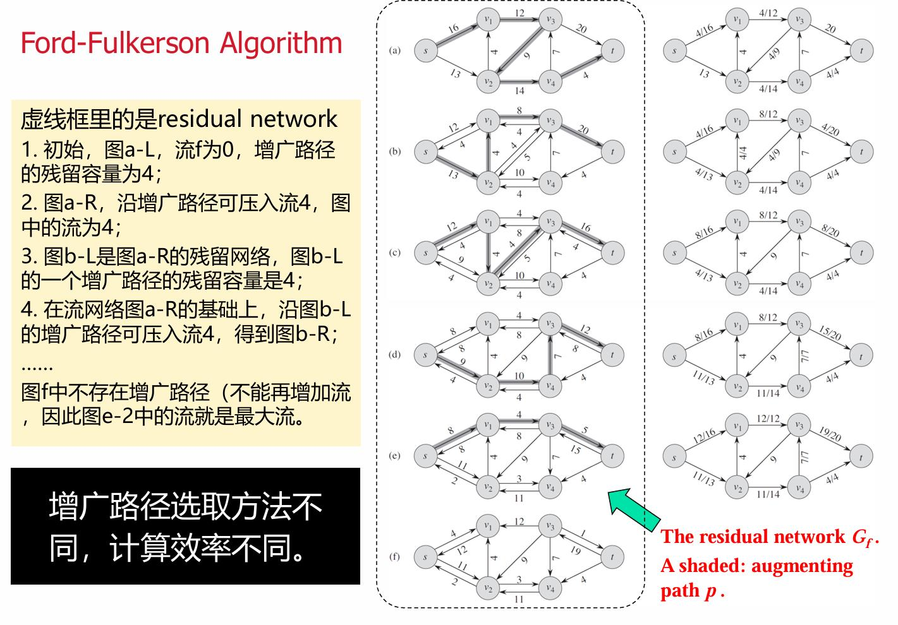

# 图论
## 1.图的遍历
```cpp
#include <bits/stdc++.h>
using namespace std;
const int N=3000;
vector<int> g[N];
int vis[N];
void dfs(int x)//递归
{
	vis[x]=1;
	printf("%d ",x);//可以改 
	for(const auto &y:g[x])
	{
		if(vis[y]) continue;
		dfs(y);
	}
}

void bfs(int x)//队列
{
	queue<int> q;
	q.push(x);
	while(q.size())
	{
		int x=q.front();
		q.pop();
		printf("%d ",x);//可以改 
		vis[x]=1;
		for(const auto &y:g[x])
		{
			if(!vis[y]) q.push(y); 
		} 	
	}
} 

int main()
{
	int n,m;
	scanf("%d%d",&n,&m);
	while(m--)
	{
		int x,y;
		scanf("%d%d",&x,&y);
		g[x].push_back(y);
		g[y].push_back(x);
	}
	dfs(1);
	bfs(1);

    return 0;
}
```
## 2.拓扑排序+单源最短路
有向无环图

```cpp
#include <bits/stdc++.h>
using namespace std;
const int N=3000;
const int INF=0x3f3f3f3f;
vector<pair<int,int>> g[N]; //g[u]存储(u的邻接点, 边权)
int ind[N]; //ind[i]表示i的入度
int dp[N];//dp[i]表示从起点走到i点的最短距离 
int n,m; 

void topo_shortest(int start)//拓扑排序+单源最短路
{
	queue<int>q;
	// 初始化dp数组
	for(int i=1;i<=n;i++) dp[i]=INF;
	dp[start]=0; //起点距离为0
	
	// 将所有入度为0的点入队（包括起点）
	for(int i=1;i<=n;i++) if(!ind[i]) q.push(i);
	
	while(q.size())
	{
		int x=q.front();
		q.pop();
		printf("%d ",x);  //读取x点
		
		// 遍历x的所有邻接点，更新最短距离
		for(const auto &edge:g[x])
		{
			int y=edge.first;  //邻接点
			int w=edge.second; //边权
			
			// 松弛操作：更新最短距离
			if(dp[x]!=INF) //如果x可达
			{
				dp[y]=min(dp[y],dp[x]+w);
			}
			
			ind[y]--;
			if(!ind[y]) q.push(y);
		} 
	}
}

int main()
{
	scanf("%d%d",&n,&m);
	for(int i=1;i<=m;i++)
	{
		int u,v,w;	//u指向v有向图，边权为w
		scanf("%d%d%d",&u,&v,&w);
		g[u].push_back({v,w}); //存储邻接点和边权
		ind[v]++; 
	}
	
	int start=1; //起点
	topo_shortest(start);
	
	printf("\n");
	// 输出从起点到各点的最短距离
	for(int i=1;i<=n;i++)
	{
		if(dp[i]==INF) printf("-1 ");
		else printf("%d ",dp[i]);
	}
    return 0;
}
```

## 3.多源最短路(Floyd)(正权图)
解决问题：多源最短路径(从任意起点到任意终点的最短路径)<br>
时间复杂度：$O(n^3)$ (只能解决n<=500)<br>
解决方法：邻接矩阵存储图+动态规划d[i][j]=min(d[i][j],d[i][k]+d[k][j])
```c
#include <stdio.h>
#include <string.h>
#include <stdlib.h>
#include <math.h>
#define N 405
#define ll long long
const ll inf=2e18;
ll d[N][N]; //d[i][j]表示i到j的最短路径
ll next[N][N]; //next[i][j]表示i到j第一步走哪个点
ll min(ll a,ll b)
{
	if(a<b) return a;
	return b;
} 
int main()
{
	int n,m,q,i,j,k;
	scanf("%d%d%d",&n,&m,&q);//n个点，m条边，q次询问 
	for(i=1;i<=n;i++)
		for(j=1;j<=n;j++)
			d[i][j]=inf;

    for(i=1;i<=n;i++)
        d[i][i] = 0;  // 自身距离为0

	while(m--)
	{
		int u,v,w;
		scanf("%d%d%d",&u,&v,&w);
		//双向图，两点之间可能有好几条边，取一个最短边 
		d[u][v]=min(d[u][v],w);
		d[v][u]=min(d[v][u],w);
	}
	
	for (int i=1; i<=n; i++) 
    	for (int j=1; j<=n; j++)  
        {
            if (i == j || d[i][j] == inf) next[i][j] = -1;
            else next[i][j] = j;
        }
        
	for(k=1;k<=n;k++)
		for(i=1;i<=n;i++)
			for(j=1;j<=n;j++)
                if(d[i][k]+d[k][j]<d[i][j])
                {
                    d[i][j]=d[i][k]+d[k][j];
                    next[i][j] = next[i][k];
                }
				
	 
	while(q--)
	{
		int st,ed;
		scanf("%d%d",&st,&ed);
		if(d[st][ed]>=inf) printf("-1\n");
		else 
		{
			printf("%lld\n",d[st][ed]); 
			printf("%lld ",st);
			int cur=st;
			while(cur!=ed)
			{
				cur=next[cur][ed];
				printf("%lld ",cur);
			}
			printf("\n"); 
		}
	}

    return 0;
}
```
## 4.单源最短路(Dijkstra)(正权图)
解决问题：单源最短路径(从固定起点到任意终点的最短路径)<br>
时间复杂度：$O(nlog(m))$ <br>
解决方法：贪心+堆优化(优先队列)
```cpp
#include <bits/stdc++.h>
using namespace std;
using ll=long long;
const ll N=3e5+5, inf=2e18;
struct Node
{
	ll x,w;		//x表示点编号，w表示源点到x点的距离 
	bool operator < (const Node &u)const
	{
		if(w!=u.w) return w>u.w;	//把w大的往堆下放(w升序排列) 
		else 	   return x<u.x;	//w相同时，x随便排个序就行 
	}
};

vector<Node> g[N];
ll d[N];
int vis[N];
int pre[N];//pre[i]表示i的前驱结点 
int n,m;

void dijkstra(int st) //预处理d数组 
{
	for(int i=1;i<=n;i++) d[i]=inf;
	priority_queue<Node> pq;
	pq.push({st,d[st]=0});
	while(pq.size())
	{
		ll x=pq.top().x;
		ll w=pq.top().w;
		pq.pop();
		if(vis[x]) continue;
		vis[x]=1;
		
		for(const auto &edge: g[x])
		{
			ll y=edge.x;
			ll dw=edge.w;
			if(d[x]+dw<d[y])
			{
				d[y]=d[x]+dw;
                pre[y]=x;
				pq.push({y,d[y]});
			}
		}
	}
}
  
int main()
{
	int i;
	scanf("%d%d",&n,&m);//n个点，m条边 
	while(m--)
	{
		int x,y,w;		//有一个w权重的x到y的单向边 
		scanf("%d%d%d",&x,&y,&w);
		g[x].push_back({y,w});//注意看是单向边还是双向边 
	}
	dijkstra(1); 
	for(i=1;i<=n;i++)
	{
		if(d[i]>=inf) printf("-1\n");
		else 
		{
			printf("%lld\n",d[i]);
			vector<int>path;
			for(int cur=i;cur!=0;cur=pre[cur]) path.push_back(cur);
			reverse(path.begin(),path.end());
			for(const auto &u:path) printf("%d ",u);
			printf("\n");
		}
	} 

    return 0;
}

```
## 5.单源最短路(BellmanFord)(负权图)
解决问题：单源最短路径(从固定起点到任意终点的最短路径)<br>
时间复杂度：$O(nm)$ <br>
解决方法：n-1轮松弛(每轮松弛遍历每条边，用这条边更新入点的最短路径)
```cpp
#include <bits/stdc++.h>
using namespace std;
using ll=long long;
const ll N=3e5+5,inf=2e18;
int n,m;
struct Edge
{
	ll u,v,w;//u到v有一个权重为w的边 
};
vector<Edge> es;//存储边 
ll h[N];  //h[i]表示i点到1的最短距离
bool Bellman_Ford()
{
	for(int i=1;i<=n;i++) h[i]=inf;
	h[1]=0;
	
	for(int i=1;i<=n-1;i++)
	{
		for(const auto &edge:es)
		{
			ll x=edge.u;
			ll y=edge.v;
			ll w=edge.w;
			if(h[x]==inf) continue;
			if(h[x]+w<h[y])
			{
				h[y]=h[x]+w;
			}
		}
	}
	for(const auto &edge:es)
	{
		ll x=edge.u;
		ll y=edge.v;
		ll w=edge.w;
		if(h[x]==inf) continue;
		if(h[x]+w<h[y]) return false;//存在负环 
	}
	return true;//不存在负环，最短路径收敛 
} 
int main()
{
	scanf("%d%d",&n,&m);
	while(m--)
	{
		int u,v,w;
		scanf("%d%d%d",&u,&v,&w);
		es.push_back({u,v,w});
	}
	if(Bellman_Ford()==true)
	{
		for(int i=1;i<=n;i++)
		{
			if(h[i]>=inf) printf("-1 ");
			else 		  printf("%lld ",h[i]);
		 } 
	}
	else  printf("false ask");

    return 0;
}
```
## 6.多源最短路(johnson)(负权图)
时间复杂度：$O(n^2log(m))$<br>
解决方法：
1. 设置超级源点0，用BellmanFord算法求单源最短路得到势能h
2. 重新设置边权 w(u,v)=w(u,v)+h[u]-h[v]，化为正权图
3. n次Dijkstra算法求出偏移最短路径d
4. 还原最短路径 f(u,v)=d(u,v)-h[u]+h[v]
注意：如果判断2点不存在路径。要判断d而非f
```cpp
 #include <bits/stdc++.h>
using namespace std;
using ll=long long;
const ll N=3e3+9,inf=1e9;

struct Edge
{
	ll u,v,w;//u到v有一个权重为w的边 
};
struct Node
{
	ll x,w;
	bool operator <(const Node &u)const
	{
		if(w!=u.w) return w>u.w;
		else	   return x>u.x;
	}
};
ll n,m;
ll h[N],dis[N][N];
vector<Edge> es;
vector<Node> g[N];
bool Bellman_Ford();
void dijkstra(int st);


int main()
{
	scanf("%lld%lld",&n,&m);
	while(m--)
	{
		ll u,v,w;
		scanf("%lld%lld%lld",&u,&v,&w);
		es.push_back({u,v,w});
		g[u].push_back({v,w});	
	}
	//建立超级源点
	for(int i=1;i<=n;i++) es.push_back({0,i,0});
	
	//跑bellmanford
	if(!Bellman_Ford())
	{
		printf("-1\n");
		return 0;
	}
	//得到h数组
	//re-weight重新设置边权
	for(int x=1;x<=n;x++)
	{
		for(auto &edge:g[x])
		{
            //注意，边权修改只传入了edge的地址，所以只能在edge上修改
			ll y=edge.x;
			ll w=edge.w;
			edge.w=edge.w+h[x]-h[edge.x];   
		}
	}
	
	//跑n次dijkstra
	for(int x=1;x<=n;x++) dijkstra(x);
	
	for(int i=1;i<=n;i++)
	{
		ll ans=0;
		for(int j=1;j<=n;j++) ans+=1ll*j*dis[i][j];
		printf("%lld\n",ans);
	}
    return 0;
}

bool Bellman_Ford()
{
	for(int i=1;i<=n;i++) h[i]=inf;
	h[0]=0;
	
	for(int i=1;i<=n;i++)
	{
		for(const auto &edge:es)
		{
			ll x=edge.u;
			ll y=edge.v;
			ll w=edge.w;
			if(h[x]==inf) continue;
			if(h[x]+w<h[y])
			{
				h[y]=h[x]+w;
			}
		}
	}
	for(const auto &edge:es)
	{
		ll x=edge.u;
		ll y=edge.v;
		ll w=edge.w;
		if(h[x]==inf) continue;
		if(h[x]+w<h[y]) return false;//存在负环 
	}
	return true;//不存在负环，最短路径收敛 
}

void dijkstra(int st) //预处理d数组 
{
	ll d[N],vis[N];
	memset(vis, 0, sizeof(vis));
	 
	for(int i=1;i<=n;i++) d[i]=inf;
	priority_queue<Node> pq;
	pq.push({st,d[st]=0});
	while(pq.size())
	{
		ll x=pq.top().x;
		ll w=pq.top().w;
		pq.pop();
		if(vis[x]) continue;
		vis[x]=1;
		
		for(const auto &edge: g[x])
		{
			ll y=edge.x;
			ll dw=edge.w;
			if(d[x]+dw<d[y])
			{
				d[y]=d[x]+dw;
				pq.push({y,d[y]});
			}
		}
	}
	for(int i=1;i<=n;i++)
	{
		if(d[i]==inf) dis[st][i]=d[i];
		else dis[st][i]=d[i]-h[st]+h[i];
	} 
}
```
## 7.多源最短路(虚拟源点、反图)
求解:多个源点i到同一终点的最短路径的最小值
1. 虚拟源点：设一个虚拟源点0，g[0].push_back({i,0})，化为单源最短路
2. 反图:从终点出发，求重点到多个源点的最短路径的最小值，化为单源最短路

## 8.最小生成树(Kruskal)
解决问题：最小生成树最短边权<br>
时间复杂度：$O(mlog(m))$ <br>
解决方法：贪心+并查集(按边权从小到大遍历边，如果没连通加入就生成树)
```cpp
#include <bits/stdc++.h>
using namespace std;
using ll=long long;
const int N=1e5+9;
struct Edge
{
	ll x,y,c;
	bool operator < (const Edge &u)const
	{
		return c<u.c; //升序排序 
	}
}; 

int pre[N];
int root(int x)
{
	pre[x]=(pre[x]==x?x:root(pre[x]));
	return pre[x];
}
int n,m;
vector<Edge> es;
ll kruskal()
{
	sort(es.begin(),es.end());//按边权升序排列
	for(int i=1;i<=n;i++) pre[i]=i;
	ll ans=0;
	for(const auto &t:es)
	{
		ll x=t.x,y=t.y,c=t.c;
		if(root(x)==root(y)) continue;
		//ans=max(ans,c);
        ans=ans+c;
		pre[root(x)]=root(y);
	}
	return ans; 
}

int main()
{
	scanf("%d%d",&n,&m);
	for(int i=1;i<=m;i++)
	{
		ll x,y,c;
		scanf("%lld%lld%lld",&x,&y,&c);
		es.push_back({x,y,c});
	}
	printf("%lld",kruskal());

    return 0;
}
```

## 8.最小生成树(Prim)
解决问题：最小生成树最短边权<br>
时间复杂度：$O(mlog(n))$ <br>
解决方法：贪心+堆优化(每次取一个到树最短结点加入树，再更新最短结点)
```cpp
#include <bits/stdc++.h>
using namespace std;
using ll=long long;
const ll N=1e5+9,inf=2e18;
struct Node
{
	ll x,w;
	bool operator <(const Node &u)const
	{
		if(w!=u.w) return w>u.w;
		else	   return x>u.x;
	}
};
vector<Node> g[N];
ll d[N];//d[i]表示i点到最小生成树的距离 
int n,m;
ll prim(); 
int main()
{
	scanf("%d%d",&n,&m);
	while(m--)
	{
		ll u,v,w;
		scanf("%lld%lld%lld",&u,&v,&w);
		g[u].push_back({v,w});
		g[v].push_back({u,w});
	}
	printf("%lld",prim());
	

    return 0;
}

ll prim()
{
	priority_queue<Node> pq;
	bitset<N> vis;
	for(int i=1;i<=n;i++) d[i]=inf;
	pq.push({1,d[1]=0});
	ll res=0; 
	while(pq.size())
	{
		int x=pq.top().x;
		pq.pop();
		if(vis[x]) continue;
		vis[x]=true;
		//res=max(res,d[x]);     //这里可以改 
        if(d[x]!=0) res+=d[x];
		for(const auto &t:g[x])
		{
			ll y=t.x,w=t.w;
			if(w<d[y]) pq.push({y,d[y]=w});
		}
	}
	return res; //返回最小边权和，也可以返回最大边权
}

```

## 9.最大流问题(最小割方法)
解决问题：网络流中的最大流问题(从源点s到汇点t的最大流量)<br>
时间复杂度：$O(2^n \cdot m)$ (指数级，仅适用于小规模网络，n≤20)<br>
解决方法：穷举所有切割，找出最小割，最大流 = 最小割容量<br>
原理：最大流最小割定理 - 最大流的值等于最小割的容量
```cpp
#include <bits/stdc++.h>
using namespace std;
using ll=long long;
const ll N=25,inf=2e18;

ll cap[N][N]; //cap[i][j]表示从i到j的容量
ll n,m,s,t;

ll min_cut()
{
	ll min_capacity=inf;
	
	// 枚举所有可能的切割
	// 使用位运算枚举：对于n个顶点，有2^(n-2)种切割方式
	// s必须在S集合中，t必须在T集合中
	// 其他n-2个顶点可以任意分配到S或T
	
	ll total_cuts=(1LL<<(n-2)); //总切割数
	
	for(ll mask=0;mask<total_cuts;mask++)
	{
		bitset<N> in_S; //标记顶点是否在S集合中
		in_S[s]=true; //s必须在S中
		in_S[t]=false; //t必须在T中
		
		// 将mask的每一位对应到中间顶点
		ll idx=0;
		for(ll i=1;i<=n;i++)
		{
			if(i==s || i==t) continue; //跳过s和t
			if(mask & (1LL<<idx)) in_S[i]=true; //根据mask决定是否在S中
			else in_S[i]=false;
			idx++;
		}
		
		// 计算当前切割的容量：所有从S到T的边的容量之和
		ll cut_capacity=0;
		for(ll i=1;i<=n;i++)
		{
			if(!in_S[i]) continue; //i不在S中，跳过
			for(ll j=1;j<=n;j++)
			{
				if(in_S[j]) continue; //j不在T中，跳过
				cut_capacity+=cap[i][j]; //累加从S到T的边容量
			}
		}
		
		min_capacity=min(min_capacity,cut_capacity);
	}
	
	return min_capacity;
}

int main()
{
	scanf("%lld%lld%lld%lld",&n,&m,&s,&t);
	
	// 初始化容量矩阵
	for(ll i=1;i<=n;i++)
		for(ll j=1;j<=n;j++)
			cap[i][j]=0;
	
	// 读入边
	while(m--)
	{
		ll u,v,c;
		scanf("%lld%lld%lld",&u,&v,&c);
		cap[u][v]+=c; //累加容量（可能有重边）
	}
	
	ll max_flow=min_cut();
	printf("最大流(最小割容量) = %lld\n",max_flow);
	
	return 0;
}
```

## 10.最大流问题(Edmonds-Karp-增广路径方法)
解决问题：网络流中的最大流问题(从源点s到汇点t的最大流量)<br>
时间复杂度：$O(nm^2)$ <br>
解决方法：BFS寻找增广路径，每次找到一条路径后更新残余网络<br>
注意：使用邻接表存储图，需要存储反向边用于退流

```cpp
#include <bits/stdc++.h>
using namespace std;
using ll=long long;
const ll N=1e3+9,inf=2e18;

struct Edge
{
	ll to,cap,rev; //to:目标点, cap:容量, rev:反向边在邻接表中的索引
};

vector<Edge> g[N]; //邻接表
ll pre[N]; //pre[i]表示BFS中到达i点的前驱边在g[i]中的索引
ll pre_node[N]; //pre_node[i]表示BFS中到达i点的前驱节点

void add_edge(ll u,ll v,ll cap)
{
	g[u].push_back({v,cap,(ll)g[v].size()}); //正向边
	g[v].push_back({u,0,(ll)g[u].size()-1}); //反向边，初始容量为0
}

ll bfs(ll s,ll t) //BFS寻找增广路径，返回路径上的最小容量
{
	memset(pre,-1,sizeof(pre));
	memset(pre_node,-1,sizeof(pre_node));
	queue<pair<ll,ll>> q; //{节点, 到达该节点的流量}
	q.push({s,inf});
	pre_node[s]=0;
	
	while(!q.empty())
	{
		ll u=q.front().first;
		ll flow=q.front().second;
		q.pop();
		
		for(ll i=0;i<g[u].size();i++)
		{
			Edge &e=g[u][i];
			if(pre_node[e.to]==-1 && e.cap>0) //未访问且容量大于0
			{
				pre_node[e.to]=u;
				pre[e.to]=i;
				ll new_flow=min(flow,e.cap);
				if(e.to==t) return new_flow; //到达汇点
				q.push({e.to,new_flow});
			}
		}
	}
	return 0; //未找到增广路径
}

ll max_flow(ll s,ll t)
{
	ll flow=0;
	while(1)
	{
		ll f=bfs(s,t);
		if(f==0) break; //无法找到增广路径
		
		flow+=f;
		//更新残余网络
		ll v=t;
		while(v!=s)
		{
			ll u=pre_node[v];
			ll idx=pre[v];
			g[u][idx].cap-=f; //正向边减少容量
			g[v][g[u][idx].rev].cap+=f; //反向边增加容量（退流）
			v=u;
		}
	}
	return flow;
}

int main()
{
	ll n,m,s,t;
	scanf("%lld%lld%lld%lld",&n,&m,&s,&t);
	while(m--)
	{
		ll u,v,cap;
		scanf("%lld%lld%lld",&u,&v,&cap);
		add_edge(u,v,cap);
	}
	printf("%lld\n",max_flow(s,t));
	return 0;
}
```

## 11.最大流问题(Dinic-增广路径方法)
解决问题：网络流中的最大流问题(从源点s到汇点t的最大流量)<br>
时间复杂度：$O(n^2m)$ (实际运行效率远好于Edmonds-Karp)<br>
解决方法：分层图+BFS+DFS多路增广<br>
步骤：
1. BFS构建分层图(计算每个点到源点的最短距离)
2. DFS在分层图上进行多路增广
3. 重复步骤1和2直到无法找到增广路径
```cpp
#include <bits/stdc++.h>
using namespace std;
using ll=long long;
const ll N=1e4+9,inf=2e18;

struct Edge
{
	ll to,cap,rev;
};

vector<Edge> g[N];
ll level[N]; //level[i]表示i点到源点的距离（层数）
ll iter[N]; //iter[i]表示当前从i点开始遍历到第几条边（当前弧优化）

void add_edge(ll u,ll v,ll cap)
{
	g[u].push_back({v,cap,(ll)g[v].size()});
	g[v].push_back({u,0,(ll)g[u].size()-1});
}

void bfs(ll s) //BFS构建分层图
{
	memset(level,-1,sizeof(level));
	queue<ll> q;
	level[s]=0;
	q.push(s);
	
	while(!q.empty())
	{
		ll u=q.front();
		q.pop();
		for(const auto &e:g[u])
		{
			if(e.cap>0 && level[e.to]<0) //容量大于0且未访问
			{
				level[e.to]=level[u]+1;
				q.push(e.to);
			}
		}
	}
}

ll dfs(ll u,ll t,ll f) //DFS多路增广，返回从u到t的流量f
{
	if(u==t) return f;
	
	for(ll &i=iter[u];i<g[u].size();i++) //当前弧优化
	{
		Edge &e=g[u][i];
		if(e.cap>0 && level[e.to]>level[u]) //容量大于0且在下一层
		{
			ll d=dfs(e.to,t,min(f,e.cap));
			if(d>0)
			{
				e.cap-=d;
				g[e.to][e.rev].cap+=d;
				return d;
			}
		}
	}
	return 0;
}

ll max_flow(ll s,ll t)
{
	ll flow=0;
	while(1)
	{
		bfs(s); //构建分层图
		if(level[t]<0) break; //无法到达汇点
		
		memset(iter,0,sizeof(iter));
		ll f;
		while((f=dfs(s,t,inf))>0) //多路增广
		{
			flow+=f;
		}
	}
	return flow;
}

int main()
{
	ll n,m,s,t;
	scanf("%lld%lld%lld%lld",&n,&m,&s,&t);
	while(m--)
	{
		ll u,v,cap;
		scanf("%lld%lld%lld",&u,&v,&cap);
		add_edge(u,v,cap);
	}
	printf("%lld\n",max_flow(s,t));
	return 0;
}
```

