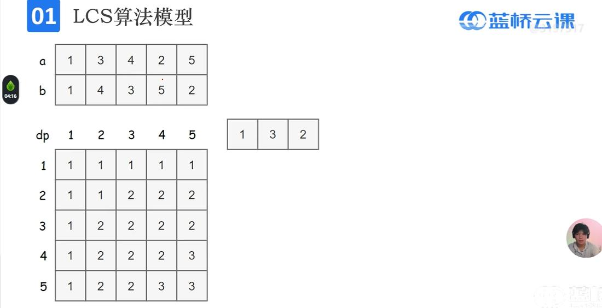

# 动态规划
## 1.动态规划基础 
### 1.1线性DP
1. 状态 dp[i]<br>
   最大子段和 dp[i]表示**以a[i]为结尾的最大字段和**(必须算a[i])<br>
   蛋糕店美味值 dp[i]表示**从第i家店往后吃的最大美味值**(算或不算a[i])

2. 状态转移方程<br>
   最大子段和 $dp[i]=max(dp[i-1]+a[i],a[i])$<br>
   蛋糕店美味值 $dp[i]=max(dp[i+1],b[i]+dp[i+a[i]+1])$//a[i]为饱腹值，b[i]为美味值

3. 转移方向

### 1.2二维DP
1. 状态 dp[i][j]<br>
   摆花 dp[i][j]表示**到第i种花、到第j个位置位置情况数**<br>
   选子序列异或和为x dp[i][j]表示**到第i个数、异或和为j的子序列个数**<br>
   数字三角形(左移右移次数相差<1) dp[i][j][k]表示**从(i,j)开始，向右移k次的方案数**


2. 状态转移方程<br>
   摆花 $dp[i][j]=dp[i-1][j]+dp[i-1][j-1]+……+dp[i-1][j-a[i]]$   //a[i]表示第i种花最多个数<br>
   选子序列异或和为x $dp[i][j]=dp[i-1][j]+dp[i-1][j$$\oplus$$a[i]]$<br>
   数字三角形(左移右移次数相差<1) $dp[i][j][k]=a[i][j]+max(dp[i+1][j][k],dp[i+1][j+1][k-1])$

3. 转移方向

### 1.3最长上升子序列(LIS)
1. 朴素法$O(n^2)$<br>
   dp[i]表示以a[i]结尾的最长上升子序列长度<br>
```c
for(i=1;i<=n;i++)
{
    dp[i]=1;
    for(j=1;j<i;j++)    dp[i]=max(dp[i],dp[j]+1);
}
for(i=1;i<=n;i++) ans=max(ans,dp[i]);
```
2. 数组标记法$O(nlogn)$<br>
dp[t]表示长度为t的上升子序列的末尾最小元素<br>
对于6,7,8,2,3,5,4,4<br>
dp[]={6,7,8}<br>
dp[]={2,7,8}<br>
dp[]={2,3,8}<br>
dp[]={2,3,5}<br>
dp[]={2,3,4}<br>
dp[]={2,3,4,4}<br>
```c
#include<stdio.h>
int a[10000005],dp[10000005];
int t=1;
//dp[t]表示t个不降序列的末尾元素最小值 
int main() 
{
    int n,i,j,ans=0;
    scanf("%d",&n);
    for(i=1;i<=n;i++)    scanf("%d",&a[i]);
    dp[1]=a[1];
    for(i=2;i<=n;i++)
    {
		if(a[i]>=dp[t])
		{
			t++;
			dp[t]=a[i];
		}
		else if(a[i]<dp[t])
		{
			for(j=t;j>=0;j--)
			{
				if(a[i]>=dp[j])
				{
					dp[j+1]=a[i]; 
                    break;
				}
			}
		}
    }
    printf("%d",t);
    return 0; 
}
```
### 1.4.1最长公共子序列(LCS)
只有朴素法$O(n*m)$<br>
dp[i][j]表示a[0~i-1], b[0~j-1]中最长公共子序列长度<br>



```c
//求长度
for(i=1;i<=n;i++)
    for(j=1;j<=m;j++)
    {
        if(a[i-1]==b[j-1]) dp[i][j]=dp[i-1][j-1]+1;
        else           dp[i][j]=max(dp[i-1][j],dp[i][j-1]);
    }
ans=dp[n][m];
//求具体序列
int x=n,y=m;
int stack[6000];//也可以改成char型,是一个栈
int top=-1;
while(x!=0&y!=0)
{
    if(a[x]==b[y])
    {
        top++;
        stack[top]=a[x];
        x--,y--;
    } 
    else if(dp[x-1][y]>dp[x][y-1])    x--;
    else    y--;   
}
for(i=top;i>=0;i--) printf("%d",stack[i]);
```
### 1.4.2最长公共子串(LCS)
dp[i][j]表示以a[i-1],b[j-1]结尾的最长公共子串的长度<br>
```c
int max1=0;
for(i=1;i<=n;i++)
    for(j=1;j<=m;j++)
    {
        if(a[i-1]==b[j-1]) 
        {
            dp[i][j]=dp[i-1][j-1]+1;
            if(dp[i][j]>max1) max1=dp[i][j];  // 在计算时同步更新最大值
        }
        else dp[i][j]=0;
    }
printf("%d ",max1);
```
### 1.5矩阵相乘
```c
#include <stdio.h>
#include <limits.h>

#define MAX 255  // 定义最大矩阵数量

// 打印最优括号化顺序的辅助函数
void printOptimalParens(int s[], int i, int j) {
    if (i == j) {  // 如果i等于j，直接打印矩阵编号
        printf("A%d", i + 1);
    } else {  // 否则，打印括号化的矩阵链
        printf("(");
        printOptimalParens(s, i, s[i][j]);  // 打印左子表达式
        printOptimalParens(s, s[i][j] + 1, j);  // 打印右子表达式
        printf(")");
    }
}

// 计算矩阵链乘法的最小乘法次数
void matrixChainOrder(int p[], int n, int m[][MAX], int s[][MAX]) {
    // 初始化m[i][i]为0，因为单个矩阵的乘法次数为0
    for (int i = 1; i <= n; i++) {
        m[i][i] = 0;
    }

    // L是链长度，从2开始到n
    for (int L = 2; L <= n; L++) {
        for (int i = 1; i <= n - L + 1; i++) {
            int j = i + L - 1;
            m[i][j] = INT_MAX;  // 初始化最小乘法次数为最大整数值
            for (int k = i; k < j; k++) {  // 枚举分割点
                int q = m[i][k] + m[k + 1][j] + p[i - 1] * p[k] * p[j];
                if (q < m[i][j]) {  // 找到更小的乘法次数
                    m[i][j] = q;
                    s[i][j] = k;  // 记录最优分割点
                }
            }
        }
    }
}

// 主函数
int main() {
    int p[] = {30, 35, 15, 5, 10, 20, 25};  // 矩阵维度数组
    int n = sizeof(p) / sizeof(p[0]) - 1;  // 矩阵数量
    int m[MAX][MAX], s[MAX][MAX];  // 存储最小乘法次数和分割点

    matrixChainOrder(p, n, m, s);  // 计算最小乘法次数和最优分割点

    printf("最小乘法次数为: %d\n", m[1][n]);
    printf("最优括号化顺序为: ");
    printOptimalParens(s, 1, n);  // 打印最优括号化顺序
    printf("\n");

    return 0;
}
```

### 1.6最优二叉搜索树
```c
#include <stdio.h>
#include <limits.h>

#define N 6

// 计算最优二叉搜索树的最小搜索代价
void optimalBST(int keys[], int p[], int q[], int n) {
    int e[N][N], w[N][N];
    int root[N][N];

    // 初始化e[i][i]为p[i]
    for (int i = 1; i <= n; i++) {
        e[i][i] = p[i];
        w[i][i] = p[i];
    }

    // 计算子问题
    for (int L = 1; L < n; L++) {
        for (int i = 1; i <= n - L; i++) {
            int j = i + L;
            e[i][j] = INT_MAX;
            w[i][j] = w[i][j-1] + p[j] + q[j];

            for (int r = i; r <= j; r++) {
                int t = e[i][r-1] + e[r+1][j] + w[i][j];
                if (t < e[i][j]) {
                    e[i][j] = t;
                    root[i][j] = r;
                }
            }
        }
    }

    // 打印最优搜索代价
    printf("Minimum cost is %d\n", e[1][n]);

    // 打印最优二叉搜索树
    printOptimalBST(root, keys, q, 1, n);
}

// 打印最优二叉搜索树
void printOptimalBST(int root[][N], int keys[], int q[], int i, int j) {
    if (i > j) return;
    if (i == j) {
        printf("%d ", keys[i]);
    } else {
        printf("( ");
        printOptimalBST(root, keys, q, i, root[i][j]-1);
        printOptimalBST(root, keys, q, root[i][j]+1, j);
        printf(")");
    }
    printf(" [%d] ", q[i] + (i > 1 ? q[i-1] : 0));
}

// 主函数
int main() {
    int keys[N+1] = {0, 10, 12, 20, 35, 46};
    int p[N+1] = {0.15, 0.10, 0.05, 0.10, 0.20};
    int q[N+1] = {0.05, 0.10, 0.05, 0.05, 0.05, 0.10};

    optimalBST(keys, p, q, N);

    return 0;
}
```

## 2.背包问题
### 2.1 01背包(每个物品只有一个)
dp[j]表示体积为j时所含最大价值
```c
//O(N*V)
scanf("%d%d",&N,&V);    //N个物品，背包容量为V
for(i=1;i<=N;i++)
{
    scanf("%d%d",&v,&w); //每个物品的v体积和w价值
    for(j=V;j>=0;j--)    //从后往前遍历
    {
        if(j>=v)dp[j]=max(dp[j],dp[j-v]+w);
    }    
}
ans=dp[V];
```
浅改1：可以用一次魔法,将一件物品体积+k,价值翻倍<br>
dp[i][j]表示体积为i,使用j次魔法时所含最大价值
```c
scanf("%d%d",&N,&V);    //N个物品，背包容量为V
for(i=1;i<=N;i++)
{
    scanf("%d%d",&v,&w); //每个物品的v体积和w价值
    for(j=V;j>=0;j--)
    {
        if(j>=v)
        {
            dp[i][0]=max(dp[i][0],dp[i-v][0]+w);
            dp[i][1]=max(dp[i][1],dp[i-v][0]+w);
        }
        if(j>=v+k)//注意这里不是else if
        {
            dp[i][1]=max(dp[i][1],dp[i-w][0]+v,dp[i-v-k][0]+2*w);
        }   
    }
}
ans=max(dp[V][0],dp[V][1]);
```
浅改2：输出选的物品的编号
```c
#include <stdio.h>
#include <string.h>
#include <stdlib.h>
#include <math.h>
#include <ctype.h>
int dp[2005];
int v[10005],w[10005];
int path[10005][10005],ans[10005];
//path 表示在达到某个容量j时，是否选择了第i个物品 
int max(int a,int b)
{
	if(a>b)	return a;
	else return b;	 
} 

int main()
{
	int N,V,i,j,cnt;
	 scanf("%d%d",&N,&V);    //N个物品，背包容量为V
    for(i=1;i<=N;i++)
    {
        scanf("%d%d",&w[i],&v[i]); //每个物品的v体积和w价值
        for(j=V;j>=v[i];j--)    //从后往前遍历
        {
            if(dp[j-v[i]]+w[i]>dp[j])
        	{
        		dp[j]=dp[j-v[i]]+w[i];
        		path[i][j]=1;
			}
        }    
    }
	printf("%d\n",dp[V]);
	i=N,j=V,cnt=0;
	while(i>=1&&j)
	{
		if(path[i][j])
		{
			ans[cnt++]=i;
			j=j-v[i];
		}
		i--;
	 }
	 for(int k=cnt-1;k>=0;k--) printf("%d ",ans[k]); 

    return 0;
}
```
浅改3：不求限定体积内的最大价值，而求限定体积内的情况数
```c
#include <stdio.h>
#include <string.h>
#include <stdlib.h>
#include <math.h>
#include <ctype.h>
int dp[10005];//dp[j]表示装了体积j的时候的情况数 
int main()
{
	int N,V,v,i,j;
	scanf("%d%d",&N,&V);    //N个物品，背包容量为V
	dp[0]=1;                //初始化
	for(i=1;i<=N;i++)
	{
    	scanf("%d",&v);      //每个物品的v体积
    	for(j=V;j>=v;j--)    //从后往前遍历
    	{
        	dp[j]=dp[j]+dp[j-v];
    	}    
	}
	for(j=1;j<=V;j++) 
	ans1=dp[V];//装了体积V的时候的情况数
	ans2=dp[1]+…+dp[V]; //装了体积≤V的时候的情况数

    return 0;
}

```


### 2.2 完全背包(每个物品有无穷个)
```c
//O(N*V)
scanf("%d%d",&N,&V);    //N个物品，背包容量为V
for(i=1;i<=N;i++)
{
    scanf("%d%d",&v,&w); //每个物品的v体积和w价值
    for(j=0;j<=V;j++)    //从前往后遍历
    {
        if(j>=v)dp[j]=max(dp[j],dp[j-v]+w);
    }    
}
ans=dp[V];
```

### 2.3 多重背包(每个物品有S个)
```c
//朴素法O(N*V*S)
scanf("%d%d",&N,&V);    //N个物品，背包容量为V
for(i=1;i<=N;i++)
{
    scanf("%d%d%d",&v,&w,&s); //每个物品的v体积、w价值、s个数
    while(s--)
    {
        for(j=V;j>=0;j--)    //从后往前遍历
        {
            if(j>=v)dp[j]=max(dp[j],dp[j-v]+w);
        }   
    } 
}
ans=dp[V];

//二进制优化模型O(N*V*log(S))
//s=1+2+4+8+……+剩余的非2进制的数
//14=1+2+4+7
scanf("%d%d",&N,&V);    //N个物品，背包容量为V
for(i=1;i<=N;i++)
{
    scanf("%d%d%d",&v,&w,&s); //每个物品的v体积、w价值、s个数
    //s=14
    for(k=1;k<=s;s=s-k,k=k*2)
    {
        //k=1,2,4
        for(j=V;j>=0;j--)    //从后往前遍历
        {
            if(j>=k*v)dp[j]=max(dp[j],dp[j-k*v]+k*w);
        }   
    }
    //s=6
    for(j=V;j>=0;j--)    //从后往前遍历
    {
        if(j>=s*v)dp[j]=max(dp[j],dp[j-s*v]+s*w);
    }  
}
ans=dp[V];
```
### 2.4 二维费用背包(背包有容积和重量)
```c
scanf("%d%d%d",&N,&V,&M);    //N个物品，背包容量为V
for(i=1;i<=N;i++)
{
    scanf("%d%d%d",&v,&m,&w); //每个物品的v体积、m重量、w价值
    for(j=V;j>=v;j--)    //从后往前遍历
        for(k=M;k>=m;k--) 
            dp[j][k]=max(dp[j][k],dp[j-v][k-m]+w);   
}
ans=dp[V][M];
```
### 2.5 分组背包(N组物品，每组s个物品只能拿一个)
dp[i][j]表示到第i组，体积为j的最大价值
```c
scanf("%d%d",&N,&V);    //N个物品，背包容量为V
for(i=1;i<=N;i++)
{
    scanf("%d",&s);      //每组有s个物品
    for(j=0;j<=V;j++)    dp[i][j]=dp[i-1][j];
    while(s--)
    {
        scanf("%d%d",&v,&w); //每个物品的v体积和w价值
        for(j=v;j<=V;j++)    //从前往后遍历
        {
            dp[i][j]=max(dp[i][j],dp[i-1][j-v]+w);
        }   
    }
     
}
ans=dp[N][V];
```
### 2.6 巨型01背包(V极大，会TLE)
已改为按价值 DP，避免按容量遍历。
 O(N × 总价值)，而不是 O(N × V)
```c
#include <stdio.h>
long long dp[1000005];//dp[j] 表示价值达到j时的最小体积
long long min(long long a,long long b)
{
    return a<b? a:b;
}
int main()
{
    long long N,V,i,j,v,w,ans=0;
    long long sum_value=0;
    scanf("%lld%lld",&N,&V);
    
    for(i=0;i<=1000000;i++) dp[i]=1e18;
    dp[0]=0;
    
    for(i=1;i<=N;i++)
    {
        scanf("%lld%lld",&v,&w);
        sum_value+=w;
        for(j=sum_value;j>=w;j--)
        {
            if(dp[j-w]!=1e18)
            {
                dp[j]=min(dp[j],dp[j-w]+v);
            }
        }
    }
    
    for(i=sum_value;i>=0;i--)
    {
        if(dp[i]<=V)
        {
            ans=i;
            break;
        }
    }
    printf("%lld",ans);
    return 0;
}
```