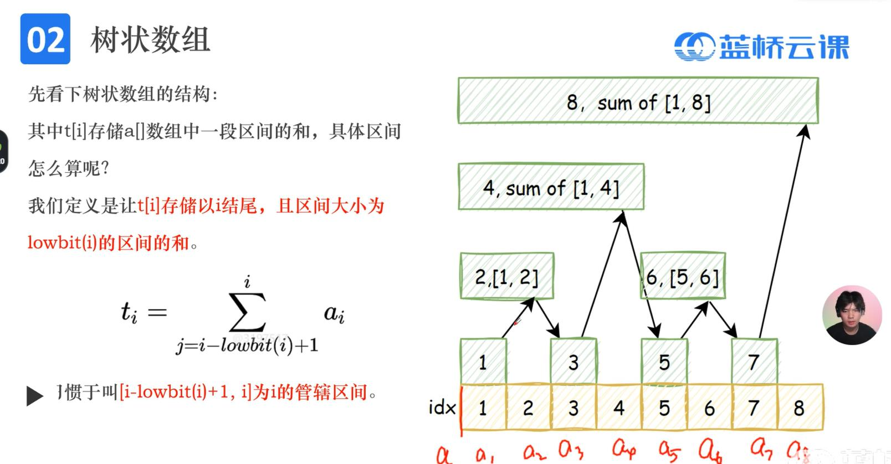
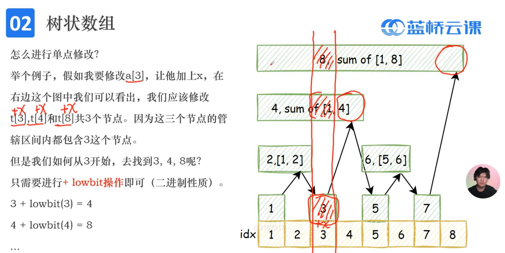
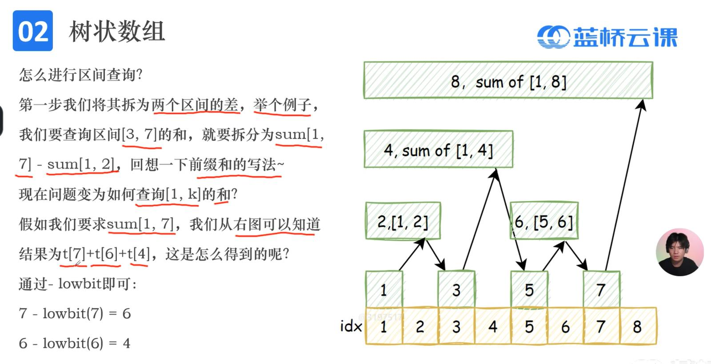
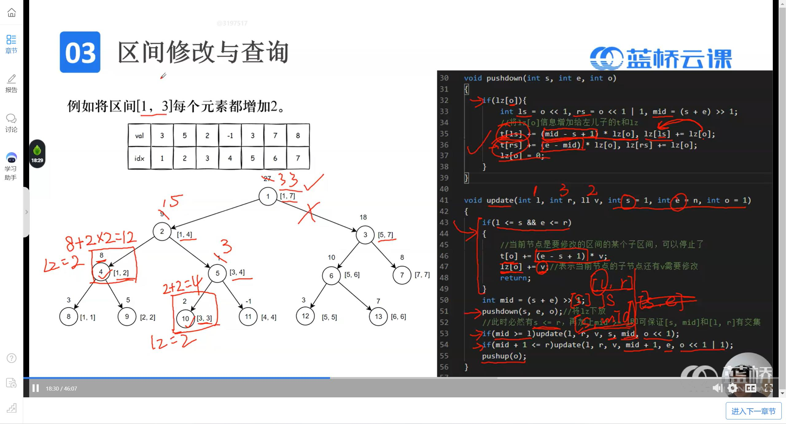
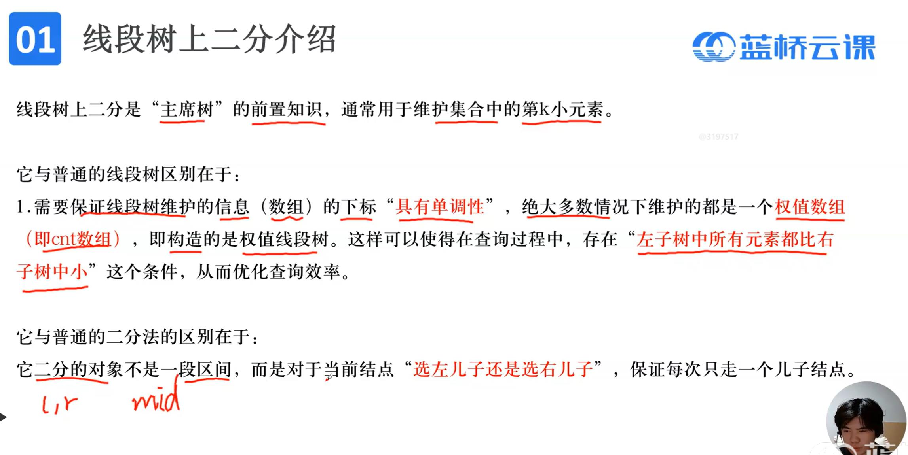
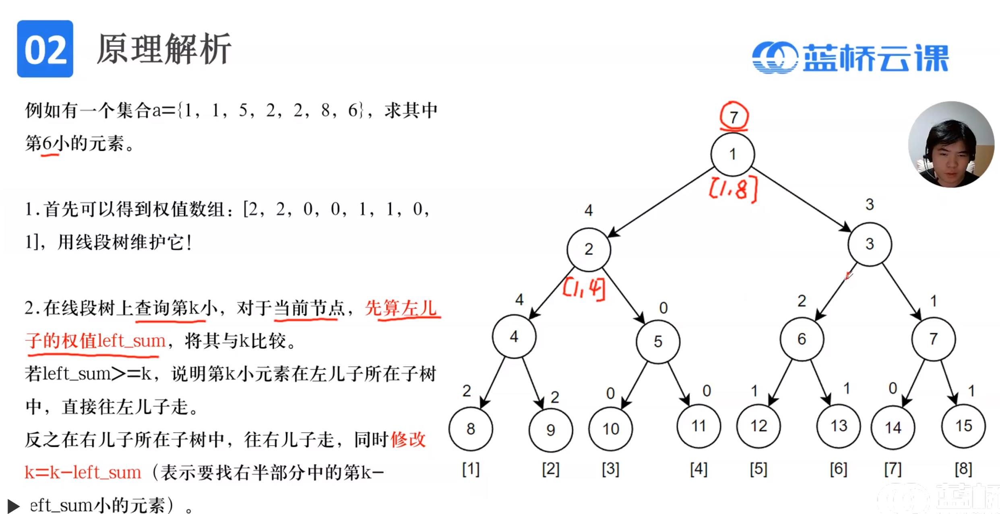
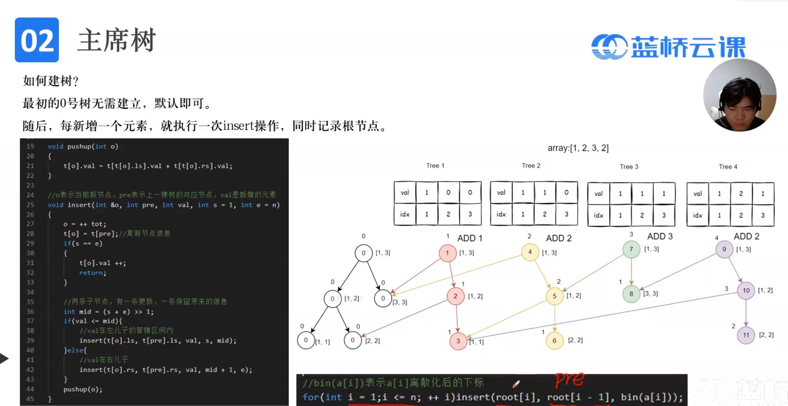

# 树形数据结构
## 1.树状数组
用途：**动态求区间和**(单点修改和区间查询)<br>
时间复杂度：O(log(n))



```c
//计算数字二进制表达中最低位1以及后面所有的0
int lowbit(int x){return x&-x;}
//给a[k]增加x
void update(int k,long long x)
{
	for(int i=k;i<=n;i+=lowbit(i)) t[i]+=x;
}
//求和sum(1,k)
long long getprefix(int k)
{
	long long res=0;
	for(int i=k;i>0;i-=lowbit(i)) res+=t[i];
	return res;
}
long long sum(int l,int r)
{
    return getprefix(r)-getprefix(l-1);
}
```
## 2.线段树
用途：**动态维护数组区间信息**(最值、和、异或和、gcd)<br>
主流线段树类型：修改(区间增加、区间修改、开根号)+查询(求和、最值)<br>
注意：
1. 区间修改加lazytag，单点修改不加lazytag
2. 有些区间修改(除法、开根号、求欧拉函数等)也无需使用lazytag(因为时间复杂度低)，只需判断是否有必要执行操作而跳过一些结点<br>
时间复杂度：O(log(n))

### 2.1区间增加+求和
```cpp
//区间修改
#include <bits/stdc++.h>
using namespace std;
using ll=long long;
const int N=2e6+5;
ll a[N],t[4*N],lz[4*N],n;

void pushup(int o)
{
	t[o]=t[o<<1]+t[o<<1|1]; //求和(可以改) 
}
void build(int s=1,int e=n,int o=1) //建树 
{
	if(s==e) //递归出口 
	{
		t[o]=a[s];
		return; 
	}
	int mid=(s+e)>>1;
	build(s,mid,o<<1);
	build(mid+1,e,o<<1|1);
	pushup(o);
} 

void pushdown(int s,int e,int o)
{
	if(lz[o]) //lz[i]表示i结点代表的区间的每个元素都要加的值 
	{
		int ls=o<<1, rs=o<<1|1, mid=(s+e)>>1;
		t[ls]+=(mid-s+1)*lz[o], lz[ls]+=lz[o];
		t[rs]+=(e-mid)*lz[o],   lz[rs]+=lz[o];
		lz[o]=0;
	}
} 
void update(int l,int r,ll v,int s=1,int e=n,int o=1) //[l,r]区间+v 
{
	if(l<=s && e<=r)
	{
		t[o]+=(e-s+1)*v;
		lz[o]+=v;
		return;
	}
	int mid=(s+e)>>1;
	pushdown(s,e,o);
	if(mid>=l)   update(l,r,v,s,mid,o<<1);
	if(mid+1<=r) update(l,r,v,mid+1,e,o<<1|1);
	pushup(o);
}

ll query(int l,int r,int s=1,int e=n,int o=1)
{
	if(l<=s&&e<=r)
	{
		return t[o];
	}
	int mid=(s+e)>>1;
	pushdown(s,e,o);
	ll res=0;
	if(mid>=l)   res+=query(l,r,s,mid,o<<1);
	if(mid+1<=r) res+=query(l,r,mid+1,e,o<<1|1);
	return res;
}
```

### 2.2区间开根号+求和
```cpp
#include <bits/stdc++.h>
using namespace std;
using ll=long long;
const int N=2e6+5;
ll a[N],t[4*N],lz[4*N],n;

void pushup(int o)
{
	t[o]=t[o<<1]+t[o<<1|1]; //求和(可以改) 
}
void build(int s=1,int e=n,int o=1) //建树 
{
	if(s==e) //递归出口 
	{
		t[o]=a[s];
		return; 
	}
	int mid=(s+e)>>1;
	build(s,mid,o<<1);
	build(mid+1,e,o<<1|1);
	pushup(o);
} 
 
void update(int l,int r,int s=1,int e=n,int o=1) 
{
    if(t[o]==e-s+1) return;//区间全是1时剪枝
	if(s==e)//重新改
	{
		t[o]=sqrt(t[o]);
		return;
	}
	int mid=(s+e)>>1;
	if(mid>=l)   update(l,r,s,mid,o<<1);
	if(mid+1<=r) update(l,r,mid+1,e,o<<1|1);
	pushup(o);
}

ll query(int l,int r,int s=1,int e=n,int o=1)
{
	if(l<=s&&e<=r)
	{
		return t[o];
	}
	int mid=(s+e)>>1;
	ll res=0;
	if(mid>=l)   res+=query(l,r,s,mid,o<<1);
	if(mid+1<=r) res+=query(l,r,mid+1,e,o<<1|1);
	return res;
}
```
### 2.3区间修改+最大值
浅改(查询第一个不小于p的数的位置)(区间修改)
```cpp
#include <bits/stdc++.h>
using namespace std;
using ll=long long;
const int N=2e6+5;
ll a[N],t[4*N],lz[4*N],n;

void pushup(int o)
{
	t[o]=max(t[o<<1],t[o<<1|1]); //求最大值(可以改) 
}
void build(int s=1,int e=n,int o=1) //建树 
{
	if(s==e) //递归出口 
	{
		t[o]=a[s];
		return; 
	}
	int mid=(s+e)>>1;
	build(s,mid,o<<1);
	build(mid+1,e,o<<1|1);
	pushup(o);
} 

void pushdown(int s,int e,int o)
{
	if(lz[o]) //lz[i]表示i结点代表的区间的每个元素都要赋的值 
	{
		int ls=o<<1, rs=o<<1|1, mid=(s+e)>>1;
		t[ls]=lz[o], lz[ls]=lz[o];
		t[rs]=lz[o], lz[rs]=lz[o];
		lz[o]=0;
	}
} 
void update(int l,int r,ll v,int s=1,int e=n,int o=1) //[l,r]区间赋值为v 
{
	if(l<=s && e<=r)
	{
		t[o]=v;
		lz[o]=v;
		return;
	}
	int mid=(s+e)>>1;
	pushdown(s,e,o);
	if(mid>=l)   update(l,r,v,s,mid,o<<1);
	if(mid+1<=r) update(l,r,v,mid+1,e,o<<1|1);
	pushup(o);
}

ll query(int l,int r,int s=1,int e=n,int o=1)
{
	if(l<=s&&e<=r)
	{
		return t[o];
	}
	int mid=(s+e)>>1;
	pushdown(s,e,o);
	ll res=0;
	if(mid>=l)   res=max(res,query(l,r,s,mid,o<<1));
	if(mid+1<=r) res=max(res,query(l,r,mid+1,e,o<<1|1));
	return res;
}

int main()
{
	int q;
	scanf("%d%d",&n,&q);
	for(int i=1;i<=n;i++)scanf("%lld",&a[i]);
	build();
	while(q--)
	{
		int op;
		scanf("%d",&op);
		if(op==1)//把l改成k 
		{
			ll l,k;
			scanf("%lld%lld",&l,&k);
			update(l,l,k);
		}
		if(op==2)//查询第一个不小于p的数的位置 
		{
			ll p,l=0,r=n+1;
			scanf("%lld",&p);
			while(l+1!=r)
			{
				int mid=(l+r)>>1;
				if(query(1,mid)>=p) r=mid;
				else l=mid;
			}
			if(r==n+1) printf("-1\n");
			else       printf("%lld\n",r);
		}
	}
    return 0;
}
```

## 3.权值线段树
用途：**动态维护整个数组中每个元素的个数**<br>
常用来：
1. 求整个数组中第k小的元素
2. 求整个数组中大小在[l,r]之间的元素个数<br>

实现方法：传入原数组a[i]，update会将叶子结点值t[o]表示为o结点对应元素a[i]的数量<br>
时间复杂度：O(log(n))


```cpp
#include <bits/stdc++.h>
using namespace std;
using ll=long long;
const int N=2e6+9;
int n;
ll t[4*N];
struct
{
	ll a,v;
} data;

void pushup(int o)
{
	t[o]=t[o<<1]+t[o<<1|1];
}
//增加a个v 
void update(ll v,ll a,int s=1,int e=N,int o=1)
{
	if(s==e)
	{
		t[o]+=a;
		return;
	}
	int mid=(s+e)>>1;
	if(v<=mid) update(v,a,s,mid,o<<1);
	if(v>mid)  update(v,a,mid+1,e,o<<1|1);
	pushup(o);
}
//询问第k小的数 
ll query(ll k, int s=1,int e=N,int o=1)
{
	if(s==e)
	{
		return s; //返回s，不是o 
	}
	int mid=(s+e)>>1;
	ll left_sum=t[o<<1];
	if(k<=left_sum) return query(k,s,mid,o<<1);
	else            return query(k-left_sum,mid+1,e,o<<1|1);
}

/*
//查询值在[l,r]之间的元素个数 
ll query(int l, int r,int s=1,int e=N,int o=1)
{
	if(l<=s&&e<=r)
	{
		return t[o]; //返回s，不是o 
	}
	int mid=(s+e)>>1;
	ll res;
	if(l<=mid) 	  res+=query(l,r,s,mid,o<<1);	
	if(mid+1<=r)  res+=query(l,r,mid+1,e,o<<1|1);
	return res;    
}
*/

int main()
{
	scanf("%d",&n);
    ll ans=0;
	for(int i=1;i<=n;i++)
	{
		scanf("%lld%lld",&data.v,&data.a);//增加a个v
		ans+=data.a;
		update(data.v,data.a);
		printf("%lld\n",query((ans+1)/2));//输出中位数(若有2个取小)
	} 
    return 0;
}

```
浅改：数据较大，离散化
```cpp
#include <bits/stdc++.h>
using namespace std;
using ll=long long;
const int N=2e5+9;
int n;
ll t[4*N];

vector<ll>L; //离散化数组
ll getidx(ll x) //x值对应的下标(从1开始)
{
	//lower_bound(a,b,c)在有序数组区间[a,b]中找到第一个>=c的寄存器位置 
	return lower_bound(L.begin(), L.end(), x) - L.begin()+1;
}

ll getval(ll idx)//idx下标(从1开始)对应的值
{
    return L[idx-1];
} 

struct
{
	ll a,v;
} q[N];

void pushup(int o)
{
	t[o]=t[o<<1]+t[o<<1|1];
}
//增加a个v 
void update(ll v,ll a,int s=1,int e=L.size(),int o=1)
{
	if(s==e)
	{
		t[o]+=a;
		return;
	}
	int mid=(s+e)>>1;
	if(v<=mid) update(v,a,s,mid,o<<1);
	if(v>mid)  update(v,a,mid+1,e,o<<1|1);
	pushup(o);
}
//询问第k小的数 
ll query(ll k, int s=1,int e=L.size(),int o=1)
{
	if(s==e)
	{
		return s; //返回s，不是o 
	}
	int mid=(s+e)>>1;
	ll left_sum=t[o<<1];
	if(k<=left_sum) return query(k,s,mid,o<<1);
	else            return query(k-left_sum,mid+1,e,o<<1|1);
}

int main()
{
	scanf("%d",&n);
	for(int i=1;i<=n;i++) scanf("%lld%lld",&q[i].v,&q[i].a);
	for(int i=1;i<=n;i++) L.push_back(q[i].v);
	sort(L.begin(),L.end());
	L.erase(unique( L.begin() , L.end() ), L.end());
	
	ll ans=0;
	for(int i=1;i<=n;i++)
	{
		ans+=q[i].a;
		update(getidx(q[i].v),q[i].a);
		printf("%lld\n",getval(query((ans+1)/2)));
	} 
    return 0;
}
```
## 4.主席树
用途：**动态维护数组每个精准区间[l,r]中每个元素的个数**<br>
常用来：
1. 动态维护区间[l,r]中第k小的元素
2. 动态维护区间[l,r]中大小为[a,b]的元素个数

实现方法：传入原数组a[i]，update会将叶子结点值t[o].val表示为o结点对应元素a[i]的数量<br>
时间复杂度：O(nlog(n))

```cpp
#include <bits/stdc++.h>
using namespace std;
using ll=long long;
const int N=2e5+9;
int n,root[N];
ll a[N];
vector<ll>L; //离散化数组
ll getidx(ll x) //x值对应的下标(从1开始)
{
	//lower_bound(a,b,c)在有序数组区间[a,b]中找到第一个>=c的寄存器位置 
	return lower_bound(L.begin(), L.end(), x) - L.begin()+1;
}

ll getval(ll idx)//idx下标(从1开始)对应的值
{
    return L[idx-1];
} 

struct Node
{
	int ls,rs;
	ll val;
}t[N*30];

void pushup(int o)
{
	t[o].val=t[t[o].ls].val+t[t[o].rs].val;
}
int tot=0;
//插入一个元素val
void insert(int &o,int pre,int val, int s=1,int e=n)
{
	o=++tot;     //动态开点
	t[o]=t[pre]; //复制信息
	if(s==e)
	{
		t[o].val++;
		return;
	}
	int mid=(s+e)>>1;
	if(val<=mid) insert(t[o].ls,t[pre].ls,val,s,mid);
	else         insert(t[o].rs,t[pre].rs,val,mid+1,e);
	pushup(o);  
}
//在区间[l,r]第k小的值 
int query(int lo,int ro,int k,int s=1,int e=n)
{
	if(s==e) return s;
	int mid=(s+e)>>1;
	int left_sum=t[t[ro].ls].val-t[t[lo].ls].val;
	if(left_sum>=k)  return query(t[lo].ls,t[ro].ls,k,s,mid);
	if(left_sum<k)   return query(t[lo].rs,t[ro].rs,k-left_sum,mid+1,e);
}

int main()
{
	int q;
	scanf("%d%d",&n,&q);
	for(int i=1;i<=n;i++) scanf("%lld",&a[i]);
	for(int i=1;i<=n;i++) L.push_back(a[i]);
	sort(L.begin(),L.end());
	L.erase(unique( L.begin() , L.end() ), L.end());
	
	for(int i=1;i<=n;i++) insert(root[i],root[i-1], getidx(a[i]));
	while(q--)
	{
		int l,r,k;
		scanf("%d%d%d",&l,&r,&k);
		printf("%lld\n",getval(query(root[l-1],root[r],k)));
	}

    return 0;
}

```
浅改：找区间[l,r]上的不同元素种类数<br>
思路：传入lst[i]数组(表示值为i的数前一次出现的下标),维护该数组在[l,r]区间上大小为[0，l-1]的元素个数<br>
```cpp
#include <bits/stdc++.h>
using namespace std;
using ll=long long;
const int N=2e5+9;
int n,root[N];
ll a[N],lst[N];

struct Node
{
	int ls,rs;
	ll val;
}t[N*30];

void pushup(int o)
{
	t[o].val=t[t[o].ls].val+t[t[o].rs].val;
}
int tot=0;
void insert(int &o,int pre,int val, int s=0,int e=n)
{
	o=++tot;     //动态开点
	t[o]=t[pre]; //复制信息
	if(s==e)
	{
		t[o].val++;
		return;
	}
	int mid=(s+e)>>1;
	if(val<=mid) insert(t[o].ls,t[pre].ls,val,s,mid);
	else         insert(t[o].rs,t[pre].rs,val,mid+1,e);
	pushup(o);  
}
//在区间[lo,ro]内值为[l,r]的元素个数 
int query(int lo,int ro,int l,int r,int s=0,int e=n)
{
	if(l<=s&&e<=r)
	{
		return t[ro].val-t[lo].val; 
	}
	int mid=(s+e)>>1;
	int res=0;
	if(mid>=l) res+=query(t[lo].ls,t[ro].ls,l,r,s,mid);
	if(mid+1<=r) res+=query(t[lo].rs,t[ro].rs,l,r,mid+1,e);
	return res;
}

int main()
{
	int q;
	scanf("%d%d",&n,&q);
	
	for(int i=1;i<=n;i++)
	{
		scanf("%lld",&a[i]);
		insert(root[i],root[i-1],lst[a[i]]);
		lst[a[i]]=i;
	} 
	while(q--)
	{
		int l,r;
		scanf("%d%d",&l,&r);
		printf("%lld\n",query(root[l-1],root[r],0,l-1));
	}

    return 0;
}
```


