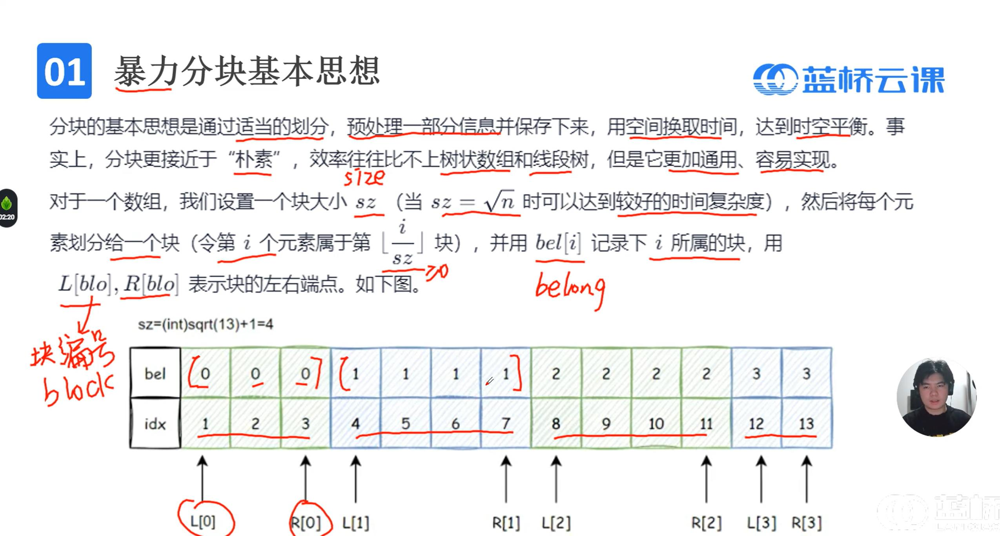
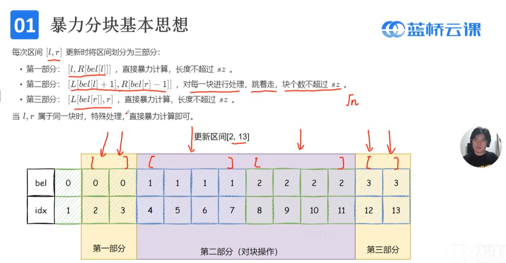
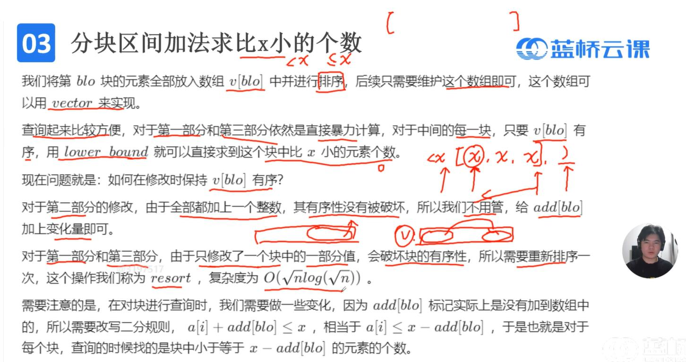
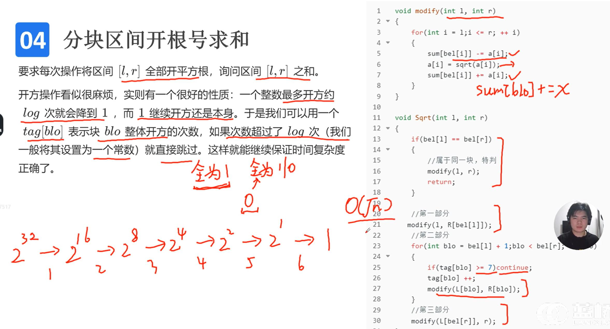
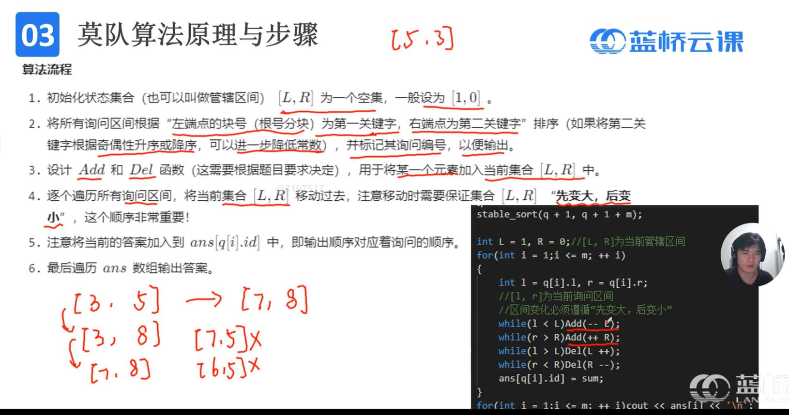

# 分块、莫队算法
## 1.分块基础


```cpp
#include <bits/stdc++.h>
using namespace std;
const int N=2e5+9;
int bel[N];    //bel[i]表示i下标belong的块 
int L[N],R[N]; //L[i]表示i块的左端点下标 
int main()
{
	sz=sqrt(n)+1;//确保块大小至少为1
	for(int i=1;i<=n;i++)
	{
		bel[i]=i/sz;
		//其他处理 
		if(i>1&&bel[i]!=bel[i-1])  L[bel[i]]=i, R[bel[i-1]]=i-1;
	}
	L[bel[1]]=1, R[bel[n]]=n; 

    return 0;
}
```
## 2.分块区间加法求和
用途：**动态修改查询区间和**(用树状数组、线段树也可以)
```cpp
#include <bits/stdc++.h>
using namespace std;
using ll=long long; 
const int N=2e5+9;

ll sz,bel[N];    //bel[i]表示i下标belong的块 
ll L[N],R[N]; //L[i]表示i块的左端点下标
 
//sum[blo]表示块blo的初始和+部分区间的增加值 
//add[blo]表示块blo整体区间每个元素的增加值 
ll sum[N],add[N],a[N];
 
void Add(int l,int r,ll x) //[l,r]每个元素加x 
{
	if(bel[l]==bel[r])
	{
		for(int i=l;i<=r;i++) a[i]+=x, sum[bel[i]]+=x;
		return;
	}
	//第一部分
	for(int i=l;i<=R[bel[l]];i++) a[i]+=x, sum[bel[i]]+=x;
	//第二部分
	for(int blo=bel[l]+1;blo<bel[r];blo++) add[blo]+=x;
	//第三部分 
	for(int i=L[bel[r]];i<=r;i++) a[i]+=x, sum[bel[i]]+=x;
}

ll getsum(int l,int r)
{
	ll res=0;
	if(bel[l]==bel[r])
	{
		for(int i=l;i<=r;i++) res+=a[i]+add[bel[i]];
		return res;
	}
	//第一部分
	for(int i=l;i<=R[bel[l]];i++) res+=a[i]+add[bel[i]];
	//第二部分
	for(int blo=bel[l]+1;blo<bel[r];blo++) res+=sum[blo]+add[blo]*(R[blo]-L[blo]+1);
	//第三部分 
	for(int i=L[bel[r]];i<=r;i++) res+=a[i]+add[bel[i]];
	return res;
} 


int main()
{
	int n,m;
	scanf("%d%d",&n,&m);
	for(int i=1;i<=n;i++) scanf("%lld",&a[i]);
	
	sz=sqrt(n)+1;//确保块大小至少为1
	for(int i=1;i<=n;i++)
	{
		bel[i]=i/sz;
		//其他处理
		sum[bel[i]]+=a[i]; 
		if(i>1&&bel[i]!=bel[i-1])  L[bel[i]]=i, R[bel[i-1]]=i-1;
	}
	L[bel[1]]=1, R[bel[n]]=n;
	
	while(m--)
	{
		int op,l,r;
		ll x;
		scanf("%d",&op);
		if(op==1)
		{
			scanf("%d%d%lld",&l,&r,&x);
			Add(l,r,x);
		}
		if(op==2)
		{
			scanf("%d%d",&l,&r);
			printf("%lld\n",getsum(l,r));
		}
	} 

    return 0;
}

```
## 3.分块区间加法求比x小的个数
用途：**动态区间修改查询[l,r]比x小的个数**(用主席树也可以)

```cpp
#include <bits/stdc++.h>
using namespace std;
using ll=long long; 
const int N=2e5+9;

ll sz,bel[N];    //bel[i]表示i下标belong的块 
ll L[N],R[N]; //L[i]表示i块的左端点下标
 
//add[blo]表示块blo整体区间每个元素的增加值 
ll add[N],a[N];
vector<ll>v[N];

void resort(int blo)
{
	v[blo].clear();
	for(int i=L[blo];i<=R[blo];i++) v[blo].push_back(a[i]);
	sort(v[blo].begin(),v[blo].end());
}

void Add(int l,int r,ll x) //[l,r]每个元素加x 
{
	if(bel[l]==bel[r])
	{
		for(int i=l;i<=r;i++) a[i]+=x;
		resort(bel[l]);
	}
	//第一部分
	for(int i=l;i<=R[bel[l]];i++) a[i]+=x;
	resort(bel[l]);
	//第二部分
	for(int blo=bel[l]+1;blo<bel[r];blo++) add[blo]+=x;
	//第三部分 
	for(int i=L[bel[r]];i<=r;i++) a[i]+=x;
	resort(bel[r]);
}

int f(int l,int r,ll x)
{
	int res=0;
	if(bel[l]==bel[r])
	{
		for(int i=l;i<=r;i++) res+=(int)(a[i]+add[bel[i]]<x);
		return res;
	}
	//第一部分
	for(int i=l;i<=R[bel[l]];i++) res+=(int)(a[i]+add[bel[i]]<x);
	//第二部分
	for(int blo=bel[l]+1;blo<bel[r];blo++) 
		res+=lower_bound(v[blo].begin(),v[blo].end(),x-add[blo])-v[blo].begin();
	//第三部分 
	for(int i=L[bel[r]];i<=r;i++) res+=(int)(a[i]+add[bel[i]]<x);
	return res;
} 


int main()
{
	int n,m;
	scanf("%d%d",&n,&m);
	for(int i=1;i<=n;i++) scanf("%lld",&a[i]);
	
	sz=sqrt(n)+1;//确保块大小至少为1
	for(int i=1;i<=n;i++)
	{
		bel[i]=i/sz;
		//其他处理
		if(i>1&&bel[i]!=bel[i-1])  L[bel[i]]=i, R[bel[i-1]]=i-1;
	}
	L[bel[1]]=1, R[bel[n]]=n;
	
	while(m--)
	{
		int op,l,r;
		ll x;
		scanf("%d",&op);
		if(op==1)
		{
			scanf("%d%d%lld",&l,&r,&x);
			Add(l,r,x);
		}
		if(op==2)
		{
			scanf("%d%d%lld",&l,&r,&x);
			printf("%lld\n",f(l,r,x));
		}
	} 

    return 0;
}
```
## 4.分块区间开根号求和
用途：**动态区间开根号求和**(用线段树也可以)

```cpp
#include <bits/stdc++.h>
using namespace std;
using ll=long long; 
const int N=2e5+9;

ll sz,bel[N];    //bel[i]表示i下标belong的块 
ll L[N],R[N]; //L[i]表示i块的左端点下标
 
//add[blo]表示块blo整体区间每个元素的增加值 
ll sum[N],a[N];
int tag[N];

void modify(int l,int r)
{
	for(int i=1;i<=r;i++)
	{
		sum[bel[i]]-=a[i];
		a[i]=sqrt(a[i]);
		sum[bel[i]]+=a[i];
	}
}

void Sqrt(int l,int r) //[l,r]每个元素加x 
{
	if(bel[l]==bel[r])
	{
		modify(l,r);
		return;
	}
	//第一部分
	modify(l,R[bel[l]]);
	//第二部分
	for(int blo=bel[l]+1;blo<bel[r];blo++)
	{
		if(tag[blo]>=7) continue;
		tag[blo]++;
		modify(L[blo],R[blo]);
	}
	//第三部分 
	modify(L[bel[r]],r);
}

ll getsum(int l,int r)
{
	ll res=0;
	if(bel[l]==bel[r])
	{
		for(int i=l;i<=r;i++) res+=a[i];
		return res;
	}
	//第一部分
	for(int i=l;i<=R[bel[l]];i++) res+=a[i];
	//第二部分
	for(int blo=bel[l]+1;blo<bel[r];blo++) res+=sum[blo];
	//第三部分 
	for(int i=L[bel[r]];i<=r;i++) res+=a[i];
	return res;
} 


int main()
{
	int n,m;
	scanf("%d%d",&n,&m);
	for(int i=1;i<=n;i++) scanf("%lld",&a[i]);
	
	sz=sqrt(n)+1;//确保块大小至少为1
	for(int i=1;i<=n;i++)
	{
		bel[i]=i/sz;
		//其他处理
		if(i>1&&bel[i]!=bel[i-1])  L[bel[i]]=i, R[bel[i-1]]=i-1;
	}
	L[bel[1]]=1, R[bel[n]]=n;
	
	while(m--)
	{
		int op,l,r;
		ll x;
		scanf("%d",&op);
		if(op==1)
		{
			scanf("%d%d",&l,&r);
			Sqrt(l,r);
		}
		if(op==2)
		{
			scanf("%d%d%",&l,&r);
			printf("%lld\n",getsum(l,r));
		}
	} 

    return 0;
}
```
## 5.基础莫队算法(离线解决不修改只查询的区间问题)
用途：查询区间不同元素的种类数(用主席树可增加修改功能)<br>
时间复杂度：$$O(q\sqrt{n})$$

```cpp
#include <bits/stdc++.h>
using namespace std;
using ll=long long;
const int N=1e5+9; 

ll sz;

struct Q
{
	int l,r,id;
	bool operator < (const Q &u)const
	{
		if(l/sz!=u.l/sz) return l<u.l;
		else			 return r<u.r;
	}
}q[N];

ll sum,cnt[N],c[N];

void Add(int k)
{
	if(++cnt[c[k]]==1) sum++;
}

void Del(int k)
{
	if(--cnt[c[k]]==0) sum--;
}

int main()
{
	int n,m;
	scanf("%d%d",&n,&m);
	sz=sqrt(n);
	for(int i=1;i<=n;i++) scanf("%d",&c[i]);
	
	for(int i=1;i<=m;i++)
	{
		scanf("%d%d",&q[i].l,&q[i].r);
		q[i].id=i;
	}
	stable_sort(q+1,q+1+m);
	
	int L=1,R=0,ans[N];
	for(int i=1;i<=m;i++)
	{
		int l=q[i].l, r=q[i].r, id=q[i].id;
		while(l<L) Add(--L);
		while(R<r) Add(++R);
		while(L<l) Del(L++);
		while(r<R) Del(R--);
		//[L,R]=[l,r]
		ans[id]=sum;
	}
	for(int i=1;i<=m;i++) printf("%d ",ans[i]);

    return 0;
}

```


