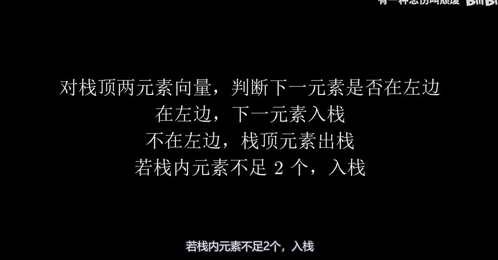
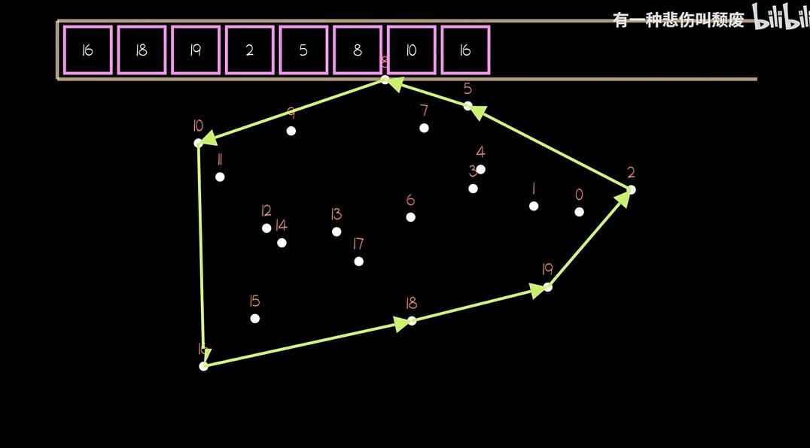

# 计算几何
## 1.线性代数知识
1. 如果两向量p1×p2>0,代表从p1在P2的相对原点的顺时针方向
   p1×p2=0,共线
   p1×p2<0,逆时针
2. 判断(a1,a2)和(a2,a3)两个首位相连向量是左转or右转
   看(a1,a2)×(a1,a3)<0,右转
   看(a1,a2)×(a1,a3)>0,左转
3. 


## 2.判断一组点是否共线
思路：
1. 先判断3点是否共线(叉乘为0)
2. 再判断点1、点2是否和点3~点n共线
```c
#include <stdio.h>
#include <stdbool.h>
#include <math.h>

// 点的结构体
typedef struct {
    double x;
    double y;
} Point;

// 判断三个点是否共线
// 使用向量叉积：如果向量AB和向量AC的叉积为0，则三点共线
bool areThreePointsCollinear(Point a, Point b, Point c) {
    // 计算向量AB和AC
    double abx = b.x - a.x;
    double aby = b.y - a.y;
    double acx = c.x - a.x;
    double acy = c.y - a.y;
    
    // 计算叉积（二维向量的叉积是一个标量）
    double crossProduct = abx * acy - aby * acx;
    
    // 考虑浮点误差，使用一个小的阈值
    const double EPSILON = 1e-9;
    return fabs(crossProduct) < EPSILON;
}

// 判断一组点是否共线
bool arePointsCollinear(Point points[], int n) {
    // 0个或1个点：认为共线
    if (n <= 1) return true;
    
    // 2个点：总是共线
    if (n == 2) return true;
    
    // 3个或更多点：检查所有点是否与前两个点共线
    for (int i = 2; i < n; i++) {
        if (!areThreePointsCollinear(points[0], points[1], points[i])) {
            return false;
        }
    }
    
    return true;
}

// 测试函数
int main()
{
    int t,n;
    scanf("%d", &t);
    while(t--)
    {
        scanf("%d", &n);
        Point points[n];
        for(int i = 0; i < n; i++)
        {
            scanf("%lf %lf", &points[i].x, &points[i].y);
        }
        if(arePointsCollinear(points, n))
        {
            printf("boo how! boo how!\n");
        }
        else
        {
            printf("how?\n");
        }
    }
    
    
    
    return 0;
}
```

## 3.判断两个线段是否相交

算法思路：
1. 计算四个方向值，判断每个端点相对于另一条线段的位置
2. 一般情况（跨立实验）：如果两条线段互相跨立，则相交
    即：p1和p2在p3p4的两侧，且p3和p4在p1p2的两侧
3. 边界情况：如果某个端点在另一条线段上，也认为相交
```c
#include <stdio.h>

// 点的结构体
typedef struct {
    long long x, y;
} Point;

// 计算两个向量的点积（数量积）
// 点积可以用来判断角度关系和投影长度
long long dot(Point a, Point b) {
    return a.x * b.x + a.y * b.y;
}

// 计算两个向量的叉积
// 叉积的符号表示方向：正数表示逆时针，负数表示顺时针，0表示共线
long long cross(Point a, Point b) {
    return a.x * b.y - a.y * b.x;
}

// 计算点pk相对于有向线段pipj的方向
// 返回值：>0表示pk在pipj的左侧，<0表示右侧，=0表示共线
// 公式：(pk - pi) × (pj - pi)
long long direction(Point pi, Point pj, Point pk) {
    Point v1 = {pk.x - pi.x, pk.y - pi.y};  // 向量 pi->pk
    Point v2 = {pj.x - pi.x, pj.y - pi.y};  // 向量 pi->pj
    return cross(v1, v2);
}

// 判断点pk是否在线段pipj上（使用点积）
// 前提：pk已经与pipj共线（direction返回0）
// 思路：计算向量(pk-pi)在向量(pj-pi)上的投影
//       如果投影在[0, |pj-pi|]范围内，则点在线段上
int onSegment(Point pi, Point pj, Point pk) {
    Point v1 = {pk.x - pi.x, pk.y - pi.y};  // 向量 pi->pk
    Point v2 = {pj.x - pi.x, pj.y - pi.y};  // 向量 pi->pj
    long long d = dot(v1, v2);               // v1在v2上的投影长度 × |v2|
    long long len2 = dot(v2, v2);            // |v2|^2
    // 如果 0 <= 投影 <= |v2|，则点在线段上
    return d >= 0 && d <= len2;
}

// 判断两条线段p1p2和p3p4是否相交
// 算法思路：
// 1. 计算四个方向值，判断每个端点相对于另一条线段的位置
// 2. 一般情况（跨立实验）：如果两条线段互相跨立，则相交
//    即：p1和p2在p3p4的两侧，且p3和p4在p1p2的两侧
// 3. 边界情况：如果某个端点在另一条线段上，也认为相交
int intersect(Point p1, Point p2, Point p3, Point p4) {
    // 计算四个方向值
    long long d1 = direction(p3, p4, p1);  // p1相对于线段p3p4的方向
    long long d2 = direction(p3, p4, p2);  // p2相对于线段p3p4的方向
    long long d3 = direction(p1, p2, p3);  // p3相对于线段p1p2的方向
    long long d4 = direction(p1, p2, p4);  // p4相对于线段p1p2的方向
    
    // 一般情况：跨立实验
    // d1和d2异号 且 d3和d4异号，说明两条线段互相跨立，必然相交
    if (((d1 > 0 && d2 < 0) || (d1 < 0 && d2 > 0)) && 
        ((d3 > 0 && d4 < 0) || (d3 < 0 && d4 > 0))) {
        return 1;
    }
    
    // 边界情况：处理端点在线段上的情况
    // 如果某个端点在另一条线段上（direction=0且onSegment为真），则相交
    if (d1 == 0 && onSegment(p3, p4, p1)) return 1;  // p1在p3p4上
    if (d2 == 0 && onSegment(p3, p4, p2)) return 1;  // p2在p3p4上
    if (d3 == 0 && onSegment(p1, p2, p3)) return 1;  // p3在p1p2上
    if (d4 == 0 && onSegment(p1, p2, p4)) return 1;  // p4在p1p2上
    
    return 0;  // 不相交
}

int main() {
    int t;
    scanf("%d", &t);
    while (t--) {
        Point a1, a2, b1, b2;
        scanf("%lld %lld %lld %lld", &a1.x, &a1.y, &a2.x, &a2.y);
        scanf("%lld %lld %lld %lld", &b1.x, &b1.y, &b2.x, &b2.y);
        if (intersect(a1, a2, b1, b2)) {
            printf("Yes\n");
        } else {
            printf("No\n");
        }
    }
    return 0;
}
```

## 4.Graham扫描解决凸包问题
$时间复杂度O(nlogn)$


```c
#include <stdio.h>
#include <stdlib.h>
#include <math.h>

/*
 * 凸包（Convex Hull）通俗解释：
 * 
 * 想象你在桌子上撒了一把钉子，然后用一根橡皮筋套住所有钉子。
 * 当橡皮筋自然收缩时，它会形成一个多边形，这个多边形就是"凸包"。
 * 
 * 凸包的特点：
 * 1. 是一个凸多边形（所有内角都小于180度）
 * 2. 包含了所有给定的点
 * 3. 是满足上述条件的最小多边形
 * 
 * 生活中的例子：
 * - 用最少的围栏围住所有羊（围栏就是凸包）
 * - 用最短的路径访问所有城市（凸包是最外层的城市）
 */

typedef struct {
    long long x, y;
} Point;

/*
 * 计算叉积：判断三个点的转向关系
 * 返回值：
 *   > 0：点c在向量ab的左侧（逆时针）
 *   < 0：点c在向量ab的右侧（顺时针）
 *   = 0：三点共线
 * 
 * 形象理解：想象你站在a点，面向b点，c点在你左边还是右边？
 */
long long cross(Point a, Point b, Point c) {
    return (b.x - a.x) * (c.y - a.y) - (b.y - a.y) * (c.x - a.x);
}

// 计算两点间的欧几里得距离（勾股定理）
double dist(Point a, Point b) {
    long long dx = b.x - a.x;
    long long dy = b.y - a.y;
    return sqrt(dx * dx + dy * dy);
}

Point p0;  // 全局变量：最下方的点（作为起点）

/*
 * 计算两点间距离的平方（避免开方，用于比较）
 */
long long distSq(Point a, Point b) {
    long long dx = b.x - a.x;
    long long dy = b.y - a.y;
    return dx * dx + dy * dy;
}

/*
 * 比较函数：用于Graham扫描的极角排序
 * 
 * 排序规则：
 * 1. 首先按极角排序（相对于起点p0的角度）
 * 2. 如果极角相同（共线），则距离p0近的点排在前面
 * 
 * 实现技巧：用叉积判断极角大小，不需要真正计算角度
 */
int cmpGraham(const void *a, const void *b) {
    Point *p1 = (Point *)a;
    Point *p2 = (Point *)b;
    
    // 计算叉积：判断p1和p2相对于p0的极角大小
    long long o = cross(p0, *p1, *p2);
    
    if (o == 0) {
        // 如果共线，距离p0近的点排在前面
        long long d1 = distSq(p0, *p1);
        long long d2 = distSq(p0, *p2);
        return d1 > d2 ? 1 : -1;
    }
    
    // 如果o > 0，说明p1在p2的逆时针方向（极角更小），p1排在前面
    // 如果o < 0，说明p1在p2的顺时针方向（极角更大），p2排在前面
    return o > 0 ? -1 : 1;
}

/*
 * Graham扫描算法求凸包
 * 
 * 算法步骤（非常形象）：
 * 1. 找到最下方的点（y最小，相同则x最小）作为起点p0
 *    想象：这个点一定是凸包上的点，就像用橡皮筋套钉子时，最下面的钉子一定在凸包上
 * 
 * 2. 按极角排序其他点（相对于p0的角度，从小到大）
 *    想象：从p0出发，按逆时针方向扫描所有点
 * 
 * 3. 用栈维护凸包上的点，依次加入排序后的点
 *    想象：像用一根绳子从p0开始，逆时针绕一圈
 *    - 如果新点导致"右转"（凹进去），就弹出栈顶的点
 *    - 直到形成"左转"（凸出来），才加入新点
 * 
 * 关键思想：
 * - 凸包一定是按极角顺序连接的
 * - 如果三个连续的点形成右转，中间的点一定在凸包内部
 * 
 * 参数：
 *   points[]: 输入的所有点（会被修改排序）
 *   n: 点的数量
 *   hull[]: 输出的凸包上的点（按逆时针顺序）
 * 返回值：凸包上点的数量
 */
int convexHull(Point points[], int n, Point hull[]) {
    // 特殊情况：少于3个点，直接返回所有点
    if (n < 3) {
        for (int i = 0; i < n; i++) hull[i] = points[i];
        return n;
    }
    
    // 第一步：找到最下方的点（y最小，相同则x最小）
    int minIdx = 0;
    for (int i = 1; i < n; i++) {
        if (points[i].y < points[minIdx].y || 
            (points[i].y == points[minIdx].y && points[i].x < points[minIdx].x)) {
            minIdx = i;
        }
    }
    
    // 把最下方的点换到第一个位置
    Point temp = points[0];
    points[0] = points[minIdx];
    points[minIdx] = temp;
    p0 = points[0];  // 设置全局起点
    
    // 第二步：按极角排序其他点（从第二个点开始排序）
    qsort(points + 1, n - 1, sizeof(Point), cmpGraham);
    
    // 第三步：用栈构建凸包
    int k = 0;  // 栈顶指针（当前凸包上的点数）
    
    // 先加入前两个点（起点和极角最小的点）
    hull[k++] = points[0];
    hull[k++] = points[1];
    
    // 依次处理剩余的点
    for (int i = 2; i < n; i++) {
        // 如果当前点导致凸包"右转"（凹进去），删除栈顶的点
        // cross <= 0 表示右转或共线
        // k > 1 确保至少有两个点才能判断转向
        while (k > 1 && cross(hull[k-2], hull[k-1], points[i]) <= 0) {
            k--;  // 弹出栈顶的点（这个点在凸包内部）
        }
        hull[k++] = points[i];  // 加入新点
    }
    
    return k;  // 返回凸包上点的数量
}

int main() {
    int n;
    scanf("%d", &n);
    Point points[1005];
    for (int i = 0; i < n; i++) {
        scanf("%lld %lld", &points[i].x, &points[i].y);
    }
    
    Point hull[1005];
    int m = convexHull(points, n, hull);
    
    // 计算凸包周长
    double perimeter = 0.0;
    for (int i = 0; i < m; i++) {
        int next = (i + 1) % m;
        perimeter += dist(hull[i], hull[next]);
    }
    
    printf("%.2f\n", perimeter);
    return 0;
}


```