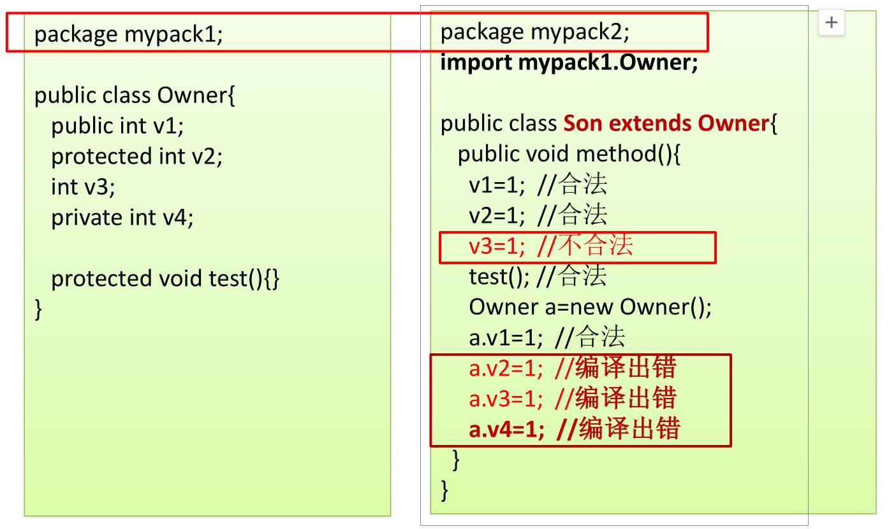
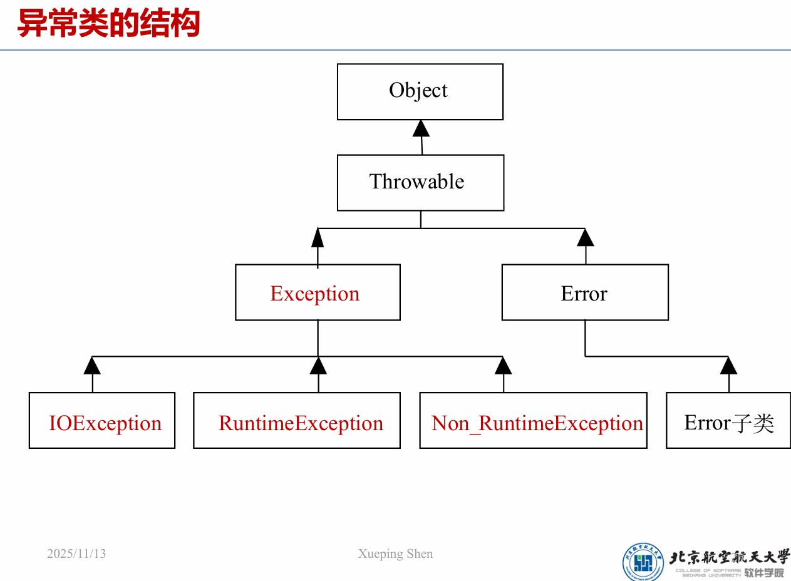
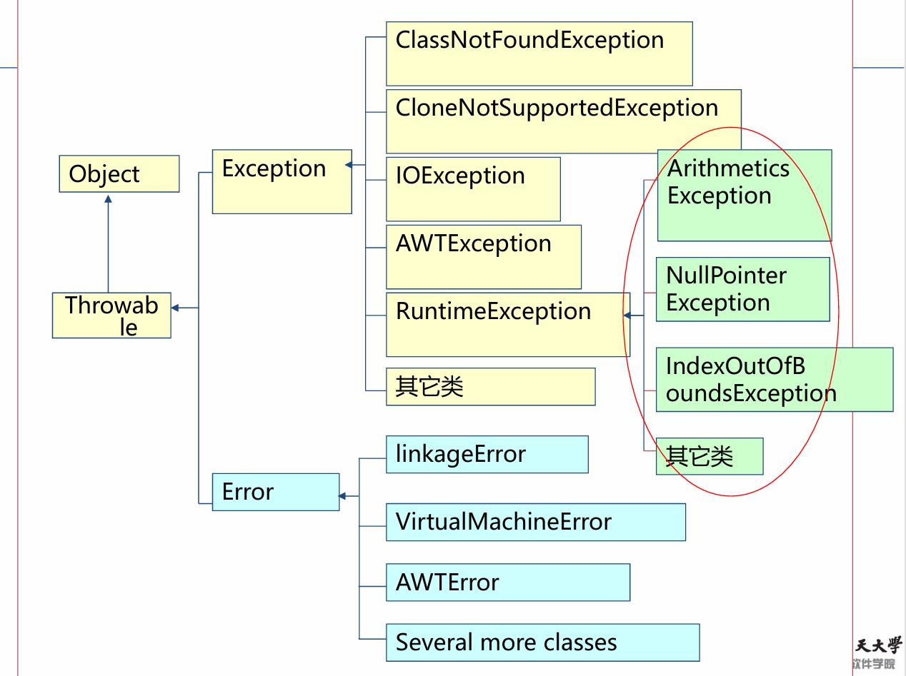

# 面向对象
## 1.概念 
面向过程——步骤化
面向过程就是分析出实现需求所需要的步骤，通过函数一步一步实现这些步骤，接着依次调用即可

面向对象——行为化
面向对象是把整个需求按照特点、功能划分，将这些存在共性的部分封装成对象，创建了对象不是为了完成某一个步骤，而是描述某个事物在解决问题的步骤中的行为

优缺点：
面向过程
优点：性能上它是优于面向对象的，因为类在调用的时候需要实例化，开销过大。
缺点：不易维护、复用、扩展
用途：单片机、嵌入式开发、Linux/Unix等对性能要求较高的地方

面向对象
优点：易维护、易复用、易扩展，由于面向对象有封装、继承、多态性的特性，可以设计出低耦合的系统，使系统更加灵活、更加易于维护 
缺点：性能比面向过程低

低耦合，简单的理解就是说，模块与模块之间尽可能的独立，两者之间的关系尽可能简单，尽量使其独立的完成成一些子功能，这避免了牵一发而动全身的问题。这一部分我们会在面向对象学习结束后进行系统的整理和总结。
$$核心:封装、继承、多态$$

## 2.类之间的关系

### 2.1 类关系类型总结表

| 关系类型 | 定义 | 特点 | 代码示例 | UML表示 |
|---------|------|------|----------|---------|
| **关联 (Association)** | 类A与类B的实例之间存在特定的对应关系 | • 两个类之间有业务联系<br>• 可以是单向或双向<br>• 关系强度可变化 | ```java<br>public class Student {<br>    private Teacher teacher;<br>}<br>``` | 实线箭头 |
| **依赖 (Dependency)** | 类A访问类B提供的服务 | • 临时性关系<br>• 类A使用类B的方法<br>• 关系较弱，变化频繁 | ```java<br>public class Order {<br>    public void calculate(Calculator calc) {<br>        calc.compute();<br>    }<br>}<br>``` | 虚线箭头 |
| **聚集 (Aggregation)** | 类A为整体类，类B为局部类，类A的对象由类B的对象组合而成 | • "has-a"关系<br>• 整体与部分可独立存在<br>• 生命周期不同 | ```java<br>public class Car {<br>    private Engine engine;<br>    private Wheel[] wheels;<br>}<br>``` | 空心菱形 |
| **组合 (Composition)** | 强聚集关系，部分不能独立于整体存在 | • 强"has-a"关系<br>• 部分生命周期依赖整体<br>• 整体消失，部分也消失 | ```java<br>public class House {<br>    private Room[] rooms;<br>}<br>``` | 实心菱形 |
| **泛化 (Generalization)** | 类A继承类B | • "is-a"关系<br>• 子类继承父类特性<br>• 支持多态 | ```java<br>public class Dog extends Animal {<br>    // Dog is-a Animal<br>}<br>``` | 空心三角箭头 |
| **实现 (Implementation)** | 类A实现了B接口 | • 类实现接口规范<br>• 必须实现所有抽象方法<br>• 支持多态 | ```java<br>public class Bird implements Flyable {<br>    public void fly() { ... }<br>}<br>``` | 虚线空心三角箭头 |

### 2.2 关系强度对比

| 关系类型 | 强度 | 生命周期依赖 | 典型场景 |
|---------|------|-------------|----------|
| 组合 | 最强 | 强依赖 | 汽车-引擎，房子-房间 |
| 聚集 | 强 | 弱依赖 | 学校-学生，公司-员工 |
| 关联 | 中等 | 无依赖 | 学生-课程，用户-订单 |
| 依赖 | 弱 | 临时性 | 方法参数，局部变量 |
| 泛化 | 强 | 继承关系 | 动物-狗，交通工具-汽车 |
| 实现 | 强 | 契约关系 | 接口-实现类 |

### 2.3 记忆口诀

- **关联**：有联系，能对应
- **依赖**：临时用，用完走  
- **聚集**：有整体，有部分
- **组合**：强聚集，同生死
- **泛化**：父子情，is-a
- **实现**：守契约，implements


## 3.类与对象
类(设计图)：对象共同特征的描述
对象：真实存在的具体东西
**先设计类，再设计对象**
### 3.1类的定义
```java
//定义类
[类修饰符] class 类名 [extends 基类]
"""
    public：都能使用 
    无:只能在一个包里使用
    final:类不可被继承（防止扩展）。常用于工具类或不可变类
    abstract:抽象类，不能直接实例化；可包含抽象方法（无方法体）。用于定义父类/模板
"""
implements 接口列表
{
    1.成员变量(代表属性，一般是名词)
    """
        一般都用private
    """
    2.成员方法(代表行为，一般是动词)
    """
        一般都用public
    """
    3.构造器
    4.代码块
    5.内部类
}
//下面举一个例子
public class Phone
{
    //属性
    String brand;
    double price;
    //行为
    public void call()
    {
        
    }
    public void  playGame()
    {

    }
}
```
#### 重载 
方法的重载指一个类里定义名字相同，参数不同的多个方法
重载需要满足的条件：
1. 方法名相同
2. 方法的参数类型、个数、顺序至少一项不同

### 3.2类的创建，删除
**注意：如果没有写构造方法，虚拟机会自动加空参构造**
**所以建议空参、有参构造都写**
#### 不带参数的构造
```java
类名 对象名 = new 类名();
Phone P = new Phone();
P.name="苹果";
P.call();
```
#### 带参数的构造
```java
public class Phone
{
    String brand;
    double price;
    public Phone(String brand,double price)
    {
        this.brand=brand;
        this.price=price;
    }
}
public class PhoneTest 
{
    public static void main(String[] args) 
    {
        Phone p1=new Phone("Apple",7880);
    }
}
```
## 4.静态属性与静态方法
### 4.1静态属性
静态属性是整个类的属性，不局限于某一个对象。
一个类的静态属性都相同
```java
public static number;
```

### 4.2静态方法
静态方法：
1. 在类定义的时候已经被装载和分配(早加载)
2. 只能直接调用静态成员或者方法，不能直接调用非静态方法或者非静态成员

非静态方法：
1. 只有在类被实例化成对象时，对象调用该方法才被分配内存（晚加载）
2. 既可以调用静态成员或者方法又可以调用其他的非静态成员或者方法

### 4.3总结
#### 类加载时机
在类的实例第一次被构造、或类的静态属性和静态方法第一次被访问时，JVM 会执行类加载
#### 详细执行顺序说明
##### 在类加载时执行
1. 初始化有显式初始化的静态成员变量(只在第一次new时执行)
   
2. 静态代码块（只在第一次new时执行）
在类加载时执行
只执行一次，无论创建多少个对象
在第一次访问类时执行

3. 初始化有显式初始化的非静态成员变量

4. 非静态代码块（每次创建对象都执行）
在每次创建对象时执行
在构造方法之前执行
每次创建新对象都会执行

5. 构造方法
在非静态代码块之后执行
每次创建对象都执行

##### 在调用时才执行
1. 普通方法()
在对象创建完成后调用
可以多次调用

#### 关键观察点
1. 静态代码块只执行一次：第二次创建对象时没有输出"静态代码块！"
2. 非静态代码块每次都执行：每次创建对象都会执行非静态代码块
3. 执行顺序固定：
初始化静态成员变量 → 静态代码块 → 初始化非静态成员变量 → 非静态代码块 → 构造方法 → 普通方法
```java
//这是一个很好的例子
public class PuTong {
    // 构造方法
    public PuTong() {
        System.out.print("默认构造方法！-->");
    }

    // 非静态代码块
    {
        System.out.print("非静态代码块！-->");
    }

    // 静态代码块
    static {
        System.out.print("静态代码块！-->");
    }

    // 静态成员方法
    public static void test() {
        System.out.println("普通方法中的代码块！");
    }

    // 主方法
    public static void main(String[] args) {
        PuTong c1 = new PuTong();
        c1.test(); // 或 PuTong.test();

        PuTong c2 = new PuTong();
        c2.test(); // 或 PuTong.test();
    }
}
输出：
静态代码块！-->非静态代码块！-->默认构造方法！-->普通方法中的代码块！
非静态代码块！-->默认构造方法！-->普通方法中的代码块！
```

## 5.就近原则和this
```java
public class People
{
    int age;//成员变量
    public void setage(age)///局部变量
    {
        this.age=age;
        """
        this.age访问类中的成员变量
        age就近原则访问局部变量
        """
    }
}
```

## 6.封装
### 6.1封装的含义
1. 把对象的属性和行为看成为一个密不可分的整体
2. 信息隐藏。把不需要让外界知道的信息隐藏起来，有些对象的属性及行为允许外界用户知道或使用，但不允许更改，而另一些属性和行为则不允许外界知晓或只允许使用对象的功能，而尽可能隐藏对象的功能实现细节。

### 6.2用private、set、get实现封装
权限修饰符
可以修饰成员(成员变量和成员方法)
被private修饰的成员只能在本类中访问
```java
//1.private实现私有化成员保护
public class GirlFriend{
    private int age;
}
public class GirlFriendTest {
    public static void main(String[] args) {
        GirlFriend gf1=new GirlFriend();
        gf1.age=18;//报错
    }
}
```

```java
//2.用get、set实现成员安全访问
public class GirlFriend {
    private String name;
    private int age;
    private String gender;
    //对于私有化成员变量，提供公共的get和set方法
    //set方法：给成员变量赋值
    public void setName(String n){
        name=n;
    }
    public void setAge(int a){
        if(a>=18&&a<=50){
            age=a;
        }else{
            System.out.println("年龄不合法");
        }
    }
    public void setGender(String g){
        gender=g;
    }
    //get方法：获取成员变量的值
    public String getName(){
        return name;
    }
    public int getAge(){
        return age;
    }
    public String getGender(){
        return gender;
    }
}

public class GirlFriendTest {
    public static void main(String[] args) {
        GirlFriend gf1=new GirlFriend();
        gf1.setName("芙宁娜");
        gf1.setAge(18);
        gf1.setGender("女");
        System.out.println(gf1.getName());
        System.out.println(gf1.getAge());
        System.out.println(gf1.getGender());
    }
}
```

### 6.3(属性、方法)访问控制修饰符
| 修饰符    | 同一个类 | 同一个包 | 子类 | 整体 |
|-----------|----------|----------|------|------|
| `private` | ✔        | ✖        | ✖    | ✖    |
| `default` | ✔        | ✔        | ✖    | ✖    |
| `protected`| ✔       | ✔        | ✔    | ✖    |
| `public`  | ✔        | ✔        | ✔    | ✔    |

易错点：protected成员变量或方法被子类访问时，只能通过继承访问，不能通过创建对象访问


### 6.4类的访问控制修饰符
–public级别的类可以被所有其他类访问
–默认级别的类只能被同一个包中的类访问
补充点：class修饰符只有public、和default，构造方法修饰符有4种，**只有class修饰符和构造方法修饰符都可见时，才能创建对象**

### 6.5单例模式
– 一个类在内存中只有一个实例（对象）存在，该类一般没有属性。
– 无法继承，所以无法扩展，无法更改它的实现。
```java
//“饿汉式”单实例模式
public class Singleton
{
    //静态的,保留自身的引用,类加载时就初始化
    private static Singleton test  = new Singleton();
    //必须是私有的构造函数
    private Singleton(){}
    //公共的静态的方法。
    public static Singleton getInstance() {
        return test;
    }
}
```
• 是否 Lazy 初始化：否
• 是否多线程安全：是
• 优点：没有加锁，执行效率会提高。
• 缺点：类加载时就初始化，容易产生垃圾对象，浪费内存。
• 特点：它基于 classloder 机制避免了多线程的同步问题，不过，instance 在类装载时就实例化。
```java
//“懒汉式”单实例模式
public class Singleton
{
    //静态的。保留自身的引用。
    private static Singleton test  =  null;
    //必须是私有的构造函数
    private Singleton(){}
    //公共的静态的方法。
    public static Singleton getInstance() {
        if(test == null)
        {
            test = new Singleton();
        }
        return test;
    }
}
```
• 是否 Lazy 初始化：是
• 是否多线程安全：否
• 描述：这种方式是最基本的实现方式，这种实现最大的问题就是不支持多线程。因
为没有加锁 synchronized，所以严格意义上它并不算单例模式。
• 特点这种方式 lazy loading 很明显，不要求线程安全，在多线程不能正常工作。

| 特性           | 饿汉式（Eager）        | 懒汉式（Lazy）         |
| ------------ | ----------------- | ----------------- |
| **什么时候创建对象** | 类加载时立即创建          | 第一次使用时才创建         |
| **线程安全**     | 天生安全（JVM保证类加载唯一性） | 默认线程不安全，需要加锁或其他机制 |
| **空间消耗**     | 类加载就创建，可能浪费资源     | 延迟创建，节省资源         |
| **时间消耗**    | 效率高                |  需要加锁，效率低     |
| **实现复杂度**     | 简单            | 较复杂，需要加锁       |


## 7.一个完整的javabean
### 简单代码
```java
public class User 
{
    //属性
    private String username;
    private String password;
    
    //空参构造
    public User(){}
    //带参构造
    public User(String username,String password)
    {
        this.username=username;
        this.password=password;
    }
    
    //get和set方法
    //快捷键：鼠标右键，源代码操作
    public String getUsername() {
        return username;
    }
    public void setUsername(String username) {
        this.username = username;
    }
    public String getPassword() {
        return password;
    }
    public void setPassword(String password) {
        this.password = password;
    }  
}

```
### equals和==
| 对比点    | `==`      | `equals()` |
| ------ | --------- | ---------- |
| 基本类型   | 比值        | 不适用        |
| 引用类型   | 比地址       | 默认比地址，可重写  |
| String | 看是否同一对象   | 比内容        |
| 总结   | 看“是不是同一个” | 看“内容是否相同”  |

String、Integer、Date会重写equals


## 8.继承
### 8.1基础知识
核心概念：
1. 子类可以访问父类的public和protected成员变量和方法，如果同包还可以访问default。但注意final变量和方法不能修改
2. 子类可以重新写父类的变量和方法，但变量和方法隐藏是静多态(看编译类型)，方法覆盖是动多态(看运行类型)
3. 变量和方法重名时，this/super 可以清楚地指定调用目标
4. 子类必须调用一个父类的构造器，如果父类有多个构造器，只需要调用一个。如果子类没有显示调用父类构造器，会自动调用父类无参构造器，若父类无无参构造器，就会报错
```java
[修饰符] class 类名 extends 父类名
{

}
```
访问权限：
| 修饰符    | 同一个类 | 同一个包 | 子类 | 整体 |
|-----------|----------|----------|------|------|
| `private` | ✔        | ✖        | ✖    | ✖    |
| `default` | ✔        | ✔        | ✖    | ✖    |
| `protected`| ✔       | ✔        | ✔    | ✖    |
| `public`  | ✔        | ✔        | ✔    | ✔    |

**易错点**：protected成员在跨包情况下，只有通过继承关系才能访问，不能通过父类对象实例访问！


### 8.2 super和this关键字
this用于：
1. 引用自身对象的成员变量
 this.age;
2. 引用自身对象的成员方法
 this.diaplay();
3. 调用自身的构造方法
 this(“Jack”,Male,10);

super用于：
1. 引用父类对象的成员变量
 super.age;
2. 引用父类对象的成员方法
 super.diaplay();
3. 调用父类的构造方法
 super(“Jack”,Male,10);

 | 区别点             | this                            | super                                   |
|------------------|-------------------------------|------------------------------------------|
| 引用（代表什么）     | 代表当前对象本身                   | 代表当前对象的父类成分（父类对象的引用）        |
| 使用方式           | `this.成员`；`this.方法()`；`this()` | `super.成员`；`super.方法()`；`super()`  |
| 调用构造方法         | 调用本类其他构造方法，必须在首行      | 调用父类构造方法，必须在首行                   |
| 查找范围（查找顺序） | 先在当前类查找，再向父类查找          | 直接在父类中查找，不查当前类                   |

### 8.3子类构造方法
构造函数不能被继承；
• 无参子类构造函数的编写
– 子类可以通过super()显示调用父类无参的构造函数，也可以隐式调用

• 有参子类构造函数的编写
– 初始化父类的成员变量；
– 初始化子类的成员变量
– 必须显示调用父类有参构造函数

• 无论使用this调用本类构造函数，还是使用super调用父类构造函数，都必须是该方法体中的第一条可以执行语句，否则会产生语法错误

1. 子类构造器总是先调用父类构造器
2. super() 必须在子类构造器第一行
3. 父类无参构造器自动调用，父类无无参构造器必须显式调用
4. 子类构造器可以用 this(...) 调用本类其他构造器

### 8.4向上转型
1. 概念：将子类转换成父类
2. 缺憾：只能调用父类中定义的属性和方法，会丢失子类中的方法和属性
3. 变量隐藏：子类的成员变量和父类的成员变量同名
4. 方法覆盖：子类的方法跟父类的方法具有完全一样的名称、参数以及**协变**(更窄的)返回类型
注意点：
   1. 子类方法**不能缩小**父类方法的访问权限
   2. 子类重写父类方法时，返回类型可以更“具体”（更窄），也就是父类返回某个类型 R，子类可以返回 R 的子类型 R1。但基本类型（如 int, long）不能协变，只能完全一样！
   3. 私有方法、静态方法不能被覆盖如果在子类出现了同签名的方法，就是方法隐藏
   4. 父类中，被final修饰的方法是最终方法，不允许覆盖
```java
class A {
    void foo() { System.out.println("A"); }
}
class B extends A {
    @Override
    void foo() { System.out.println("B"); }
}
A a = new B();
a.foo();      // 输出 B，运行期动态绑定到 B 的对象
```
1. 方法隐藏：
   1. 私有方法、静态方法不能被覆盖，符合方法覆盖条件时被隐藏
   2. 父类中，被final修饰的方法是最终方法，不允许覆盖
```java
class A {
    static void foo() { System.out.println("A"); }
}
class B extends A {
    static void foo() { System.out.println("B"); }  // 隐藏，不是 override
}
A a = new B();
a.foo();      // 输出 A，因为 a 的编译期类型是 A
```
### 8.5 final关键字
final 类不可被继承，可继承别人
final 方法不可被重写
final 变量=常量（只能赋值一次）
final 引用“地址不可改，内容可变”

## 9.多态
### 9.1基础知识
1. 多态定义：同一个引用类型，使用不同的实例，执行不同操作
2. 出现多态的原因：
   编译时的类型由声明该变量时使用的类型决定
   运行时的类型由实际赋给该变量的对象决定
   如果编译时的类型与运行时的类型不一致就会出现所谓的多态

### 9.2静多态和动多态
静多态：在编译时决定调用哪个方法
条件：方法重载，方法隐藏(和继承无关)

动多态：在运行时才能确定调用哪个方法
条件：
1. 必须要有继承的情况存在
2. 在继承中必须要有方法覆盖
3. 必须由父类的引用指向派生类的实例，并且通过父类的引用调用被覆盖的方法
```java
//动多态例子
class Printer()
{
    print(String str){}
}
class ColorPrinter extends Printer 
{
    print(String str) 
    {
        System.out.println("输出彩色的"+str);
    }
}
class BlackPrinter extends Printer 
{
    print(String str) 
    {
        System.out.println("输出黑白的"+str);
    }
}
public static void main(String[] args) 
{
    Printer p= new ColorPrinter();
    p.print();  //彩色的
    p = new BlackPrinter();
    p.print();  //黑白的
}
```
### 9.3抽象类和抽象方法
如果父类的方法没机会被访问调用，或者没有办法给出明确的定义，可以使用抽象方法
使用条件：
1. 抽象方法没有方法体
2. 抽象方法必须在抽象类里
3. 抽象方法必须在子类中被实现，除非子类是抽象类

```java
abstract class Figure
{
    protected double x;
    Figure(){}
    Figure(double x1)
    {
        x=x1;
    }
    abstract public double area();
}

class Rectangle extends Figure
{
    protected double y;
    public Rectangle(){};
    public Rectangle(double a,double b)
    {
        super(a);
        y=b;
    }
    public double area()
    {
        return x*y;
    }
}
```

## 10.接口
### 10.1要点
从本质上讲，接口是一种特殊的抽象类，这种抽象类中只包含常量和方法的定义，而没有方法的实现。接口是抽象方法和常量值的定义的集合。
接口是用来实现类间（不相关类）多重继承功能的结构
1. 接口中所有的方法都默认是public abstract的，并且只有方法头和参数列表，没有方法体；
2. 接口中所有的变量都默认是public static final的；
```java
//定义接口
[public][interfcae]接口名称[extends父接口名列表]
{
//静态常量
[public][static][final]数据类型 变量名=常量名；
//抽象方法
[public][abstract][native]返回值类型 方法名（参数列表）；
}
//实现接口
[修饰符]class类名[extends父类名][implements接口A,接口B,…]
{
类的成员变量和成员方法；
为接口A中的所有方法编写方法体，实现接口A;
为接口A中的所有方法编写方法体，实现接口B;
…
}
//例子
[修饰符] class A implements IA {…}
[修饰符] class B extends A implements IB, IC
{…}
```
```java
/** 表示所有能拍照的工具类型 */
public interface Photographable{
/** 拍照 */
public void takePhoto();
}

public class Camera implements Photographable {
public void takePhoto(){…};  //实现拍照功能
}
public class CellPhone implements Photographable {
public void takePhoto(){…};  //实现拍照功能
}
```
### 10.2抽象类VS接口

| 对比项 | 接口（interface） | 抽象类（abstract class） | 备注 |
| --- | --- | --- | --- |
| 访问级别 | 成员变量和方法只能是 public | 成员变量和方法可为任意访问级别 | — |
| 成员变量 | 只能是 public static final 常量 | 可定义实例变量与静态变量 | — |
| 构造方法 | 没有构造方法 | 可以有构造方法 | — |
| 数量 | 一个类可以实现多个接口 | 一个类只能继承一个抽象类 | — |
| 方法形态 | 所有方法都是抽象方法 | 可以有，也可以没有抽象方法；实现细节更多 | — |
| 语义定位 | 表示更高层次的抽象，声明对外提供的服务 | 某一类事物的抽象 | — |
| 示例理解 | `run` 可由“狗”实现，也可由“汽车”实现 | “生物”虽抽象，但具“狗”的雏形 | — |


### 10.3接口回调
接口变量=实现该接口的类所创建的对象；
接口变量.接口方法([参数列表])；
```java
Runner r=new Person();
r.run();
```
```java
interface Runner {
//接口１
    public void run();
}
interface Swimmer {
//接口２
    public void swim();
}
abstract class Animal  {
//抽象类,去掉关键字abstract是否可行?
    public abstract void eat();
}
class Person extends Animal implements Runner,Swimmer {  //继承类，实现接口
    public void run() {
        System.out.println("我是飞毛腿,跑步速度极快!");
    }
    public void swim(){
        System.out.println("我游泳技术很好,会蛙泳、自由泳、仰泳、蝶泳...");
    }
    public void eat(){
        System.out.println("我牙好胃好,吃啥都香!");
    }
}

public class InterfaceTest
{
    public void m1(Runner r) { r.run(); } //接口作参数
    public void m2(Swimmer s) {s.swim();} //接口作参数
    public void m3(Animal a) {a.eat();} //抽象类引用

    public static void main(String args[])
    {
    InterfaceTest t = new InterfaceTest();
    Person p = new Person();
    t.m1(p); //接口回调
    t.m2(p); //接口回调
    t.m3(p);//接口回调
    }
}
```
### 10.4向下转型
向下转型(映射)：一个已经向上转型的子类对象可以使用强制类型转换的格式，将父类引用转为子类引用，这个过程是向下转型。
```java
子类类型 变量名 = (子类类型) 父类类型的变量;
– 如：Person p = new Student();
Student stu = (Student) p
• 如果是直接创建父类对象，是无法向下转型
的！，会产生运行时异常
• 如：Person p = new Peron();
Student stu = (Student) p
```
#### 向下转型的保护(instanceof)
当我们已经知道a静态时是Dog的父类并要将其向下转型时，我们要通过instanceof查询动态时a是不是Dog及其子类，如果是，就可以向下转型
```java
Fish fish=new Fish();
System.out.println(fish instanceof XXX);
XXX为以下时为true
— Fish类。
– Fish类的直接或间接父类
– Fish类实现的接口
```
```java
if (a instanceof Dog)
{
    Dog d = (Dog) a;  // 安全
}
 else 
 {
    System.out.println("不能转型为 Dog");
}
```


### 10.5匿名内部类
传统类实现接口
```java
interface Inter {
    void show();
}
class Outer {
    static class InnerImpl implements Inter {
        public void show() {
            System.out.println("DuluDulu");
        }
    }
    
    public static Inter method() {
        return new InnerImpl();
    }
}
```
匿名内部类实现接口
```java
interface Inter {
    void show();
}
class Outer {
    public static Inter method() {
        return new Inter() {
            public void show() {
                System.out.println("DuluDulu");
            }
        };
    }
}
```

## 11.编程原则
### 11.1 里氏代换原则（Liskov Substitution Principle, LSP）

**定义**：子类对象可以替换父类对象，而不会影响程序的正确性。任何使用父类对象的地方，都应该能够使用子类对象。

**核心要求**：
1. 子类必须能够完全替代父类
2. 子类可以扩展父类的功能，但不能改变父类的原有功能
3. 子类重写父类方法时，参数不能更严格，返回值不能更宽泛
4. 子类不能抛出父类没有声明的异常
5. 子类不能削弱父类方法的契约

**记忆要点**：子可替父，不改变契约，扩展不修改

### 11.2 开闭原则（Open-Closed Principle, OCP）

**定义**：对扩展开放，对修改关闭。软件实体（类、模块、函数等）应该对扩展开放，对修改关闭。

**核心要求**：
1. 当需要添加新功能时，应该通过扩展来实现，而不是修改现有代码
2. 通过抽象（接口或抽象类）来定义稳定的部分
3. 通过实现类来扩展新功能
4. 避免直接修改已经测试通过的代码

**记忆要点**：扩展开放，修改关闭，抽象稳定，实现扩展

### 11.3 合成复用原则（Composite Reuse Principle, CRP）

**定义**：尽量使用对象组合/聚合，而不是继承来达到复用的目的。

**核心要求**：
1. 优先使用组合（has-a）关系，而不是继承（is-a）关系
2. 通过组合已有对象来实现新功能，而不是通过继承父类
3. 组合关系更灵活，耦合度更低
4. 继承关系应该只在真正需要"is-a"关系时使用

**记忆要点**：优先组合，少用继承，降低耦合，提高灵活

#### 继承的使用方式
```java
// 使用继承（is-a关系）
class Animal {
    public void eat() {
        System.out.println("吃东西");
    }
}

class Dog extends Animal {
    // Dog is-a Animal
    public void bark() {
        System.out.println("汪汪叫");
    }
}

// 使用
Dog dog = new Dog();
dog.eat();   // 继承自Animal
dog.bark();  // 自己的方法
```

#### 组合的使用方式
```java
// 使用组合（has-a关系）
class Engine {
    public void start() {
        System.out.println("引擎启动");
    }
}

class Car {
    // Car has-a Engine（组合关系）
    private Engine engine;
    
    public Car() {
        this.engine = new Engine();
    }
    
    public void start() {
        engine.start();  // 调用组合对象的方法
        System.out.println("汽车启动");
    }
}

// 使用
Car car = new Car();
car.start();  // 通过组合的Engine对象实现功能
```

#### 组合的优势示例
```java
// 需要复用多个类的功能时，组合更灵活
class A {
    public void methodA() { }
}

class B {
    public void methodB() { }
}

// 使用组合：可以同时使用A和B的功能
class C {
    private A a;
    private B b;
    
    public C() {
        this.a = new A();
        this.b = new B();
    }
    
    public void doSomething() {
        a.methodA();
        b.methodB();
    }
}

// 如果使用继承，Java只能单继承，无法同时继承A和B
// class C extends A { }  // 只能继承一个
```

### 11.4 依赖倒转原则（Dependency Inversion Principle, DIP）

**定义**：高层模块不应该依赖低层模块，两者都应该依赖抽象。抽象不应该依赖细节，细节应该依赖抽象。

**核心要求**：
1. 面向接口编程，而不是面向实现编程
2. 高层模块通过抽象接口调用低层模块，而不是直接依赖具体实现
3. 抽象接口由高层模块定义，低层模块实现这些接口
4. 降低模块间的耦合度，提高系统的可维护性和可扩展性

**记忆要点**：面向接口，不依赖实现，抽象稳定，细节可变

#### 代码示例
```java
// 错误做法：高层模块直接依赖低层模块
class MySQLDatabase {
    public void save() {
        System.out.println("保存到MySQL");
    }
}

class UserService {
    private MySQLDatabase db;  // 直接依赖具体实现
    public void saveUser() {
        db.save();
    }
}

// 正确做法：依赖抽象接口
interface Database {
    void save();
}

class MySQLDatabase implements Database {
    public void save() {
        System.out.println("保存到MySQL");
    }
}

class OracleDatabase implements Database {
    public void save() {
        System.out.println("保存到Oracle");
    }
}

class UserService {
    private Database db;  // 依赖抽象接口
    public UserService(Database db) {
        this.db = db;
    }
    public void saveUser() {
        db.save();  // 通过接口调用
    }
}
```

### 11.5 高内聚低耦合

**定义**：
- **高内聚**：一个模块内部各个元素之间关联紧密，功能相关性强
- **低耦合**：模块与模块之间依赖关系弱，相互影响小

**核心要求**：
1. **高内聚**：类的方法和属性应该围绕同一个职责，功能相关
2. **低耦合**：类与类之间应该通过接口或抽象类交互，减少直接依赖
3. 一个类只做一件事，职责单一
4. 模块之间通过定义良好的接口通信，而不是直接访问内部实现

**记忆要点**：内聚要紧密，耦合要松散，职责单一，接口通信

#### 高内聚示例
```java
// 高内聚：所有方法都围绕"用户"这个职责
class User {
    private String name;
    private int age;
    
    public void setName(String name) { }
    public void setAge(int age) { }
    public String getName() { }
    public int getAge() { }
    public void displayInfo() { }
}

// 低内聚：方法职责混乱
class BadClass {
    public void saveUser() { }      // 用户相关
    public void sendEmail() { }     // 邮件相关
    public void calculateTax() { }  // 税务相关
}
```

#### 低耦合示例
```java
// 低耦合：通过接口交互
interface Payment {
    void pay();
}

class Alipay implements Payment {
    public void pay() { }
}

class WeChatPay implements Payment {
    public void pay() { }
}

class OrderService {
    private Payment payment;  // 依赖接口，耦合度低
    public void processOrder() {
        payment.pay();
    }
}

// 高耦合：直接依赖具体类
class OrderService {
    private Alipay alipay;  // 直接依赖具体类，耦合度高
    public void processOrder() {
        alipay.pay();
    }
}
```
### 11.6 接口隔离原则（Interface Segregation Principle, ISP）

**定义**：客户端不应该依赖它不需要的接口。一个类对另一个类的依赖应该建立在最小的接口上。

**核心要求**：
1. 接口应该尽量细化，不要定义过于庞大的接口
2. 一个接口只应该包含客户端需要的方法
3. 不应该强迫客户端实现它们不使用的方法
4. 将大接口拆分成多个小接口，每个接口职责单一

**记忆要点**：接口要细化，职责要单一，不强迫实现，按需依赖

#### 代码示例
```java
// 错误做法：接口过于庞大，包含不相关的方法
interface Worker {
    void work();
    void eat();
    void sleep();
}

class Programmer implements Worker {
    public void work() { }
    public void eat() { }
    public void sleep() { }  // 程序员不需要实现sleep方法
}

class Robot implements Worker {
    public void work() { }
    public void eat() { }    // 机器人不需要eat方法
    public void sleep() { }  // 机器人不需要sleep方法
}

// 正确做法：将大接口拆分成多个小接口
interface Workable {
    void work();
}

interface Eatable {
    void eat();
}

interface Sleepable {
    void sleep();
}

class Programmer implements Workable, Eatable {
    public void work() { }
    public void eat() { }
    // 不需要实现sleep方法
}

class Robot implements Workable {
    public void work() { }
    // 只需要实现work方法
}
```

### 11.7 迪米特法则（Law of Demeter, LoD）/ 最少知道法则

**定义**：一个对象应该对其他对象有最少的了解。一个类应该只与直接的朋友通信，不要和陌生人说话。

**核心要求**：
1. 只与直接的朋友通信（朋友包括：当前对象本身、当前对象的成员对象、当前对象创建的对象、当前对象的方法参数）
2. 不要通过其他对象间接访问另一个对象
3. 减少类与类之间的依赖关系，降低耦合度
4. 一个类应该尽可能少地知道其他类的内部实现细节

**记忆要点**：只和直接朋友说话，不通过中间人，减少依赖，降低耦合

#### 代码示例
```java
// 错误做法：通过其他对象间接访问，违反迪米特法则
class Company {
    private Employee employee;
    
    public Employee getEmployee() {
        return employee;
    }
}

class Employee {
    private Address address;
    
    public Address getAddress() {
        return address;
    }
}

class Address {
    private String city;
    
    public String getCity() {
        return city;
    }
}

// 违反迪米特法则：通过employee间接访问address
class Manager {
    public void printCity(Company company) {
        // 通过company -> employee -> address 间接访问
        String city = company.getEmployee().getAddress().getCity();
        System.out.println(city);
    }
}

// 正确做法：只与直接朋友通信
class Company {
    private Employee employee;
    
    public String getEmployeeCity() {
        // 在Company内部处理，对外只暴露需要的方法
        return employee.getAddress().getCity();
    }
}

class Manager {
    public void printCity(Company company) {
        // 只与Company直接通信
        String city = company.getEmployeeCity();
        System.out.println(city);
    }
}
```

## 12.异常处理
Java 的异常处理机制是：当程序发生异常时，会创建一个异常类的实例对象，并通过 throw 或 JVM 自动抛出；运行时沿调用栈向上查找匹配的 catch 语句进行捕获并处理，如果没有被捕获，程序将终止。
| 错误类型 | 说明 |
|---------|------|
| **编译错误(Compilation error)** | 在编译阶段发现的错误，程序无法通过编译 |
| **逻辑错误(logic error)** | 程序可以编译和运行，但结果不符合预期 |
| **运行时错误(runtime error)** | 在程序运行过程中如果发生了一个不可能执行的操作,就会出现运行时错误 |

**这里只讨论运行时异常**
### 12.1java异常类层次结构



#### 异常分类（按编译时是否受检来分）

| 异常类型 | 包含范围 | 检测时机 | 编译器检查 | 处理方式 | 说明 |
|---------|---------|---------|-----------|---------|------|
| **非受检异常<br>(Unchecked Exception)** | • RuntimeException及其子类<br>• Error及其子类 | 只能在程序执行时被检测到 | 编译器对非受检异常类不进行检查 | 程序对这类异常可不做处理，交由系统处理 | 这些异常不能在编译时被检测到 |
| **受检异常<br>(Checked Exception)** | 除了非受检异常之外的异常<br>（即除了RuntimeException及其子类、Error及其子类以外的其他Exception的子类） | 在编译时就能被Java编译器检测到 | 编译器会检查 | 必须采用声明异常或者try、catch方式处理异常 | 这些异常类是编译时可检测的异常 |

#### 受检异常与非受检异常对比

| 对比项 | 受检异常 (Checked Exception) | 非受检异常 (Unchecked Exception) |
|--------|------------------------------|----------------------------------|
| **检测时机** | 编译时就能被检测到 | 只能在程序执行时被检测到 |
| **编译器检查** | 编译器会检查，必须处理 | 编译器不进行检查 |
| **包含范围** | 除了RuntimeException及其子类以外的其他Exception的子类 | RuntimeException及其子类、Error及其子类 |
| **处理要求** | 必须采用声明异常或者try、catch方式处理 | 程序可不做处理，交由系统处理 |
| **典型示例** | IOException、SQLException、ClassNotFoundException | NullPointerException、ArrayIndexOutOfBoundsException、OutOfMemoryError |

### 12.2 try catch finally 处理异常
```java
try 
{ 
 //接受监视的程序块,在此区域内发生的异常,由catch中指定的程序处理;
} 
catch (ExceptionType1 e) 
{
 // 抛出ExceptionType1异常时要执行的代码
}
catch (ExceptionType2 e) 
{
 // 抛出ExceptionType2异常时要执行的代码
}……
finally 
{
 // //无条件执行的语句
}
```
执行顺序：
1. **try块按顺序执行**
   - 如果没有异常：执行完try块后，执行finally块，然后继续执行后续代码
   - 如果遇到异常：立即跳转到匹配的catch块，try块中异常之后的代码不会执行

2. **catch块执行**
   - 执行匹配的catch块中的异常处理代码
   - 如果有多个catch块，按顺序匹配，只执行第一个匹配的catch块

3. **finally块执行**
   - 无论是否有异常，finally块都会执行
   - **重要**：即使try块或catch块中有return语句，finally块也会在return之前执行
   - finally块执行完后，才会真正执行return语句

4. **继续执行**
   - finally块执行完后，不会回到try块继续执行
   - 继续执行try-catch-finally语句块之后的代码

**为什么finally在return之前执行？**
- Java的设计原则：finally块用于确保资源清理、关闭连接等操作必须执行
- 执行机制：当遇到return语句时，Java会先计算return的值并暂存，然后执行finally块，最后才真正返回
- 这样可以保证无论方法如何退出（正常return、异常、break等），finally中的清理代码都能执行

**示例说明：**
```java
public int test() {
    try {
        System.out.println("try块执行");
        return 1;  // 先计算返回值1，但暂不返回
    } catch (Exception e) {
        return 2;
    } finally {
        System.out.println("finally块执行");  // 先执行finally
    }
    // 执行完finally后，才真正返回1
}

// 输出：
// try块执行
// finally块执行
// 返回值：1
```

### 12.3 throws 声明异常
声明异常：一个方法不处理它产生的异常,而是沿着调用层次向上传递,由调用它的方法来处理这些异常,叫声明异常。
```java
<访问权限修饰符><返回值类型><方法名>(参数列表)throws异常列表
{}
```
```java
public int  compute(int x) throws ArithmeticException
{  
    return z=100/x;
}
 public method1()
 {   int x;
     try  { 
         x=System.in.read();
         compute(x);
     }
     catch(IOException ioe)
     {   System.out.println(“read error”); }
     catch(ArithmeticException e)
     {   System.out.println(“devided by 0”); }
 }
```

注意：
1. 当父类中的方法没有throws，则子类重写此方法时也不可以throws。若重写方法中出异常，必须采用try结构处理。
2. 重写方法不能抛出比被重写方法范围更大的异常类型，子类重写方法也可以不抛出异常。

### 12.4自定义异常并throw人工抛出

**自定义异常类：**
```java
// 自定义异常类，继承Exception（受检异常）
public class AgeException extends Exception {
    // 无参构造
    public AgeException() {
        super();
    }
    
    // 带参构造，可以传递错误信息
    public AgeException(String message) {
        super(message);
    }
}

// 或者继承RuntimeException（非受检异常）
public class AgeRuntimeException extends RuntimeException {
    public AgeRuntimeException(String message) {
        super(message);
    }
}
```

**使用throw抛出异常：**
```java
public class Person {
    private int age;
    
    // 方法1：使用throws声明异常（受检异常必须声明）
    public void setAge(int age) throws AgeException {
        if (age < 0 || age > 150) {
            // 使用throw关键字手动抛出异常
            throw new AgeException("年龄必须在0-150之间！当前年龄：" + age);
        }
        this.age = age;
    }
    
    // 方法2：直接抛出非受检异常（不需要throws声明）
    public void setAge2(int age) {
        if (age < 0 || age > 150) {
            throw new AgeRuntimeException("年龄必须在0-150之间！当前年龄：" + age);
        }
        this.age = age;
    }
}
```

**调用示例：**
```java
public class Test {
    public static void main(String[] args) {
        Person p = new Person();
        
        // 方式1：处理受检异常（必须try-catch或throws）
        try {
            p.setAge(200);  // 会抛出AgeException
        } catch (AgeException e) {
            System.out.println("捕获异常：" + e.getMessage());
        }
        
        // 方式2：非受检异常可以不处理（但建议处理）
        try {
            p.setAge2(-10);  // 会抛出AgeRuntimeException
        } catch (AgeRuntimeException e) {
            System.out.println("捕获异常：" + e.getMessage());
        }
    }
}
```

**要点总结：**
1. **自定义异常类**：继承`Exception`（受检异常）或`RuntimeException`（非受检异常）
2. **throw关键字**：用于手动抛出异常对象
3. **throws关键字**：用于在方法声明中声明可能抛出的异常（受检异常必须声明）
4. **区别**：
   - 受检异常：必须用try-catch处理或在方法签名中用throws声明
   - 非受检异常：可以不处理，但建议处理

## 13.内部类

### 13.1 什么是内部类

**定义在一个类内部的类**，称为内部类。

```java
class Outer {
    class Inner {
    }
}
```

**内部类的核心特点：**

* **可以访问外部类的所有成员**（包括 `private` 成员）
* 这是内部类最重要的优势

### 13.2 实例内部类（成员内部类）

#### 13.2.1 定义位置

**定义在外部类中，方法外**

```java
class Outer {
    private int num = 10;

    class Inner {
        void show() {
            System.out.println(num); // 直接访问外部类私有成员
        }
    }
}
```

#### 13.2.2 特点总结

* **依赖外部类对象存在**
* **可以直接访问外部类所有成员（包括 private）**
* **不能定义 static 成员（除非是常量）**

#### 13.2.3 创建方式

```java
Outer outer = new Outer();
Outer.Inner inner = outer.new Inner();
inner.show();
```

**注意：** 实例内部类**必须依附某一个外部类对象**，所以需要 `outer.new Inner()` 来创建。

#### 13.2.4 外部类和内部类同名变量

```java
class Outer {
    int num = 10;

    class Inner {
        int num = 20;
        void show() {
            System.out.println(num);          // 20
            System.out.println(this.num);     // 20
            System.out.println(Outer.this.num); // 10
        }
    }
}
```

### 13.3 静态内部类

#### 13.3.1 定义方式

```java
class Outer {
    static int num = 100;

    static class Inner {
        void show() {
            System.out.println(num);
        }
    }
}
```

#### 13.3.2 特点总结

* **不依赖外部类对象**
* **只能直接访问外部类的静态成员**
* **不能直接访问外部类的非静态成员**

#### 13.3.3 创建方式

```java
Outer.Inner inner = new Outer.Inner();
inner.show();
```

**和普通类几乎一样**

#### 13.3.4 使用场景

* 逻辑上属于外部类
* 不需要外部类实例
* **比普通内部类更安全（不隐式持有外部类引用）**

例如：工具类、Builder 模式

### 13.4 局部内部类

#### 13.4.1 定义位置

**定义在方法中**

```java
class Outer {
    int num = 10;

    void method() {
        final int x = 20; // 或"有效 final"

        class Inner {
            void show() {
                System.out.println(num); // 外部类成员
                System.out.println(x);   // 方法中的 final / 有效 final
            }
        }

        Inner inner = new Inner();
        inner.show();
    }
}
```

#### 13.4.2 特点总结

* **只能在当前方法中使用**
* **可以访问外部类所有成员**
* **可以访问方法中的 final 或"有效 final"变量**
* **不能定义 static 成员**

#### 13.4.3 什么是"有效 final"

```java
void test() {
    int a = 10;  // 没写 final，但没被修改
    // a = 20;   // 一旦修改，就不能被内部类访问

    class Inner {
        void show() {
            System.out.println(a);
        }
    }
}
```

Java 8 以后：**只要变量"事实上没变"，就当成 final**

### 13.5 匿名内部类

定义：
匿名类在定义的时候 同时创建对象，没有名字，也就无法在别处再实例化同样的类。
它本质上就是 一次性、临时的内部类，通常用在需要 快速继承父类或者实现接口 的场景。

特点：
1. 没有类名
2. 必须继承一个父类或实现一个接口
3. 定义同时创建对象

#### 13.5.1 形式

```java
接口/父类 p = new 接口/父类()
{
    //方法重写或接口实现
};
p.方法 //引用方式
```

#### 13.5.2 示例
##### 实现接口
```java
interface Greeting {
    void sayHello();
}

public class Test {
    public static void main(String[] args) {
        Greeting g = new Greeting() { // 匿名类
            @Override
            public void sayHello() {
                System.out.println("Hello, World!");
            }
        };
        g.sayHello(); // 输出: Hello, World!
    }
}
```
##### 继承父类
```java
class Person {
    void greet() {
        System.out.println("Hi!");
    }
}

public class Test {
    public static void main(String[] args) {
        Person p = new Person() {
            @Override
            void greet() {
                System.out.println("Hello from anonymous class!");
            }
        };
        p.greet(); // 输出: Hello from anonymous class!
    }
}
```

#### 13.5.3 特点

* **没有类名**
* **只能创建一个对象**
* **常用于接口回调、线程、监听器**

### 13.6 四种内部类对比总结

| 类型    | 是否依赖外部类对象 | 访问外部类     | 使用范围  |
| ----- | --------- | --------- | ----- |
| 实例内部类 | 是         | 所有成员      | 整个外部类 |
| 静态内部类 | 否         | 只能 static | 整个外部类 |
| 局部内部类 | 是         | 所有成员      | 当前方法  |
| 匿名内部类 | 是         | 所有成员      | 当前语句  |

匿名内部类/局部内部类可以访问外部类的所有成员；
但访问方法中的局部变量时，只能访问 final 或 effectively final 的变量。

### 13.7 总结

**内部类的最大特点：可以直接访问外部类的所有成员。**

* 实例内部类依赖外部对象
* 静态内部类不依赖外部对象
* 局部和匿名内部类只能在方法中使用，并受 final 变量限制
