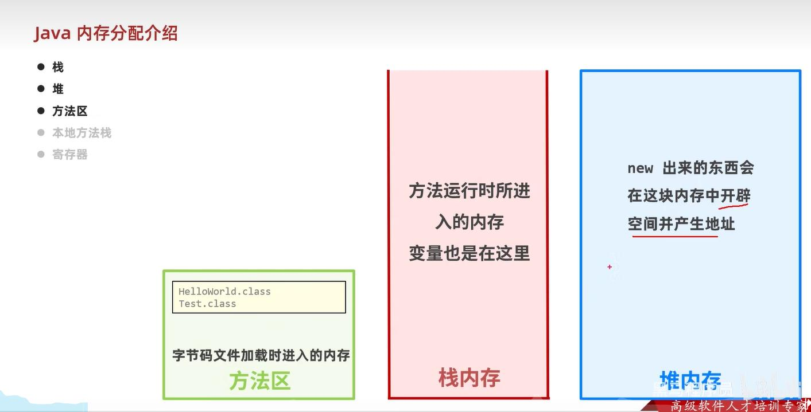
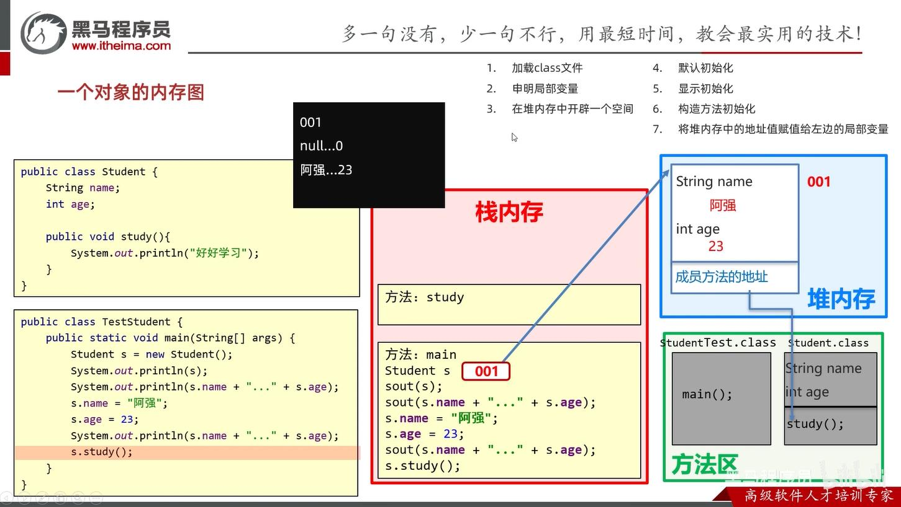
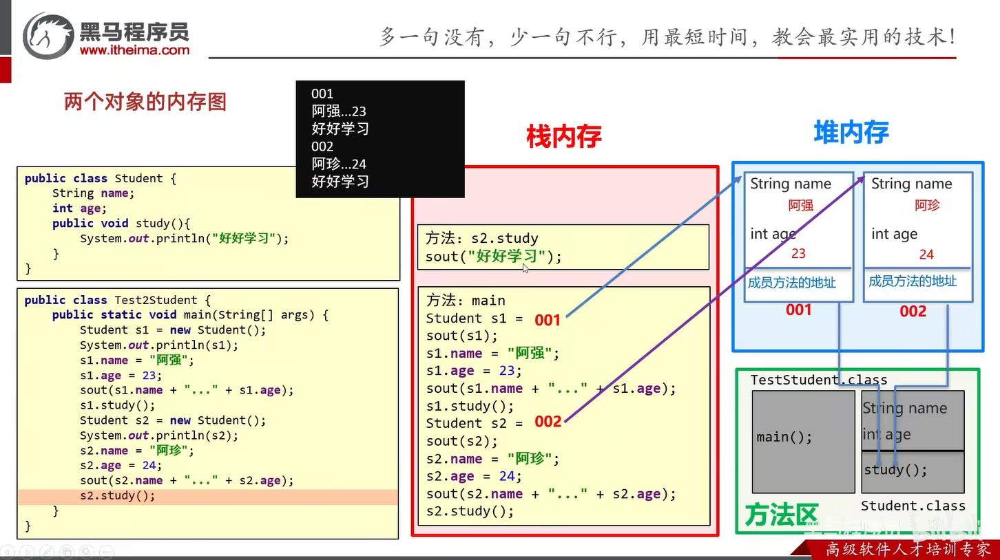
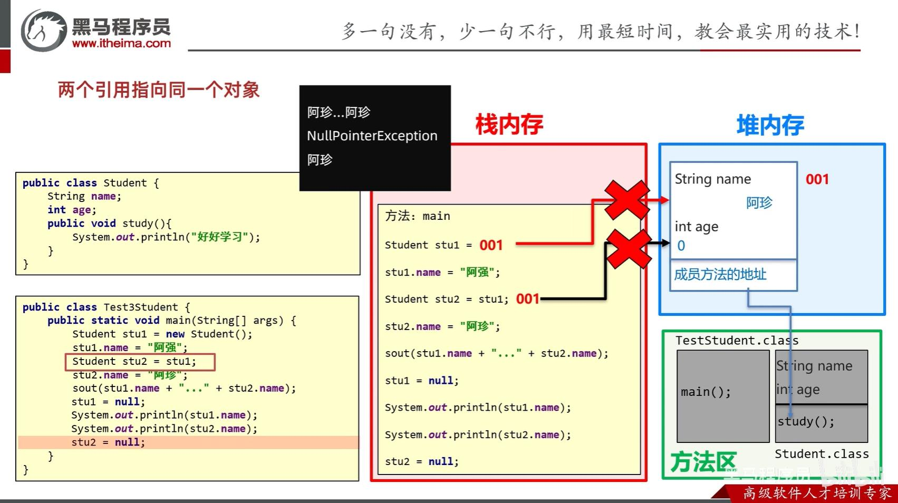
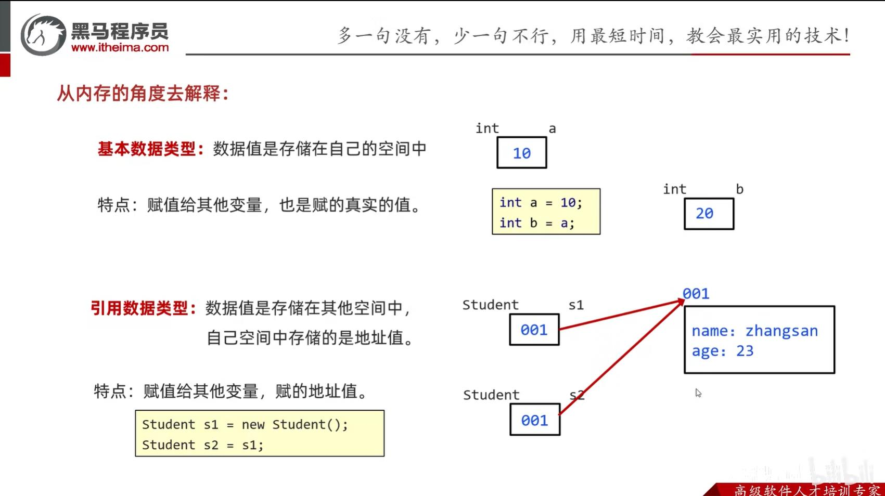
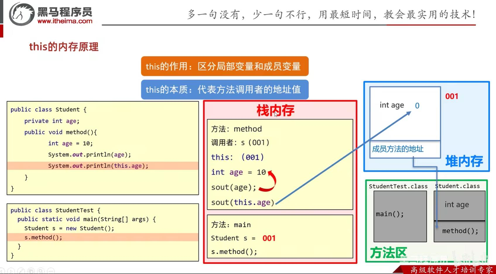
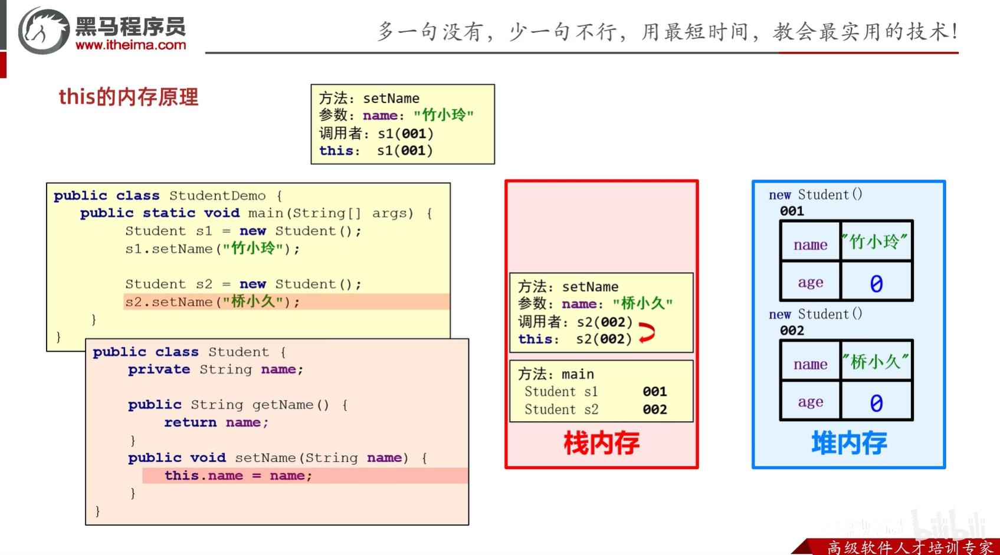
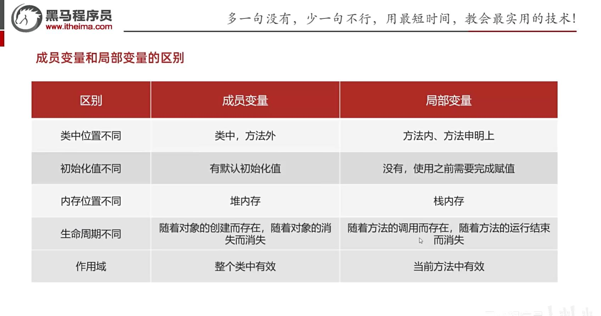
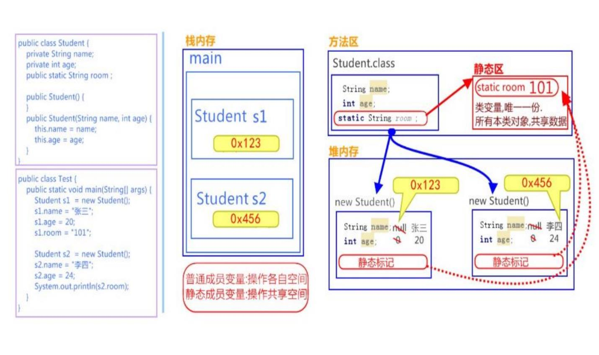

# 面向对象理论
## 1.对象内存图

### 1.1一个对象的内存图

### 1.2两个对象的内存图
**第二次创建对象不用再加载class**

### 1.3两个引用指向同一个对象(浅拷贝)
**stu1和stu2都是地址，stu2=stu1就是把stu1地址给了stu2**

## 2.基本、引用数据类型

## 3.this的内存原理
**this作用：区分局部变量和成员变量**
**this本质：所在方法调用者的地址值**

## 4.成员变量与局部变量

## 5.静态内存
