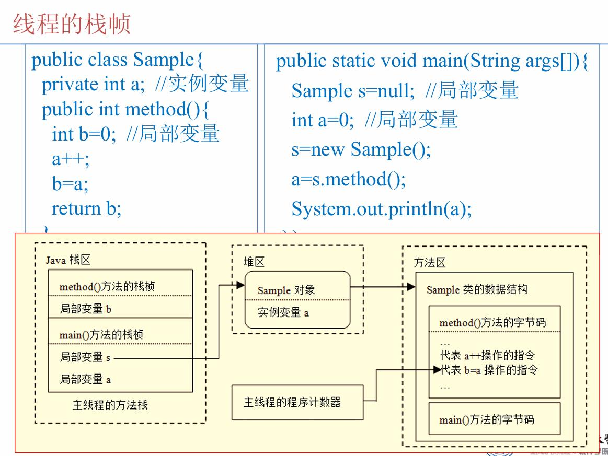
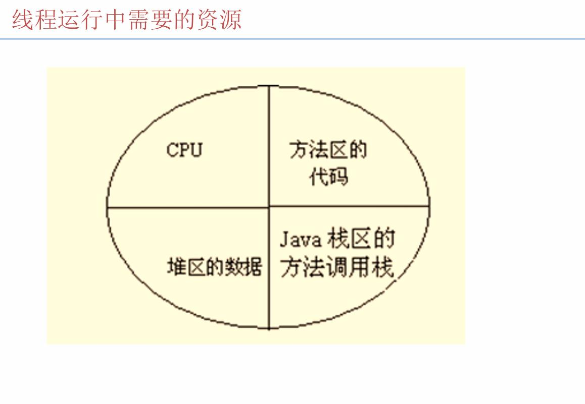

# 多线程程序设计 —— 概念性知识点梳理（选择题版）

---

## 一、程序、进程与线程（基础概念板块）

### 1. 程序（Program）

* 程序是一段**静态的代码**
* 是对数据和操作的描述
* 是应用程序执行的**蓝本**

📌 关键词：**静态**

---

### 2. 进程（Process）

* 进程是程序的**一次执行过程**
* 是系统运行程序的**基本单位**
* 进程是**动态的**
* 每个进程拥有**独立的系统资源**

  * CPU
  * 内存
  * I/O 端口等

📌 关键词：**动态、资源独立**

---

### 3. 线程（Thread）

* 线程是比进程**更小的执行单位**
* 一个进程中可以包含**多个线程**
* 线程不能独立存在，**必须依附于进程**
* 同一进程中的线程：

  * **共享进程的内存和资源**
  * 但每个线程有**独立的程序计数器和方法栈**

📌 关键词：**共享资源、独立执行路径**

---

### 4. 进程与线程的关系（必考对比）

| 对比点    | 进程     | 线程     |
| ------ | ------ | ------ |
| 是否独立存在 | 是      | 否      |
| 资源占用   | 独立     | 共享进程资源 |
| 切换开销   | 大      | 小      |
| 数量关系   | 至少一个线程 | 属于某个进程 |

❗ 易错点：

* ❌ 线程有独立内存空间（错误）
* ✅ 线程共享进程内存（正确）

---

## 二、多线程程序设计（概念板块）

### 1. 多线程的定义

* 一个程序中包含**多个并发执行的线程**
* 同一进程中存在**多条执行路径**
* 多线程体现的是**并发执行**

---

### 2. 为什么要使用多线程

* **线程切换开销小**
* **提高 CPU 利用率**
* 微观上：同一时间 CPU 只执行一个线程
* 宏观上：多个线程“同时”执行

❗ 常考判断：

* ❌ 多线程可以让 CPU 同时执行多个线程（错误）

---

## 三、线程的运行机制（运行原理板块）

### 1. 线程独有的资源

* 程序计数器（PC）
* 方法调用栈（方法栈）
* 栈帧（存储局部变量、参数、临时数据）

📌 线程之间**不共享栈**




---

### 2.栈区（Stack）

#### 1. 栈区存放的内容
- **局部变量**
  - 基本数据类型变量（int、double 等）
  - 对象引用（引用地址）
- **方法调用信息**
  - 方法参数
  - 返回地址
- **栈帧（Stack Frame）**
  - 每次方法调用都会创建一个栈帧

---

#### 2. 栈区的特点
- **线程私有**
- 方法调用结束，栈帧立即出栈
- 存取速度快
- 生命周期短

---

#### 3. 栈区常考点
- ❌ 对象本身存放在栈中  
- ✅ 对象引用存放在栈中  
- ✅ 每个线程都有自己的栈

---

### 3、堆区（Heap）

#### 1. 堆区存放的内容
- **对象实例**
  - new 创建的对象
- **数组**
- **对象的实例变量（成员变量）**

---

#### 2. 堆区的特点
- **线程共享**
- 由 JVM 统一管理
- 生命周期不确定
- 通过 **垃圾回收机制（GC）** 回收

---

#### 3. 堆区常考点
- ✅ new 出来的对象在堆中
- ❌ 局部变量在堆中
- ❌ 堆是线程私有的

---

### 4.方法区（Method Area）

#### 1. 方法区存放的内容
- **类信息**
  - 类名
  - 父类信息
  - 接口信息
- **方法信息**
  - 方法字节码
- **静态变量（static）**
- **常量池（运行时常量池）**

---

#### 2. 方法区的特点
- **线程共享**
- 随类的加载而创建
- 随 JVM 的关闭而释放

---

#### 3. 方法区常考点
- ✅ static 变量在方法区
- ❌ 方法区存放对象实例
- ❌ 方法区是线程私有的

---

### 5.三大内存区域对比（选择题最爱）

| 区域 | 存放内容 | 是否共享 | 生命周期 |
|---|---|---|---|
| 栈区 | 局部变量、方法调用 | 否 | 方法结束即释放 |
| 堆区 | 对象实例、数组 | 是 | GC 回收 |
| 方法区 | 类信息、静态变量、常量池 | 是 | JVM 结束 |

---

### 6.经典易混淆总结（必背）

- **对象在堆中，引用在栈中**
- **局部变量在栈中**
- **成员变量在堆中**
- **static 变量在方法区**
- **栈是线程私有，堆和方法区线程共享**

---

### 7.期末选择题常见判断

- ✅ 对象实例存放在堆区  
- ✅ 方法调用使用栈  
- ❌ 局部变量存放在堆区  
- ✅ 静态变量存放在方法区  
- ❌ 方法区是线程私有的  

---


## 四、线程调度（高频选择题板块）

### 1. Java 线程调度方式

* Java 线程调度采用**抢占式调度**
* 优先级高的线程优先执行
* 同优先级线程遵循：

  * **先到先执行**

❗ 易错点：

* ❌ Java 线程是分时调度（错误）
* ✅ Java 线程是抢占式调度（正确）

---

### 2. 线程优先级

* 范围：**1 ～ 10**
* 常量：

  * `MIN_PRIORITY = 1`
  * `NORM_PRIORITY = 5`
  * `MAX_PRIORITY = 10`
* 新线程**继承父线程的优先级**

---

## 五、线程的状态与生命周期（必背板块）

### 1. 线程的五种状态

1. 新建（New）
2. 就绪（Runnable）
3. 运行（Running）
4. 阻塞（Blocked）
5. 终止（Terminated）

---

### 2. 常见状态转换

| 方法                         | 状态变化    |
| -------------------------- | ------- |
| `start()`                  | 新建 → 就绪 |
| CPU 调度                     | 就绪 → 运行 |
| `sleep()`                  | 运行 → 阻塞 |
| `wait()`                   | 运行 → 阻塞 |
| `notify()` / `notifyAll()` | 阻塞 → 就绪 |
| `run()` 执行结束               | 运行 → 终止 |
| `join()`                   | 当前线程阻塞  |

---

## 六、Thread 类常用方法（概念级）

### 常见方法作用

| 方法          | 作用       |
| ----------- | -------- |
| `start()`   | 启动线程     |
| `run()`     | 线程体      |
| `sleep()`   | 线程休眠     |
| `yield()`   | 让出 CPU   |
| `join()`    | 等待线程结束   |
| `isAlive()` | 判断线程是否存活 |

❗ 重点：

* **不能直接调用 run() 来启动线程**

---

## 七、sleep / wait / yield / notify / notifyAll 对比（必考）

### 📚 前置概念说明

#### 1. 锁（Lock）是什么？

**锁**是一种**同步机制**，用于控制多个线程对**共享资源**的访问。

* **作用**：确保同一时刻只有一个线程能访问被锁保护的代码或资源
* **类比**：就像厕所的门锁，一个人进去后锁门，其他人必须等待
* **常见锁**：
  * `synchronized` 关键字（隐式锁）
  * `ReentrantLock` 等（显式锁）
* **释放锁**：线程不再持有锁，其他等待的线程可以获得锁并执行

#### 2. 同步（Synchronization）是什么？

**同步**是指多个线程**协调执行**，避免同时访问共享资源造成数据混乱。

* **为什么需要同步**：
  * 多个线程同时修改同一变量 → 数据可能出错
  * 例如：两个线程同时给账户余额 +100，可能只加了一次
* **同步方式**：
  * `synchronized` 关键字
  * `synchronized` 代码块
  * `synchronized` 方法
* **同步代码块**：被 `synchronized` 包裹的代码，同一时刻只能有一个线程执行

#### 3. sleep() / wait() / yield() 方法详解

##### sleep() 方法
* **定义**：`Thread.sleep(long millis)` - 让当前线程**休眠**指定的毫秒数
* **作用**：暂停线程执行，但不释放锁
* **状态变化**：运行 → **阻塞**（Blocked）
* **特点**：
  * 休眠时间到了会自动醒来
  * 必须捕获 `InterruptedException` 异常
  * 可以在任何地方调用，不需要同步代码块

##### wait() 方法
* **定义**：`Object.wait()` - 让当前线程**等待**，直到被其他线程唤醒
* **作用**：暂停线程执行，**释放锁**，等待通知
* **状态变化**：运行 → **阻塞**（Blocked）
* **特点**：
  * 必须在 `synchronized` 代码块中调用
  * 必须配合 `notify()` 或 `notifyAll()` 使用
  * 会释放对象锁，让其他线程可以进入同步代码块

##### yield() 方法
* **定义**：`Thread.yield()` - 让当前线程**让出 CPU**，给其他线程执行机会
* **作用**：主动放弃 CPU 时间片，但可能立即又获得执行权
* **状态变化**：运行 → **就绪**（Runnable）
* **特点**：
  * 不释放锁
  * 不保证一定会让其他线程执行（只是建议）
  * 考虑线程优先级（高优先级线程更容易获得 CPU）

##### notify() 方法
* **定义**：`Object.notify()` - **唤醒**一个正在等待该对象锁的线程
* **作用**：通知等待队列中的**一个线程**，让它从 `wait()` 状态中醒来
* **状态变化**：被唤醒的线程从**阻塞** → **就绪**（Runnable）
* **特点**：
  * 必须在 `synchronized` 代码块中调用
  * 只唤醒**一个**等待的线程（随机选择）
  * 被唤醒的线程需要重新竞争锁才能继续执行
  * 调用 `notify()` 的线程**不会立即释放锁**，需要执行完同步代码块才释放

##### notifyAll() 方法
* **定义**：`Object.notifyAll()` - **唤醒所有**正在等待该对象锁的线程
* **作用**：通知等待队列中的**所有线程**，让它们从 `wait()` 状态中醒来
* **状态变化**：被唤醒的所有线程从**阻塞** → **就绪**（Runnable）
* **特点**：
  * 必须在 `synchronized` 代码块中调用
  * 唤醒**所有**等待的线程
  * 被唤醒的线程需要重新竞争锁才能继续执行（同一时刻只有一个能获得锁）
  * 调用 `notifyAll()` 的线程**不会立即释放锁**，需要执行完同步代码块才释放

#### 4. 线程优先级（Priority）是什么？

**线程优先级**是给线程分配的一个**数值**，用于影响线程获得 CPU 执行的机会。

* **范围**：1（最低）～ 10（最高）
* **默认值**：5（`NORM_PRIORITY`）
* **作用**：
  * 优先级高的线程**更容易**被 CPU 调度执行
  * 但**不保证**高优先级一定先执行（只是概率更高）
* **设置方法**：
  * `thread.setPriority(int priority)`
  * `thread.setPriority(Thread.MAX_PRIORITY)` // 设置为 10

---

### 1. sleep() 与 wait() 对比

| 对比点    | sleep() | wait() |
| ------ | ------- | ------ |
| 是否释放锁  | 否       | 是      |
| 所属类    | Thread  | Object |
| 是否必须同步 | 否       | 是      |

**详细解释**：

* **是否释放锁**：
  * `sleep()`：线程休眠时**仍然持有锁**，其他线程无法进入同步代码块
  * `wait()`：线程等待时**会释放锁**，其他线程可以进入同步代码块执行
* **所属类**：
  * `sleep()` 是 `Thread` 类的静态方法，直接通过 `Thread.sleep()` 调用
  * `wait()` 是 `Object` 类的方法，需要通过对象实例调用
* **是否必须同步**：
  * `sleep()` 可以在任何地方调用，不需要在同步代码块中
  * `wait()` **必须在** `synchronized` 代码块中调用，否则会抛出 `IllegalMonitorStateException`

📌 口诀：

> **wait 释放锁，sleep 不释放**

**记忆技巧**：
* `wait()` 等待别人通知，所以把锁让给别人用
* `sleep()` 只是睡觉，锁还在自己手里

---

### 2. sleep() 与 yield() 对比

| 对比点     | sleep() | yield() |
| ------- | ------- | ------- |
| 进入状态    | 阻塞      | 就绪      |
| 是否抛异常   | 是       | 否       |
| 是否考虑优先级 | 否       | 是       |

**详细解释**：

* **进入状态**：
  * `sleep()`：线程进入**阻塞状态**，需要等待指定时间后才能继续
  * `yield()`：线程进入**就绪状态**，可以立即被 CPU 调度执行（可能马上又执行）
* **是否抛异常**：
  * `sleep()`：必须捕获或声明抛出 `InterruptedException` 异常
  * `yield()`：不抛异常，直接调用即可
* **是否考虑优先级**：
  * `sleep()`：不考虑优先级，时间到了就醒来
  * `yield()`：**考虑优先级**，让出 CPU 后，高优先级线程更容易获得执行机会

**使用场景**：
* `sleep()`：需要线程暂停固定时间（如定时任务）
* `yield()`：想让其他线程有机会执行，但不保证一定让出（很少使用）

---

### 3. notify() 与 notifyAll() 对比

| 对比点     | notify() | notifyAll() |
| ------- | ------- | ---------- |
| 唤醒线程数量 | 一个      | 所有        |
| 选择方式   | 随机      | 全部        |
| 使用场景   | 生产者-消费者（单消费者） | 生产者-消费者（多消费者） |
| 性能     | 较高      | 较低（唤醒所有线程） |

**详细解释**：

* **唤醒线程数量**：
  * `notify()`：只唤醒**一个**等待的线程
  * `notifyAll()`：唤醒**所有**等待的线程
* **选择方式**：
  * `notify()`：从等待队列中**随机选择**一个线程唤醒
  * `notifyAll()`：唤醒等待队列中的**所有线程**
* **使用场景**：
  * `notify()`：适用于**单一消费者**场景，例如一个生产者对应一个消费者
  * `notifyAll()`：适用于**多个消费者**场景，例如一个生产者对应多个消费者，需要唤醒所有等待的消费者
* **性能**：
  * `notify()`：只唤醒一个线程，性能较好
  * `notifyAll()`：唤醒所有线程，这些线程需要重新竞争锁，可能造成性能开销

**重要注意事项**：

* ⚠️ `notify()` 和 `notifyAll()` **必须在** `synchronized` 代码块中调用
* ⚠️ 调用 `notify()` 或 `notifyAll()` 的线程**不会立即释放锁**
* ⚠️ 被唤醒的线程需要**重新竞争锁**才能继续执行
* ⚠️ `wait()`、`notify()`、`notifyAll()` 必须使用**同一个对象**的锁

**wait() / notify() / notifyAll() 配合使用示例**：

```java
// 生产者线程
synchronized (lock) {
    // 生产数据
    data = produce();
    // 唤醒等待的消费者
    lock.notify();  // 或 lock.notifyAll()
}

// 消费者线程
synchronized (lock) {
    while (data == null) {
        lock.wait();  // 等待生产者通知
    }
    // 消费数据
    consume(data);
}
```

📌 记忆技巧：

> **notify 唤醒一个，notifyAll 唤醒所有**

---

## 八、创建线程的方式（只考概念）

### 1. 继承 Thread 类

* 重写 `run()` 方法
* 缺点：**Java 单继承限制**

---

### 2. 实现 Runnable 接口（推荐）

* 实现 `run()` 方法
* 优点：

  * 避免单继承限制
  * **适合资源共享**

---

### 3. 实现 Callable 接口

* 实现 `call()` 方法
* 特点：

  * **有返回值**
  * **可以抛异常**
  * 需要配合 `Future`

---

## 九、Runnable 与 Callable 对比（送分题）

| 对比点    | Runnable | Callable |
| ------ | -------- | -------- |
| 方法     | run()    | call()   |
| 返回值    | 无        | 有        |
| 抛异常    | 不可以      | 可以       |
| Future | 无        | 有        |

---

## 十、Executor 框架（了解型）

### execute() 与 submit()

| 方法        | 特点                           |
| --------- | ---------------------------- |
| execute() | 无返回值，只接收 Runnable            |
| submit()  | 有返回值，可接收 Runnable / Callable |

---

## 十一、终止线程（概念）

* 线程执行完 `run()` 方法 → **自然终止**
* `stop()` 方法：

  * **不安全**
  * 已被废弃
* 推荐方式：

  * 使用**标志变量**控制线程结束

---

## 十二、期末选择题常见判断总结

✅ 线程是 CPU 调度的基本单位
✅ 同一进程的线程共享内存
❌ sleep() 会释放锁
✅ wait() 必须在同步代码中使用
✅ Java 线程调度是抢占式
❌ Runnable 可以返回执行结果

---

如果你需要，我可以下一步帮你做👇

* 📘 **“一页纸 A4 考前速记版”**
* 📝 **“期末选择题模拟 + 解析”**

直接告诉我你要哪一个。
