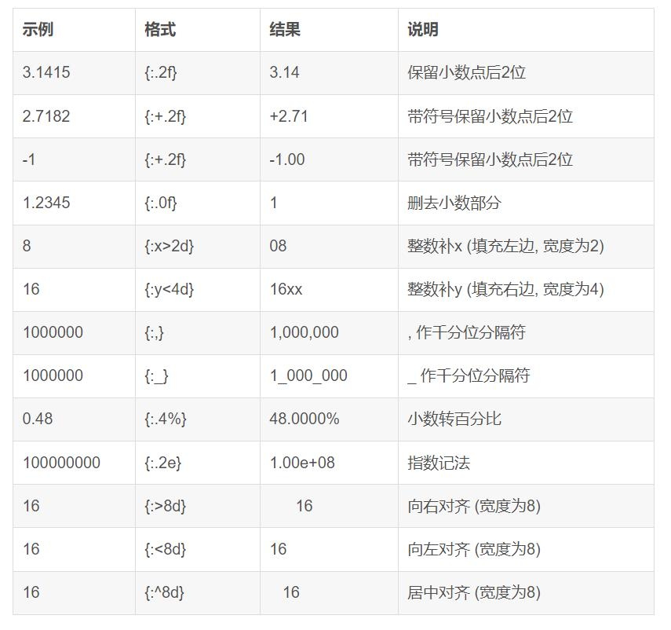
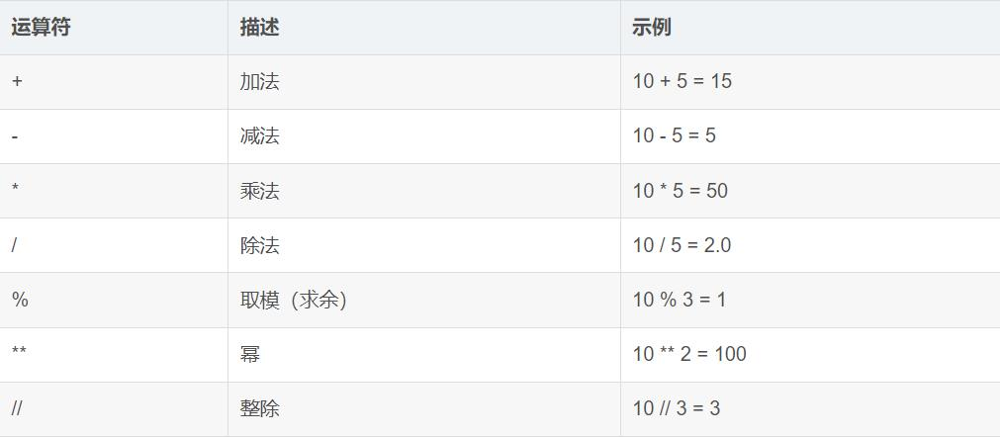
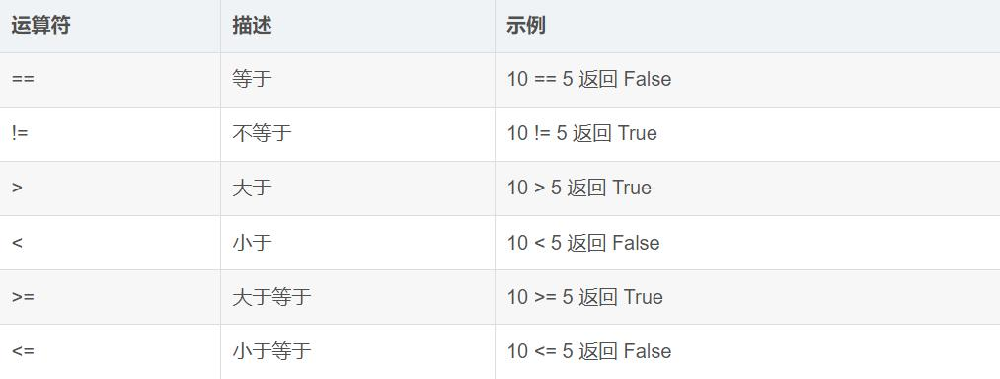
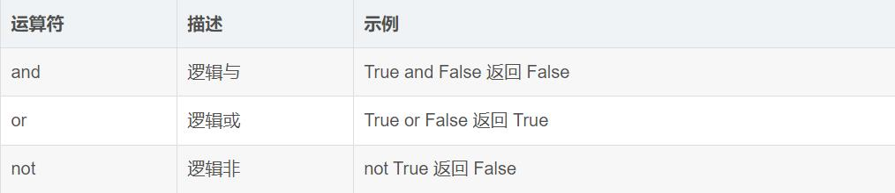
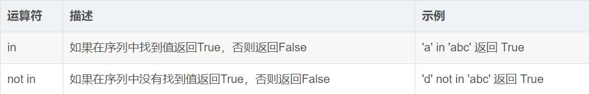
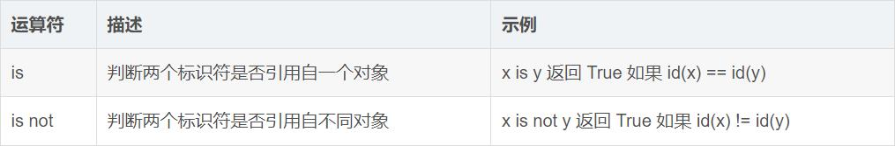

# 基础语法
## 1.输入输出
```py
a, b = input().split(" ") # 输入字符串(默认返回类型)a 和 b  以(空格)分隔
a, b, c = eval(input())   #输入三个值(任何类型)中间由逗号分隔
a, b, c = map(int, input().split(","))    #输入三个值(int)中间由逗号分隔
a, b, c = map(eval, input().split(" ")) #输入三个值(任何类型)中间(空格)分隔

lst = list(map(int, input().split(" "))) #输入一行值(int)由(空格)分隔 存入列表

#输入n个数
n = int(input())
s = input() #将数一行输入 空格分隔
lst = []
for i in s.split(" "):
    lst.append(int(i))
#两种输出方式
for i in lst:
    print(i, end=" ")
for i in range(n):
    print(lst[i], end=" ")
```

```py
# 法一：sep指多个输出之间的间隔符号(默认空格)，end表示结尾符号(默认换行)，file表示输出位置(默认标准输出)
print(a,b,sep=' ',end='\n',file=sys.stdout)

x=3
print('%-3d'%x)

# 法二：format格式化
place = '中国'
age = 18
print('我来自%s,我的年龄是%d' %(place, age))
print('我来自{},我的年龄是{}'.format(place, age))
print('我来自{0},我的年龄是{1}'.format(place, age))

# 法三：f-string
name = '张三'
age = 18
print(f'我的名字是{name}，我的年龄是{age}')
```

## 2.数据类型
### 2.1 字符串
```py
s = "Hello, World!"
# 访问字符
print(s[0])  # 输出第一个字符 'H'
# 切片
print(s[0:5])  # 输出 'Hello'
# 连接
s1 = "Hello"
s2 = "World"
print(s1 + ", " + s2 + "!")  # 输出 'Hello, World!'
# 长度
print(len(s))  # 输出 13
```

### 2.2 强制类型转换
```py
y = int(3.14)  # 浮点数转整数（截断小数部分）
a = float("3.14")  # 字符串转浮点数

# 转换为字符串
s1 = str(10)  # 整数转字符串
s2 = str(3.14)  # 浮点数转字符串
s3 = str(True)  # 布尔值转字符串

# 转换为布尔值
b1 = bool(0)  # 0转False
b2 = bool(10)  # 非零数字转True
b3 = bool("")  # 空字符串转False
b4 = bool("Hello")  # 非空字符串转True
```

## 3.运算符
### 3.1 算数运算符

### 3.2 比较运算符

### 3.3 逻辑运算符

### 3.4 成员运算符

### 3.5 身份运算符


## 4.控制结构
### 4.1 条件语句
```py
score=85
if score>=90:
    print('A')
elif score>=80:
    print('B')
else:
    print('C')
```
### 4.2 循环语句
```py
# 遍历列表
fruits = ["苹果", "香蕉", "橙子"]
for fruit in fruits:
    print(fruit)

# 遍历字符串
for char in "Hello":
    print(char)

# 使用range()函数
for i in range(5):  # 输出0到4
    print(i)

for i in range(1, 6):  # 输出1到5
    print(i)

for i in range(1, 10, 2):  # 输出1, 3, 5, 7, 9
    print(i)
```
## 5.函数作用域
```py
# 全局变量
global_var = 10

def modify_global():
    # 使用global关键字修改全局变量
    global global_var
    global_var = 20
    print("修改后的全局变量:", global_var)

```