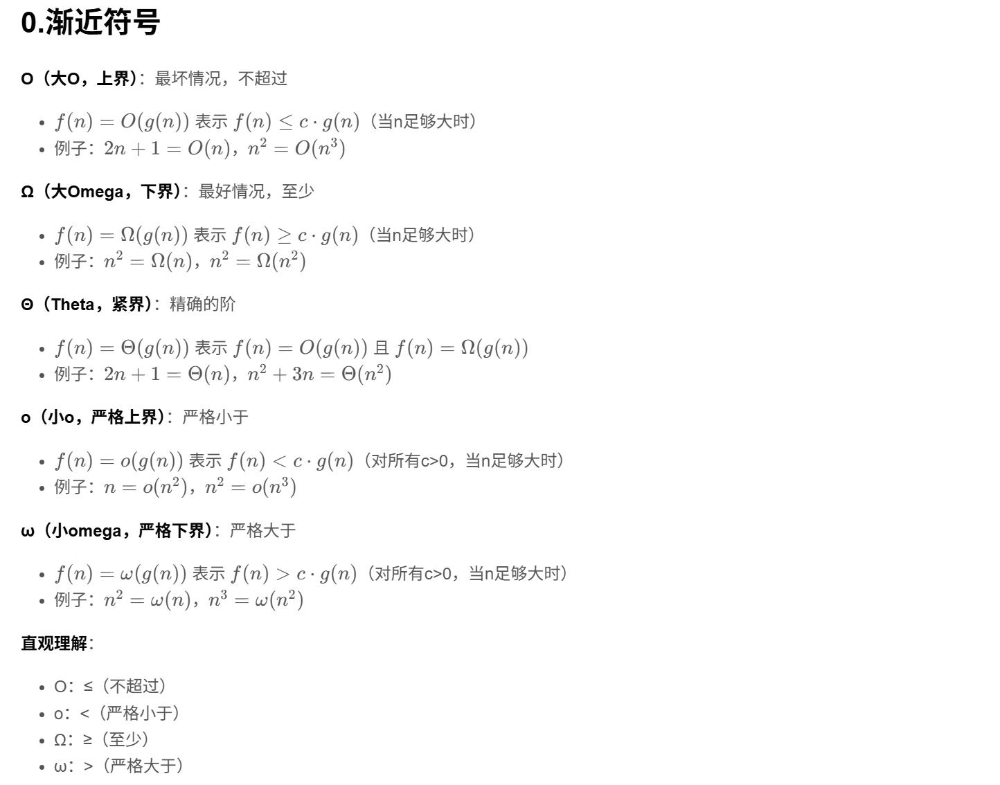
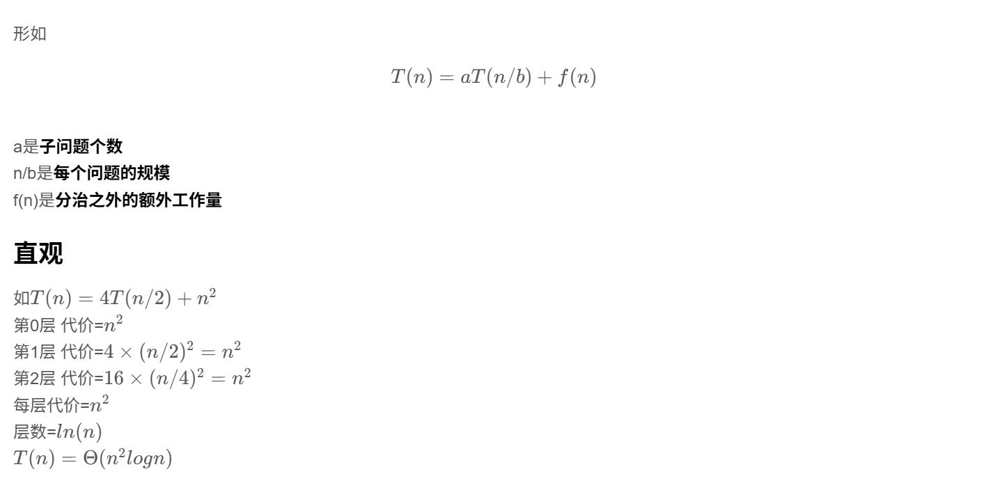
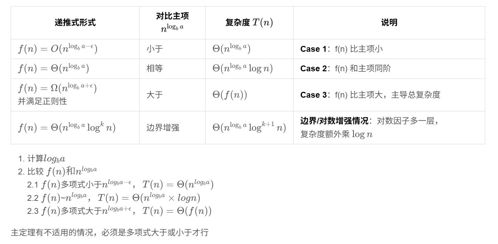
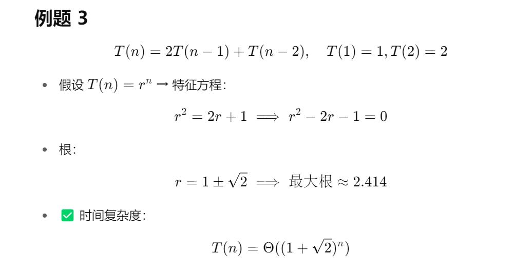
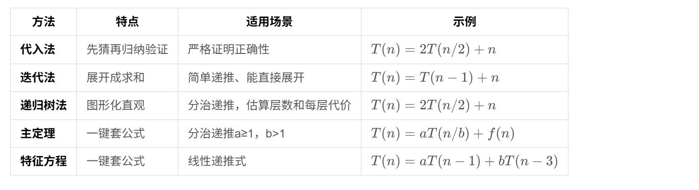

# 时间复杂度

## 0.渐近符号

## 1.主定理

### 主定理总结公式

主定理有不适用的情况，必须是多项式大于或小于才行

## 2.特征方程

## 3.五种方法对比

## 4.P类和NP类问题

**P类问题（Polynomial）**：能在多项式时间内解决的问题
- 时间复杂度：$O(n^k)$，k是常数
- 例子：排序、查找、最短路径（Dijkstra）
- 直观：**容易解决**的问题

**NP类问题（Nondeterministic Polynomial）**：能在多项式时间内**验证**解的问题
- 给定一个解，能在多项式时间内验证是否正确
- 例子：旅行商问题（TSP）、背包问题、图着色
- 直观：**难解决，但容易验证**的问题

**NP完全问题（NP-Complete）**：NP类中最难的问题
- 所有NP问题都能在多项式时间内归约到它
- 如果找到一个NP完全问题的多项式解法，所有NP问题都能解决
- 例子：SAT问题、哈密顿回路、子集和问题

**P vs NP问题**：$P \subseteq NP$，但 $P = NP$ 还是 $P \neq NP$ 尚未证明
- 如果 $P = NP$：所有NP问题都能快速解决
- 如果 $P \neq NP$：存在永远无法快速解决的问题

**直观理解**：
- **P**：能快速解决（多项式时间）
- **NP**：能快速验证（多项式时间验证）
- **NP完全**：NP中最难的，解决它就能解决所有NP问题

