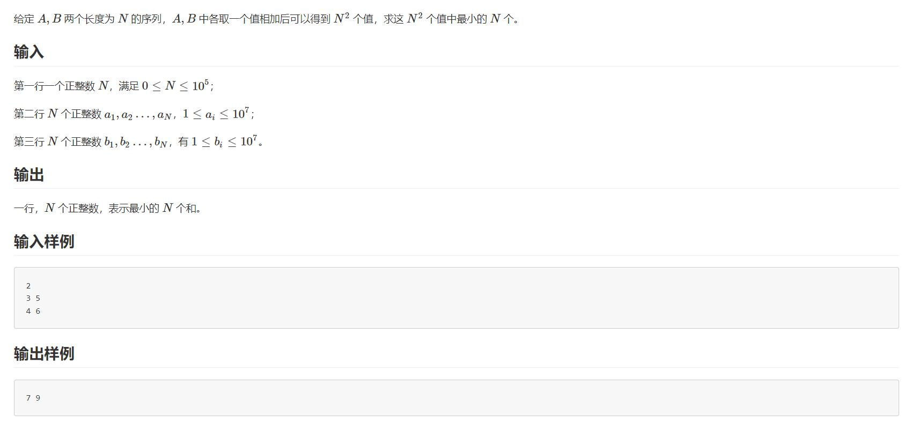

# 排序
## 1.堆(优先队列)
用途：**动态数组(可增加元素，可删去最值元素)求最值**<br>
父亲节点：a[x>>1]=a[x/2]   
左儿子：a[x<<1]=a[x×2]    
右儿子：a[x<<1|1]=a[x*2+1] 
```c
#include <stdio.h>

int a[300000000]; 
int size=0;
void swap(int *a,int *b)
{
	int c;
	c=*b;
	*b=*a;
	*a=c; 
}
int max(int a,int b,int c)
{
	if(a>=b&&a>=c) return a;
	if(b>=a&&b>=c) return b;
	return c;
} 
void pushup(int x)//将某个点向上更新 
{
	while(x!=1)
	{
		if(a[x]>a[x>>1]) swap(&a[x],&a[x>>1]),x=(x>>1);
		else break;
	}
}
void pushdown(int x)//将某个点向下更新 
{
	//如果没有儿子
	if((x<<1)>size) return;
	//如果只有左儿子 
	if((x<<1|1)>size)
	{
		if(a[x<<1]>a[x])
		{
			swap(&a[x],&a[x<<1]);
			pushdown(x<<1);
		}
	}
	//如果左右儿子都有
	else
	{
		if(a[x]==max(a[x],a[x<<1],a[x<<1|1])) return;
		if(a[x<<1]>a[x<<1|1])
		{
			swap(&a[x],&a[x<<1]);
			pushdown(x<<1);
		}
		else
		{
			swap(&a[x],&a[x<<1|1]);
			pushdown(x<<1|1);
		}
	} 
}
void push(int x)//插入一个点到堆里 
{
	a[++size]=x;
	pushup(size);
} 
void pop()//将根节点删除 
{
    int max1=a[1];
	a[1]=a[size];
    a[size]=max1;
    size--;
	pushdown(1);
}

int top()//取堆最大值
{
    return a[1];
}

void build_heap()//快速建堆(O(n))
{
    /* 如果 size==0 直接返回 */
    if (size <= 1) return;

    /* 完全二叉树中最后一个非叶节点是 size/2 */
    for (int i = size >> 1; i >= 1; --i)
        pushdown(i);   /* 你已有的函数 */
}

int main()
{
    int n,q,s;
    scanf("%d%d",&n,&q);
    for(int i=1;i<=n;i++)
    {
        scanf("%d",&s);
        push(s);
    }
    for(int i=1;i<=q;i++) pop();
    for(int i=1;i<=n;i++) printf("%d ",a[i]);
    printf("\n");
    for(int i=q+1;i<=n;i++) pop();
    for(int i=1;i<=n;i++) printf("%d ",a[i]);

}
```
### 优先队列快速实现堆
```cpp
queue<int> q;
push(x);    //队尾插入x
pop();      //弹出队首元素
front();    //返回队首元素
back();     //返回队尾元素
empty();    //是否为空
size();     //返回元素个数

priority_queue   //优先队列(堆)(队首一定是最大值)
push(x);    //将x插入到优先队列中
pop();      //弹出优先队列的顶部元素
top();      //返回优先队列的顶部元素
empty();    //是否为空
size();     //返回元素个数

//法一：从小到大排
priority_queue<int, vector<int>, greater<int>> q;//小顶堆
priority_queue<int, vector<int>, less<int>> q;//大顶堆
//法二：复杂排序
struct Compare
{
    bool operator()(int a,int b) 
    {
        //小顶堆
        return a>b;
    }
};
priority_queue<int, vector<int>, Compare> pq;
```
### 多路归并问题

```cpp
#include <bits/stdc++.h>
using namespace std;

int rise_int(const void *p1, const void *p2);

struct Node
{
    long long x,y1,y2;
};

struct Compare
{
    bool operator()( Node a, Node b)
    {
        //自定义比较函数，按照逆序排列
        return a.x>b.x;
    }
};
priority_queue<Node, vector<Node>, Compare> pq;

long long a[100005],b[100005];
set<pair<int, int> > vis;

int main()
{
    int N,i;
    scanf("%d",&N);
    for(i=1;i<=N;i++) scanf("%lld",&a[i]);
    for(i=1;i<=N;i++) scanf("%lld",&b[i]);

    qsort(a+1, N, sizeof(a[1]), rise_int);
    qsort(b+1, N, sizeof(b[1]), rise_int);
    
    pq.push({a[1]+b[1],1,1});
    vis.insert({1, 1});  // 初始元素标记为已访问
    for(i=1;i<=N;i++)
    {
        Node top=pq.top();
        pq.pop();
        printf("%lld ",top.x);
        
        if(top.y1<N && vis.find({top.y1+1, top.y2}) == vis.end()) {
            vis.insert({top.y1+1, top.y2});  // 在添加前就标记，避免重复添加
            pq.push({a[top.y1+1]+b[top.y2],top.y1+1,top.y2});
        }
        if(top.y2<N && vis.find({top.y1, top.y2+1}) == vis.end()) {
            vis.insert({top.y1, top.y2+1});  // 在添加前就标记，避免重复添加
            pq.push({a[top.y1]+b[top.y2+1],top.y1,top.y2+1});
        }
    }
    return 0;
}


int rise_int(const void *p1, const void *p2)
{
    if ( *(long long *)p1 < *(long long *)p2 ) return -1;
    if ( *(long long *)p1 > *(long long *)p2 ) return 1;
    return 0;
}
```
### 多路归并内存加强版(构建二维动态数组)
```cpp
#include <bits/stdc++.h>
using namespace std;

struct Node
{
    int x,y,z;
};
struct Compare
{
    bool operator()(Node a,Node b) 
    {
        //小顶堆
        return a.z>b.z;
    }
};
priority_queue<Node, vector<Node>, Compare> pq;
int main()
{
    int t;
    scanf("%d",&t);
    while(t--)
    {
        int k,n;
        scanf("%d%d",&k,&n);
        vector<vector<int>> a(k+1, vector<int>(n+1));//k+1行，n+1列(从0开始)
        for(int i=1;i<=k;i++)
        {
            for(int j=1;j<=n;j++)
            {
                scanf("%d",&a[i][j]);
            }
            pq.push({i,1,a[i][1]});
        }
        for(int i=1;i<=n*k;i++)
        {
            Node top=pq.top();
            pq.pop();
            printf("%d ",top.z);
            if(top.y<n)
            {
                pq.push({top.x,top.y+1,a[top.x][top.y+1]});
            }
        }
        printf("\n");

    }


}

```

## 2.快速排序
```c
#include <stdlib.h>
void qsort( void *base, size_t num, size_t wid, int (*cmp)(const void *e1, const void *e2) );//数组名，元素个数，sizeof(数组数据类型)，比较函数(自己写一个)
//下面是一个例子
qsort(a, n, sizeof(int), rise_int);
int rise_int(const void *p1, const void *p2)
{
    if ( *(int *)p1 < *(int *)p2 ) return -1;
    if ( *(int *)p1 > *(int *)p2 ) return 1;
    return 0;
}
```
板子：二维数组排序
```c
int pt[500005][2];
int main()
{
    int n;
    scanf("%d",&n);
	for(i=0;i<=n-1;i++)
	{
		scanf("%d%d",&pt[i][0],&pt[i][1]); 
	}
    qsort(pt, n, 2 * sizeof(int), x_ascending);
}

int x_ascending(const void * pt1, const void * pt2)//前降序后升序
{
if(((int*) pt1)[0] > ((int *) pt2)[0]) return -1;
else if(((int *) pt1)[0] < ((int *) pt2)[0]) return 1;

else if (((int *) pt1)[1] < ((int *) pt2)[1]) return -1;
else if(((int *) pt1)[1] > ((int *) pt2)[1]) return 1;

else return 0;
}
```
结构体排序(oj排行版完整版)
```c
struct Stu {
    char name[30];
    double score;
    int fa;
} oj[2000];

int comp(const void *pt1, const void *pt2);

int main() {
    int i = 0,n;
    while (scanf("%s %lf %d", oj[i].name, &oj[i].score, &oj[i].fa) != EOF) {
        i++;
    }
    n=i;
    qsort(oj, n, sizeof(oj[0]), comp);
	for(i=0;i<=n-1;i++)
	{
        printf("%10s %8.2f %10d\n", oj[i].name, oj[i].score, oj[i].fa);		
	}
    return 0;
}

int comp(const void *pt1, const void *pt2) {
    struct Stu *s1 = (struct Stu *)pt1;
    struct Stu *s2 = (struct Stu *)pt2;

    if (s1->score > s2->score) return -1; //首先按分数降序排列
    else if (s1->score < s2->score) return 1;

    else if (s1->fa < s2->fa) return -1; //如果分数相同，按fa升序排列
    else if (s1->fa > s2->fa) return 1;

    return strcmp(s1->name, s2->name); // 如果fa也相同，按名字字典顺序排列
}
```

## 3.计数排序（Counting Sort）

**适用场景**：
- 数据范围较小（通常0到k，k不太大）
- 非负整数排序
- 需要稳定排序
- 数据分布相对集中

**时间复杂度**：O(n + k)，其中n是元素个数，k是数据范围
**空间复杂度**：O(k)

```c
#include <stdio.h>
#include <string.h>

#define MAXN 100005
#define MAXK 100005

int a[MAXN];        // 原数组
int count[MAXK];    // 计数数组
int output[MAXN];   // 输出数组

void countingSort(int n, int max_val) {
    // 初始化计数数组
    memset(count, 0, sizeof(count));
    
    // 统计每个元素出现的次数
    for (int i = 0; i < n; i++) {
        count[a[i]]++;
    }
    
    // 将计数数组转换为前缀和（表示每个元素在输出数组中的位置）
    for (int i = 1; i <= max_val; i++) {
        count[i] += count[i - 1];
    }
    
    // 从后往前遍历原数组，保证稳定性
    for (int i = n - 1; i >= 0; i--) {
        output[count[a[i]] - 1] = a[i];
        count[a[i]]--;
    }
    
    // 将结果复制回原数组
    for (int i = 0; i < n; i++) {
        a[i] = output[i];
    }
}

int main() {
    int n, max_val = 0;
    scanf("%d", &n);
    
    for (int i = 0; i < n; i++) {
        scanf("%d", &a[i]);
        if (a[i] > max_val) max_val = a[i];
    }
    
    countingSort(n, max_val);
    
    for (int i = 0; i < n; i++) {
        printf("%d ", a[i]);
    }
    printf("\n");
    
    return 0;
}
```

## 4.基数排序（Radix Sort）

**适用场景**：
- 非负整数排序
- 数据位数相对固定
- 需要稳定排序
- 数据范围较大但位数不多

**时间复杂度**：O(d × (n + k))，其中d是位数，n是元素个数，k是基数（通常为10）
**空间复杂度**：O(n + k)

```c
#include <stdio.h>
#include <string.h>

#define MAXN 100005
#define RADIX 10  // 基数（十进制）

int a[MAXN];
int temp[MAXN];
int count[RADIX];

// 获取数字的第exp位（从个位开始，exp=0表示个位）
int getDigit(int num, int exp) {
    return (num / exp) % RADIX;
}

// 基数排序
void radixSort(int n) {
    int max_val = a[0];
    // 找到最大值，确定需要排序的位数
    for (int i = 1; i < n; i++) {
        if (a[i] > max_val) max_val = a[i];
    }
    
    // 从个位开始，对每一位进行计数排序
    for (int exp = 1; max_val / exp > 0; exp *= RADIX) {
        // 初始化计数数组
        memset(count, 0, sizeof(count));
        
        // 统计当前位每个数字出现的次数
        for (int i = 0; i < n; i++) {
            count[getDigit(a[i], exp)]++;
        }
        
        // 将计数数组转换为前缀和
        for (int i = 1; i < RADIX; i++) {
            count[i] += count[i - 1];
        }
        
        // 从后往前遍历，保证稳定性
        for (int i = n - 1; i >= 0; i--) {
            int digit = getDigit(a[i], exp);
            temp[count[digit] - 1] = a[i];
            count[digit]--;
        }
        
        // 将结果复制回原数组
        for (int i = 0; i < n; i++) {
            a[i] = temp[i];
        }
    }
}

int main() {
    int n;
    scanf("%d", &n);
    
    for (int i = 0; i < n; i++) {
        scanf("%d", &a[i]);
    }
    
    radixSort(n);
    
    for (int i = 0; i < n; i++) {
        printf("%d ", a[i]);
    }
    printf("\n");
    
    return 0;
}
```

## 5.桶排序（Bucket Sort）

**适用场景**：
- 数据均匀分布在某个范围内
- 浮点数排序
- 需要稳定排序
- 数据分布相对均匀

**时间复杂度**：
- 平均情况：O(n + k)，其中k是桶的个数
- 最坏情况：O(n²)（所有元素都在一个桶内）
**空间复杂度**：O(n + k)

```c
#include <stdio.h>
#include <stdlib.h>

#define MAXN 100005
#define BUCKET_NUM 10  // 桶的个数

// 链表节点（用于桶内存储）
typedef struct Node {
    double data;
    struct Node *next;
} Node;

// 桶结构
Node *buckets[BUCKET_NUM];

// 插入排序（用于桶内排序）
void insertSort(Node **head, double val) {
    Node *newNode = (Node *)malloc(sizeof(Node));
    newNode->data = val;
    newNode->next = NULL;
    
    if (*head == NULL || val < (*head)->data) {
        newNode->next = *head;
        *head = newNode;
        return;
    }
    
    Node *current = *head;
    while (current->next != NULL && current->next->data < val) {
        current = current->next;
    }
    newNode->next = current->next;
    current->next = newNode;
}

// 桶排序
void bucketSort(double arr[], int n, double min_val, double max_val) {
    // 初始化桶
    for (int i = 0; i < BUCKET_NUM; i++) {
        buckets[i] = NULL;
    }
    
    // 计算每个桶的范围
    double range = (max_val - min_val) / BUCKET_NUM;
    
    // 将元素分配到各个桶中
    for (int i = 0; i < n; i++) {
        int bucketIndex = (int)((arr[i] - min_val) / range);
        // 处理边界情况（最大值）
        if (bucketIndex >= BUCKET_NUM) bucketIndex = BUCKET_NUM - 1;
        insertSort(&buckets[bucketIndex], arr[i]);
    }
    
    // 将桶中的元素按顺序放回原数组
    int index = 0;
    for (int i = 0; i < BUCKET_NUM; i++) {
        Node *current = buckets[i];
        while (current != NULL) {
            arr[index++] = current->data;
            Node *temp = current;
            current = current->next;
            free(temp);
        }
    }
}

int main() {
    int n;
    double arr[MAXN];
    scanf("%d", &n);
    
    double min_val = 1e9, max_val = -1e9;
    for (int i = 0; i < n; i++) {
        scanf("%lf", &arr[i]);
        if (arr[i] < min_val) min_val = arr[i];
        if (arr[i] > max_val) max_val = arr[i];
    }
    
    bucketSort(arr, n, min_val, max_val);
    
    for (int i = 0; i < n; i++) {
        printf("%.2f ", arr[i]);
    }
    printf("\n");
    
    return 0;
}
```

## 三种排序算法的选择指南

| 算法 | 适用场景 | 时间复杂度 | 空间复杂度 | 稳定性 |
|------|---------|-----------|-----------|--------|
| **计数排序** | 数据范围小（0~k），非负整数 | O(n + k) | O(k) | 稳定 |
| **基数排序** | 非负整数，位数固定 | O(d × (n + k)) | O(n + k) | 稳定 |
| **桶排序** | 数据均匀分布，浮点数 | O(n + k)平均 | O(n + k) | 稳定 |

**选择建议**：
1. **计数排序**：当数据范围较小（如0~1000）且是非负整数时，效率最高
2. **基数排序**：当数据范围很大但位数不多时（如手机号、身份证号），比计数排序更节省空间
3. **桶排序**：当数据是浮点数或数据分布相对均匀时使用，适合大数据量
```