# 总线与IO
## 1.总线的仲裁
### 1.1总线概念
总线：连接两个或多个功能部件的一组公共的信号传输线

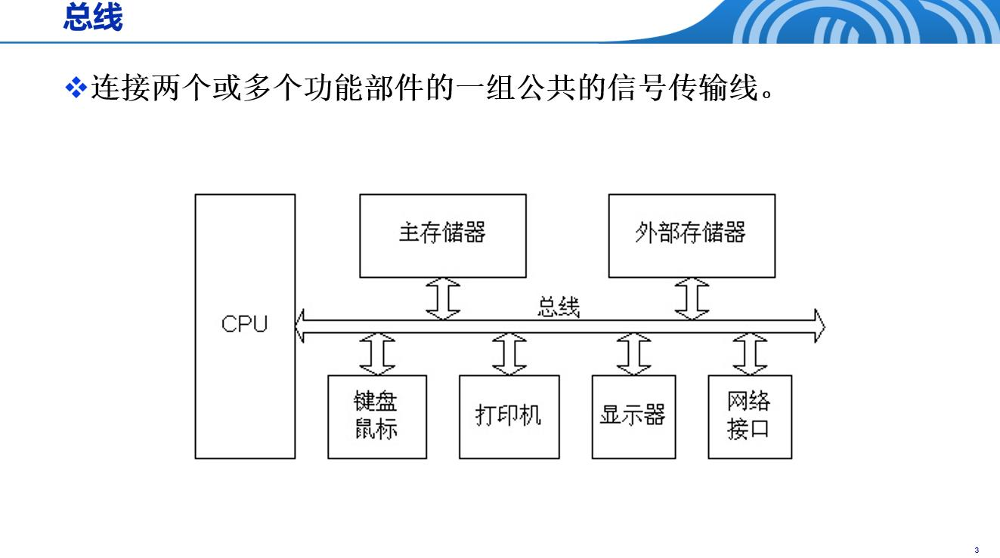

### 1.2总线仲裁
总线仲裁：总线仲裁是指当多个主设备（如CPU、DMA控制器、外设等）同时请求使用共享总线时，通过特定机制决定哪个主设备获得总线控制权的过程
其主要目的是解决多设备同时访问总线时可能出现的冲突和竞争问题，保证设备能够有序地进行数据传输和通信。
#### 链式查询法
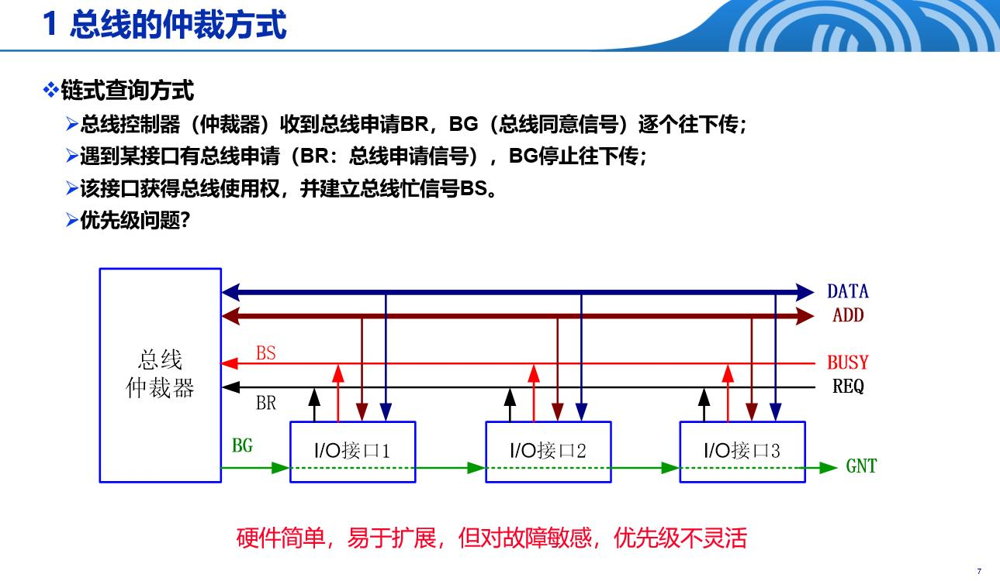
#### 计数器法
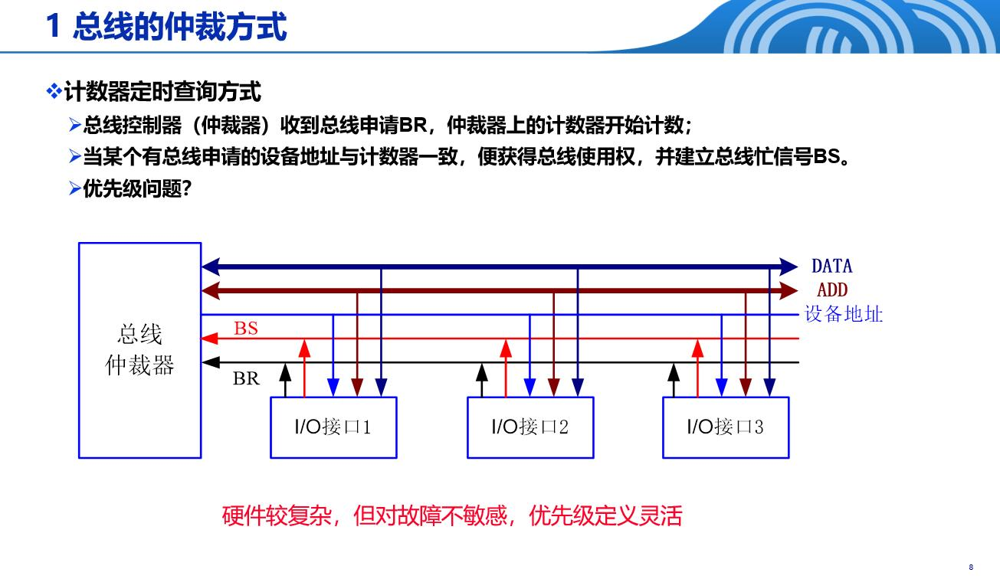
#### 独立请求法
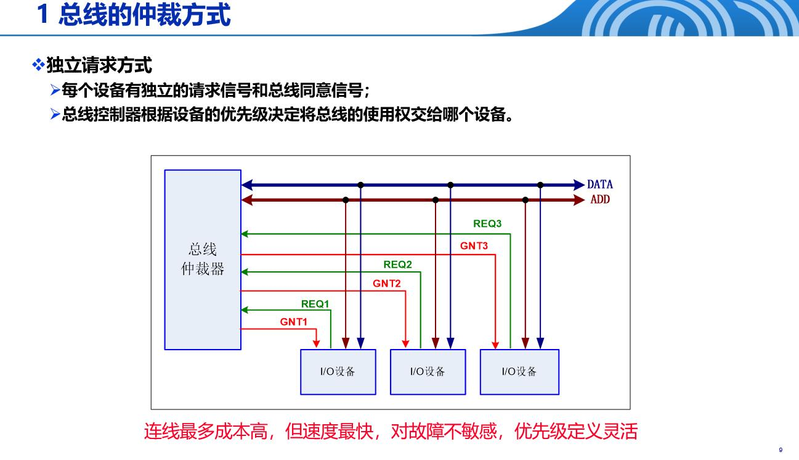

## 2.I/O接口
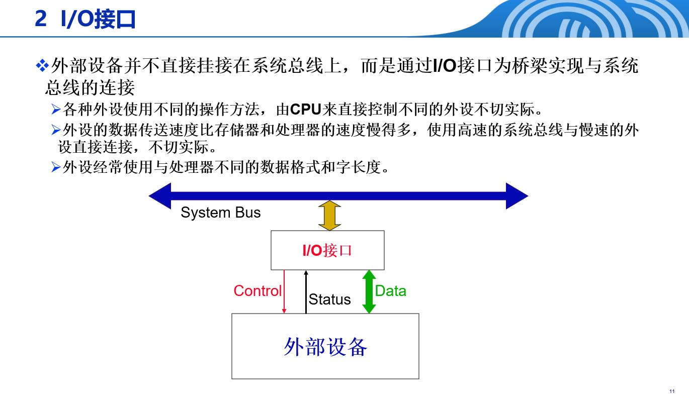

### 2.1 I/O接口的功能

| I/O接口的功能 | 解释 |
| :------------ | :--- |
| 识别I/O地址，即地址译码 | 能够识别CPU发出的I/O地址，判断当前操作是针对哪个I/O设备，就像给每个设备分配一个门牌号。 |
| 实现主机与I/O设备的数据交换、控制命令的传递和状态检测与传递 | 作为主机和外部设备之间的桥梁，负责传递数据、控制指令和设备状态信息，实现双向通信。 |
| 提供缓冲和驱动能力 | 临时存储数据以匹配主机和设备的处理速度差异，并提供足够的电信号驱动能力，确保信号能够正确传输。 |
| 进行数据格式、类型方面的转换（串并行转换，电平转换等） | 将串行数据转换为并行数据（或反之），以及进行不同电压电平之间的转换，使不同特性的设备能够与系统总线连接。 |
| 支持一定的I/O方式（程序查询、程序中断、DMA等） | 支持多种数据传输方式，如CPU主动查询、设备主动中断通知，或直接内存访问（DMA）等，提高系统效率。 |
| I/O控制与定时 | 控制I/O操作的时序和流程，确保数据传输在正确的时间点进行，协调各个操作步骤的执行顺序。 |

### 2.2 I/O接口的分类

| 分类标准 | 接口类型 | 描述 |
| :------- | :------- | :--- |
| 按传送数据格式 | 串行接口 | 适合速度低、传输距离长的环境 |
| 按传送数据格式 | 并行接口 | 适合速度高、传输距离短的环境 |
| 按I/O方式 | 程序查询接口 | - |
| 按I/O方式 | 中断接口 | - |
| 按I/O方式 | DMA接口 | - |
| 按I/O方式 | 通道控制接口 | - |
| 按时序控制方式 | 同步接口 | 数据传送由一个统一的时钟信号同步控制 |
| 按时序控制方式 | 异步接口 | 数据传送采用异步应答方式控制 |

### 2.3 I/O设备的编址

#### I/O设备的编址方式

| 特性 | 独立编址方式 | 统一编址方式 |
| :--- | :----------- | :----------- |
| **地址空间** | 存储器地址与I/O地址分开 | 存储器地址与I/O地址统一考虑 |
| **CPU指令** | CPU具有专用的I/O指令 | 支持存储器操作的指令都可用于I/O操作 |
| **系统总线** | 具有区别存储器读写和I/O操作的控制信号 | 通常不需额外的区分信号，I/O如同内存访问 |
| **典型代表** | x86 | MIPS、ARM |

#### I/O地址的定义

I/O地址（I/O接口地址，I/O端口地址）实际上是I/O接口电路中寄存器的地址（外设寄存器）。

### 2.4 I/O接口通用结构
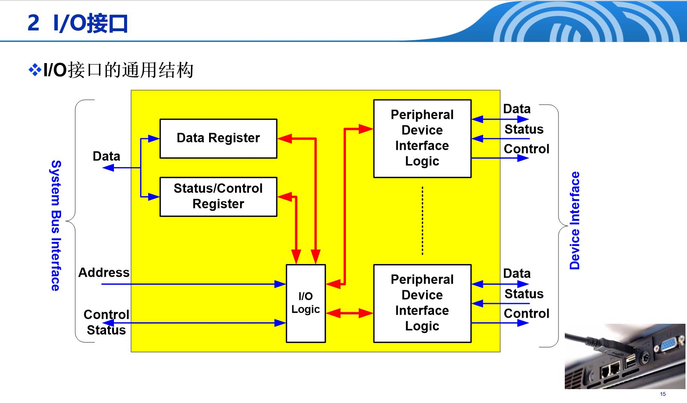

## 3.程序查询序查询I/O方式
定义：CPU通过I/O命令直接控制I/O
流程：
1. 检测设备状态(状态正常才启动，否则就一直检测)
2. 发送读写命令（处理器发送I/O命令后，必须等待，直到I/O接口状态就绪）
3. 传送数据

I/O命令：
1. 控制命令：激活外设完成动作。如指示磁带机快进或快退，控制命令与设备类型相关
2. 测试命令：测试与I/O接口及其外部设备的各种状态条件
3. 读命令：使I/O接口从外设获得一个数据项，存入内部缓冲区
4. 写命令：使I/O接口从数据总线获得一个数据项，然后传送到外设

程序查询I/O方式的特点：
1. I/O操作由CPU直接完成（通过执行I/O指令完成）
2.外设速度慢，CPU速度快，在外设准备过程中，CPU处在不断的查询之中，CPU的效率浪费严重。
3. 外设与CPU完全串行工作。

## 4.中断与中断I/O方式
定义：机器出现了一些紧急事务，CPU不得不停下当前正在执行的程序，转去处理紧急事务，当紧急事务处理完后，继续执行被中断的程序。
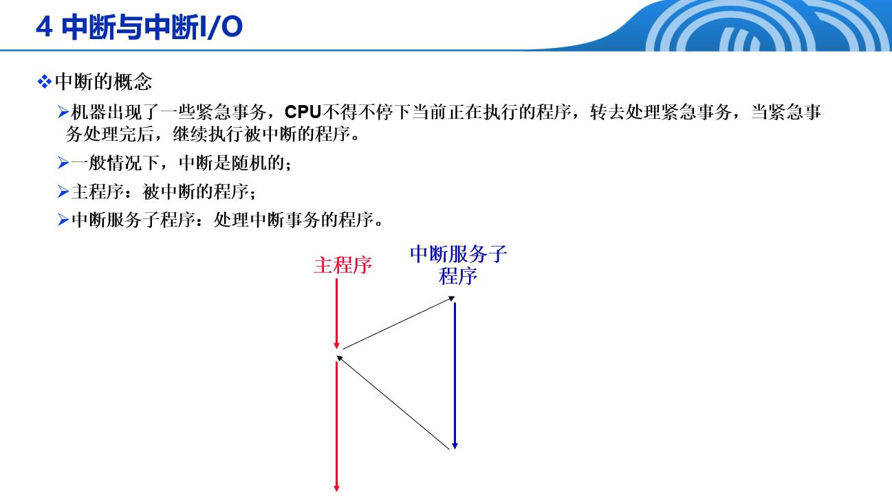
### 4.1中断分类
#### 引起中断的因素（中断源）

| 因素类型 | 具体示例/描述 |
| :------- | :------------ |
| 人为设置的中断 | 软中断 SWI：主动中断 |
| 程序性事故 | 如溢出、除"零"等 |
| 硬件故障 | 如电源掉电、磁盘损坏 |
| I/O操作 | I/O设备准备就绪，请求操作 |
| 外部事件 | 如键盘操作 |

#### 中断源分类

| 中断源分类 | 描述/示例 |
| :--------- | :-------- |
| 不可屏蔽中断 | CPU不能不响应；如电源掉电、总线奇偶位出错 |
| 可屏蔽中断 | 若中断源被屏蔽，CPU不响应 |

#### 中断的分类

| 分类名称 | 描述/备注 |
| :------- | :-------- |
| 非屏蔽中断与可屏蔽中断 | - |
| 硬中断与软中断 | 软中断不是真正的中断 |

### 4.2中断请求
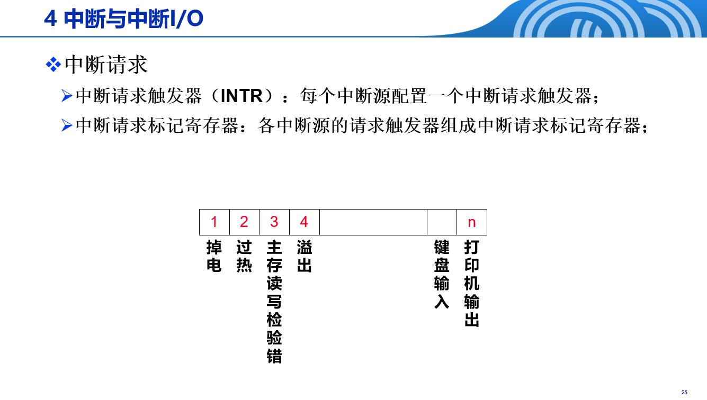
### 4.3中断流程
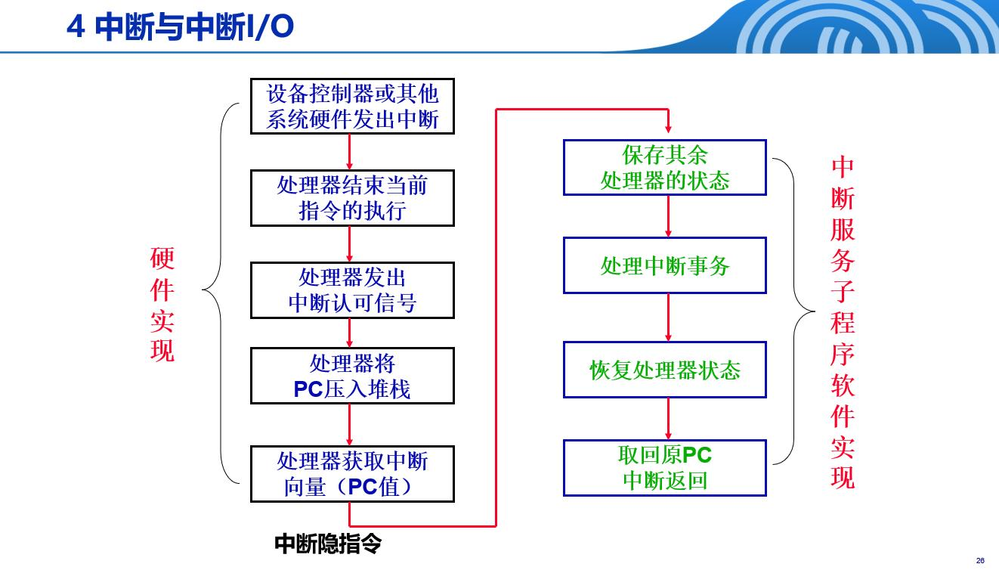

## 5.DMA I/O方式
定义：CPU对总线的控制被临时禁止。DMA控制器接管总线控制权，控制数据址信号直接在**存储器**与**外设**之间高速交换，CPU不再介入具体的I/O操作，而是可以转头处理其他事
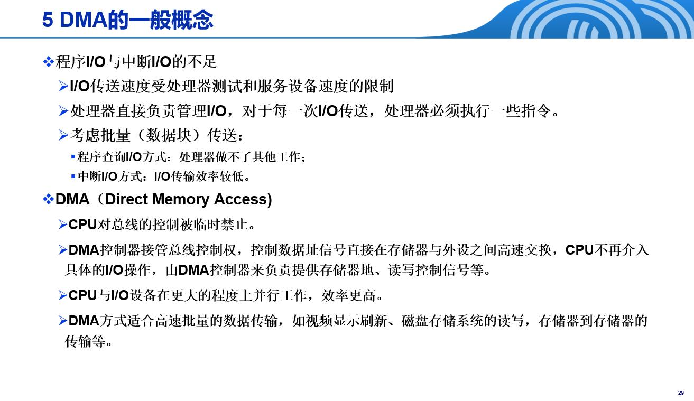

### 5.1 DMA 过程
##### 1. I/O接口向CPU发送DMA请求
接口做好数据传输的准备，通过有关逻辑向CPU发出DMA请求信号。

##### 2. CPU初始化DMA控制器
1. 设置数据传送方向：是请求读还是请求写（对存储器而言）
2. 设置I/O接口地址：DMA操作所涉及的I/O接口的地址
3. 设置存储器起始地址：读或写存储器的起始单元地址
4. 设置传送的数据数量：传送数据的字数
5. 有关中断方式的设置：DMA结束后通过中断方式请求CPU处理
   
##### 3. DMA将数据从接口传输到存储器
###### 传送方式1：停止CPU访问内存（成组传送方式）
一次DMA请求得到响应后，DMA控制器完全占用总线，进行块数据（多字）传送，直到所有数据传送完毕才释放总线，这段时间完全停止CPU访问内存。
适应高速外设与存储器交换数据的情况。

###### 传送方式2：周期窃取方式（单字传送方式，DMA和CPU交替使用总线）
每次DMA请求得到响应后，DMA控制器窃取一个总线周期完成一次数据传送，然后释放总线，CPU接着使用一个总线周期，然后DMA再窃取一个周期，这样持续循环下去，直到数据传输结束。
一般情况下，CPU 不访问存储器时释放总线
一般适应存储器速度远高于I/O设备速度的情况。

### 5.2 DMA控制器的结构
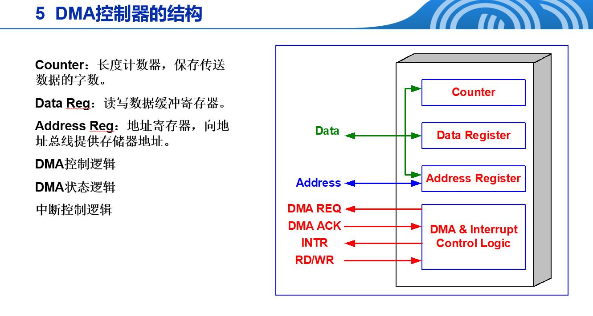

### 5.3 DMA控制器的类型
#### 选择型DMA控制器
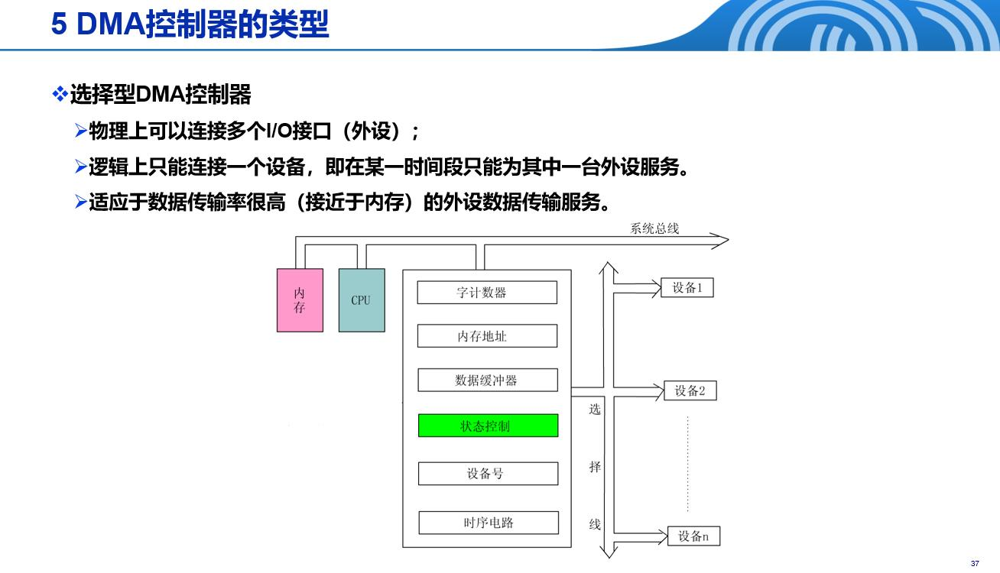
#### 多路型DMA控制器
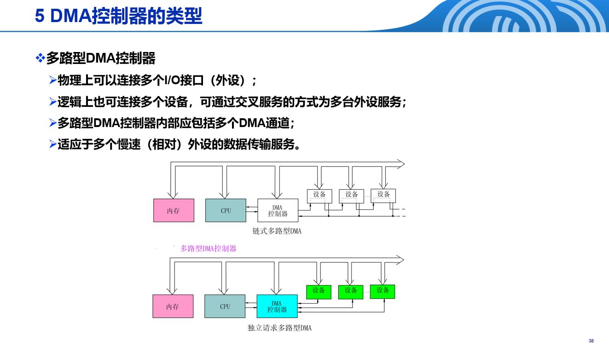