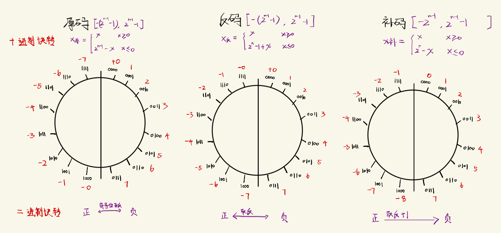
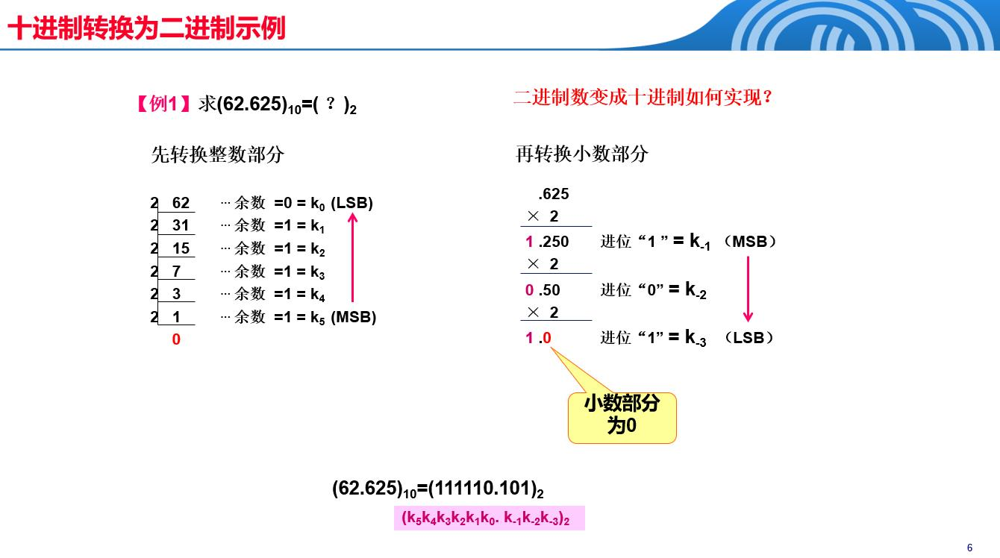
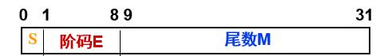
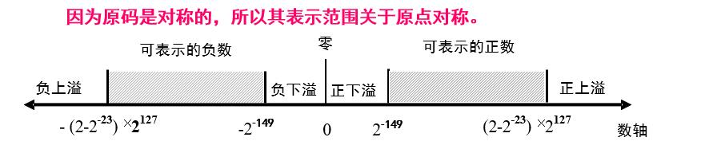
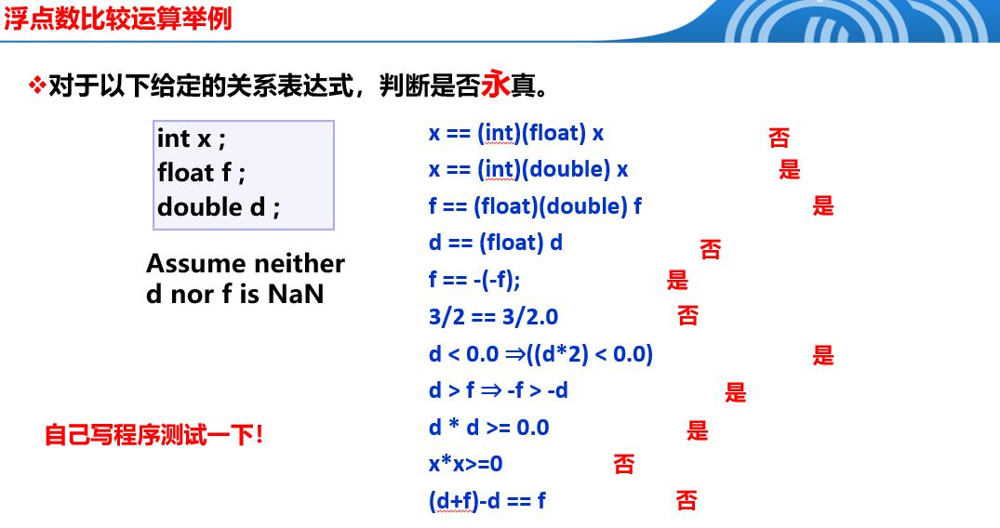

# 数值数据编码
## 1.定点数编码


### 2421BCD码
如何把$(10010110.1010)_{2421BCD}$转为10进制？
先按4位划分，然后乘以权重，自然排序即可
```
1001(2+1=3) 0110(4+2=6).1010(2+2=4)
自然排序：36.4
```
### 余3码
如何把$(10010110.1010)_{余3BCD}$转为10进制？
先按4位划分，然后变为10进制-3，自然排序即可
```
1001(9-3=6) 0110(6-3=3).1010(10-3=7)
自然排序：63.7
```


## 2.浮点数编码
### 2.1编码表示
$$浮点数=符号(S)+阶码(E)+尾数(M)$$
1. 数符 S： 1位，0表示正数，1   表示负数
2. 阶码 E：用移码表示，n 位阶码偏移量为 $2^{n-1}-1$
3. 尾数 M： 尾数必须规格化成小数点左侧一定为1，并且小数点前面这个1作为隐含位被省略。这样单精度浮点数尾数实际上为24位
  规格化数（尾数）形式：M=1.m
$$float=(-1)^S×1.m×2^{E-127}$$

浮点数类型|数符S|阶码E|尾数M
---|---|---|---
float|1位|8位|23位
double|1位|11位|52位

可以发现相邻float数之间的间隔随着E增大而增大

### 2.2表示范围

$最大整数=1.11…1×2^{11…1}=(2-2^{-23})×2^{127}$
$最小整数=0.00…1×2^{00…0}=1×2^{-149}$
注意：这里移码E=0，转化后为-127，但为了保持间距一致性，改为-126和启用非规范浮点数

阶码E|尾数M|浮点数float
---|---|---
E=0|M=0|$表示float=0$
E=0|M≠0|表示非规范浮点数<br>$float=(-1)^S×0.m×2^{-126}$
1≤E≤254|M≠0|表示规范浮点数<br>$float=(-1)^S×1.m×2^{E-127}$
E=255|M=0|$表示无穷大$
E=255|M≠0|$不是一个数$

### 2.3浮点数精度比较
数据类型|数据量级|有效数字(尾数M)
---|---|---
int|32位|32位
float|2^8-1-127=128位|24位
double|2^11-1-1023=1024位|53位

总结：
1. 高有效数字转低有效数字会造成精度缺失
2. 整型溢出会变号，浮点型溢出不会变号(编码形式决定)
3. 由于浮点数间距会随量级变化，大数+小数会吃掉小数



