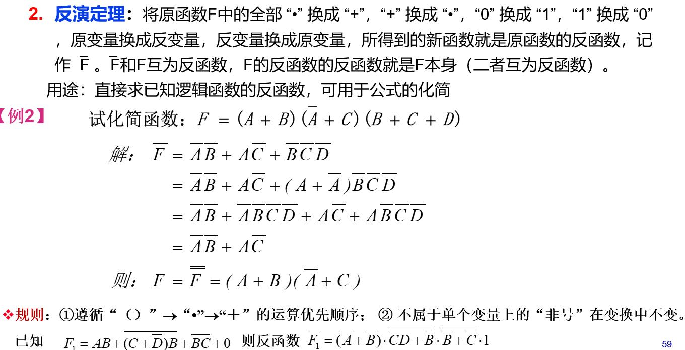
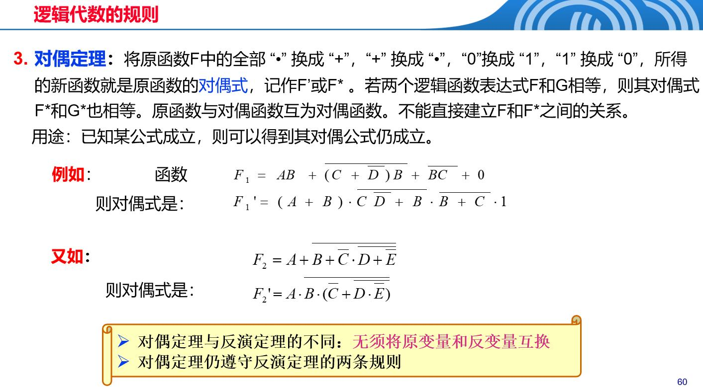
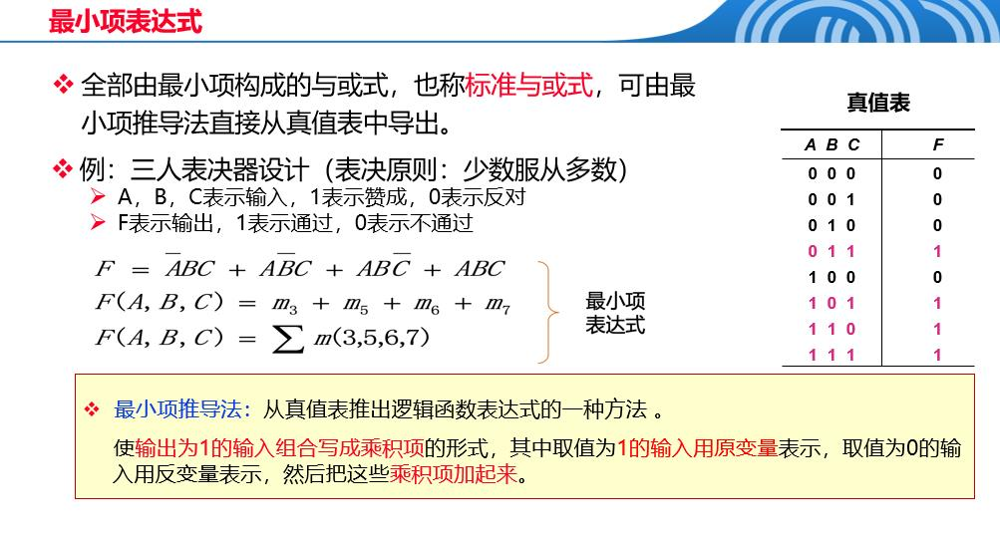
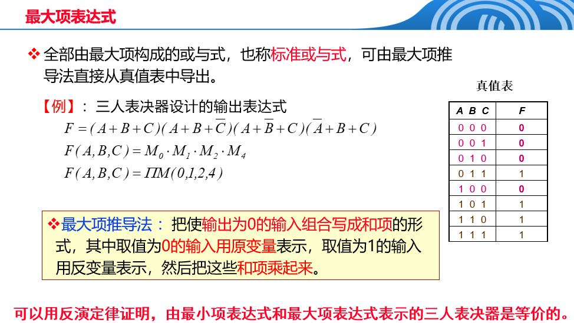
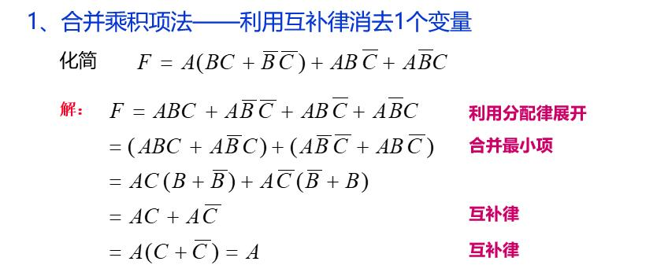
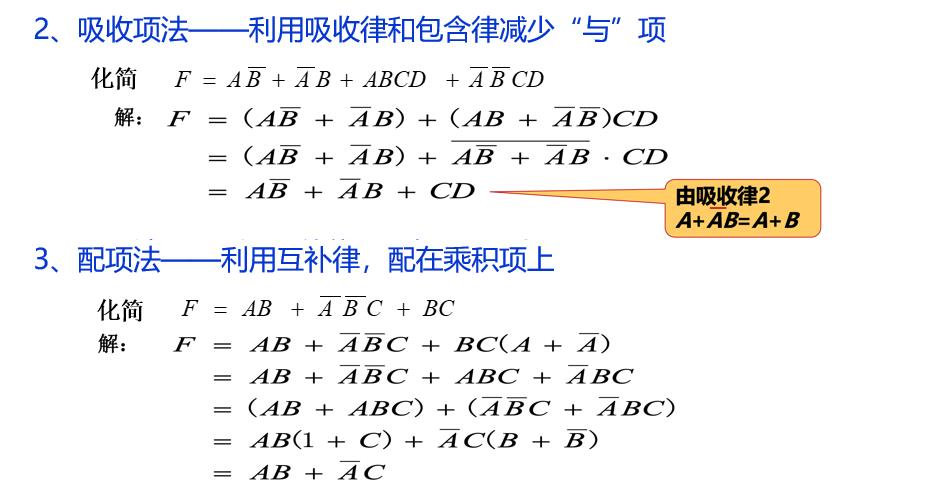

 布尔代数核心公式表

## 1.基本公理

| 定律 | 加法形式 | 乘法形式 |
|------|----------|----------|
| **交换律** | \( A + B = B + A \) | \( A \cdot B = B \cdot A \) |
| **结合律** | \( (A + B) + C = A + (B + C) \) | \( (A \cdot B) \cdot C = A \cdot (B \cdot C) \) |
| **分配律** | \( A + B \cdot C = (A + B) \cdot (A + C) \) | \( A \cdot (B + C) = A \cdot B + A \cdot C \) |
| **0-1律** | \( A + 0 = A \), \( A + 1 = 1 \) | \( A \cdot 1 = A \), \( A \cdot 0 = 0 \) |
| **互补律** | \( A + \bar{A} = 1 \) | \( A \cdot \bar{A} = 0 \) |

## 2.重要定理

| 定理名称 | 加法形式 | 乘法形式 |
|----------|----------|----------|
| **重叠律（幂等律）** | \( A + A = A \) | \( A \cdot A = A \) |
| **吸收律1** | \( A + A \cdot B = A \) | \( A \cdot (A + B) = A \) |
| **吸收律2** | \( A + \bar{A} \cdot B = A + B \) | \( A \cdot (\bar{A} + B) = A \cdot B \) |
| **还原律** | \( \bar{\bar{A}} = A \) | \( \bar{\bar{A}} = A \) |
| **摩根定律** | \( \overline{A + B} = \bar{A} \cdot \bar{B} \) | \( \overline{A \cdot B} = \bar{A} + \bar{B} \) |
| **包含律** | \( A \cdot B + \overline{A} \cdot C + B \cdot C = A \cdot B + \overline{A} \cdot C \) | \( (A + B) \cdot (\overline{A} + C) \cdot (B + C) = (A + B) \cdot (\overline{A} + C) \) |

## 3.逻辑代数规则



## 4.逻辑函数表达式
设某一逻辑电路的输入逻辑变量为A1，A2，…，An，输出逻辑变量为F。则称F为A1，A2，…，An的逻辑函数，记为：F = f ( A1，A2，…，An )
最小项表达式：全部由最小项构成的 与或式（积之和式）
最大项表达式：全部由最大项构成的 或与式（和之积式）
$$最小项表达式(example)：F(A,B,C)=\overline{A}\overline{B}C+\overline{A}B\overline{C}+A\overline{B}\overline{C}+ABC$$
$$最大项表达式(example)：F(A,B,C)=(A+B+C)(A+\overline{B}+C)(\overline{A}+\overline{B}+\overline{C})$$

### 4.1最小项表达式

| 最小项 | 取值 | 编号表示 |
|--------|------|----------|
| $\overline{A}\overline{B}\overline{C}$ | 000 | $m_0$ |
| $\overline{A}\overline{B}C$ | 001 | $m_1$ |
| $\overline{A}B\overline{C}$ | 010 | $m_2$ |
| $\overline{A}BC$ | 011 | $m_3$ |
| $A\overline{B}\overline{C}$ | 100 | $m_4$ |
| $A\overline{B}C$ | 101 | $m_5$ |
| $AB\overline{C}$ | 110 | $m_6$ |
| $ABC$ | 111 | $m_7$ |


### 4.2最大项表达式

| 最大项 | 取值 | 编号表示 |
|--------|------|----------|
| $\overline{A} + \overline{B} + \overline{C}$ | 111 | $M_7$ |
| $\overline{A} + \overline{B} + C$ | 110 | $M_6$ |
| $\overline{A} + B + \overline{C}$ | 101 | $M_5$ |
| $\overline{A} + B + C$ | 100 | $M_4$ |
| $A + \overline{B} + \overline{C}$ | 011 | $M_3$ |
| $A + \overline{B} + C$ | 010 | $M_2$ |
| $A + B + \overline{C}$ | 001 | $M_1$ |
| $A + B + C$ | 000 | $M_0$ |



## 5.逻辑函数化简

### 5.1 代数法
1. 利用对偶规则，将"或与"表达式→"与或表达式"
2. 化简"与或"表达式



| 原表达式 | 异或形式 | 说明 |
|----------|----------|------|
| $A\overline{B} + \overline{A}B$ | $A \oplus B$ | 基本异或 |
| $A\overline{B}C + \overline{A}B\overline{C}$ | $A \oplus B \oplus C$ | 连续异或 |
| $A\overline{B}\overline{C} + \overline{A}BC$ | **不能化简为异或** | 不是异或形式 |
| $A\overline{B}\overline{C}\overline{D} + \overline{A}BCD$ | **不能化简为异或** | 不是异或形式 |
| $A\overline{B}\overline{C} + \overline{A}BC + A\overline{B}C + \overline{A}B\overline{C}$ | $A \oplus B \oplus C$ | 三变量异或 |
| $A\overline{B}\overline{C}\overline{D} + \overline{A}BCD + A\overline{B}CD + \overline{A}B\overline{C}\overline{D}$ | $A \oplus B \oplus C \oplus D$ | 四变量异或 |
### 5.2 卡诺图化简法

#### 5.2.1 卡诺图的基本概念
卡诺图是一种图形化的逻辑函数化简方法，通过相邻性原理进行化简。

#### 5.2.2 二变量卡诺图
| B\A | 0 | 1 |
|-----|---|---|
| 0   | m₀| m₁|
| 1   | m₂| m₃|

**化简规则：**
- 相邻的1可以合并
- 相邻包括：水平相邻、垂直相邻、边界相邻

#### 5.2.3 三变量卡诺图
| BC\A | 0 | 1 |
|------|---|---|
| 00   | m₀| m₄|
| 01   | m₁| m₅|
| 11   | m₃| m₇|
| 10   | m₂| m₆|

**化简规则：**
- 2个相邻的1 → 消去1个变量
- 4个相邻的1 → 消去2个变量
- 8个相邻的1 → 消去3个变量

#### 5.2.4 四变量卡诺图
| CD\AB | 00 | 01 | 11 | 10 |
|-------|----|----|----|----|
| 00    | m₀ | m₄ | m₁₂| m₈ |
| 01    | m₁ | m₅ | m₁₃| m₉ |
| 11    | m₃ | m₇ | m₁₅| m₁₁|
| 10    | m₂ | m₆ | m₁₄| m₁₀|

**化简规则：**
- 2个相邻的1 → 消去1个变量
- 4个相邻的1 → 消去2个变量
- 8个相邻的1 → 消去3个变量
- 16个相邻的1 → 消去4个变量

#### 5.2.5 卡诺图化简步骤

**步骤1：画卡诺图**
- 根据变量个数选择相应的卡诺图
- 变量顺序要保证相邻格子只有一个变量不同

**步骤2：填1**
- 将逻辑函数中为1的最小项在卡诺图中标出
- 其余位置填0（通常省略不写）

**步骤3：画圈**
- 圈出相邻的1，形成矩形或正方形
- 每个圈必须包含2ⁿ个1（n=0,1,2,3...）
- 圈要尽可能大，数量尽可能少
- 每个1至少被一个圈包含

**步骤4：写表达式**
- 每个圈对应一个乘积项
- 在圈内，变量值相同的保留，不同的消去
- 变量值为0时取反，为1时取原变量

#### 5.2.6 化简示例

**例1：三变量函数化简**
$F(A,B,C) = \sum m(0,1,2,3,6,7)$

卡诺图：
```
BC\A | 0 | 1
-----|---|---
00   | 1 | 0
01   | 1 | 0  
11   | 1 | 1
10   | 1 | 1
```

化简结果：$F = \overline{A} + BC$

**例2：四变量函数化简**
$F(A,B,C,D) = \sum m(0,1,2,3,4,5,6,7,8,9,10,11)$

化简结果：$F = \overline{A} + \overline{B}$

#### 5.2.7 注意事项

1. **边界相邻**：卡诺图的左右边界、上下边界是相邻的
2. **圈要最大**：优先画大圈，再画小圈
3. **避免冗余**：每个圈至少包含一个未被其他圈包含的1
4. **包含所有1**：每个1都必须被至少一个圈包含

#### 5.2.8 卡诺图化简的优势

- **直观性强**：图形化表示，容易理解
- **系统性强**：有明确的步骤和规则
- **不易出错**：按规则操作，结果可靠
- **适合复杂函数**：对于多变量函数特别有效

