# 组合逻辑电路
## 1.组合逻辑设计概述
### 1.1组合逻辑电路特点
数字电路分类：组合逻辑电路和时序逻辑电路
组合逻辑电路：将逻辑门以一定的方式组合在一起，使其具有一定逻辑功能的数字电路。
组合逻辑电路是一种无记忆电路——任一时刻的输出信号仅取决于该时刻的输入信号，而与信号作用前电路原来所处的状态无关。

### 1.2组合逻辑电路分析
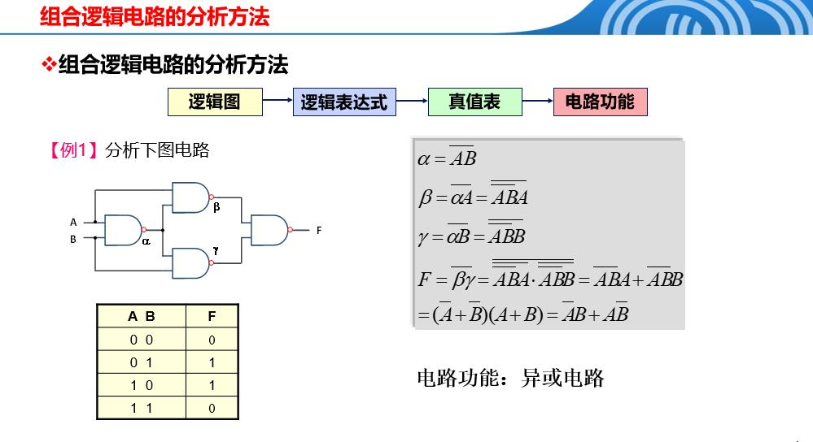

### 1.3组合逻辑电路设计
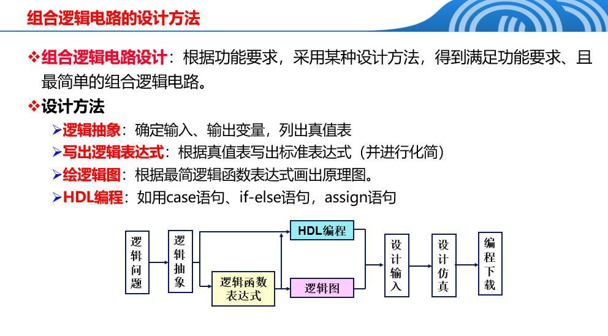

## 2.运算单元电路
### 2.1加法器
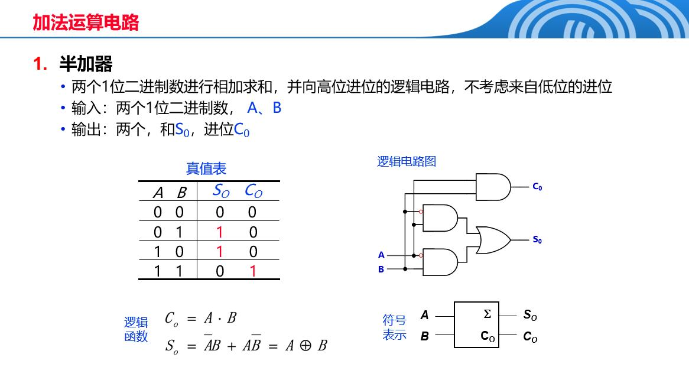
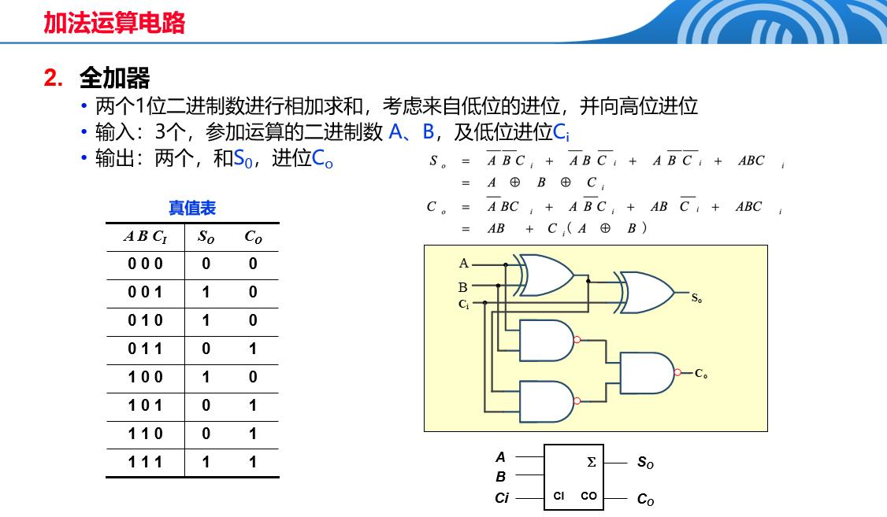
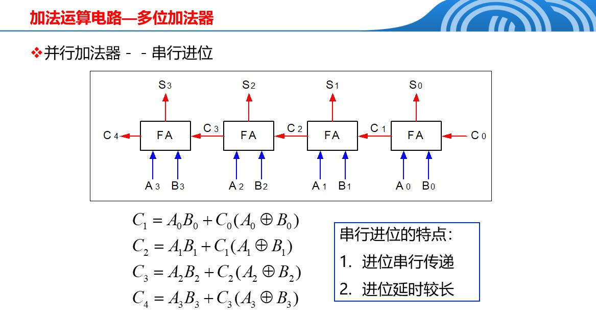
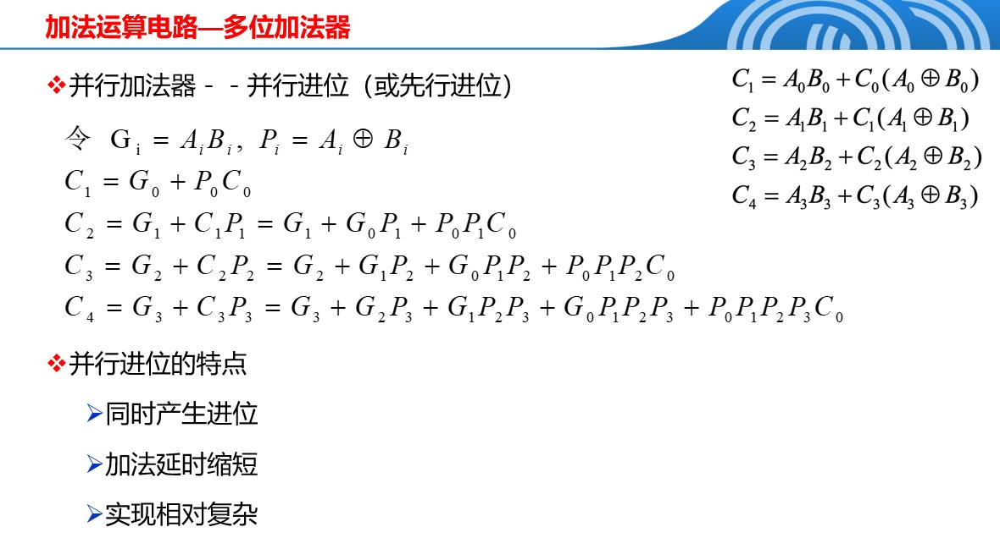

### 2.2用加法器实现减法
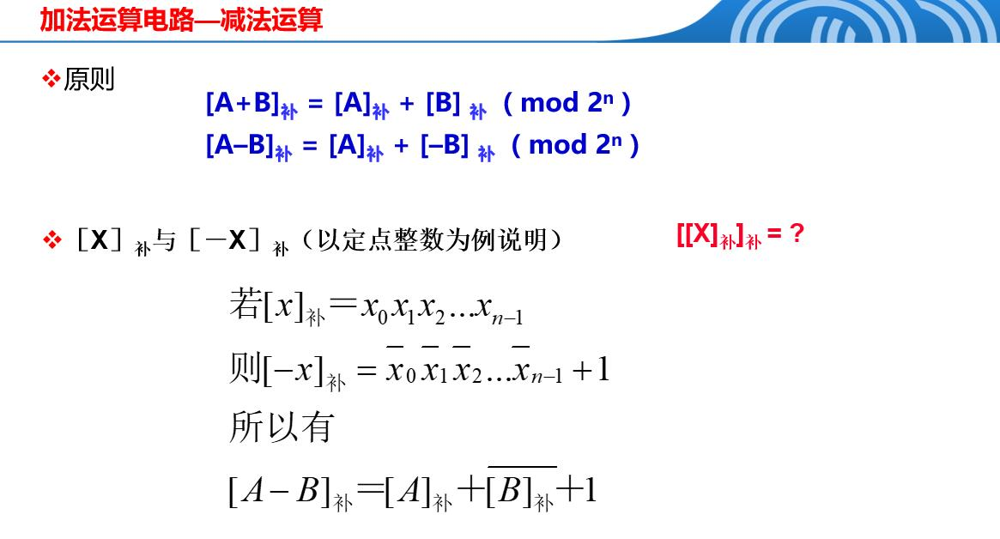
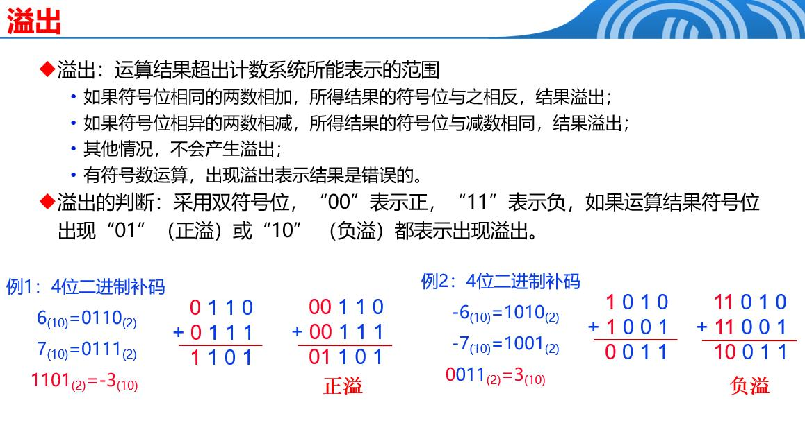

### 2.3 ALU
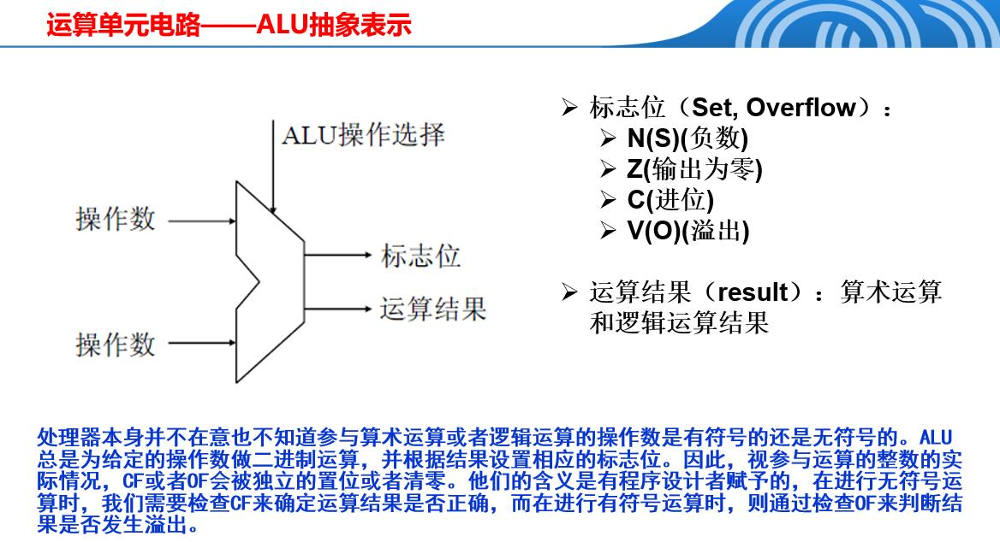

## 3. 编码器、译码器
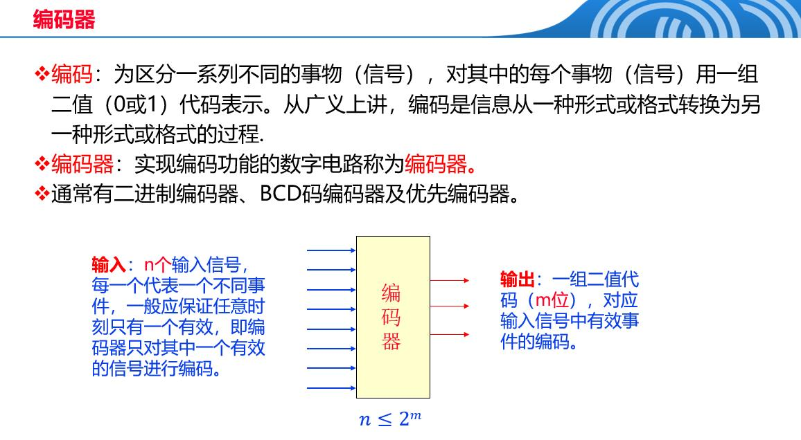
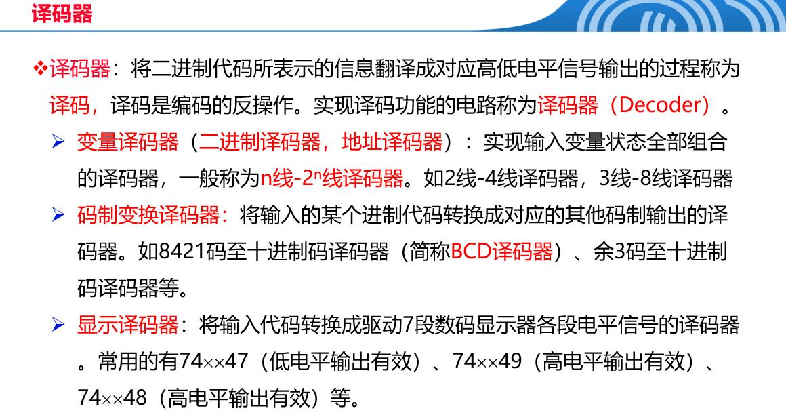
### 3.1 二进制编码器
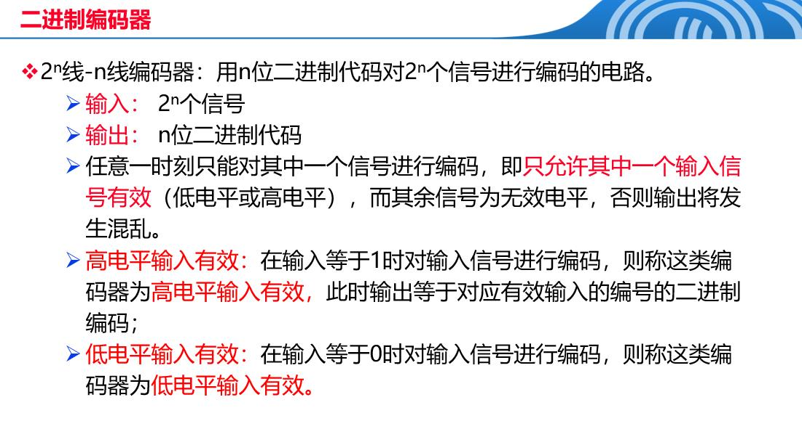
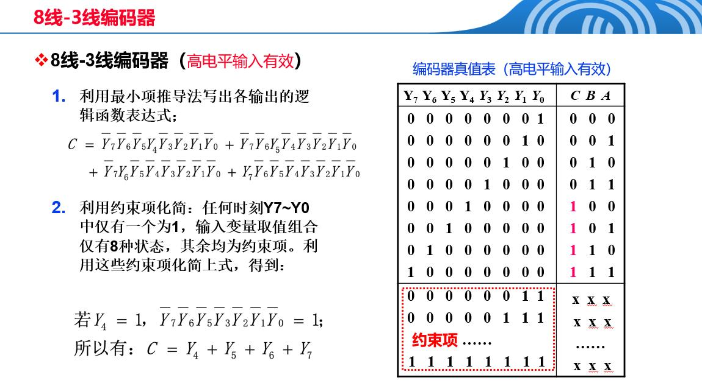
### 3.2 8421BCD码编码器
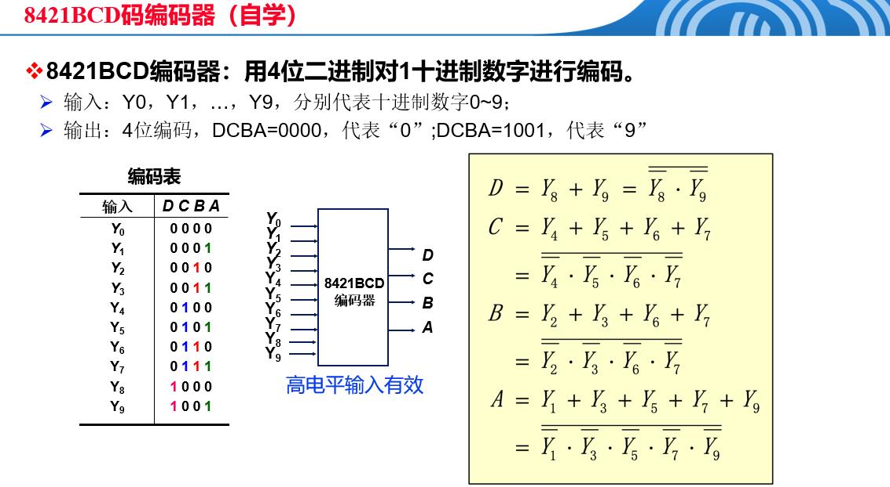
### 3.3 优先编码器
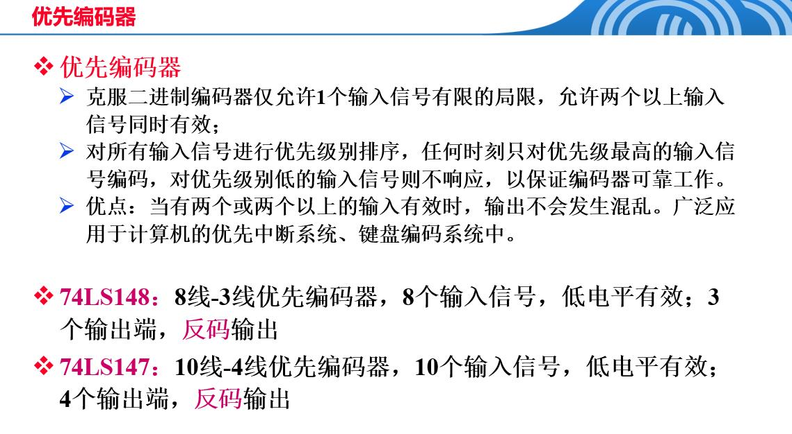

## 4.多路选择器
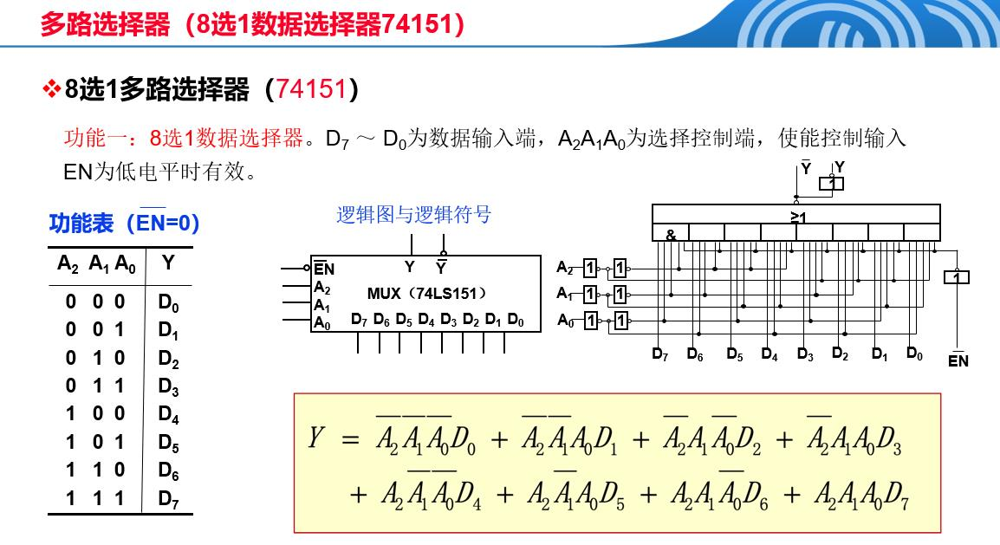

## 5.竞争冒险现象
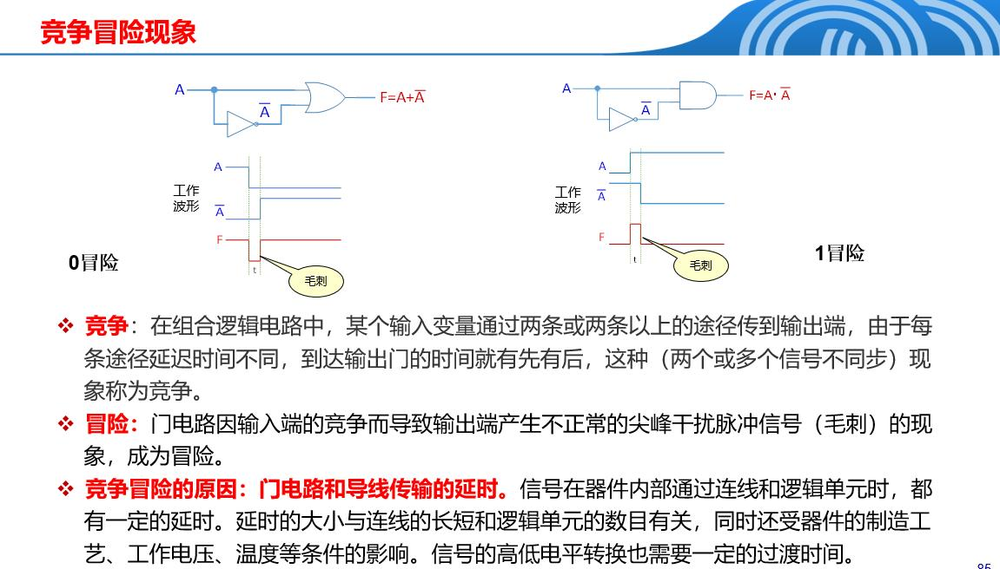
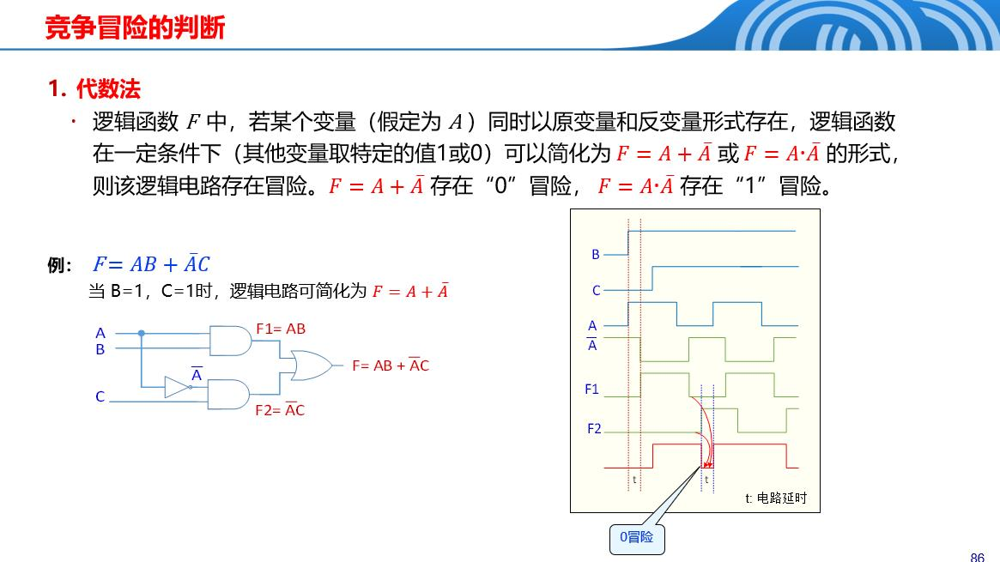
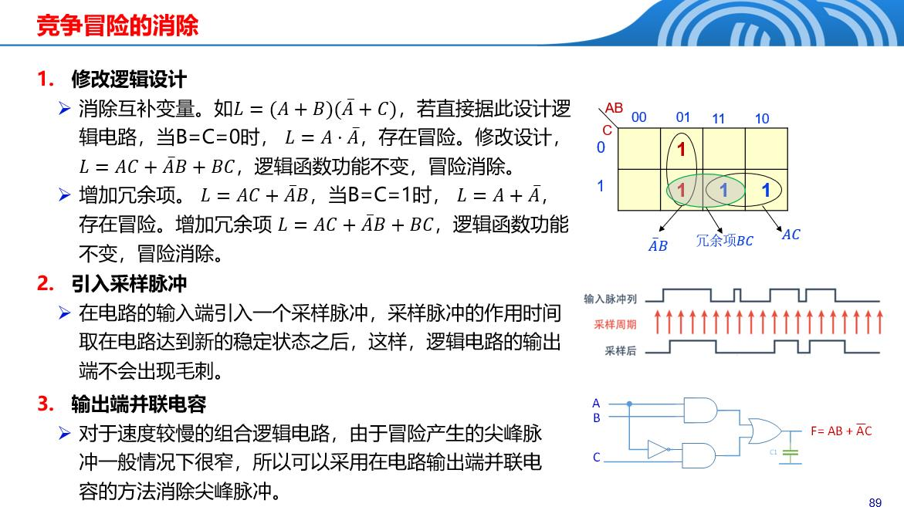