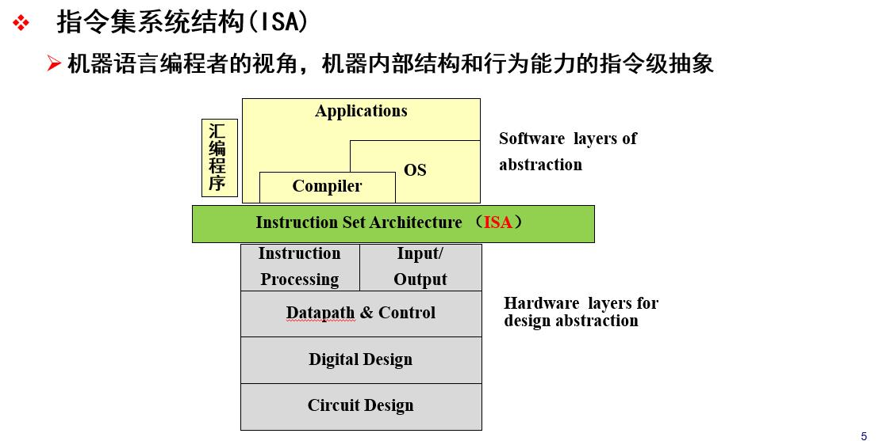
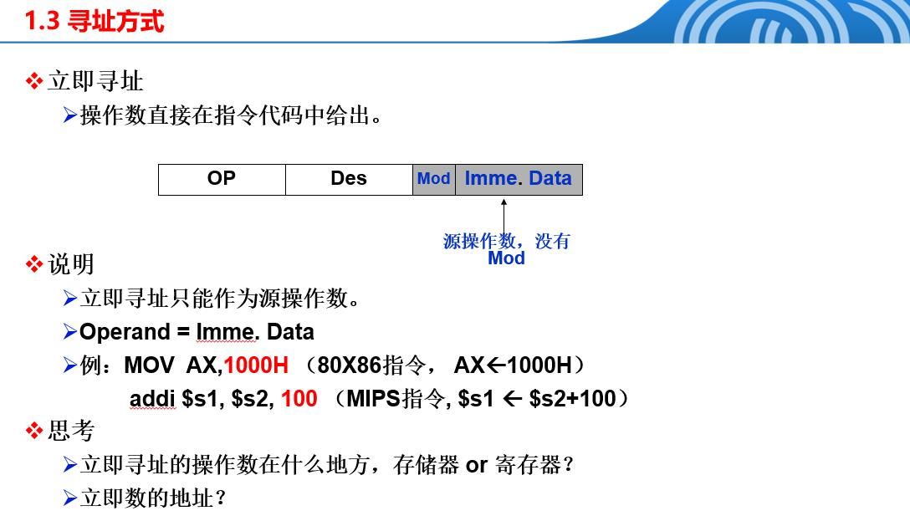
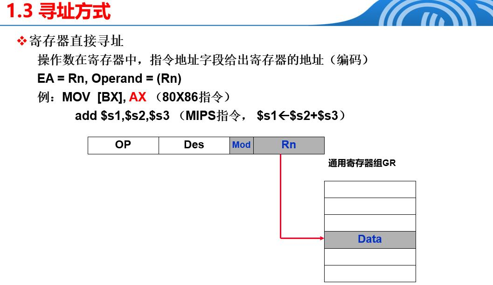
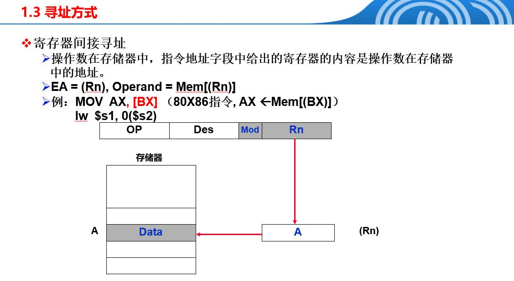
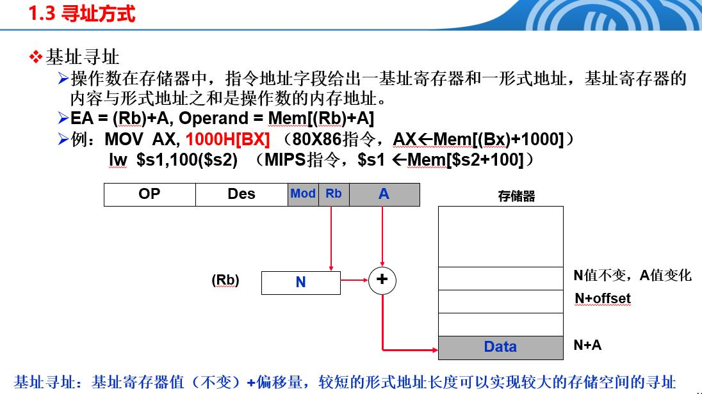
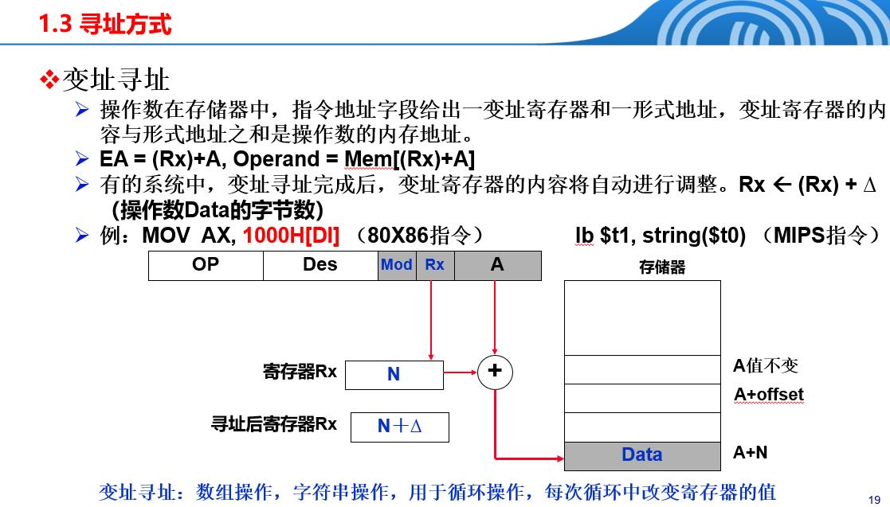
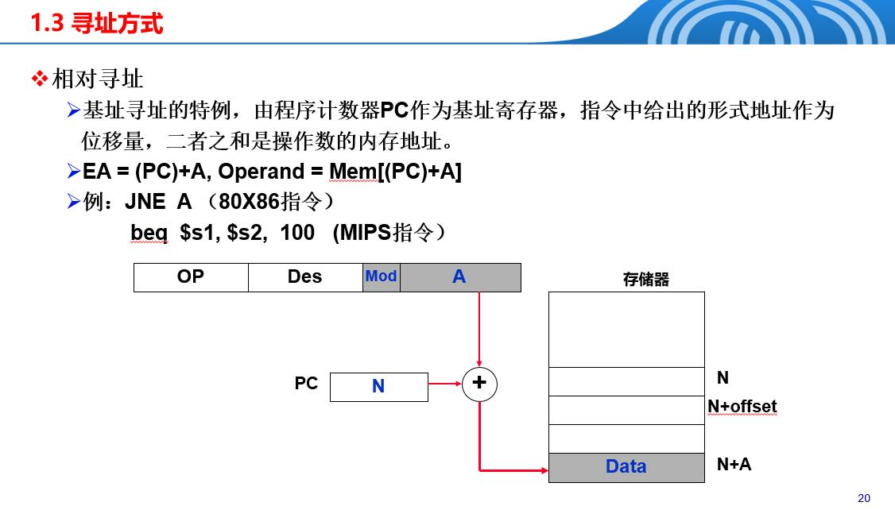
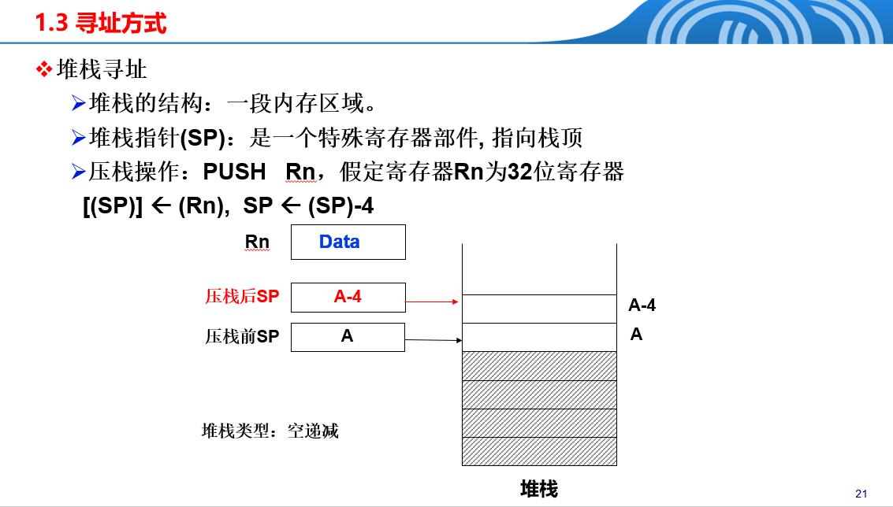

# 指令格式
## 1.指令格式概述
### 1.1机器指令的要素
| 要素      | 作用描述                 | 指令级体现                          | 典型形式                      |
| ------- | -------------------- | ------------------------------ | ------------------------- |
| 操作码     | 指定所要完成的操作类型          | 指令码字段                          | ADD、LOAD、BRANCH 等         |
| 源操作数地址  | 提供参与运算的操作数或其地址       | 立即数字段、寄存器编号、存储器形式地址            | Reg、Imm、Mem(Rb+Disp)      |
| 目的操作数地址 | 指定运算结果的存放位置          | 寄存器编号或存储器形式地址                  | Rd、Mem(EA)                |
| 下条指令地址    | 控制程序流向，显式或隐式给出后续指令地址 | 隐式：PC ← PC + IS<br>显式：相对/绝对偏移量 | PC+4（顺序）<br>PC+Offset（分支） |

### 1.2指令集系统结构(ISA)


### 1.3指令集系统结构(ISA)的种类

| 指令集架构类型 | 系统集结构类型 | 优点 | 缺点 | 典型应用 |
|------------|------------|------|------|---------|
| 堆栈结构 (Stack) | 简单、指令字长短 | • 指令格式简单<br>• 代码密度高<br>• 实现简单 | • 不能随机访问<br>• 形成瓶颈口影响性能<br>• 编译器优化困难 | 早期计算器、虚拟机 |
| 累加器结构 (Accumulator) | 内部状态最小 | • 能形成短指令<br>• 硬件实现简单<br>• 指令格式统一 | • 访问频繁<br>• 并行性差<br>• 寄存器利用率低 | 早期微处理器 |
| 通用寄存器 (General Purpose Register) | 具有生成代码的最通用形式 | • 编译效率高<br>• 并行性好<br>• 寄存器利用率高<br>• 支持复杂寻址模式 | • 指令长度增加<br>• 硬件复杂度高<br>• 功耗较大 | 现代处理器 (x86, ARM, MIPS) |
| 寄存器-存储器 (Register-Memory) | 混合型架构 | • 灵活性好<br>• 支持多种操作数类型<br>• 代码密度适中 | • 指令长度不固定<br>• 硬件设计复杂<br>• 流水线实现困难 | x86架构 |
| 寄存器-寄存器 (Register-Register) | 纯寄存器架构 | • 指令格式统一<br>• 流水线友好<br>• 并行性最佳<br>• 编译器优化容易 | • 指令数量多<br>• 代码密度较低<br>• 内存访问频繁 | RISC处理器 (MIPS, ARM) |

**寄存器-寄存器**:只能“拿”或“放”数据时接触内存，计算时只用“小抽屉”（寄存器）里的数。
```
LOAD R1, [内存地址A]  # 把仓库的数3搬进抽屉R1
LOAD R2, [内存地址B]  # 把仓库的数5搬进抽屉R2
ADD R3, R1, R2       # 抽屉R1+R2→结果存R3（计算只用抽屉）
STORE R3, [内存地址C] # 把结果搬回仓库
```
**寄存器-存储器**:可以一边翻仓库，一边直接算，省一步搬运！
```
MOV EAX, [内存地址A]  # 把仓库的数3搬进抽屉EAX
ADD EAX, [内存地址B]  # 抽屉EAX + 仓库的数5 → 结果存EAX（直接算！）
MOV [内存地址C], EAX # 结果搬回仓库
```

### 1.4指令类型
| 指令类型         | 通俗解释                                            | 生活比喻                                |
| ------------ | ----------------------------------------------- | ----------------------------------- |
| 数据传输  | 搬数据：把"数"从一个地方拷贝到另一个地方，不改动数值本身。      | 快递小哥：把包裹（数据）从仓库（内存）送到你家（寄存器），或者反着送。 |
| 算术逻辑| 做计算：加减乘除、与或非、移位等，改动数据。                  | 厨房大厨：把食材（数据）加工成菜（结果）。               |
| 程序控制  | 跳地方：让程序不按顺序走，跳到别处执行（比如if、for、函数调用）。 | GPS导航：遇到堵车（条件），就绕行（跳转）。         |
| 浮点运算 | 算小数：专门处理带小数点的数（如3.14、2.718）。            | 科学计算器：普通计算器算不了的小数，用它！               |

### 1.5通用寄存器的优势
| 优势       | 一句话解释                                              | 生活比喻                                            |
| -------- | -------------------------------------------------- | ----------------------------------------------- |
|快| 寄存器比内存快100倍！                           | 把常用工具放桌面（寄存器），比去地下室（内存）拿快多了！            |
|易 | 编译器（翻译代码的管家）最爱用寄存器，好安排。                | 管家安排任务：桌面就那么大，一眼看清，安排起来不纠结。             |
|  短 | 寄存器地址短（如R1、R2），指令更紧凑。                      | 写地址：写“R3”只要2字符，写“内存0x7FF12345678”要十几字符！ |
| 省 | 指令 shorter → 程序更小→ 占内存少→ 运行更快。 | 快递包装：盒子越小，运费越便宜，送货越快！                   |

## 2.指令格式
### 指令的表示
| 写法           | 是啥        | 举例                  | 人看得懂吗？                |
| ------------ | --------- | ------------------- | --------------------- |
| 机器表示     | 二进制，0和1   | `10110001 01100010` | ❌ 看不懂，CPU才懂           |
| 符号表示（汇编） | 英文缩写（助记符） | `MOV AX, BX`        | ✅ 人能看懂，意思是：把BX的值复制到AX |

### 操作数地址数目
| 地址数 | 格式示例             | 说明             |
| --- | ---------------- | -------------- |
| 三地址 | `ADD R3, R1, R2` | R3 = R1 + R2   |
| 双地址 | `ADD R1, R2`     | R1 = R1 + R2   |
| 单地址 | `NOT R1`         | R1 = ~R1       |
| 无地址 | `syscall`        | 啥都不写，CPU自己知道干啥 |

### 操作数的位置
| 住哪        | 通俗解释                    | 例子                      | 生活比喻                             |
| --------- | ----------------------- | ----------------------- | -------------------------------- |
| 立即数   | 直接写在指令里的常数，不用找  | `MOV EAX, 123` 里的 `123` | 外卖订单备注"多放辣椒"，随单送达，不用去仓库拿 |
| 寄存器   | 在CPU的"小抽屉"里，名字短 | `ADD AX, BX`            | 调料就放在灶台旁的小盒，伸手就够             |
| 存储器   | 在内存里，地址长        | `MOV EAX, [0x12345678]` | 调料放在地下室货架，得跑一趟               |
| I/O端口 | 在外设（键盘、显卡等）的"小窗口"   | `IN AL, 0x60`           | 去邻居家借糖，得专门走一扇门               |

### 操作数的类型
| 类型        | 举例                        | 说明                              |
| --------- | ------------------------- | ------------------------------- |
| 数值    | `int`, `float`, `double`  | 就是数字，分整数和小数         |
| 逻辑/字符 | `bool`, `char`, `"hello"` | 真/假、字母、一串文字         |
| 地址    | `0x00401000`              | 不是数据本身，而是"数据住哪"的门牌号 |

### 操作数的存储方式
| 次序     | 谁在前       | 内存低地址→高地址     | 生活比喻                 |
| ------ | --------- | ------------- | -------------------- |
| 大端 | 高字节在前 | `12 34 56 78` | 先写姓再写名：王小明 → 王在前 |
| 小端 | 低字节在前 | `78 56 34 12` | 先写名再写姓：王小明 → 明在前 |

### 操作码结构
#### 固定长度操作码
| 特点       | 解释                 | 生活比喻                       |
| -------- | ------------------ | -------------------------- |
| 长度固定 | 不管干啥，操作码永远N位   | 所有人名字都两个字：张三、李四、王五     |
| 硬件简单 | 解码器一看就知道"到哪结束" | 老师点名：一听两个字就知道是名字       |
| 速度快  | 不用猜，译码一步到位 | 快递分拣：只看固定区域就知道哪个城市 |
| 浪费空间 | 哪怕只干小事，也得占满整个坑 | 送个小信封，也得用大纸箱装，空隙多  |

#### 可变长度操作码
| 特点         | 解释                  | 生活比喻                               |
| ---------- | ------------------- | ---------------------------------- |
| 长度可变   | 常用指令短，冷门指令长 | 高频汉字"的"一笔，生僻字十几笔               |
| 像哈夫曼编码 | 越常用越短，越冷门越长 | 快递：北京上海用"京""沪"，偏远地区写全称 |
| 省空间    | 程序整体更小          | 写笔记：常用词写"d"，不常用写"的"    |
| 硬件复杂   | 得先猜操作码到哪结束  | 读文章：有的字一笔，有的十几笔，得慢慢数   |

### 指令长度
| 类型       | 解释                      | 举例                  | 生活比喻                       |
| -------- | ----------------------- | ------------------- | -------------------------- |
| 定长指令 | 所有指令一样长             | MIPS 全部32位（4字节） | 乐高积木：每块一样大，拼起来整整齐齐 |
| 变长指令 | 指令长度随意，但是字节的整数倍 | x86 1～15字节不等    | 俄罗斯方块：有长有短，拼满一行才行      |

## 3.寻址方式
指令只给了一个“线索”（形式地址），CPU得靠“寻址方式”算出真正的位置（有效地址）
| 名词       | 解释                       | 例子                      |
| -------- | ------------------------ | ----------------------- |
| 形式地址 | 指令里直接写出来的那个数/寄存器/偏移量 | `4($t2)` 里的 `4` 和 `$t2` |
| 有效地址 | 真正去内存拿数时用的地址         | `$t2 + 4` 算出来的结果        |

| 寻址方式        | 指令样子             | 有效地址怎么算？              | 生活比喻                               |
| ----------- | ---------------- | --------------------- | ---------------------------------- |
| 立即寻址    | `ADD R1, 42`     | 不用算，42就在指令里       | 外卖订单备注"多放两包番茄酱"，随单送达       |
| 寄存器直接寻址 | `ADD R1, R2`     | R2就是数，不用访存        | 调料就在灶台旁小盒，伸手拿                  |
| 寄存器间接寻址 | `ADD R1, (R2)`   | R2里存的是地址，按地址去内存拿数 | R2是张纸条，写着"地下室3排5号"，你得跑一趟   |
| 基址/变址寻址 | `lw $t1, 4($t2)` | 地址 = $t2 + 4     | 纸条写"从地下室3排开始，再走5格"             |
| 相对寻址    | `beq label`      | 地址 = PC + 偏移量     | 你站在第10节车厢，朋友说"往前走3节"       |
| 堆栈寻址    | `push/pop`       | 地址 = 栈顶指针自动+-     | 自助餐堆盘子，放一份就压一下，拿一份就弹一下 |

### 3.1寻址方式的确定
| 方法               | 谁来决定寻址方式？         | 指令长啥样？            | 代表架构     | 生活比喻                                         |
| ---------------- | ----------------- | ----------------- | -------- | -------------------------------------------- |
| **方法1：藏在操作码里**   | **操作码本身**就暗示了寻址方式 | **没有额外位**，看起来“干净” | **MIPS** | 饭店菜单写“**番茄炒蛋**”，**默认**就是**炒**，不用你选做法         |
| **方法2：专门给寻址方式位** | **额外几位**单独说“我怎么找” | **有专门的字段**说明      | **x86**  | 点外卖：选“**番茄炒蛋**”后，还要勾**炒/煮/蒸**，**每种菜都能选不同做法** |


## 3.2寻址方式缩写
| 缩写            | 全称                | 通俗解释                      | 生活比喻                        |
| ------------- | ----------------- | ------------------------- | --------------------------- |
| **OP**        | Operation Code    | **操作码**：告诉CPU“**干啥**”     | 菜单上的菜名：“**番茄炒蛋**”           |
| **Des**       | Destination       | **目的地**：结果要**放哪**         | 快递单上的“**收货地址**”             |
| **Sur**       | Source            | **来源地**：数据从**哪来**         | 快递单上的“**发货地址**”             |
| **A 或 Add**   | Address           | **形式地址**：指令里**直接写出来的地址**  | 纸条上写“**3楼5号**”              |
| **Mod**       | Mode              | **寻址方式**：说明**怎么找**操作数     | 纸条写“**3楼5号**”，但**是走路还是电梯？** |
| **Rn**        | Register n        | **通用寄存器**，CPU里的“**小抽屉**”  | 灶台旁的**调料盒**，伸手就够            |
| **Rx**        | Index Register    | **变址寄存器**：用来**加偏移**       | 地图上的“**X坐标**”，**往右走几步**     |
| **Rb**        | Base Register     | **基址寄存器**：**起点地址**        | 地图上的“**起点**”，**从这儿开始算**     |
| **SP**        | Stack Pointer     | **堆栈指针**：**栈顶**的地址        | 自助餐**盘子堆**最上面那个**盘子**       |
| **EA**        | Effective Address | **有效地址**：**真正去内存拿数时用的地址** | 你**实际走到的那间房**               |
| **Data**      | Data              | **纯数据**，不是地址              | **信封里的信**，不是信封上的地址          |
| **Operand**   | Operand           | **操作数**：要**参与运算的数**       | **炒菜用的鸡蛋**，不是锅              |
| **(Rn)**      | Content of Rn     | **寄存器里的值**                | 抽屉里**到底装了啥**                |
| **Mem\[A]**   | Memory\[A]        | **内存地址A里的内容**             | **3楼5号房间里的人**               |
| **Imme.Data** | Immediate Data    | **立即数**：**直接写在指令里的常数**    | 外卖备注“**多放辣椒**”，**不用去仓库拿**   |
| **XXH**       | Hex Number        | **十六进制数**                 | `0x1A2F` 就是**XXH**格式        |

## 3.3立即寻址

| 项目          | 说明                              |
| ----------- | ------------------------------- |
| **操作数在哪？**  | **直接写在指令里**，叫**立即数**（Imme.Data） |
| **能不能当结果？** | **只能当“源”**，**不能当“目的地”**         |
| **有没有地址？**  | **没有地址！**它就**跟在指令后面**，**不占地儿**  |

## 3.4寄存器直接寻址

| 项目           | 说明                             |
| ------------ | ------------------------------ |
| **操作数在哪？**   | **寄存器里**（CPU 的小抽屉）             |
| **指令给什么？**   | **寄存器编号**（Rn，比如 AX、\$s2）       |
| **有效地址 EA？** | **EA = Rn**（**寄存器本身就是地址**）     |
| **最终操作数？**   | **Operand = (Rn)**（**寄存器里的值**） |

## 3.5寄存器间接寻址

| 项目           | 说明                                      |
| ------------ | --------------------------------------- |
| **操作数在哪？**   | **内存里**（不是寄存器！）                         |
| **寄存器的作用？**  | **存地址**（当“指针”用）                         |
| **有效地址 EA？** | **EA = (Rn)** → **寄存器里的值就是地址**          |
| **最终操作数？**   | **Operand = Mem\[(Rn)]** → **去这个地址里拿数** |


## 3.6基址寻址

| 项目           | 说明                           |
| ------------ | ---------------------------- |
| **操作数在哪？**   | **内存里**                      |
| **谁提供“起点”？** | **基址寄存器 Rb**（放“基地址”）         |
| **谁提供“偏移”？** | **指令里的形式地址 A**（也叫 offset）    |
| **有效地址 EA？** | **EA = (Rb) + A**            |
| **最终操作数？**   | **Operand = Mem\[(Rb) + A]** |


## 3.7变址寻址

| 项目             | 说明                              |
| -------------- | ------------------------------- |
| **操作数在哪？**     | **内存里**                         |
| **谁提供“固定起点”？** | **指令里的形式地址 A**（比如数组首地址）         |
| **谁提供“移动脚步”？** | **变址寄存器 Rx**（循环里每次 +1/+2/...+△） |
| **有效地址 EA？**   | **EA = (Rx) + A**               |
| **最终操作数？**     | **Operand = Mem\[(Rx) + A]**    |

### 基址寻址和变址寻址区别
| 对比点       | 基址寻址        | 变址寻址         |
| --------- | ----------- | ------------ |
| 寄存器里存的是什么 | 基地址（起点）     | 变址量（偏移 / 下标） |
| 常变化的是     | 基址寄存器       | 变址寄存器        |
| 指令中给的是    | 偏移量         | 基地址          |
| 适合场景      | 结构体、栈、内存重定位 | 数组、循环        |
| 地址语义      | “从哪个区域开始”   | “第几个元素”      |


基址寻址侧重“定位对象 / 区域的起点”，适合结构体、栈帧、内存重定位；
变址寻址侧重“在区域内部按下标访问”，适合数组、循环遍历。


## 3.8相对寻址

| 项目           | 说明                                  |
| ------------ | ----------------------------------- |
| **谁当基址寄存器？** | **PC（程序计数器）**——**当前指令地址**           |
| **谁当偏移？**    | **指令里的形式地址 A**（也叫 **displacement**） |
| **有效地址 EA？** | **EA = (PC) + A**                   |
| **用途？**      | **跳转指令**（if、while、for、函数调用）         |


## 3.9堆栈寻址

| 项目          | 说明                                  |
| ----------- | ----------------------------------- |
| **操作数在哪？**  | **内存里的一段特殊区域——堆栈**                  |
| **谁当指针？**   | **SP（Stack Pointer）寄存器**，**永远指向栈顶** |
| **怎么找操作数？** | **EA = (SP)**，**不需要指令再给地址**         |
| **典型操作？**   | **PUSH（压盘）/ POP（取盘）**               |


