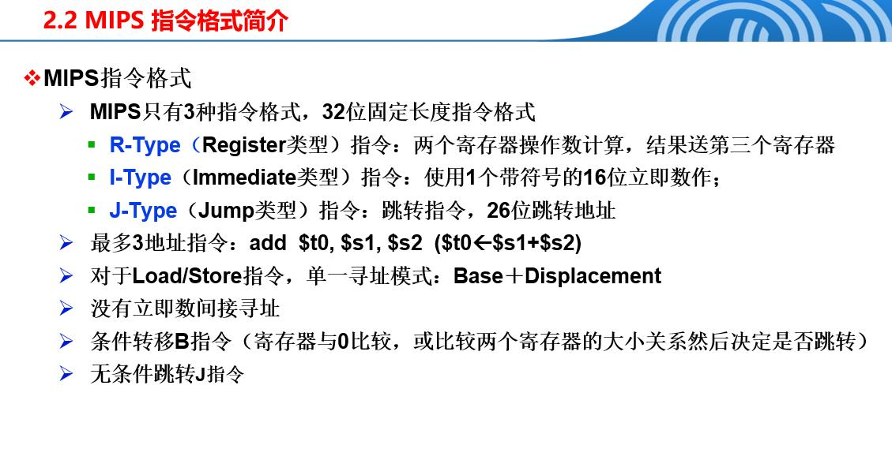
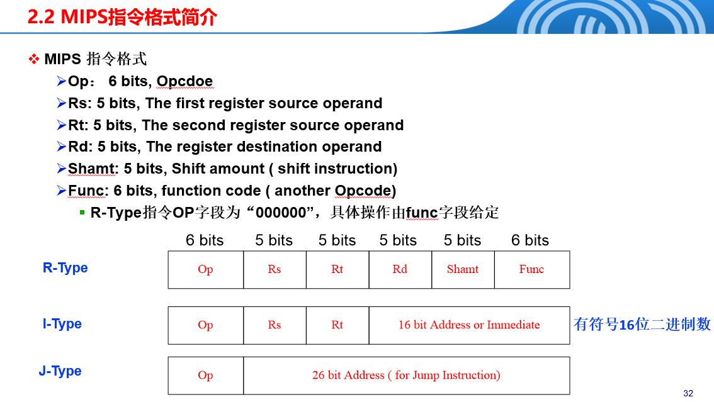
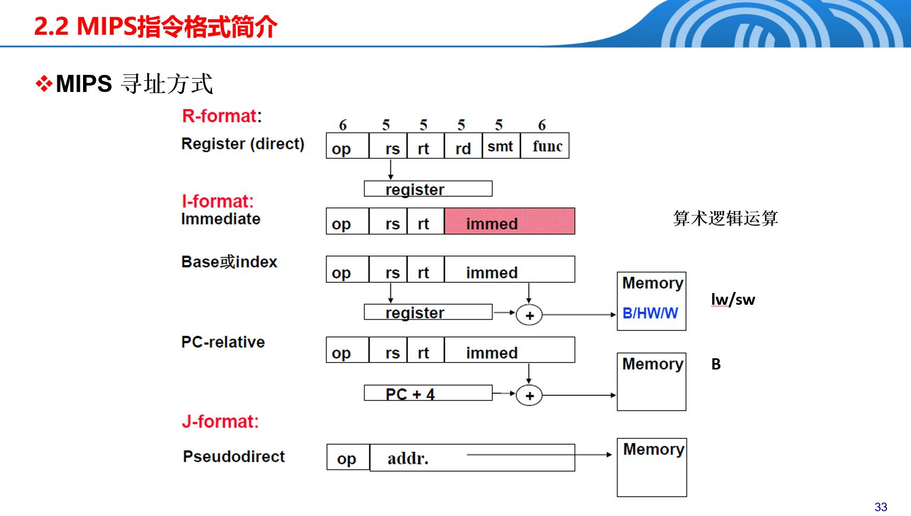

# MIPS指令
## 1.基础概念



1. R-Type（寄存器类型）
用途：执行寄存器之间的算术和逻辑操作。
格式：
Op（操作码）：6 位，指示要执行的操作类型。
Rs（源寄存器1）：5 位，第一个操作数所在的寄存器编号。
Rt（源寄存器2）：5 位，第二个操作数所在的寄存器编号。
Rd（目的寄存器）：5 位，结果要存储的寄存器编号。
Shamt（移位量）：5 位，用于位移操作的位数。
Func（功能码）：6 位，进一步指定操作的具体类型。

2. I-Type（立即数类型）
用途：执行需要立即数（即常数）的操作，如加载数据到寄存器。
格式：
Op（操作码）：6 位，指示要执行的操作类型。
Rs（源寄存器）：5 位，操作数所在的寄存器编号。
Rt（目的寄存器）：5 位，结果要存储的寄存器编号。
立即数（16位）：16 位，直接在指令中给出的常数值。

3. J-Type（跳转类型）
用途：执行跳转操作，改变程序的执行流。
格式：
Op（操作码）：6 位，指示要执行的操作类型。
跳转地址（26位）：26 位，指定跳转的目标地址。

## 2.常用代码
### 2.1读取数据
#### 2.1.1键盘读入
```py
li $v0, 5(常数)       # $v0⬅5，表示读取整数 
syscall         # 执行系统调用，结果放在v0
move $t0, $v0   # t0⬅v0
```
#### 2.1.2常数读入
```py
.data
prompt_a: .asciiz "Enter integer a: "
```

### 2.2输出数据
```py
li $v0, 4           # $v0⬅4，表示打印字符串
la $a0, prompt_a    # a0⬅prompt_a
syscall
```
```py
li $v0, 1       # $v0⬅1，表示打印整数
lw $a0, sum     # a0⬅sum
syscall         # 执行系统调用
```

### 2.3退出程序
```py
li $v0, 10      # $v0⬅10，表示退出程序
syscall         # 执行系统调用
```

### 2.4分支结构
```py
beq $t2, $t3, subtract_op  #如果t2==t3，跳转到subtract_op
blt $t0, $t1, not_prime    #如果t0<t1，跳转到not_prime
bgt $t1, $t4, is_prime     #如果t1>t4，跳转到is_prime
ble $t0, $t1, less_equal   #如果t0<=t1，跳转到 less_equal
bge $t5, $t0, check        #如果t5>=t0，跳转到check 
bne $t0, $t1, not_equal    #如果$t0≠$t1，跳转到标签 not_equal
j end

subtract_op:
    sub $t4, $t0, $t1  # $t4 = $t0 - $t1
    j print_result

print_result:
    ……

end:
    ……
```
### 2.5数值计算
```py
add $t4, $t0, $t1  # $t4 = $t0 + $t1
sub $t4, $t0, $t1  # $t4 = $t0 - $t1
mul $t4, $t0, $t1  # $t4 = $t0 * $t1

div $t0, $t1       # $t0 / $t1
mflo $t4           # t4为商
mfhi $t5           # t5为余数
```
### 2.6数组
```py
.data
array: .space 500      # 分配500个字节的空间，每个字节存储一个数字
sb $t0, array          # array[0] = t0
sb $zero, array($t1)   # array[t1] = 0
lb $t6, array($t1)     # t6 = array[t1]
```
```py
.data
string: .space 1001

li $v0, 8         # 服务码8，读取字符串
la $a0, string    # 将string的地址加载到$a0
move $a1, $t0     # 加1以包含字符串结束符'\0'
syscall           # 调用系统服务

li $v0, 4          # 服务码4，打印字符串
la $a0, string     # 加载字符串地址
syscall            # 调用系统服务
```

### 2.7寄存器与内存
| 指令     | 功能       | 数据大小     | 是否符号扩展  | 方向       |
|---------|-----------|-------------|-------------|-----------|
| **lb**  | 加载字节到寄存器 | 1 字节（8位） | 是（符号扩展） | 内存 → 寄存器 |
| **sb**  | 存储字节到内存  | 1 字节（8位） | 否          | 寄存器 → 内存 |
| **lw**  | 加载字到寄存器  | 1 字（32位） | 否          | 内存 → 寄存器 |
| **sw**  | 存储字到内存   | 1 字（32位） | 否          | 寄存器 → 内存 |

### 2.8常见指令
#### 2.8.1 la（Load Address）- 加载地址
**功能**：将标签或变量的地址加载到寄存器中  
**格式**：`la $rd, label`  
**说明**：la是伪指令，用于将内存中标签的地址加载到目标寄存器。常用于加载数组、字符串等变量的地址。

```py
.data
array: .space 100
string: .asciiz "Hello"

.text
la $t0, array      # $t0 = array的地址
la $a0, string     # $a0 = string的地址（常用于系统调用）
```

#### 2.8.2 li（Load Immediate）- 加载立即数
**功能**：将立即数（常数）加载到寄存器中  
**格式**：`li $rd, immediate`  
**说明**：li是伪指令，用于将常数直接加载到寄存器。常用于设置系统调用服务码、初始化变量等。

```py
li $v0, 5          # $v0 = 5（系统调用：读取整数）
li $v0, 1          # $v0 = 1（系统调用：打印整数）
li $v0, 4          # $v0 = 4（系统调用：打印字符串）
li $v0, 10         # $v0 = 10（系统调用：退出程序）
li $t0, 100        # $t0 = 100
li $t1, -5         # $t1 = -5
```

#### 2.8.3 jal（Jump And Link）- 跳转并链接
**功能**：跳转到指定地址，并将返回地址（PC+4）保存到$ra寄存器  
**格式**：`jal label` 或 `jal $rd, label`  
**说明**：jal用于函数调用，跳转到函数地址的同时保存返回地址到$ra（或指定的寄存器），函数执行完毕后可通过jr返回。

```py
main:
    li $t0, 10
    jal function    # 跳转到function，$ra = 返回地址
    # 函数返回后继续执行这里
    li $v0, 10
    syscall

function:
    addi $t0, $t0, 1
    jr $ra          # 返回到调用者（返回到$ra保存的地址）
```

#### 2.8.4 jr（Jump Register）- 寄存器跳转
**功能**：跳转到寄存器中保存的地址  
**格式**：`jr $rs`  
**说明**：jr用于从函数返回，通常与jal配合使用。跳转到$ra（或指定寄存器）中保存的地址，实现函数返回。

```py
# 函数调用示例
main:
    jal my_function    # 调用函数，$ra保存返回地址
    # 函数返回后继续执行
    li $v0, 10
    syscall

my_function:
    # 函数体
    addi $t0, $t0, 1
    jr $ra             # 返回到main（跳转到$ra中的地址）

# 也可以用于间接跳转
la $t0, target_label
jr $t0                 # 跳转到$t0中保存的地址
```

## 3.伪指令

伪指令是汇编器提供的便捷指令，它们会被汇编器转换为一条或多条真实指令。

| 中文名称 | 助记符 | 英文全称 | 格式 | 功能 | 使用示例 |
|---------|--------|----------|------|------|----------|
| 取地址 | `la` | Load Address | `la $rd, label` | 将标签或变量的地址加载到寄存器中 | `la $s0, table` // table是一个地址标签<br>`la $a0, string` // 加载字符串地址 |
| 取立即数 | `li` | Load Immediate | `li $rd, immediate` | 将立即数（常数）加载到寄存器中 | `li $v0, 10` // $v0 = 10<br>`li $t0, 100` // $t0 = 100 |
| 移动 | `move` | Move | `move $rd, $rs` | 将源寄存器的值复制到目标寄存器 | `move $t8, $sp` // $t8 = $sp<br>`move $t0, $v0` // $t0 = $v0 |
| 乘 | `mul` | Multiply | `mul $rd, $rs, $rt` | 两个寄存器相乘，结果存储在目标寄存器 | `mul $t2, $a0, $a1` // $t2 = $a0 × $a1<br>`mul $t4, $t0, $t1` // $t4 = $t0 × $t1 |
| 除 | `div` | Divide | `div $rd, $rs, $rt` | 两个寄存器相除，结果存储在目标寄存器 | `div $s1, $v1, $t7` // $s1 = $v1 ÷ $t7<br>`div $t2, $t0, $t1` // $t2 = $t0 ÷ $t1 |
| 求余 | `rem` | Remainder | `rem $rd, $rs, $rt` | 两个寄存器求余，结果存储在目标寄存器 | `rem $s2, $v1, $t7` // $s2 = $v1 % $t7<br>`rem $t3, $t0, $t1` // $t3 = $t0 % $t1 |
| 取反 | `neg` | Negate | `neg $rd, $rs` | 对寄存器中的值取反（0 - 值） | `neg $s0, $s0` // $s0 = -$s0<br>`neg $t1, $t0` // $t1 = -$t0 |

## 4.跳转和转移指令

跳转和转移指令用于控制程序执行顺序。

### 4.1跳转指令（Jump Instructions）

**类型**：J型指令（使用26位绝对目标地址）或R型指令（使用32位寄存器地址）

**功能**：无条件跳转到指定地址

| 指令 | 英文全称 | 格式 | 功能 | 使用示例 |
|------|----------|------|------|----------|
| `J` | Jump | `j label` | 无条件跳转到标签地址 | `j end` // 跳转到end标签<br>`j loop` // 跳转到loop标签 |
| `JAL` | Jump And Link | `jal label` | 跳转并链接，将返回地址保存到$ra，用于函数调用 | `jal function` // 调用函数，$ra保存返回地址<br>`jal print_num` // 调用打印函数 |
| `JR` | Jump Register | `jr $rs` | 寄存器跳转，跳转到寄存器中保存的地址，用于函数返回 | `jr $ra` // 返回到调用者<br>`jr $t0` // 跳转到$t0中的地址 |
| `JALR` | Jump And Link Register | `jalr $rd, $rs` | 寄存器跳转并链接，跳转到$rs中的地址，返回地址保存到$rd | `jalr $ra, $t0` // 跳转到$t0，返回地址保存到$ra |

### 4.2转移指令（Branch Instructions）

**类型**：I型指令，使用PC相对寻址模式，16位偏移量（立即数）相对于程序计数器

**功能**：根据条件决定是否跳转

| 指令 | 英文全称 | 格式 | 功能 | 使用示例 |
|------|----------|------|------|----------|
| `BEQ` | Branch if Equal | `beq $rs, $rt, label` | 如果$rs == $rt，则跳转到label | `beq $t2, $t3, equal` // 如果$t2==$t3，跳转<br>`beq $t0, $zero, zero_case` // 如果$t0==0，跳转 |
| `BNE` | Branch if Not Equal | `bne $rs, $rt, label` | 如果$rs != $rt，则跳转到label | `bne $t0, $t1, not_equal` // 如果$t0≠$t1，跳转<br>`bne $a0, $zero, non_zero` // 如果$a0≠0，跳转 |
| `BLEZ` | Branch if Less than or Equal to Zero | `blez $rs, label` | 如果$rs <= 0，则跳转到label | `blez $t0, negative_or_zero` // 如果$t0<=0，跳转 |
| `BGTZ` | Branch if Greater Than Zero | `bgtz $rs, label` | 如果$rs > 0，则跳转到label | `bgtz $t0, positive` // 如果$t0>0，跳转 |
| `BLTZ` | Branch if Less Than Zero | `bltz $rs, label` | 如果$rs < 0，则跳转到label | `bltz $t0, negative` // 如果$t0<0，跳转 |
| `BGEZ` | Branch if Greater than or Equal to Zero | `bgez $rs, label` | 如果$rs >= 0，则跳转到label | `bgez $t0, non_negative` // 如果$t0>=0，跳转 |
| `BLTZAL` | Branch if Less Than Zero And Link | `bltzal $rs, label` | 如果$rs < 0，则跳转并链接（保存返回地址到$ra） | `bltzal $t0, negative_func` // 如果$t0<0，调用函数 |
| `BGEZAL` | Branch if Greater than or Equal to Zero And Link | `bgezal $rs, label` | 如果$rs >= 0，则跳转并链接（保存返回地址到$ra） | `bgezal $t0, non_neg_func` // 如果$t0>=0，调用函数 |

## 5.Load/Store指令和算术指令

### 5.1 Load/Store指令（取数/存储指令）

**类型**：I型指令

**功能**：在内存和通用寄存器之间传输数据

**寻址模式**：仅支持一种内存寻址模式——**基址+偏移量**（Base+Index）

#### 5.1.1 取数指令（Fetch Instructions）

| 指令 | 英文全称 | 格式 | 功能 | 数据大小 | 符号扩展 | 使用示例 |
|------|----------|------|------|----------|----------|----------|
| `LB` | Load Byte | `lb $rt, offset($rs)` | 从内存加载字节到寄存器 | 1字节（8位） | 是（符号扩展） | `lb $t0, 0($s0)` // 加载字节，符号扩展<br>`lb $t1, array($t2)` // 加载array[$t2]的字节 |
| `LBU` | Load Byte Unsigned | `lbu $rt, offset($rs)` | 从内存加载无符号字节到寄存器 | 1字节（8位） | 否 | `lbu $t0, 0($s0)` // 加载无符号字节<br>`lbu $t1, buffer($t2)` // 加载无符号字节 |
| `LH` | Load Halfword | `lh $rt, offset($rs)` | 从内存加载半字到寄存器 | 2字节（16位） | 是（符号扩展） | `lh $t0, 0($s0)` // 加载半字，符号扩展<br>`lh $t1, data($t2)` // 加载半字 |
| `LHU` | Load Halfword Unsigned | `lhu $rt, offset($rs)` | 从内存加载无符号半字到寄存器 | 2字节（16位） | 否 | `lhu $t0, 0($s0)` // 加载无符号半字<br>`lhu $t1, word($t2)` // 加载无符号半字 |
| `LW` | Load Word | `lw $rt, offset($rs)` | 从内存加载字到寄存器 | 4字节（32位） | 否 | `lw $t0, 0($s0)` // 加载字<br>`lw $a0, sum` // 加载sum变量的值<br>`lw $t1, array($t2)` // 加载array[$t2] |
| `LWL` | Load Word Left | `lwl $rt, offset($rs)` | 从内存加载左字（非对齐访问） | 4字节（32位） | 否 | `lwl $t0, 0($s0)` // 加载左字 |
| `LWR` | Load Word Right | `lwr $rt, offset($rs)` | 从内存加载右字（非对齐访问） | 4字节（32位） | 否 | `lwr $t0, 0($s0)` // 加载右字 |

#### 5.1.2 存储指令（Store Instructions）

| 指令 | 英文全称 | 格式 | 功能 | 数据大小 | 使用示例 |
|------|----------|------|------|----------|----------|
| `SB` | Store Byte | `sb $rt, offset($rs)` | 将寄存器的低8位存储到内存 | 1字节（8位） | `sb $t0, 0($s0)` // 存储字节<br>`sb $t0, array` // array[0] = $t0的低8位<br>`sb $zero, array($t1)` // array[$t1] = 0 |
| `SH` | Store Halfword | `sh $rt, offset($rs)` | 将寄存器的低16位存储到内存 | 2字节（16位） | `sh $t0, 0($s0)` // 存储半字<br>`sh $t0, data($t1)` // 存储半字 |
| `SW` | Store Word | `sw $rt, offset($rs)` | 将寄存器的32位值存储到内存 | 4字节（32位） | `sw $t0, 0($s0)` // 存储字<br>`sw $a0, result` // 存储result变量<br>`sw $t1, array($t2)` // array[$t2] = $t1 |
| `SWL` | Store Word Left | `swl $rt, offset($rs)` | 存储左字（非对齐访问） | 4字节（32位） | `swl $t0, 0($s0)` // 存储左字 |
| `SWR` | Store Word Right | `swr $rt, offset($rs)` | 存储右字（非对齐访问） | 4字节（32位） | `swr $t0, 0($s0)` // 存储右字 |

### 5.2 算术指令（Arithmetic Instructions）

**类型**：包括R型指令和I型指令

#### 5.2.1 算术运算（Arithmetic Operations）

| 指令 | 英文全称 | 格式 | 功能 | 类型 | 使用示例 |
|------|----------|------|------|------|----------|
| `add` | Add | `add $rd, $rs, $rt` | 带符号加法，$rd = $rs + $rt | R型 | `add $t4, $t0, $t1` // $t4 = $t0 + $t1<br>`add $s0, $s1, $s2` // $s0 = $s1 + $s2 |
| `addu` | Add Unsigned | `addu $rd, $rs, $rt` | 无符号加法，$rd = $rs + $rt | R型 | `addu $t4, $t0, $t1` // 无符号加法 |
| `addi` | Add Immediate | `addi $rt, $rs, immediate` | 立即数加法（带符号），$rt = $rs + immediate | I型 | `addi $t0, $t0, 1` // $t0 = $t0 + 1<br>`addi $t1, $t2, -5` // $t1 = $t2 - 5 |
| `addiu` | Add Immediate Unsigned | `addiu $rt, $rs, immediate` | 立即数加法（无符号），$rt = $rs + immediate | I型 | `addiu $t0, $t0, 1` // 无符号立即数加法 |
| `sub` | Subtract | `sub $rd, $rs, $rt` | 带符号减法，$rd = $rs - $rt | R型 | `sub $t4, $t0, $t1` // $t4 = $t0 - $t1<br>`sub $s0, $s1, $s2` // $s0 = $s1 - $s2 |
| `subu` | Subtract Unsigned | `subu $rd, $rs, $rt` | 无符号减法，$rd = $rs - $rt | R型 | `subu $t4, $t0, $t1` // 无符号减法 |
| `mul` | Multiply | `mul $rd, $rs, $rt` | 乘法，$rd = $rs × $rt（伪指令） | R型 | `mul $t2, $a0, $a1` // $t2 = $a0 × $a1<br>`mul $t4, $t0, $t1` // $t4 = $t0 × $t1 |
| `mult` | Multiply | `mult $rs, $rt` | 乘法，结果存储在HI和LO寄存器 | R型 | `mult $t0, $t1` // HI:LO = $t0 × $t1<br>`mflo $t2` // 取低32位到$t2 |
| `multu` | Multiply Unsigned | `multu $rs, $rt` | 无符号乘法，结果存储在HI和LO寄存器 | R型 | `multu $t0, $t1` // 无符号乘法 |
| `div` | Divide | `div $rs, $rt` | 带符号除法，商在LO，余数在HI | R型 | `div $t0, $t1` // $t0 ÷ $t1<br>`mflo $t4` // $t4 = 商<br>`mfhi $t5` // $t5 = 余数 |
| `divu` | Divide Unsigned | `divu $rs, $rt` | 无符号除法，商在LO，余数在HI | R型 | `divu $t0, $t1` // 无符号除法 |
| `mfhi` | Move From HI | `mfhi $rd` | 从HI寄存器移动到$rd | R型 | `mfhi $t5` // $t5 = HI（余数） |
| `mflo` | Move From LO | `mflo $rd` | 从LO寄存器移动到$rd | R型 | `mflo $t4` // $t4 = LO（商） |

#### 5.2.2 逻辑运算（Logical Operations）

| 指令 | 英文全称 | 格式 | 功能 | 类型 | 使用示例 |
|------|----------|------|------|------|----------|
| `and` | And | `and $rd, $rs, $rt` | 逻辑与，$rd = $rs & $rt | R型 | `and $t2, $t0, $t1` // $t2 = $t0 & $t1<br>`and $s0, $s1, $s2` // 按位与 |
| `andi` | And Immediate | `andi $rt, $rs, immediate` | 立即数逻辑与，$rt = $rs & immediate | I型 | `andi $t0, $t1, 0xFF` // $t0 = $t1 & 0xFF<br>`andi $t2, $t0, 15` // 取低4位 |
| `or` | Or | `or $rd, $rs, $rt` | 逻辑或，$rd = $rs \| $rt | R型 | `or $t2, $t0, $t1` // $t2 = $t0 \| $t1<br>`or $s0, $s1, $s2` // 按位或 |
| `ori` | Or Immediate | `ori $rt, $rs, immediate` | 立即数逻辑或，$rt = $rs \| immediate | I型 | `ori $t0, $t1, 0xFF` // $t0 = $t1 \| 0xFF<br>`ori $t2, $zero, 1` // $t2 = 1 |
| `xor` | Exclusive Or | `xor $rd, $rs, $rt` | 逻辑异或，$rd = $rs ^ $rt | R型 | `xor $t2, $t0, $t1` // $t2 = $t0 ^ $t1<br>`xor $s0, $s1, $s2` // 按位异或 |
| `xori` | Exclusive Or Immediate | `xori $rt, $rs, immediate` | 立即数逻辑异或，$rt = $rs ^ immediate | I型 | `xori $t0, $t1, 0xFF` // $t0 = $t1 ^ 0xFF |
| `nor` | Not Or | `nor $rd, $rs, $rt` | 逻辑或非，$rd = ~($rs \| $rt) | R型 | `nor $t2, $t0, $t1` // $t2 = ~($t0 \| $t1) |

#### 5.2.3 移位指令（Shift Instructions）

| 指令 | 英文全称 | 格式 | 功能 | 类型 | 使用示例 |
|------|----------|------|------|------|----------|
| `sll` | Shift Left Logical | `sll $rd, $rt, shamt` | 逻辑左移，$rd = $rt << shamt | R型 | `sll $t2, $t0, 2` // $t2 = $t0 << 2（乘以4）<br>`sll $t1, $t0, 1` // $t1 = $t0 << 1（乘以2） |
| `srl` | Shift Right Logical | `srl $rd, $rt, shamt` | 逻辑右移，$rd = $rt >> shamt（无符号） | R型 | `srl $t2, $t0, 2` // $t2 = $t0 >> 2（除以4）<br>`srl $t1, $t0, 1` // $t1 = $t0 >> 1（除以2） |
| `sra` | Shift Right Arithmetic | `sra $rd, $rt, shamt` | 算术右移，$rd = $rt >> shamt（带符号，保持符号位） | R型 | `sra $t2, $t0, 2` // 算术右移2位<br>`sra $t1, $t0, 1` // 算术右移1位 |
| `sllv` | Shift Left Logical Variable | `sllv $rd, $rt, $rs` | 变量逻辑左移，$rd = $rt << $rs | R型 | `sllv $t2, $t0, $t1` // $t2 = $t0 << $t1<br>`sllv $s0, $s1, $s2` // 左移位数由$s2决定 |
| `srlv` | Shift Right Logical Variable | `srlv $rd, $rt, $rs` | 变量逻辑右移，$rd = $rt >> $rs（无符号） | R型 | `srlv $t2, $t0, $t1` // $t2 = $t0 >> $t1 |
| `srav` | Shift Right Arithmetic Variable | `srav $rd, $rt, $rs` | 变量算术右移，$rd = $rt >> $rs（带符号） | R型 | `srav $t2, $t0, $t1` // 算术右移，位数由$t1决定 |

