# 虚拟存储
## 1.辅助存储器
#### 辅助存储器的定义

| 概念 | 说明 |
|------|------|
| **定义** | 主存的后援设备，不直接与CPU交换信息，又称外存 |
| **作用** | 作为主存储器的备份和扩展，存储大量数据和程序 |

#### 辅助存储器的特点

| 特点 | 说明 |
|------|------|
| **容量大** | 存储容量远大于主存储器 |
| **价格低** | 单位存储成本较低 |
| **非易失性** | 断电后数据不会丢失 |
| **速度慢** | 访问速度较慢（与寄存器和主存相比） |

#### 存储介质类型

| 存储介质类型 | 英文名称 | 存储原理 | 典型设备 | 特点 |
|------------|---------|---------|---------|------|
| **半导体存储介质** | Semiconductor Storage | 电 | 固态盘(SSD) | 速度快、无机械部件、价格较高 |
| **磁介质存储器** | Magnetic Storage | 磁 | 硬盘、软盘、磁带 | 容量大、价格低、有机械部件 |
| **光介质存储器** | Optical Storage | 光 | 光盘(CD/DVD) | 便携性好、容量中等、读取速度较慢 |

### 1.1磁记录方式
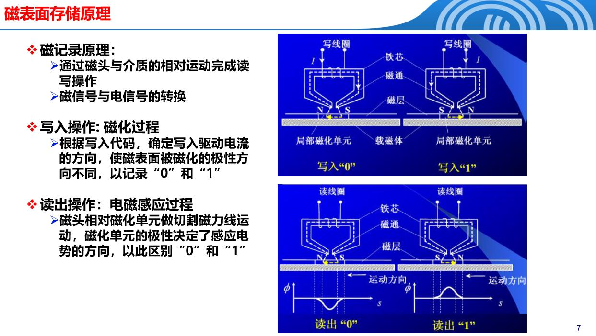

### 1.2硬磁盘存储器
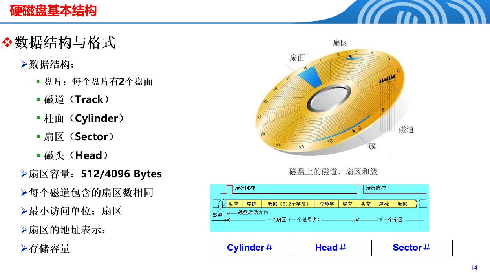
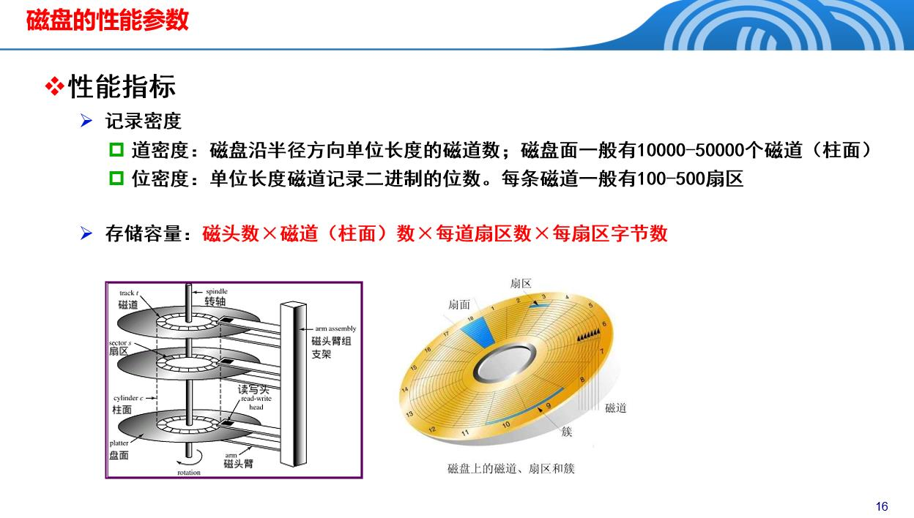
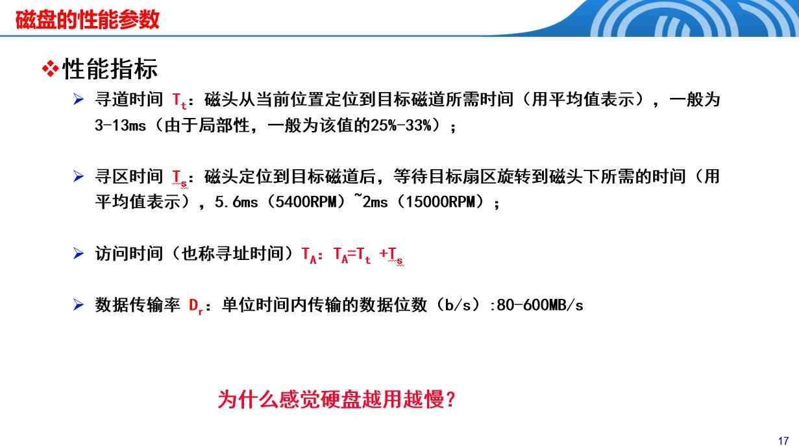
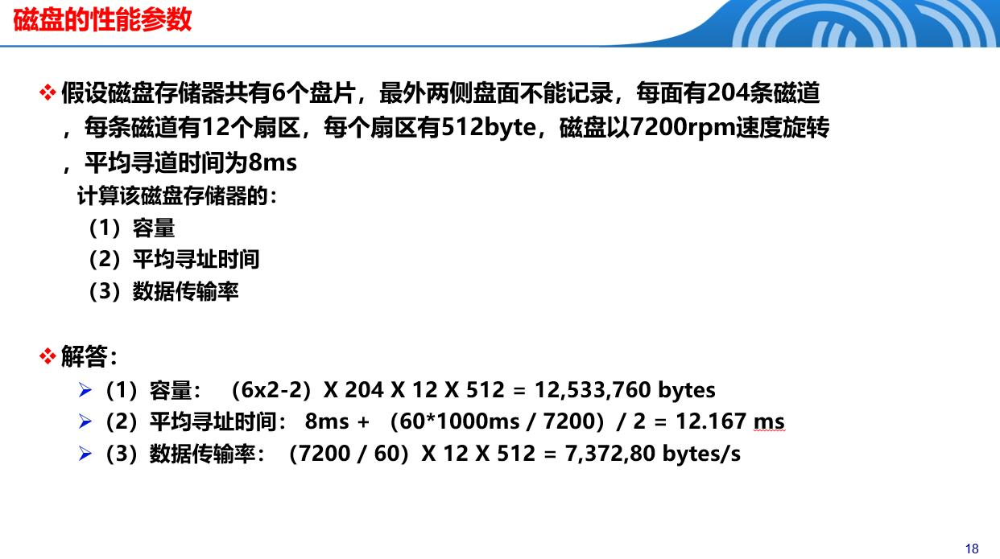

### 1.3固态硬盘（SSD）

#### 固态硬盘相对机械硬盘的优点

| 优点 | 详细说明 |
|------|---------|
| **存取速度快** | 无寻道（扇区）时间；无读写磁头；采用快速随机读取；读取延迟极低；无论是系统启动还是运行大型软件，相比主流机械硬盘都有质的飞跃（速度快3-5倍） |
| **防震抗摔** | 内部无机械运动部件，避免机械故障；不怕碰撞、冲击、震动；即使在高速移动或倾斜翻转的情况下也能正常使用；将笔记本电脑意外掉落或与硬物碰撞时造成数据丢失的可能性降到最低 |
| **发热低、零噪音** | 由于没有机械马达；闪存芯片发热量小；工作噪音为0分贝 |
| **体积小** | 相比传统机械硬盘，体积更小；重量更轻；便于携带 |

#### 固态硬盘的缺点

| 缺点 | 详细说明 |
|------|---------|
| **成本高** | 相比机械硬盘，成本较高；目前大容量固态硬盘约为4TB；价格方面，同容量固态硬盘比机械硬盘贵3-5倍 |
| **写入速度相对较慢** | 在数据**读取**速度方面有明显优势；但数据**写入**速度较慢；容易产生碎片 |
| **寿命相对较短** | 一般闪存固态硬盘有写入次数限制，为10万次；最新技术可延长至100万-500万次；虽然对于U盘或数码产品来说可能不是问题，但用于系统的固态硬盘很容易超过这个写入次数 |
| **修复难度高** | 如果固态硬盘数据损坏，修复困难；目前的数据恢复技术几乎无法从损坏的芯片中恢复数据；相比之下，机械硬盘仍可恢复部分数据 |

### 1.4磁盘的类型
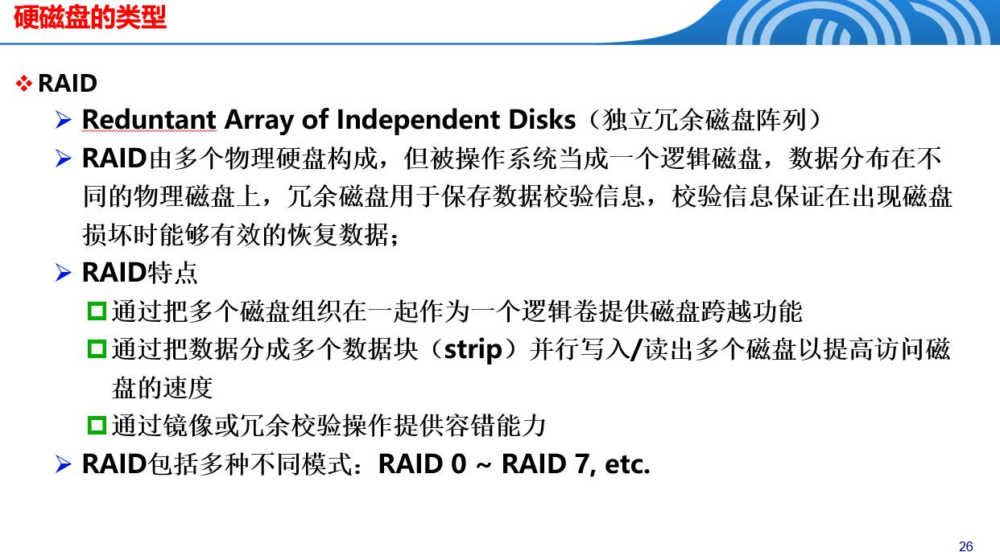
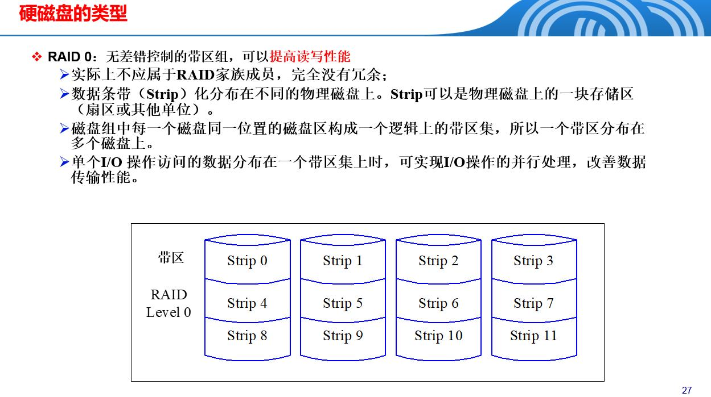
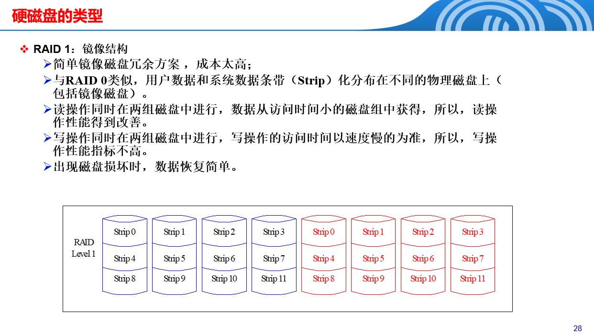
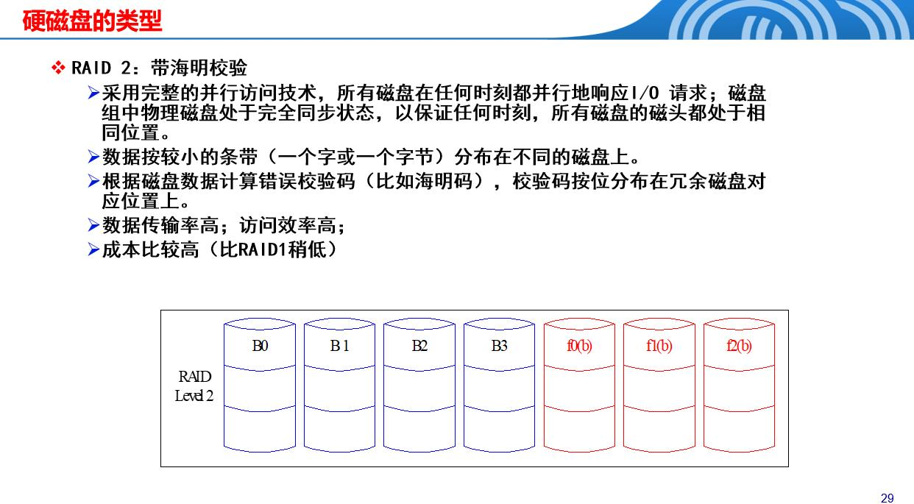
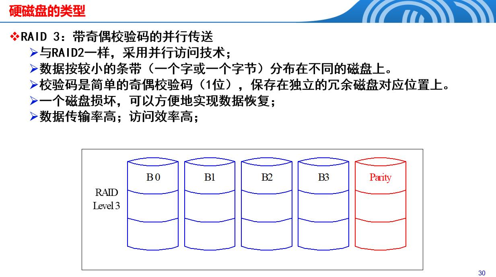

## 2.虚拟存储器

### 2.1 虚拟存储的动机

| 动机类别 | 具体问题 | 说明 |
|---------|---------|------|
| **早期系统局限性** | 单道程序运行 | 主存中只包含操作系统和正在执行的一个用户程序，存储管理简单 |
| **消除主存容量限制** | 编程不确定性 | 编写和编译程序时，程序员并不知道程序运行时会与哪些其他程序共享内存；程序员希望每个程序都能在自己的独立地址空间中编译和运行 |
| **消除主存容量限制** | 程序过大问题 | 单个用户程序的大小可能超过实际的主存容量，导致程序无法加载或运行 |
| **多道程序共享内存** | 内存需求超过实际容量 | 同时运行的多个程序对内存的总需求之和可能超过计算机实际可用的物理内存容量 |
| **多道程序共享内存** | 局部性原理 | 某个时间点，只需要一部分活跃的程序；并非所有程序的所有部分都需要同时加载到内存中 |

### 2.2 虚拟存储的解决方案

| 方面 | 说明 |
|------|------|
| **解决之道** | 内存管理采用交换机制（硬件和操作系统实现部分装入和部分替换），进程保存在辅存中，执行时只将活跃部分调入主存（基于局部性原理），主存此时可视为辅存的"高速缓存" |
| **虚拟存储技术** | 是一种将主存当作辅助存储器高速缓存的技术，允许程序使用比实际物理主存更大的存储空间，这个空间称为虚拟存储器（virtual memory） |
| **虚拟存储器特性** | 从逻辑上为用户提供一个比物理存储容量大得多、可寻址的"主存储器"；其容量与物理主存大小无关，而受限于计算机的地址结构 |
| **硬件支持** | CPU中专门有一个存储器管理部件MMU (Memory Management Unit) 协助操作系统完成存储器访问，负责虚拟地址到物理地址的转换以及内存保护等功能 |

### 2.3三种内存管理方式
#### 简单分区模式
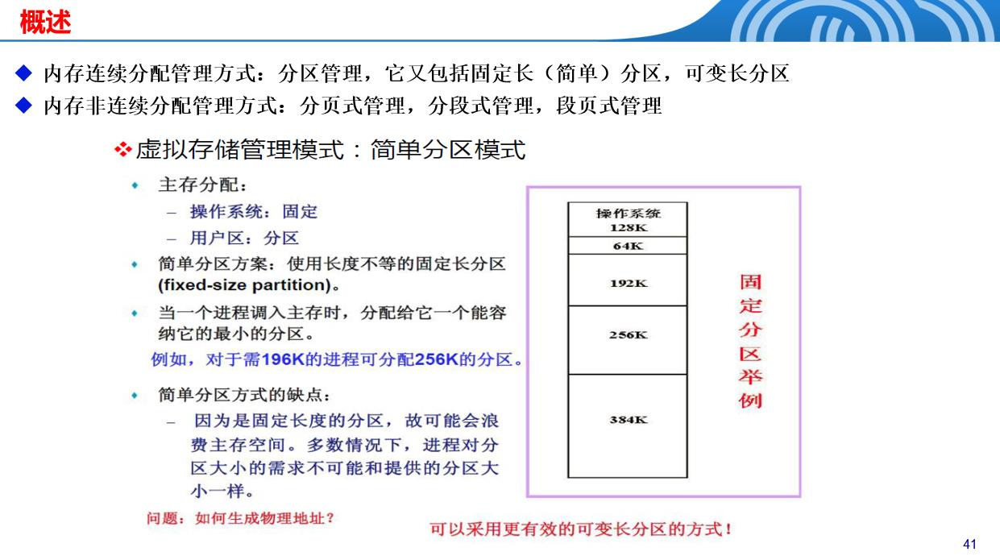
#### 可变分区模式
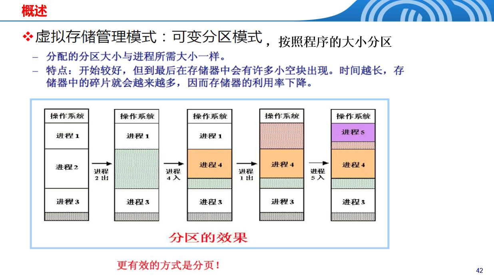
#### 分页模式
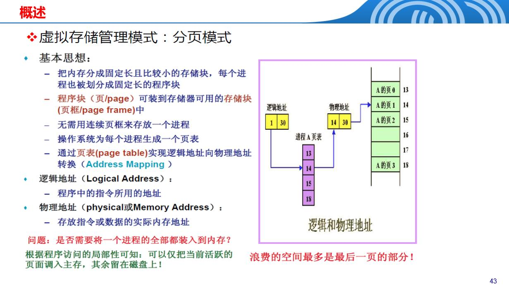

## 3.页式存储器
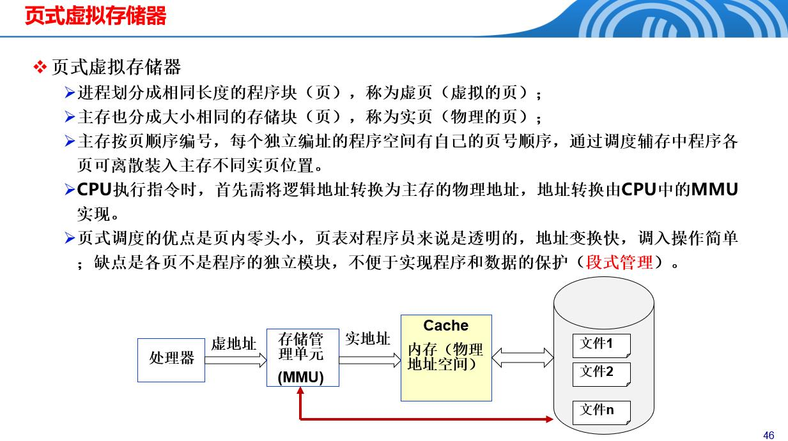
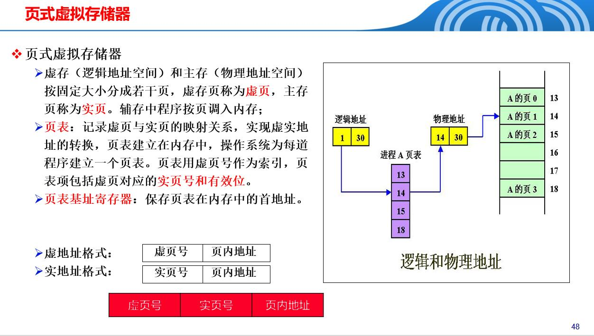
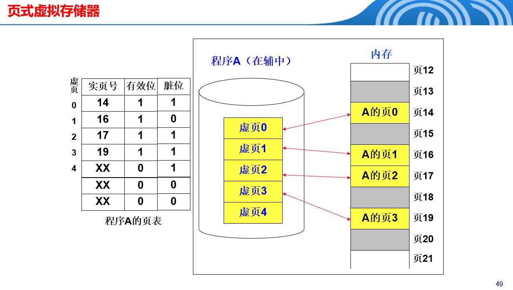

### 但是页表存储在主存中，不能过大
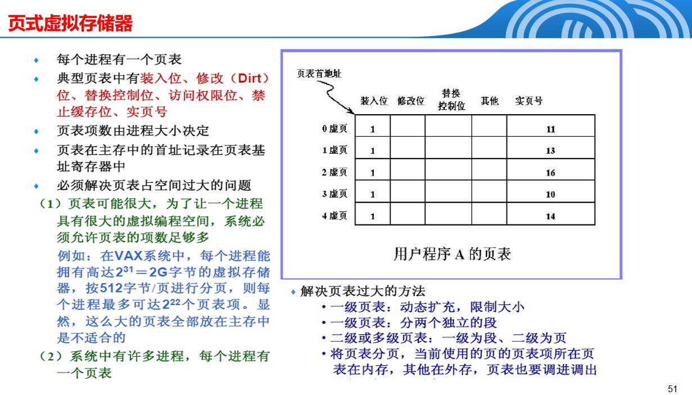
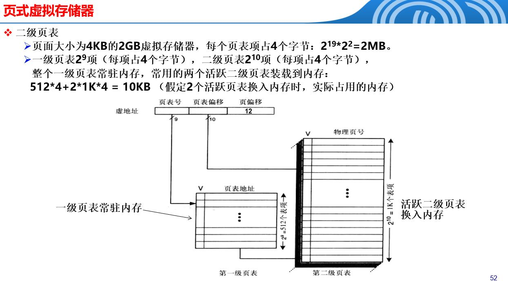

### 快表TLB
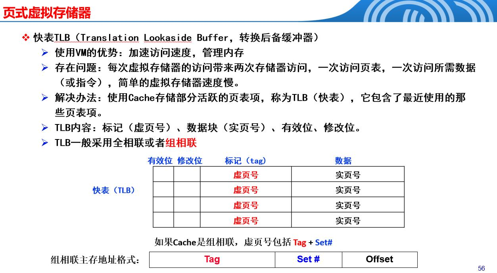
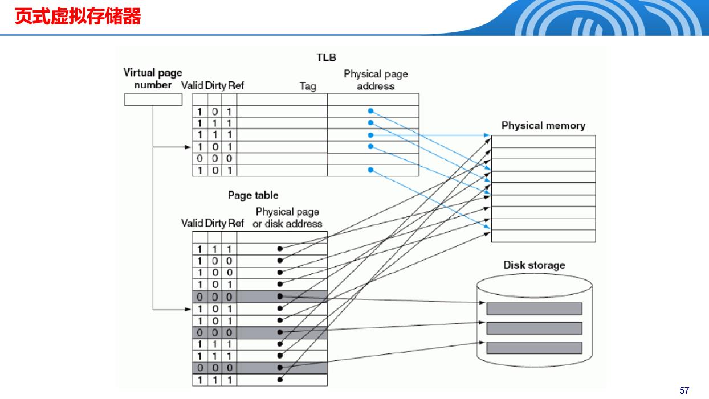
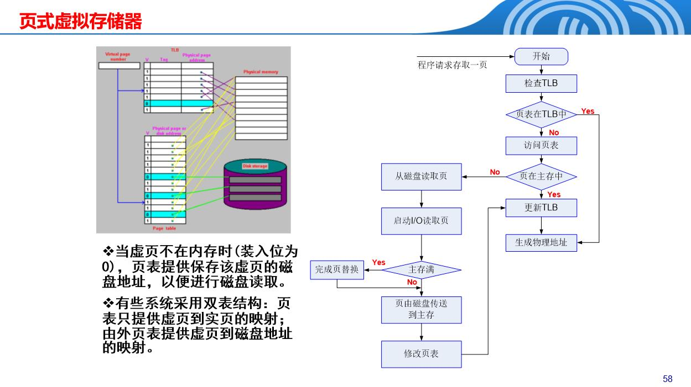

### 计算题
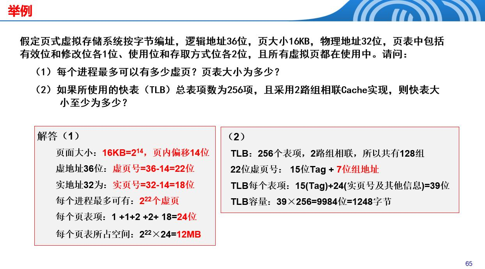